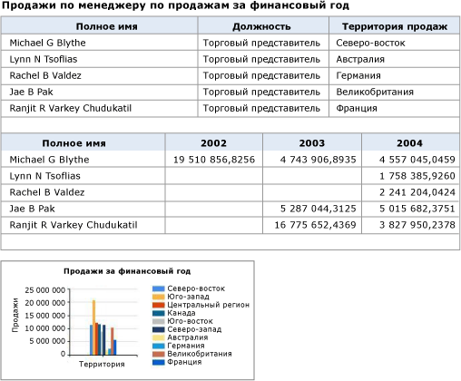
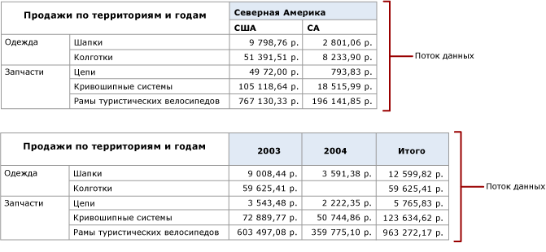
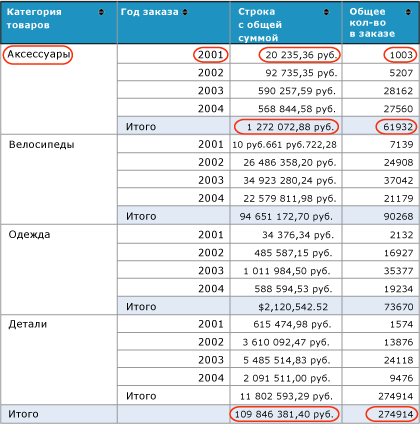

# Формирование веб-каналов данных из отчетов (построитель отчетов и службы SSRS)

  Модуль подготовки отчетов служб [!INCLUDE[ssRSnoversion](../../includes/ssrsnoversion-md.md)] Atom формирует сервисный документ Atom, в котором перечислены веб-каналы данных, доступные в отчете с разбиением на страницы, а также веб-каналы данных из областей данных в отчете. Этот модуль используется для формирования совместимых с Atom потоков данных, которые допускают чтение и обмен данными с приложениями, которые потребляют потоки данных, формируемые отчетами. Например можно использовать модуль подготовки отчетов Atom для формирования потоков данных, затем можно использовать в Power Pivot и Power BI.  
  
 Сервисный документ Atom содержит сведения по меньшей мере об одном потоке данных для каждой области данных отчета. В зависимости от типа области данных и самих данных, которые отображает эта область, службы [!INCLUDE[ssRSnoversion](../../includes/ssrsnoversion-md.md)] могут сформировать из нее несколько потоков данных. Несколько потоков данных может породить, к примеру, матрица или диаграмма. Когда модуль подготовки отчетов Atom создает сервисный документ Atom, для каждого потока данных создается уникальный идентификатор, который упоминается в URL-адресе для доступа к содержимому потока данных.  
  
 Метод формирования модулем подготовки отчетов Atom данных для потока данных аналогичен методу, при помощи которого модуль подготовки отчетов в формате CSV формирует данные для CSV-файла. Как и CSV-файл, поток данных содержит плоское представление данных отчета. Например, таблица с группой строк, которые суммируют продажи в группе, повторяет эту сумму в каждой строке данных. Отдельная строка, содержащая только эту сумму, отсутствует.  
  
 Сервисные документы и веб-каналы данных Atom можно формировать с помощью веб-портала [!INCLUDE[ssRSnoversion](../../includes/ssrsnoversion-md.md)] , сервера отчетов или сайта SharePoint, интегрированного в [!INCLUDE[ssRSnoversion](../../includes/ssrsnoversion-md.md)].  
  
 Atom отвечает двум родственным стандартам. Сервисный документ Atom соответствует спецификациям протокола публикации RFC 5023 Atom, а потоки данных соответствуют спецификациям протокола формата синдикации RFC 4287 Atom.  
  
 Следующие разделы предоставляют дополнительные сведения об использовании модуля подготовки отчетов Atom.  
  
 [!INCLUDE[ssRBRDDup](../../includes/ssrbrddup-md.md)]  
  
##   Отчеты как потоки данных  
 Можно экспортировать производственный отчет в виде потока данных, либо создать отчет, основной целью которого является предоставление данных приложениям в форме потоков данных. Использование отчетов в качестве потоков данных представляет собой альтернативный способ предоставления данных приложениям в тех случаях, когда доступ к данным через клиентские поставщики данных затруднен, либо необходимо скрыть сложность источника данных и упростить использование данных из него. Еще одним преимуществом работы с данными отчета как с веб-каналами данных является возможность использования таких средств и функций [!INCLUDE[ssRSnoversion](../../includes/ssrsnoversion-md.md)] , как функции защиты, планирования и создания мгновенных снимков отчетов при управлении отчетами, предоставляющими веб-каналы данных.  
  
 Чтобы получить максимальную отдачу от модуля подготовки отчетов Atom, необходимо разобраться в том, как отчет преобразуется в потоки данных. При работе с существующими отчетами полезно иметь возможность предсказать, какие веб-каналы данных будут порождены этими отчетами. Если же отчет создается специально для использования в качестве потоков данных, важно включить данные и настроить макет отчета таким образом, чтобы потоки данных оказались максимально полезными.  
  
 Дополнительные сведения см. в разделе [Формирование веб-каналов данных из отчета (построитель отчетов и службы SSRS)](../../reporting-services/report-builder/generate-data-feeds-from-a-report-report-builder-and-ssrs.md).  
  
  
##   Сервисный документ Atom (файл ATOMSVC)  
 Сервисный документ Atom определяет связь с одним или несколькими веб-каналами данных. В простейшем варианте это просто URL-адрес службы, порождающей поток данных.  
  
 При подготовке данных отчета с помощью модуля Atom сервисный документ Atom содержит список потоков данных, доступных для отчета. Этот документ содержит сведения по меньшей мере об одном потоке данных для каждой области данных отчета. Таблицы и датчики формируют только по одному потоку данных, но матрицы, списки и диаграммы могут формировать несколько потоков в зависимости от отображаемых ими данных.  
  
 На следующей иллюстрации показан отчет, содержащий две таблицы и диаграмму.  
  
   
  
 Сервисный документ Atom, сформированный из этого отчета, включает три потока данных: по одному для каждой таблицы и один для диаграммы.  
  
 Области данных матрицы могут содержать более одного потока данных в зависимости от структуры матрицы. На следующей диаграмме показан отчет, содержащий матрицу, которая формирует два потока данных.  
  
   
  
 Сервисный документ Atom, сформированный на основе этого отчета, включает два потока данных, по одному для каждого динамического однорангового столбца: «Территория» и «Год». Следующая диаграмма показывает содержимое каждого из этих потоков данных.  
  
   
  
  
##   Потоки данных  
 Поток данных представляет собой XML-файл в согласованном табличном формате, который не меняется со временем, и содержит переменные данные, которые могут изменяться при каждом выполнении отчета. Службы [!INCLUDE[ssRSnoversion](../../includes/ssrsnoversion-md.md)] формируют данные в том же формате, что и службы ADO.NET Data Services.  
  
 Поток данных содержит два раздела: заголовок и данные. Элементы каждого раздела определяются спецификациями Atom. Заголовок содержит такие сведения, как схема кодирования символов, используемая веб-каналами данных.  
  
### Раздел заголовка  
 Следующий код XML иллюстрирует раздел заголовка потока данных.  
  
 `<?xml version="1.0" encoding="utf-8" standalone="yes"?><feed xmlns:d="http://schemas.microsoft.com/ado/2007/08/dataservices" xmlns:m="http://schemas.microsoft.com/ado/2007/08/dataservices/metadata" xmlns="http://www.w3.org/2005/Atom">`  
  
 `<title type="text"></title>`  
  
 `<id>uuid:1795992c-a6f3-40ec-9243-fbfd0b1a5be3;id=166321</id>`  
  
 `<updated>2009-05-08T23:09:58Z</updated>`  
  
### Раздел данных  
 Раздел данных потоков данных содержит один \< **входа**> для каждой строки в плоский набор строк, сформированный модулем подготовки отчетов Atom.  
  
 На следующей диаграмме показан отчет, содержащий группы и итоговые значения.  
  
   
  
 Следующий XML-КОДЕ показано \< **входа**> из этого отчета в поток данных. Обратите внимание, что \< **входа**> включает итоговые значения по продажам и заказам для группы и итоговые значения по продажам и заказам для всех групп. \< **Входа**> включает все значения в отчете.  
  
 `<entry><id>uuid:1795992c-a6f3-40ec-9243-fbfd0b1a5be3;id=166322</id><title type="text"></title><updated>2009-05-08T23:09:58Z</updated><author /><content type="application/xml"><m:properties>`  
  
 `<d:ProductCategory_Value>Accessories</d:ProductCategory_Value>`  
  
 `<d:OrderYear_Value m:type="Edm.Int32">2001</d:OrderYear_Value>`  
  
 `<d:SumLineTotal_Value m:type="Edm.Decimal">20235.364608</d:SumLineTotal_Value>`  
  
 `<d:SumOrderQty_Value m:type="Edm.Int32">1003</d:SumOrderQty_Value>`  
  
 `<d:SumLineTotal_Total_2_1 m:type="Edm.Decimal">1272072.883926</d:SumLineTotal_Total_2_1>`  
  
 `<d:SumOrderQty_Total_2_1 m:type="Edm.Double">61932</d:SumOrderQty_Total_2_1>`  
  
 `<d:SumLineTotal_Total_2_2 m:type="Edm.Decimal">109846381.399888</d:SumLineTotal_Total_2_2>`  
  
 `<d:SumOrderQty_Total_2_2 m:type="Edm.Double">274914</d:SumOrderQty_Total_2_2></m:properties></content>`  
  
 `</entry>`  
  
### Работа с потоками данных  
 Все потоки данных, формируемые отчетом, включают элементы отчета, находящиеся в области видимости родительского элемента области данных, породившей потоки данных. . Представьте, что отчет содержит несколько таблиц и одну диаграмму. Текстовые поля в теле отчета содержат описания каждой области данных. Каждая запись в каждом потоке данных, формируемом отчетом, включает значение такого текстового поля. Например, если задан текст «Диаграмма отображает средние ежемесячные продажи по региону продаж», то этот текст будет включен в каждую строку всех трех потоков данных.  
  
 Если макет отчета содержит иерархические отношения между данными, например, вложенные области данных, эти отношения будут включены в плоский набор строк данных отчета.  
  
 Строки данных для вложенных областей данных как правило очень длинны, особенно если вложенные таблицы и матрицы включают группы и итоговые значения. Может оказаться полезным экспортировать отчет в поток данных и просмотреть этот поток данных для проверки корректности формирования данных.  
  
 Когда модуль подготовки отчетов Atom создает сервисный документ Atom, для потока данных создается уникальный идентификатор, который упоминается в URL-адресе для доступа к содержимому потока данных. Образец сервисного документа Atom, показанный выше, включает URL-адрес `http://ServerName/ReportServer?%2fProduct+Sales+Summary&rs%3aCommand=Render&rs%3aFormat=ATOM&rc%3aDataFeed=xAx0x1`. Этот URL-адрес идентифицирует отчет (Product Sales Summary), формат подготовки отчета Atom (ATOM) и название потока данных (xAx0x1).  
  
 Имена элементов отчета по умолчанию совпадают с именами элементов языка определения отчетов (RDL) для элементов отчета, поэтому зачастую они неинтуитивны и трудны для запоминания. Например, первая матрица, помещенная в отчет, будет по умолчанию названа Tablix 1. Потоки данных также будут использовать эти имена.  
  
 Для упрощения работы с веб-каналом данных можно воспользоваться свойством DataElementName области данных для выбора понятных имен. Если указать значение для DataElementName подэлемент потока данных \< **d**> будет использовать это вместо имени области данных по умолчанию. Например, если имя по умолчанию для области данных является Tablix1 и DataElementName задано значение «salesbyterritoryyear» то \< **d**> веб-канала данных использует значение «salesbyterritoryyear». Если области данных содержат два потока данных (как в случае с матричным отчетом, описанным выше), потоки данных будут иметь имена SalesByTerritoryYear _Territory и SalesByTerritoryYear _Year.  
  
 Если сравнить данные каждого из отчетов с данными потока данных, можно заметить определенные отличия. Отчеты часто отображают отформатированные числовые значения и значения даты/времени, в то время как потоки данных содержат неформатированные данные.  
  
 Поток данных сохраняется в файле с расширением ATOM. Для просмотра структуры и содержимого такого файла можно использовать любой редактор текста или XML, например, «Блокнот » или XML Editor.  
  
  
##   Выравнивание данных отчета  
 Модуль Atom представляет данные отчета в виде плоских наборов строк в формате XML. Правила выравнивания таблиц данных совпадают с правилами, которые использует модуль подготовки отчетов в формате CSV, со следующими исключениями.  
  
-   Элементы в области видимости выравниваются до детального уровня. В отличие от модуля подготовки отчетов в формате CSV, текстовые поля верхнего уровня появляются в каждой записи потока данных.  
  
-   Значения параметров отчета включаются в каждую выходную строку.  
  
 Иерархические и группированные данные должны быть переведены в плоский формат, чтобы их можно было представить в формате модуля Atom. Модуль подготовки отчетов делает отчет плоским, преобразуя его в древовидную структуру, отображающую вложенные группы области данных. Формирование плоского отчета происходит следующим образом.  
  
-   Сначала делается плоской иерархия строк, затем — иерархия столбцов.  
  
-   Сначала в потоке данных отображаются элементы иерархии строк, затем элементы иерархии столбцов.  
  
-   Столбцы упорядочены следующим образом: текстовые поля в тексте отчета — слева направо, сверху вниз, а затем области данных — слева направо, сверху вниз.  
  
-   В пределах области данных столбцы упорядочены следующим образом: элементы углов, элементы иерархии строк, элементы иерархии столбцов, а затем ячейки.  
  
-   Одноранговые области данных — это области данных или динамические группы, относящиеся к одной и той же области данных или имеющие одного динамического предка. Одноранговые данные можно определить по разветвлениям уплощенного дерева.  
  
 Дополнительные сведения см. в разделе [Таблицы, матрицы и списки (построитель отчетов и службы SSRS)](../../reporting-services/report-design/tables-matrices-and-lists-report-builder-and-ssrs.md).  
  
  
##   Правила подготовки отчетов модулем Atom  
 Модуль подготовки отчетов Atom игнорирует следующие сведения при подготовке потоков данных.  
  
-   Форматирование и макет  
  
-   Верхний колонтитул страницы  
  
-   Нижний колонтитул страницы  
  
-   Пользовательские элементы отчета  
  
-   Прямоугольники  
  
-   Линии  
  
-   Изображения  
  
-   Автоматические подытоги  
  
 Остальные элементы отчета сортируются сверху вниз, затем слева направо. Каждый элемент присваивается столбцу. Если отчет имеет вложенные элементы данных, такие как списки или таблицы, родительские элементы повторяются в каждой строке.  
  
 В следующей таблице описывается, как выглядят подготовленные к просмотру элементы отчета.  
  
|Элемент|Поведение при подготовке к просмотру|  
|----------|------------------------|  
|Таблица|Подготовка путем разворачивания таблицы и создания строки и столбца для каждой строки и столбца на самом низком уровне детализации. Строки и столбцы подытогов не имеют заголовков строки или столбца. Детализированные отчеты не поддерживаются.|  
|Матрица|Подготовка с развертыванием таблицы и созданием строки и столбца для каждой строки и столбца на самом низком уровне детализации. Строки и столбцы подытогов не имеют заголовков строки или столбца.|  
|Список|Подготовка записи для каждой отдельной строки или экземпляра в списке.|  
|Подотчет|Родительский элемент повторяется для каждого экземпляра содержимого.|  
|Диаграмма|Подготовка записи со всеми метками диаграммы для каждого значения диаграммы. Метки для рядов и категорий в иерархиях приводятся к плоскому формату и включаются в строку для значения диаграммы.|  
|Гистограмма|Отображается как диаграмма. Как правило, гистограмма не содержит иерархии или метки.|  
|Спарклайн|Отображается как диаграмма. Как правило, спарклайн не содержит иерархии или метки.|  
|Датчик|Подготавливает единственную запись с минимальным и максимальным значениями линейной шкалы, начальным и конечным значениями диапазона и значением указателя.|  
|Индикатор|Отображается как единственная запись с названием активного состояния, состояний доступности и значений данных.|  
|Схема|Создается поток данных для каждой области данных карты. Если для одной области карты используется несколько слоев карты, то они все включаются в поток данных. Поток данных включает запись с метками и значениями для всех элементов карты слоя карты.|  
  
  
##   Настройки сведений об устройстве  
 Можно изменить некоторые параметры по умолчанию для этого модуля подготовки отчетов, включая используемую схему кодировки. Дополнительные сведения см. в разделе [ATOM Device Information Settings](../../reporting-services/atom-device-information-settings.md).  

## Следующие шаги

[Экспорт в CSV-файл](../../reporting-services/report-builder/exporting-to-a-csv-file-report-builder-and-ssrs.md)   
[Экспорт отчетов](../../reporting-services/report-builder/export-reports-report-builder-and-ssrs.md)  

Дополнительные вопросы? [Попробуйте задать вопрос на форуме служб Reporting Services](http://go.microsoft.com/fwlink/?LinkId=620231)
