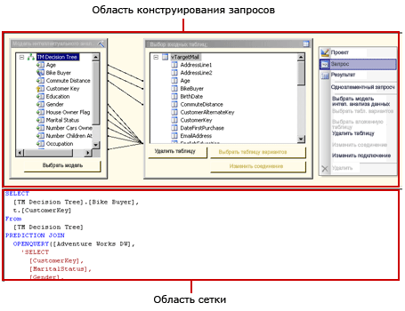
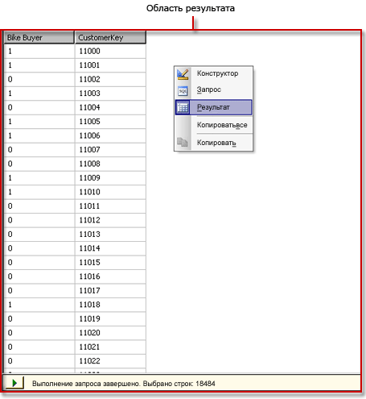

# Пользовательский интерфейс конструктора DMX-запросов служб Analysis Services
  [!INCLUDE[ssRSnoversion](../../includes/ssrsnoversion-md.md)] предоставляют графические конструкторы запросов для построения DMX-запросов и запросов многомерных выражений из источника данных служб [!INCLUDE[ssASnoversion](../../includes/ssasnoversion-md.md)] . В этом разделе описан конструктор DMX-запросов. Дополнительные сведения о конструкторе запросов многомерных выражений см. в разделе [Analysis Services MDX Query Designer User Interface](../../reporting-services/report-data/analysis-services-mdx-query-designer-user-interface.md).  
  
 Графический конструктор запросов расширений интеллектуального анализа данных имеет три режима: "Конструктор", "Запрос" и "Результат". Для переключения режимов щелкните правой кнопкой мыши панель конструктора запросов и выберите режим. В каждом режиме имеется панель «Метаданные», из которой можно перетащить элементы из выбранных кубов для построения DMX-запроса, получающего данные для набора данных при обработке отчета.  
  
## Панель инструментов графического конструктора DMX-запросов  
 На панели инструментов графического конструктора расположены кнопки, помогающие проектировать DMX-запросы с помощью графического интерфейса. В следующей таблице перечислены кнопки и описаны их функции.  
  
|Кнопка|Описание|  
|------------|-----------------|  
|**Редактировать как текст**|Отключена для этого типа источника данных.|  
|**Импорт**|Импортировать существующий запрос из файла определения отчета (RDL), расположенного в файловой системе. Дополнительные сведения см. в разделе [Внедренные и общие наборы данных отчета (построитель отчетов и службы SSRS)](../../reporting-services/report-data/report-embedded-datasets-and-shared-datasets-report-builder-and-ssrs.md).|  
||Переключить в режим конструктора запросов многомерных выражений.|  
||Переключить в режим конструктора DMX-запросов.|  
||Обновление метаданных из источника данных.|  
||Удалить выбранный на панель «Данные» столбец из запроса.|  
||Отображает диалоговое окно **Параметры запроса** . При присвоении переменной значения по умолчанию создается соответствующий параметр отчета при переключении конструктора отчетов в режим разметки.|  
||Подготовить запрос.|  
||Переключение между режимом конструктора и режимом запроса. Для изменения результирующего представления щелкните правой кнопкой мыши панель конструктора и выберите пункт **Результат**.|  
  
## Графический конструктор DMX-запросов в режиме конструктора  
 При изменении набора данных, использующего источник данных служб [!INCLUDE[ssASnoversion](../../includes/ssasnoversion-md.md)] , в котором нет допустимых кубов, но есть допустимые модели интеллектуального анализа данных, графический конструктор запросов открывается в режиме конструктора. На следующем рисунке отмечены панели в режиме конструктора.  
  
   
  
 В следующей таблице описываются функции каждой панели.  
  
|Панель|Компонент|  
|----------|--------------|  
|Панель конструктора запросов|Использует диалоговые окна **Модель интеллектуального анализа данных** и **Выбор входных таблиц** для построения DMX-запроса.|  
|Панель сетки|Для каждой строки сетки используйте раскрывающийся список **Источник** для выбора функции или выражения, и выберите поля, группы и критерии или аргументы для использования в DMX-запросе. Для просмотра текста DMX-запроса, сформированного в соответствии с выбранными значениями, нажмите кнопку **Режим конструктора** на панели инструментов.|  
  
 Чтобы запустить DMX-запрос и показать результаты на панели "Результат", щелкните правой кнопкой мыши панель конструктора запросов и выберите пункт **Результат**.  
  
## Графический конструктор DMX-запросов в режиме запроса  
 Для переключения графического конструктора запросов в режим "Запрос" нажмите кнопку **Режим конструктора** на панели инструментов или щелкните правой кнопкой мыши область конструктора и выберите пункт **Запрос** в контекстном меню. Используйте этот режим для прямого ввода текста DMX-запроса на панели запроса.  
  
 На следующем рисунке показаны метки панелей режима запроса.  
  
   
  
 В следующей таблице описываются функции каждой панели.  
  
|Панель|Компонент|  
|----------|--------------|  
|Панель конструктора запросов|Использует диалоговые окна **Модель интеллектуального анализа данных** и **Выбор входных таблиц** для построения DMX-запроса.|  
|Панель запросов|Просмотр или изменение текста DMX-запроса непосредственно в этой панели. Изменения в тексте DMX-запроса не сохранятся при возвращении в режим **Конструктор** .|  
  
 Чтобы запустить DMX-запрос и показать результаты на панели "Результат", щелкните правой кнопкой мыши панель конструктора запросов и выберите пункт **Результат**.  
  
## Графический конструктор DMX-запросов в режиме «Результат»  
 Для переключения в режим "Результат" щелкните правой кнопкой мыши область конструктора запросов и выберите пункт **Результат** в контекстном меню. При переключении в режим «Результат» DMX-запрос запускается автоматически.  
  
 На следующем рисунке показан конструктор запросов в режиме «Результат».  
  
   
  
 Для переключения обратно в режим конструктора или запроса щелкните правой кнопкой мыши панель "Результат" и выберите пункт **Конструктор** или **Запрос**.  
  
## См. также:  
 [Определение параметров в конструкторе запросов многомерных выражений для служб Analysis Services (построитель отчетов и службы SSRS)](../../reporting-services/report-data/define-parameters-in-the-mdx-query-designer-for-analysis-services.md)   
 [Создание общего или внедренного набора данных (построитель отчетов и службы SSRS)](../../reporting-services/report-data/create-a-shared-dataset-or-embedded-dataset-report-builder-and-ssrs.md)   
 [Тип соединения служб Analysis Services для расширений интеллектуального анализа данных (службы SSRS)](../../reporting-services/report-data/analysis-services-connection-type-for-dmx-ssrs.md)   
 [Получение данных из модели интеллектуального анализа данных (расширения интеллектуального анализа данных) (службы SSRS)](../../reporting-services/report-data/retrieve-data-from-a-data-mining-model-dmx-ssrs.md)   
 [Файл конфигурации RSReportDesigner](../../reporting-services/report-server/rsreportdesigner-configuration-file.md)   
 [Тип соединения служб Analysis Services для запросов многомерных выражений (службы SSRS)](../../reporting-services/report-data/analysis-services-connection-type-for-mdx-ssrs.md)   
 [Тип соединения служб Analysis Services для расширений интеллектуального анализа данных (службы SSRS)](../../reporting-services/report-data/analysis-services-connection-type-for-dmx-ssrs.md)  
  
  
