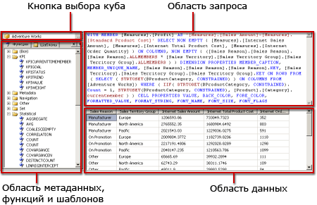

# Пользовательский интерфейс конструктора запросов многомерных выражений служб Analysis Services
  [!INCLUDE[ssRSnoversion](../../includes/ssrsnoversion-md.md)] предоставляют графические конструкторы запросов для построения запросов многомерных выражений и запросов расширений интеллектуального анализа данных для источника данных служб [!INCLUDE[ssASnoversion](../../includes/ssasnoversion-md.md)] . Данный раздел посвящен конструктору запросов многомерных выражений. Дополнительные сведения о конструкторе запросов многомерных выражений см. в разделе [Тип соединения служб Analysis Services для расширений интеллектуального анализа данных (службы SSRS)](../../reporting-services/report-data/analysis-services-connection-type-for-dmx-ssrs.md).  
  
 Графический конструктор запросов многомерных выражений имеет два режима: режим конструктора и режим запросов. В каждом режиме есть панель метаданных, из которой можно перетаскивать элементы с выбранного куба для построения запроса многомерных выражений, который извлекает данные в ходе обработки отчета.  
  
> [!IMPORTANT]  
>  При создании и выполнении запросов пользователи получают доступ к источникам данных. Следует предоставить минимальные разрешения на источники данных, например разрешение только на чтение.  
  
> [!NOTE]  
>  Импорт запроса многомерных выражений из файла не поддерживается.  
  
## Графический конструктор запросов многомерных выражений: режим конструктора  
 При изменении запроса многомерных выражений для набора данных отчета графический конструктор запросов многомерных выражений откроется в режиме конструктора.  
  
 На следующем рисунке отмечены панели в режиме конструктора.  
  
   
  
 В следующей таблице перечисляются панели, доступные в этом режиме.  
  
|Панель|Функция|  
|----------|--------------|  
|Кнопка "Выбрать куб" (**...**)|Отображает куб, выбранный в настоящий момент.|  
|Панель «Метаданные»|Отображает список мер в иерархическом порядке, ключевые показатели эффективности (KPIs) и измерения, определенные для выбранного куба.|  
|Панель «Вычисляемые элементы»|Отображает вычисляемые элементы, определенные на данный момент и доступные для использования в запросе.|  
|Панель «Фильтр»|Используется для выбора измерений и относящихся к ним иерархий для фильтрации данных источника и ограничения данных, возвращенных отчету.|  
|Панель «Данные»|Отображает заголовки столбцов для результирующего набора в ходе перетаскивания элементов с панели «Метаданные» и панели «Вычисляемые элементы». Автоматически обновляет результирующий набор, если выбрана кнопка **Автовыполнение** . .|  
  
 Можно перетаскивать измерения, меры и ключевые показатели эффективности с панели «Метаданные», а вычисляемые элементы с панели «Вычисляемые элементы» на панель «Данные». На панели «Фильтр» можно выбрать измерения и относящиеся к ним иерархии, а также задать критерии фильтра для ограничения данных, доступных запросу. Если **Автовыполнение** () был выбран переключатель на панели инструментов, конструктор запросов выполняет запрос каждый раз при помещении объекта метаданных на панель «данные». Вы можете вручную запустить запрос с использованием **запуска** () на панели инструментов.  
  
 При создании запроса многомерных выражений в данном режиме следующие дополнительные свойства автоматически включаются в запрос:  
  
 **Свойства элемента** MEMBER_CAPTION, MEMBER_UNIQUE_NAME  
  
 **Свойства ячейки** VALUE, BACK_COLOR, FORE_COLOR, FORMATTED_VALUE, FORMAT_STRING, FONT_NAME, FONT_SIZE, FONT_FLAGS  
  
 Чтобы включить собственные дополнительные свойства, необходимо вручную изменить запрос многомерных выражений в режиме запроса.  
  
### Панель инструментов графического конструктора запросов многомерных выражений в режиме конструктора  
 Панель инструментов конструктора запросов содержит кнопки, которые помогают создавать запросы многомерных выражений с помощью графического интерфейса. В следующей таблице перечислены кнопки и их функции.  
  
|Кнопка|Description|  
|------------|-----------------|  
|**Редактировать как текст**|Не включено для данного типа источника данных.|  
|**Импорт**|Импортировать существующий запрос из файла определения отчета (RDL), расположенного в файловой системе. Дополнительные сведения см. в разделе [Внедренные и общие наборы данных отчета (построитель отчетов и службы SSRS)](../../reporting-services/report-data/report-embedded-datasets-and-shared-datasets-report-builder-and-ssrs.md).|  
||Перейти к многомерному выражению командного типа.|  
||Перейти к расширению интеллектуального анализа данных командного типа.|  
||Обновление метаданных из источника данных.|  
||Отображение диалогового окна **Построитель вычисляемых элементов** .|  
||Переключение между отображением и скрытием пустых ячеек на панели «Данные». (Это эквивалентно использованию предложения NON EMPTY в многомерном выражении).|  
||Автоматически выполнять запрос и отображать результат при каждом изменении. Результаты отображаются в панели «Данные».|  
||Показать статистические выражения на панели «Данные».|  
||Удалить выбранный на панель «Данные» столбец из запроса.|  
||Отображает диалоговое окно **Параметры запроса** . При указании значений для параметра запроса автоматически создается аналогичный параметр отчета с тем же именем. В качестве значения для параметра запроса устанавливается выражение, ссылающееся на параметр отчета.|  
||Подготовить запрос.|  
||Выполнить запрос и показать результаты на панели «Данные».|  
||Отмена запроса.|  
||Переключение между режимом конструктора и режимом запроса.|  
  
## Графический конструктор запросов многомерных выражений: режим запроса  
 Для переключения графического конструктора запросов в режим **запроса** нажмите кнопку **Режим конструктора** на панели инструментов.  
  
 На следующем рисунке показаны метки панелей режима запроса.  
  
   
  
 В следующей таблице перечисляются панели, доступные в этом режиме.  
  
|Панель|Функция|  
|----------|--------------|  
|Кнопка "Выбрать куб" (**...**)|Отображает куб, выбранный в настоящий момент.|  
|Панель Метаданные/Функции/Шаблоны|Отображает меры в иерархическом списке, ключевые показатели эффективности и измерения, определенные для выбранного куба.|  
|Панель запросов|Отображает текст запроса.|  
|Панель результатов|Отображает результаты выполнения запроса.|  
  
 Панель «Метаданные» содержит вкладки **Метаданные**, **Функции**и **Шаблоны**. Можно перетащить измерения, иерархии, ключевые показатели эффективности и меры с вкладки **Метаданные** на панель запросов многомерных выражений. Функции можно перетащить с вкладки **Функции** на панель запросов многомерных выражений. Шаблоны многомерных выражений можно добавить на панель запросов многомерных выражений с вкладки **Шаблоны** . После выполнения запроса на панели результатов отображаются результаты запроса многомерных выражений.  
  
 Запрос многомерных выражений по умолчанию, сформированный в режиме конструктора, можно расширить, включив дополнительные свойства элементов и ячеек. После выполнения запроса следующие значения не будут отражены в результирующем наборе. Однако данные значения передаются службам [!INCLUDE[ssRSnoversion](../../includes/ssrsnoversion-md.md)] и могут быть использованы в отчете. Дополнительные сведения см. в разделе [Расширенные свойства поля для базы данных служб Analysis Services (службы SSRS)](../../reporting-services/report-data/extended-field-properties-for-an-analysis-services-database-ssrs.md).  
  
### Панель инструментов графического конструктора запросов многомерных выражений в режиме запроса  
 Панель инструментов конструктора запросов содержит кнопки, которые помогают создавать запросы многомерных выражений с помощью графического интерфейса.  
  
 Кнопки на панели инструментов в режиме конструктора ничем не отличаются от кнопок в режиме запроса, однако в режиме запроса недоступны следующие кнопки.  
  
-   **Редактировать как текст**  
  
-   **Добавить вычисляемый элемент** ()  
  
-   **Показывать пустые ячейки** ()  
  
-   **Автоматическое выполнение** ()  
  
-   **Показать агрегаты** ()  
  
## См. также:  
 [Определение параметров в конструкторе запросов многомерных Выражений для служб Analysis Services &#40; Построитель отчетов и службы SSRS &#41;](../../reporting-services/report-data/define-parameters-in-the-mdx-query-designer-for-analysis-services.md)   
 [Создание общего набора данных или внедренный набор данных &#40; Построитель отчетов и службы SSRS &#41;](../../reporting-services/report-data/create-a-shared-dataset-or-embedded-dataset-report-builder-and-ssrs.md)   
 [Тип соединения служб Analysis Services для расширений интеллектуального анализа данных &#40; Службы SSRS &#41;](../../reporting-services/report-data/analysis-services-connection-type-for-dmx-ssrs.md)   
 [Файл конфигурации RSReportDesigner](../../reporting-services/report-server/rsreportdesigner-configuration-file.md)   
 [Тип соединения служб Analysis Services для многомерных Выражений &#40; Службы SSRS &#41;](../../reporting-services/report-data/analysis-services-connection-type-for-mdx-ssrs.md)  
  
  
