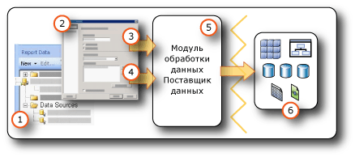

# <a name="data-connections-data-sources-and-connection-strings-report-builder-and-ssrs"></a>Подключения к данным, источники данных и строки подключения (построитель отчетов и службы SSRS)

[!INCLUDE [ssrs-appliesto](../../includes/ssrs-appliesto.md)] [!INCLUDE [ssrs-appliesto-2016-and-later](../../includes/ssrs-appliesto-2016-and-later.md)] [!INCLUDE[ssrs-appliesto-pbirsi](../../includes/ssrs-appliesto-pbirs.md)] [!INCLUDE[ssrs-appliesto-sharepoint-2013-2016i](../../includes/ssrs-appliesto-sharepoint-2013-2016.md)]

[!INCLUDE [ssrs-previous-versions](../../includes/ssrs-previous-versions.md)]

  Для включения данных в отчет с разбиением на страницы [!INCLUDE[ssRBnoversion](../../includes/ssrbnoversion-md.md)] или  [!INCLUDE[ssRSnoversion](../../includes/ssrsnoversion-md.md)] прежде всего следует создать *источники данных* и *наборы данных*. Данная тема объясняет типы источников данных, как создать источники данных и предоставляет важную информацию, относящуюся к учетным данным источника данных. Источник данных включает в себя тип источника данных, информацию о подключении и используемый тип учетных данных. Существует два типа источников данных отчета: внедренные и общие. Внедренный источник данных определяется в отчете и используется только этим отчетом. Общий источник данных определяется независимо от отчета и может использоваться несколькими отчетами. Дополнительные сведения см. в разделе [Внедренные и общие наборы данных отчета (построитель отчетов и службы SSRS)](../../reporting-services/report-data/embedded-and-shared-datasets-report-builder-and-ssrs.md).  

> [!NOTE]  
>  [!INCLUDE[ssRBRDDup](../../includes/ssrbrddup-md.md)]
  
##  <a name="bkmk_data_sources"></a> Общие и внедренные источники данных  
 Применение общего источника данных рекомендовано в тех случаях, когда источник данных используется часто. Рекомендуется использовать общие источники данных (если возможно). Они облегчают управление отчетами и доступом к ним, а также помогают обеспечить безопасность отчетов и источников данных. Необходимый общий источник данных должен создать системный администратор.  
  
 Внедренный источник данных представляет собой подключение к данным, которое сохраняется в определении отчета. Эти сведения могут использоваться только тем отчетом, в который они внедрены. Внедренные источники данных определяются и управляются с помощью диалогового окна **Свойства источника данных** .  
  
 Различие между общими и внедренными источниками данных состоит в способе создания, хранения и управления.  
  
-   В конструкторе отчетов создайте внедренные или общие источники данных в рамках среды [!INCLUDE[ssBIDevStudioFull](../../includes/ssbidevstudiofull-md.md)] проекта. Можно выбрать, следует ли использовать их локально для предварительного просмотра или для развертывания их в качестве части проекта на сервере отчетов или сайте SharePoint. Можно использовать пользовательские данные модули, которые были установлены на локальном компьютере и на сервере отчетов или сайте SharePoint, где развертываются отчеты.  
  
     Системные администраторы могут установить и настроить дополнительные модули обработки данных и поставщики данных платформы .NET Framework. Дополнительные сведения см. в разделе [Модули обработки данных и поставщики данных .NET Framework (службы SSRS)](../../reporting-services/report-data/data-processing-extensions-and-net-framework-data-providers-ssrs.md).  
  
     Разработчики могут воспользоваться API-интерфейсом <xref:Microsoft.ReportingServices.DataProcessing> для создания модулей обработки данных, работающих с другими типами источников данных.  
  
-   В [!INCLUDE[ssRBnoversion](../../includes/ssrbnoversion-md.md)]перейдите на сервер отчетов или веб-сайт SharePoint и выберите общие источники данных или создайте внедренные источники данных в отчете. В [!INCLUDE[ssRBnoversion](../../includes/ssrbnoversion-md.md)]невозможно создать общий источник данных. В [!INCLUDE[ssRBnoversion](../../includes/ssrbnoversion-md.md)]нельзя использовать пользовательские модули обработки данных.  
  
 В следующей таблице приведены все различия между внедренными и общими источниками данных.  
  
|Description|Внедренный<br /><br /> Источник данных|Shared<br /><br /> Источник данных|  
|-----------------|------------------------------|----------------------------|  
|Подключение к данным внедрено в определение отчета.|||  
|Указатель на подключение к данным на сервере ответов внедрен в определение отчета.|||  
|Управляется на сервере отчетов|||  
|Необходим для общих наборов данных|||  
|Необходим для компонентов|||  
  
##  <a name="bkmk_DataConnections"></a> Встроенные модули обработки данных  
 Модули обработки данных по умолчанию [!INCLUDE[ssRSnoversion](../../includes/ssrsnoversion-md.md)] включают в себя следующие типы подключений к данным:  
  
-   Microsoft SQL Server и База данных SQL Microsoft Azure
  
-   Службы Microsoft SQL Server Analysis Services  
  
-   Список Microsoft SharePoint  
  
-   [!INCLUDE[ssSDSFull](../../includes/sssdsfull-md.md)]  
  
-   Параллельные хранилища данных Microsoft SQL Server  
  
-   OLE DB  
  
-   Oracle;  
  
-   SAP NetWeaver BI  
  
-   Hyperion Essbase  
  
-   Teradata  
  
-   XML  
  
-   интерфейс ODBC  
  
-   Семантическая модель бизнес-аналитики Microsoft для Power View: этот тип источников данных доступен на сайте SharePoint, настроенном для работы с коллекцией [!INCLUDE[ssGemini](../../includes/ssgemini-md.md)] и [!INCLUDE[ssCrescent](../../includes/sscrescent-md.md)]. Этот тип источника данных используется только для презентаций [!INCLUDE[ssCrescent](../../includes/sscrescent-md.md)] . Дополнительную информацию смотрите в [Построение отличных семантических табличных моделей бизнес-аналитики для Power View](http://technet.microsoft.com/video/building-the-perfect-bi-semantic-tabular-models-for-power-view.aspx).  
  
 Полный список источников данных и версий, поддерживаемых [!INCLUDE[ssRSnoversion](../../includes/ssrsnoversion-md.md)], см. в разделе [Источники данных, поддерживаемые службами Reporting Services (SSRS)](../../reporting-services/report-data/data-sources-supported-by-reporting-services-ssrs.md).  
  
## <a name="data-in-includessrbnoversionincludesssrbnoversion-mdmd"></a>Данные в [!INCLUDE[ssRBnoversion](../../includes/ssrbnoversion-md.md)]  
   
  
1.  **Источники данных в области данных отчета** . Источник данных появляется в области данных отчета после создания внедренного источника данных или добавления общего источника данных.  
  
2.  **Диалоговое окно соединения** . Используйте диалоговое окно соединения для создания строки соединения или вставки строки соединения.  
  
3.  **Сведения о подключении к данным** . Строка подключения передается модулю обработки данных.  
  
4.  **Учетные данные** . Учетные данные управляются отдельно от строки соединения.  
  
5.  **Модуль обработки данных/поставщик данных** . Соединение с данными может проходить через несколько уровней доступа к данным.  
  
6.  **Внешние источники данных.** Получение данных из реляционных баз данных, многомерных баз данных, списков SharePoint, веб-служб или моделей отчетов.  
  
##  <a name="bkmk_connection_examples"></a> Примеры общих строк подключения  
 Строки подключения являются текстовым представлением свойств соединения для поставщика данных. Следующая таблица содержит примеры строк соединения для различных типов подключения к данным.  
 
 > [!NOTE]  
>  [ConnectionStrings.com](http://www.connectionstrings.com/) — это еще один ресурс, где можно получить примеры для строк подключения. 
  
|**Data source**|**Пример**|**Description**|  
|---------------------|-----------------|---------------------|  
|База данных SQL Server на локальном сервере|`data source="(local)";initial catalog=AdventureWorks`|Задайте тип источника данных **Microsoft SQL Server**. Дополнительные сведения см. в разделе [Тип соединения SQL Server (службы SSRS)](../../reporting-services/report-data/sql-server-connection-type-ssrs.md).|  
|Экземпляр SQL Server<br /><br /> базой данных|`Data Source=localhost\MSSQL13.<InstanceName>; Initial Catalog=AdventureWorks`|Задайте тип источника данных **Microsoft SQL Server**.|  
|База данных SQL Server Express|`Data Source=localhost\MSSQL13.SQLEXPRESS; Initial Catalog=AdventureWorks`|Задайте тип источника данных **Microsoft SQL Server**.|  
|База данных SQL Azure|`Data Source=<host>;Initial Catalog=AdventureWorks; Encrypt=True`|Задайте тип источника данных **База данных SQL Microsoft Azure**. Дополнительные сведения см. в разделе [Тип соединения SQL Azure (службы SSRS)](../../reporting-services/report-data/sql-azure-connection-type-ssrs.md).|  
|Параллельное хранилище данных SQL Server|`HOST=<IP address>;database= AdventureWorks; port=<port>`|Задайте тип источника данных **Microsoft SQL Server Parallel Data Warehouse**. Дополнительные сведения см. в разделе [Тип соединения с параллельным хранилищем данных SQL Server (службы SSRS)](../../reporting-services/report-data/sql-server-parallel-data-warehouse-connection-type-ssrs.md).|  
|База данных служб Analysis Services на локальном сервере|`data source=localhost;initial catalog=Adventure Works DW`|Задайте тип источника данных **Microsoft SQL Server Analysis Services**. Дополнительные сведения см. в разделе [Тип соединения служб Analysis Services для многомерных выражений (службы SSRS)](../../reporting-services/report-data/analysis-services-connection-type-for-mdx-ssrs.md) или [Тип соединения служб Analysis Services для расширений интеллектуального анализа данных (службы SSRS)](../../reporting-services/report-data/analysis-services-connection-type-for-dmx-ssrs.md).|  
|Табличный шаблон базы данных служб Analysis Services с торговым представителем|`Data source=<servername>;initial catalog= Adventure Works DW;cube='Sales’`|Задайте тип источника данных **Microsoft SQL Server Analysis Services**. Укажите имя перспективы в параметре cube=. Дополнительные сведения см. в разделе [Перспективы (табличные службы SSAS)](../../analysis-services/tabular-models/perspectives-ssas-tabular.md).|  
|Источник данных — модель отчета на сервере отчетов, сконфигурированном в собственном режиме|`Server=http://myreportservername/reportserver; datasource=/models/Adventure Works`|Укажите URL-адрес сервера отчетов или библиотеки документов, а также путь к опубликованной модели в пространстве имен папки сервера отчетов или папки библиотеки документов. Дополнительные сведения см. в разделе [Соединение с моделью отчета (службы SSRS)](../../reporting-services/report-data/report-model-connection-ssrs.md).|  
|Источник данных — модель отчета на сервере отчетов, сконфигурированном в режиме интеграции с SharePoint|`Server=http://server; datasource=http://server/site/documents/models/Adventure Works.smdl`|Укажите URL-адрес сервера отчетов или библиотеки документов, а также путь к опубликованной модели в пространстве имен папки сервера отчетов или папки библиотеки документов.|  
|[!INCLUDE[ssNoVersion](../../includes/ssnoversion-md.md)] Сервер служб [!INCLUDE[ssASnoversion](../../includes/ssasnoversion-md.md)] 2000|`provider=MSOLAP.2;data source=<remote server name>;initial catalog=FoodMart 2000`|Задайте тип источника данных **Поставщик OLE DB для служб OLAP 8.0**.<br /><br /> Задав для свойства [!INCLUDE[ssNoVersion](../../includes/ssnoversion-md.md)] ConnectTo [!INCLUDE[ssASnoversion](../../includes/ssasnoversion-md.md)] значение **8.0** , можно добиться более быстрого соединения с источниками данных служб **2000**. Чтобы установить это свойство, воспользуйтесь диалоговым окном **Свойства соединения** на вкладке **Дополнительные свойства** .|  
|Сервер Oracle|`data source=myserver`|Задайте тип источника данных **Oracle**. Клиентские средства Oracle должны быть установлены на том компьютере, где работает конструктор отчетов, и на сервере отчетов. Дополнительные сведения см. в разделе [Тип соединения Oracle (службы SSRS)](../../reporting-services/report-data/oracle-connection-type-ssrs.md).|  
|Источник данных SAP NetWeaver BI|`DataSource=http://mySAPNetWeaverBIServer:8000/sap/bw/xml/soap/xmla`|Задайте тип источника данных **SAP NetWeaver BI**. Дополнительные сведения см. в разделе [Тип соединения SAP NetWeaver BI (службы SSRS)](../../reporting-services/report-data/sap-netweaver-bi-connection-type-ssrs.md).|  
|Источник данных Hyperion Essbase|`Data Source=http://localhost:13080/aps/XMLA; Initial Catalog=Sample`|Задайте тип источника данных **Hyperion Essbase**. Дополнительные сведения см. в разделе [Тип соединения Hyperion Essbase (службы SSRS)](../../reporting-services/report-data/hyperion-essbase-connection-type-ssrs.md).|  
|Источник данных типа Teradata|`data source=`\<NNN>.\<NNN>.\<NNN>.\<NNN>`;`|Задайте тип источника данных **Teradata**. Строка подключения представляет собой IP-адрес в виде четырех полей, каждое из которых содержит от одного до трех числовых разрядов. Дополнительные сведения см. в разделе [Тип соединения Teradata (службы SSRS)](../../reporting-services/report-data/teradata-connection-type-ssrs.md).|  
|Источник данных типа Teradata|`Database=` *\<имя базы данных>* `; data source=` *\<NN*N*>.\<NNN>.\<NNN>.\<N*NN*>*`;Use X Views=False;Restrict to Default Database=True`|Установите для источника данных тип **Teradata**аналогично предыдущему примеру. Используйте только базу данных по умолчанию, указанную в теге Database, и не выполняйте автоматическое обнаружение связей данных.|  
|Источник XML-данных, веб-служба|`data source=http://adventure-works.com/results.aspx`|Задайте тип источника данных **XML**. Строка подключения является URL-адресом веб-службы, поддерживающей язык определения веб-служб (язык WSDL). Дополнительные сведения см. в разделе [Тип соединения XML (службы SSRS)](../../reporting-services/report-data/xml-connection-type-ssrs.md).|  
|Источник XML-данных, XML-документ|`http://localhost/XML/Customers.xml`|Задайте тип источника данных **XML**. Строкой соединения является URL-адрес XML-документа.|  
|Источник XML-данных, внедренный XML-документ|*Пустой*|Задайте тип источника данных **XML**. XML-данные внедрены в определение отчета.|  
|SharePoint|`data source=http://MySharePointWeb/MySharePointSite/`|Задайте в качестве типа источника данных **Список SharePoint**.|  
  
 Если не удается подключиться к серверу отчетов с помощью **localhost**, убедитесь, что сетевой протокол для TCP/IP включен. Дополнительные сведения см. в статье [Configure Client Protocols](../../database-engine/configure-windows/configure-client-protocols.md).  
  
 Дополнительные сведения о конфигурациях, необходимых для подключения к этим типам источников данных, см. в конкретном подразделе о подключении к данным в разделах [Добавление данных из внешних источников данных (службы SSRS)](../../reporting-services/report-data/add-data-from-external-data-sources-ssrs.md) или [Источники данных, поддерживаемые службами Reporting Services (SSRS)](../../reporting-services/report-data/data-sources-supported-by-reporting-services-ssrs.md).  
  
##  <a name="bkmk_special_password_characters"></a> Специальные символы пароля  
 Если источник данных ODBC или SQL настроен так, что запрашивает пароль, или пароль включен в строку подключения, а пользователь вводит пароль со специальными символами, такими как знаки препинания, некоторые базовые драйверы источников данных не могут проверить специальные символы. При обработке отчета сообщение «Неверный пароль» может быть признаком этой ошибки. Если смена пароля нецелесообразна, администратор базы данных может сохранить соответствующие учетные данные на сервере как часть имени системного источника данных ODBC (DSN). Дополнительные сведения см. в разделе «OdbcConnection.ConnectionString» документации по пакету SDK платформы [!INCLUDE[dnprdnshort](../../includes/dnprdnshort-md.md)] .  
  
##  <a name="bkmk_Expressions_in_connection_strings"></a> Строки подключения на основе выражений  
 Строки подключения на основе выражений вычисляются во время выполнения. Например, можно задать источник данных в качестве параметра, включить ссылку на этот параметр в строку соединения и позволить пользователю выбрать источник данных для отчета. Например, у многонациональной компании есть серверы данных в нескольких странах. Благодаря тому, что строка соединения зависит от выражения, пользователь, выполняющий отчет о продажах, перед запуском может выбрать источник данных для определенной страны.  
  
 Следующий пример иллюстрирует использование выражения источника данных в строке соединения [!INCLUDE[ssNoVersion](../../includes/ssnoversion-md.md)] . Пример предполагает создание параметра отчета с именем `ServerName`:  
  
```  
="data source=" & Parameters!ServerName.Value & ";initial catalog=AdventureWorks"  
```  
  
 Выражения источника данных обрабатываются во время выполнения или во время предварительного просмотра отчета. Само выражение должно быть написано на языке [!INCLUDE[vbprvb](../../includes/vbprvb-md.md)]. При определении выражения источника данных пользуйтесь следующими рекомендациями.  
  
-   Разрабатывайте отчет, используя статическую строку соединения. Для указания статической строки соединения выражение не используется (например, при выполнении этапов создания общего источника данных или источника данных, зависящего от отчета, определяется именно статическая строка соединения). Использование статической строки соединения позволяет устанавливать соединение с источником данных в конструкторе отчетов, чтобы получить результаты запроса, необходимые для создания отчетов.  
  
-   При определении соединения с источником данных не следует использовать общий источник данных. Нельзя использовать выражение источника данных для общего источника данных. Необходимо определить для отчета внедренный источник данных.  
  
-   Указывайте учетные данные отдельно от строки соединения. Можно использовать сохраненные учетные данные, запрашиваемые учетные данные или интегрированную защиту.  
  
-   Добавьте параметр отчета для указания источника данных. Для выбора значения параметра можно либо добавить статический список доступных значений (в таком случае доступными значениями должны быть источники данных, которые допустимо использовать с отчетом), либо определить запрос, извлекающий список источников данных во время выполнения.  
  
-   Удостоверьтесь, что все источники данных в списке используют одну и ту же схему базы данных. Конструирование отчета начинается с информации схемы. Если возникнет несоответствие между схемой, предназначенной для определения отчета, и схемой, фактически используемой отчетом во время выполнения, то выполнить отчет будет невозможно.  
  
-   Перед публикацией отчета замените статическую строку соединения выражением. Перед тем как заменять статическую строку соединения выражением, завершите конструирование отчета. Если в запросе используется выражение, этот отчет невозможно выполнить в конструкторе отчетов. Более того, список полей в области данных отчета и список параметров не будут обновляться автоматически.  

## <a name="next-steps"></a>Следующие шаги

[Создание, изменение и удаление общих источников данных](../../reporting-services/report-data/create-modify-and-delete-shared-data-sources-ssrs.md)   
[Создание и изменение внедренных источников данных](../../reporting-services/report-data/create-and-modify-embedded-data-sources.md)   
[Определение свойств развертывания](../../reporting-services/tools/set-deployment-properties-reporting-services.md)   
[Определение учетных данных и сведениях о подключении для источников данных отчета](../../reporting-services/report-data/specify-credential-and-connection-information-for-report-data-sources.md)  

Остались вопросы? [Посетите форум служб Reporting Services](http://go.microsoft.com/fwlink/?LinkId=620231).
