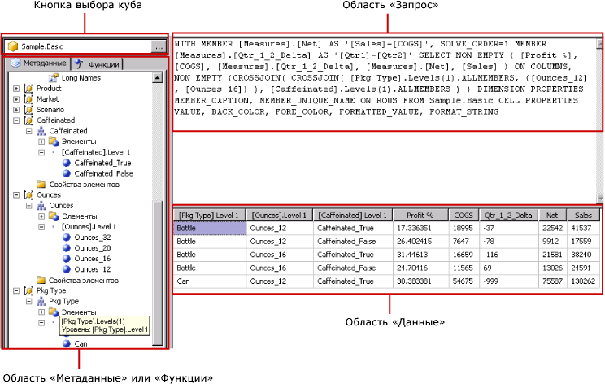

# Пользовательский интерфейс конструктора запросов Hyperion Essbase
  [!INCLUDE[ssRSnoversion](../../includes/ssrsnoversion-md.md)] включают графический конструктор запросов, предназначенный для создания запросов многомерных выражений к источнику данных [!INCLUDE[extEssbase](../../includes/extessbase-md.md)]. Графический конструктор запросов многомерных выражений имеет два режима: режим конструктора и режим запросов. В каждом режиме есть панель «Метаданные», из которой можно перетаскивать элементы куба, определенного в источнике данных, для построения запроса многомерных выражений, получающего данные при обработке отчета.  
  
> [!IMPORTANT]  
>  При создании и выполнении запросов пользователи получают доступ к источникам данных. Следует предоставить минимальные разрешения на источники данных, например разрешение только на чтение.  
  
 Дополнительные сведения о работе с многомерными источниками данных [!INCLUDE[extEssbase](../../includes/extessbase-md.md)] см. в разделе [Тип соединения Hyperion Essbase (SSRS)](../../reporting-services/report-data/hyperion-essbase-connection-type-ssrs.md).  
  
 В этом разделе описываются кнопки панели инструментов и области конструктора запросов для каждого режима работы графического конструктора запросов.  
  
## Графический конструктор запросов в режиме конструктора  
 При изменении запросов многомерных выражений для набора данных, использующего источник данных [!INCLUDE[extEssbase](../../includes/extessbase-md.md)] , графический конструктор запросов открывается в режиме конструктора.  
  
 На следующем рисунке отмечены панели в режиме конструктора.  
  
   
  
 В следующей таблице приводится список панелей в этом режиме.  
  
|Панель|Функция|  
|----------|--------------|  
|Кнопка «Выбрать куб»|Отображает куб, выбранный в настоящий момент.|  
|Панель «Метаданные»|Отображает иерархический список кубов.|  
|Панель «Вычисляемые элементы»|Отображает вычисляемые элементы, определенные на данный момент и доступные для использования в запросе.|  
|Панель «Фильтр»|Отображает фильтры, применяемые к запросу.|  
|Панель «Данные»|Отображает результаты выполнения запроса.|  
  
 В панель «Данные» можно перетаскивать измерения и меры из панели «Метаданные» и вычисляемые элементы из панели «Вычисляемые элементы». Если переключатель **Автовыполнение** на панели инструментов включен, конструктор запросов выполняет запрос каждый раз при перетаскивании объекта в область «Данные». Если переключатель **Автовыполнение** выключен, конструктор запросов не выполняет запрос при любых изменениях в панели «Данные». Запрос можно выполнить вручную, нажав кнопку **Запуск** на панели инструментов.  
  
 В панели «Фильтр» можно выбрать значения измерений, чтобы ограничить данные, получаемые из источника данных. Значения, определенные фильтром в режиме конструктора, отображаются в предложении многомерных выражений WHERE в режиме запросов.  
  
### Панель инструментов графического конструктора запросов в режиме конструктора  
 Панель инструментов конструктора запросов содержит кнопки, которые помогают создавать запросы многомерных выражений с помощью графического интерфейса. В следующей таблице перечислены кнопки и описаны их функции.  
  
|Кнопка|Description|  
|------------|-----------------|  
|**Редактировать как текст**|Переключиться из текстового конструктора запросов в графический и обратно. Недоступен для этого типа источника данных.|  
|**Импорт**|Импортировать существующий запрос из файла определения отчета (RDL), расположенного в файловой системе. Дополнительные сведения см. в разделе [Внедренные и общие наборы данных отчета (построитель отчетов и службы SSRS)](../../reporting-services/report-data/report-embedded-datasets-and-shared-datasets-report-builder-and-ssrs.md).|  
||Обновление метаданных из источника данных.|  
||Отображение диалогового окна **Построитель вычисляемых элементов** . Используйте его, чтобы создать или изменить выражения для вычисляемого элемента, включая задание свойства **Порядок вычисления** .|  
||Переключение между режимами отображения и скрытия пустых ячеек в панели «Данные». (Это эквивалентно использованию предложения NON EMPTY в многомерном выражении).|  
||Автоматическое выполнение запроса и вывод результатов после каждого изменения, например после удаления столбца на панели «Данные». Результаты отображаются в панели «Данные».|  
||Удаление выбранного элемента из запроса. Используйте эту кнопку для удаления выбранных строк в панели «Фильтр».|  
||Выполнить запрос и показать результаты на панели «Данные».|  
||Отмена запроса.|  
||Переключение между режимом конструктора и режимом запросов.|  
  
## Графический конструктор запросов в режиме запросов  
 Для переключения графического конструктора запросов в режим запросов щелкните переключатель **Режим конструктора** на панели инструментов. На следующем рисунке показаны части конструктора запросов в режиме запросов.  
  
   
  
 В следующей таблице описываются функции каждой панели.  
  
|Панель|Функция|  
|----------|--------------|  
|Кнопка «Выбрать куб»|Отображает куб, выбранный в настоящий момент.|  
|Панель «Метаданные/Функции»|Отображает окно с вкладками, содержащее список доступных метаданных и функций, которые можно использовать при создании текста запроса.|  
|Панель запросов|Отображает текст текущего запроса.|  
|Панель результатов|Отображает результаты запроса.|  
  
 Можно перетаскивать меры и измерения с вкладки **Метаданные** панели «Метаданные» в панель «Запросы многомерных выражений». Функции можно перетаскивать в панель «Запросы многомерных выражений» с вкладки **Функции** . При выполнении запроса в панели «Результат» отображаются результаты текущего запроса многомерных выражений.  
  
### Панель инструментов графического конструктора запросов в режиме запросов  
 Панель инструментов конструктора запросов содержит кнопки, которые помогают создавать запросы многомерных выражений с помощью графического интерфейса. Кнопки на панели инструментов в режиме конструктора ничем не отличаются от кнопок в режиме запроса, однако в режиме запроса недоступны следующие кнопки.  
  
-   **Редактировать как текст**  
  
-   **Добавить вычисляемый элемент** ()  
  
-   **Показывать пустые ячейки** ()  
  
-   **Автовыполнение** ()  
  
## См. также  
 [Создание общего или внедренного набора данных (построитель отчетов и службы SSRS)](../../reporting-services/report-data/create-a-shared-dataset-or-embedded-dataset-report-builder-and-ssrs.md)   
 [Файл конфигурации RSReportDesigner](../../reporting-services/report-server/rsreportdesigner-configuration-file.md)  
  
  