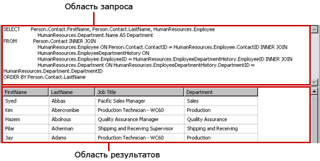
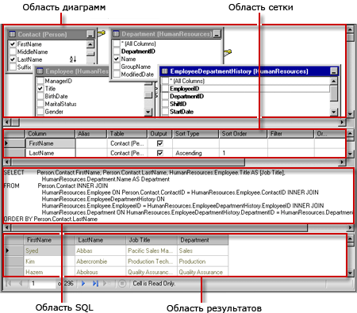
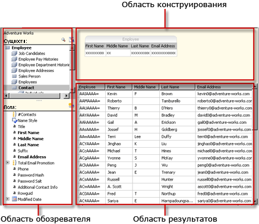
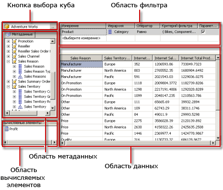
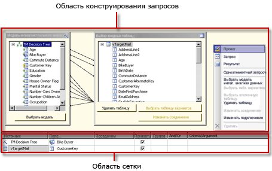
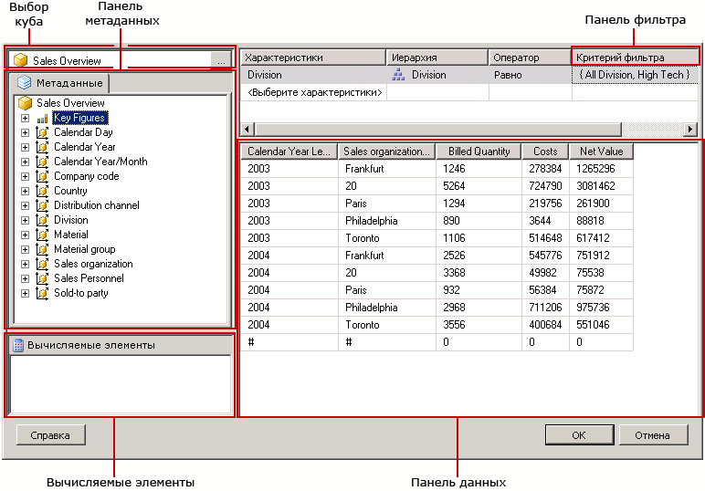
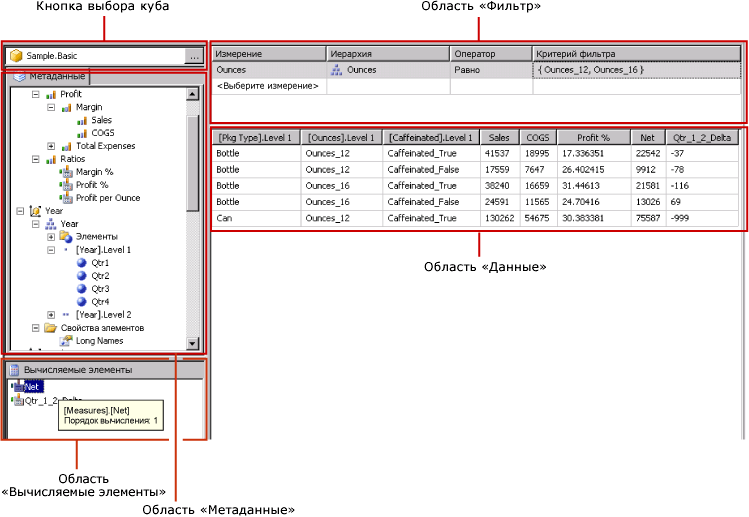

# Средства проектирования запросов (SSRS)
  [!INCLUDE[ssRSnoversion](../../includes/ssrsnoversion-md.md)] содержат различные средства проектирования запросов, которые можно использовать для создания запросов набора данных в конструкторе отчетов. Некоторые конструкторы запросов поддерживают альтернативные режимы работы, что позволяет выбирать между работой в визуальном режиме или непосредственно на языке запросов. В этом разделе представлено каждое из этих средств и описаны типы источников данных, поддерживаемых каждым средством. В этом разделе описаны следующие средства.  
  
-   [Текстовый конструктор запросов](#Textbased)  
  
-   [Графический конструктор запросов](#Graphical)  
  
-   [конструктор запросов моделей отчетов](#Model)  
  
-   [Конструктор запросов многомерных выражений](#MDX)  
  
-   [Конструктор DMX-запросов](#DMX)  
  
-   [Конструктор запросов бизнес-аналитики SAPNetWeaver](#SAPBW)  
  
-   [конструктор запросов Hyperion Essbase](#Hyperion)  
  
 Все средства проектирования запросов выполняются в среде проектирования данных внутри среды [!INCLUDE[ssBIDevStudioFull](../../includes/ssbidevstudiofull-md.md)] при работе с шаблоном проекта сервера отчетов или мастера сервера отчетов. Дополнительные сведения о работе с конструкторами запросов см. в разделе [Reporting Services Query Designers](https://msdn.microsoft.com/library/07efd3f1-804f-45f7-b62a-3e727a3d9835).  
  
 Доступность конкретного конструктора запросов зависит от типа источника данных, с которым вы работаете.  
  
 Доступные типы источников данных определяются модулями обработки данных служб [!INCLUDE[ssRSnoversion](../../includes/ssrsnoversion-md.md)] , установленными на клиенте или на сервере отчетов. Дополнительные сведения см. в разделах [Файл конфигурации RSReportDesigner](../../reporting-services/report-server/rsreportdesigner-configuration-file.md) и [Файл конфигурации RsReportServer.config](../../reporting-services/report-server/rsreportserver-config-configuration-file.md).  
  
 Модуль обработки данных и связанный с ним конструктор запросов могут иметь различный уровень поддержки источников данных.  
  
-   **По типу конструктора запросов.** Например, источник данных [!INCLUDE[ssNoVersion](../../includes/ssnoversion-md.md)] поддерживает и графический и текстовый конструкторы запросов.  
  
-   **По версии языка запросов.** Например, язык запросов, такой как [!INCLUDE[tsql](../../includes/tsql-md.md)] , может иметь разный синтаксис в зависимости от типа источника данных. Языки [!INCLUDE[msCoName](../../includes/msconame-md.md)] [!INCLUDE[tsql](../../includes/tsql-md.md)] и Oracle SQL имеют небольшие различия в синтаксисе команд запросов.  
  
-   **По поддержке указания схемы в именах объектов базы данных.** Если источник данных использует указание схемы в идентификаторе объекта базы данных, она должна указываться в запросе для всех имен, имеющих схему, отличную от схемы по умолчанию. Например, `SELECT FirstName, LastName FROM [Person].[Person]`.  
  
-   **По поддержке параметров запроса.** Поставщики данных поддерживают параметры запросов по-разному. Некоторые из них поддерживают именованные параметры, например: `SELECT Col1, Col2 FROM Table WHERE <parameter identifier><parameter name> = <value>`. Другие поддерживают неименованные параметры, например: `SELECT Col1, Col2 FROM Table WHERE <column name> = ?`. Идентификаторы параметров могут различаться для разных поставщиков данных. Так, в [!INCLUDE[ssNoVersion](../../includes/ssnoversion-md.md)] используется символ "\@" , а в Oracle — двоеточие (:). Некоторые поставщики данных вообще не поддерживают параметров.  
  
-   **По возможности импортировать запросы.** Например, для источника данных [!INCLUDE[ssNoVersion](../../includes/ssnoversion-md.md)] можно импортировать запросы из файла определения отчета (RDL) или из SQL-файла.  
  
##   Текстовый конструктор запросов  
 Текстовый конструктор запросов используется по умолчанию для построения запросов к большинству поддерживаемых реляционных источников данных, таких как [!INCLUDE[msCoName](../../includes/msconame-md.md)] [!INCLUDE[ssNoVersion](../../includes/ssnoversion-md.md)], Oracle, Teradata, OLE DB, XML и ODBC. В отличие от графического конструктора запросов это средство не осуществляет проверку синтаксиса запросов в процессе проектирования. Ниже приведена иллюстрация текстового конструктора запросов.  
  
   
  
 Текстовый конструктор запросов рекомендуется использовать для создания сложных запросов, применения хранимых процедур, запросов XML-данных, а также для написания динамических запросов. В зависимости от источника данных можно переключаться между графическим конструктором запросов и текстовым конструктором запросов с помощью кнопки **Изменить как текст** на панели инструментов. Дополнительные сведения см. в разделе [Пользовательский интерфейс текстового конструктора запросов](https://msdn.microsoft.com/library/44b7c664-03aa-494e-a484-052b318e810c).  
  
##   Графический конструктор запросов  
 Графический конструктор запросов используется для создания или изменения запросов [!INCLUDE[tsql](../../includes/tsql-md.md)] для реляционной базы данных. Это средство проектирования запросов используется в некоторых продуктах [!INCLUDE[msCoName](../../includes/msconame-md.md)] и в других компонентах [!INCLUDE[ssNoVersion](../../includes/ssnoversion-md.md)] . В зависимости от типа источника данных оно поддерживает режимы «Текст», «Хранимая процедура» и «Таблица». Ниже приведена иллюстрация графического конструктора запросов.  
  
   
  
 Можно переключаться между графическим конструктором запросов и текстовым конструктором запросов с помощью кнопки **Изменить как текст** на панели инструментов. Дополнительные сведения см. в статье [Graphical Query Designer User Interface](../../reporting-services/report-data/graphical-query-designer-user-interface.md).  
  
##   конструктор запросов моделей отчетов  
 Конструктор запросов моделей отчетов используется для создания и изменения запросов, выполняемых по модели отчета SMDL, опубликованной на сервере отчетов. Отчеты, выполняемые для моделей, поддерживают просмотр данных с дополнительной информацией. Запрос определяет путь для просмотра данных во время выполнения. Ниже приведена иллюстрация конструктора запросов модели отчета.  
  
   
  
 Чтобы использовать конструктор запросов моделей отчетов, необходимо определить источник данных, указывающий на опубликованную модель. При определении набора данных для источника данных можно открыть запрос набора данных в конструкторе запросов моделей отчетов. Конструктор запросов моделей отчетов поддерживает работу в графическом и текстовом режимах. Можно переключаться между графическим конструктором запросов и текстовым конструктором запросов с помощью кнопки **Изменить как текст** на панели инструментов. Дополнительные сведения см. в статье [Report Model Query Designer User Interface](../../reporting-services/report-data/report-model-query-designer-user-interface.md).  
  
##   Конструктор запросов многомерных выражений  
 Конструктор запросов многомерных выражений (MDX) используется для создания или изменения запросов, выполняемых к источнику данных служб [!INCLUDE[ssASnoversion](../../includes/ssasnoversion-md.md)] с многомерными кубами. Ниже приведена иллюстрация конструктора запросов многомерных выражений после определения запроса и фильтра.  
  
   
  
 Для использования конструктора запросов многомерных выражений необходимо определить источник данных, для которого доступен допустимый и обработанный куб служб Analysis Services. При определении набора данных для источника данных можно открыть запрос в конструкторе запросов многомерных выражений. При необходимости используйте кнопки «MDX» и «DMX» на панели инструментов для переключения между режимами многомерных выражений (MDX) и расширения интеллектуального анализа данных (DMX). Дополнительные сведения см. в статье [Analysis Services MDX Query Designer User Interface](../../reporting-services/report-data/analysis-services-mdx-query-designer-user-interface.md).  
  
##   Конструктор DMX-запросов  
 Конструктор запросов выражений прогноза интеллектуального анализа данных (DMX-запросов) используется для создания и изменения запросов для источника данных служб [!INCLUDE[ssASnoversion](../../includes/ssasnoversion-md.md)] с моделями интеллектуального анализа. Ниже приведена иллюстрация конструктора DMX-запросов расширений интеллектуального анализа данных после выбора модели и входных таблиц.  
  
   
  
 Чтобы использовать конструктор DMX-запросов, необходимо определить источник данных, для которого доступна допустимая модель интеллектуального анализа данных. При определении набора данных для источника данных можно открыть запрос в конструкторе DMX-запросов. При необходимости используйте кнопки «MDX» и «DMX» на панели инструментов для переключения между режимами многомерных выражений (MDX) и расширения интеллектуального анализа данных (DMX). После выбора модели можно создавать запросы прогноза интеллектуального анализа данных, предоставляющие данные для отчета. Дополнительные сведения см. в статье [Analysis Services DMX Query Designer User Interface](../../reporting-services/report-data/analysis-services-dmx-query-designer-user-interface.md).  
  
##   Конструктор запросов BI Sap NetWeaver  
 Конструктор запросов [!INCLUDE[SAP_DPE_BW_1](../../includes/sap-dpe-bw-1-md.md)] используется для получения данных из базы данных [!INCLUDE[SAP_DPE_BW_1](../../includes/sap-dpe-bw-1-md.md)] . Для использования этого конструктора запросов необходим источник данных [!INCLUDE[SAP_DPE_BW_1](../../includes/sap-dpe-bw-1-md.md)] , для которого определен хотя бы один запрос InfoCube, MultiProvider или запрос на основе веб-интерфейса. Ниже приведена иллюстрация конструктора запросов [!INCLUDE[SAP_DPE_BW_1](../../includes/sap-dpe-bw-1-md.md)] . Дополнительные сведения см. в статье [SAP NetWeaver BI Query Designer User Interface](../../reporting-services/report-data/sap-netweaver-bi-query-designer-user-interface.md).  
  
   
  
##   конструктор запросов Hyperion Essbase  
 Конструктор запросов [!INCLUDE[extEssbase](../../includes/extessbase-md.md)] используется для получения данных из баз данных и приложений [!INCLUDE[extEssbase](../../includes/extessbase-md.md)] . Ниже приведена иллюстрация конструктора запросов [!INCLUDE[extEssbase](../../includes/extessbase-md.md)] .  
  
   
  
 Для использования этого конструктора запросов необходим источник данных [!INCLUDE[extEssbase](../../includes/extessbase-md.md)] , который располагает хотя бы одной базой данных.  
  
 Дополнительные сведения см. в статье [Hyperion Essbase Query Designer User Interface](../../reporting-services/report-data/hyperion-essbase-query-designer-user-interface.md).  
  
## См. также:  
 [Инструментальные средства служб Reporting Services](../../reporting-services/tools/reporting-services-tools.md)   
 [Наборы данных отчетов (службы SSRS)](../../reporting-services/report-data/report-datasets-ssrs.md)   
 [Создание строк подключения к данным (построитель отчетов и службы SSRS)](../../reporting-services/report-data/data-connections-data-sources-and-connection-strings-report-builder-and-ssrs.md)   
 [Учебники по службам Reporting Services &#40;SSRS&#41;](../../reporting-services/reporting-services-tutorials-ssrs.md)   
 [Источники данных, поддерживаемые службами Reporting Services (SSRS)](../../reporting-services/report-data/data-sources-supported-by-reporting-services-ssrs.md)   
 [Создание внедренного или общего источника данных (службы SSRS)](https://msdn.microsoft.com/library/b111a8d0-a60d-4c8b-b00a-51644b19c34b)  
  
  
