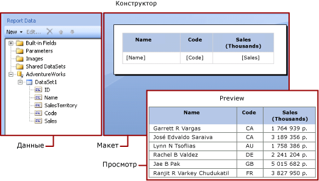
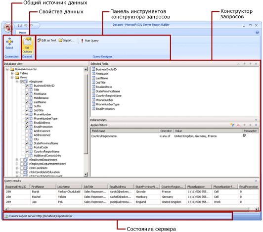

# Наборы данных отчетов (SSRS)
  Чтобы добавить данные в отчет, необходимо создать наборы данных. Каждый набор данных представляет результирующий набор команды запроса к источнику данных. Столбцы в результирующем наборе представляют собой коллекцию полей. Стройки в результирующем наборе представляют данные. Набор данных не содержит фактических данных. Набор данных содержит информацию, необходимую для получения определенного набора данных из источника данных.  
  
 Есть два типа наборов данных: внедренные и общие. Внедренный набор данных определяется в отчете и используется только этим отчетом. Общий набор данных определяется на сервере отчетов или на сайте SharePoint и может использоваться несколькими отчетами. В построителе отчетов можно создавать общие наборы данных в режиме «Общий набор данных» либо внедренные наборы данных в режиме «Конструктор отчетов». В конструкторе отчетов в среде [!INCLUDE[ssBIDevStudioFull](../../includes/ssbidevstudiofull-md.md)]можно создавать общие наборы данных как часть проекта либо внедренные наборы данных как часть отчета.  
  
-   **Внедренные наборы данных.** В отличие от таких приложений, как [!INCLUDE[msCoName](../../includes/msconame-md.md)] Office Excel, где можно работать с данными непосредственно в электронной таблице, в построителе отчетов или конструкторе отчетов вы работаете с метаданными, представляющими данные, которые будут извлечены при обработке отчета. Чтобы создать внедренный набор данных, выберите источник данных и задайте запрос. После создания набора данных можно просмотреть коллекцию полей в области данных отчета. Данные из набора данных можно отобразить в области данных как таблицу или диаграмму. В каждой области данных можно группировать, фильтровать и сортировать данные. После создания макета отчета можно выполнить отчет, чтобы получить фактические данные.  
  
     На следующем рисунке в области данных отчета отображается источник данных [!INCLUDE[ssSampleDBUserInputNonLocal](../../includes/sssampledbuserinputnonlocal-md.md)], набор данных DataSet1 и пять полей в коллекции полей набора данных. Панель «Макет» содержит таблицу с заголовками столбцов в верхней строке и ячейками таблицы с текстом в нижней строке. Заполнитель [Name] — это метаданные для поля Name. При выполнении отчета текст заполнителя заменяется фактическими значениями данных. Таблица расширяется, чтобы показать все данные.  
  
       
  
-   **Общие наборы данных.** Если набор данных нужно использовать в нескольких отчетах, можно создать общий набор данных. Чтобы создать и сохранить общий набор данных на сервере отчетов или на сайте SharePoint, воспользуйтесь построителем отчетов в представлении конструктора общего набора данных. Создать общий набор данных как часть проекта, который будет развернут на сервере или сайте, можно с помощью конструктора отчетов.  
  
     На следующей иллюстрации показано представление конструктора общих наборов данных в построителе отчетов. Можно выбрать или изменить подключение к данным, свойства набора данных, запрос и фильтры. Есть также возможность пометить фильтры как параметры и просмотреть результаты выполнения запроса. После этого нужно сохранить изменения на сервере или на сайте.  
  
       
  
 Дополнительные сведения см. в разделах [Внедренные и общие наборы данных (построитель отчетов и службы SSRS)](../../reporting-services/report-data/embedded-and-shared-datasets-report-builder-and-ssrs.md) и [Внедренные и общие подключения к данным или источники данных (построитель отчетов и службы SSRS)](https://msdn.microsoft.com/library/f417782c-b85a-4c4d-8a40-839176daba56).  
  
 Также можно добавить наборы данных в отчет, добавив элементы отчета, включающие наборы данных, от которых они зависят. [!INCLUDE[ssRBrptparts](../../includes/ssrbrptparts-md.md)]  
  
 Дополнительные сведения о создании отчета с данными из базы данных [!INCLUDE[ssNoVersion](../../includes/ssnoversion-md.md)] см. в разделе [Учебник. Создание простого табличного отчета (построитель отчетов)](../../reporting-services/tutorial-creating-a-basic-table-report-report-builder.md). О построении отчета, включающего собственные данные, см. в разделе [Учебник. Создание стандартного отчета с диаграммой в режиме "вне сети" (построитель отчетов)](../../reporting-services/report-builder/tutorial-create-a-quick-chart-report-offline-report-builder.md).  
  
> [!NOTE]  
>  [!INCLUDE[ssRBRDDup](../../includes/ssrbrddup-md.md)]  
  
##   Добавление данных отчета  
 В построителе отчетов можно добавлять данные отчета следующими способами.  
  
-   Добавить части отчета с сервера отчетов в отчет. Каждый элемент отчета автономен и включает зависимые наборы данных. Наборы данных стандартные.  
  
-   Использовать мастера таблиц/матриц, диаграмм и карт. В мастере можно выбрать общие источники данных и общие наборы данных либо создать новые наборы данных и продолжить конструирование отчета.  
  
-   Добавить общие наборы данных с сервера отчетов. Общие наборы данных стандартные, и в них указано, какие данные используются из стандартных источников данных. При добавлении общего набора данных в отчет добавьте ссылку на набор данных, которая указывает на определение этого общего набора данных.  
  
 В построителе или конструкторе отчетов можно добавлять данные следующими способами.  
  
-   Добавить внедренные наборы данных, основанные на общих источниках данных.  
  
-   Добавить внедренные наборы данных, основанные на встроенных источниках данных.  
  
> [!NOTE]  
>  На сервере отчетов безопасность общих элементов отчетов обеспечивается отдельно или с помощью наследования разрешений от папок, в которых они были опубликованы. Чтобы разрешить другим пользователям доступ к общим наборам данных, сохраненным определенным пользователем, необходимо понимать, каким образом предоставляются эти права. Дополнительные сведения см. в разделе [Безопасность (построитель отчетов)](../../reporting-services/report-builder/security-report-builder.md) или [Защита элементов общего набора данных](../../reporting-services/security/secure-shared-dataset-items.md).  
  
 После добавления данных в отчет можно организовать данные на странице отчета с помощью частей данных, изменить элементы отчета, опубликовать изменения для совместного использования и дать возможность пользователям ограничить или сортировать данные в отчете. Дополнительные сведения см. в соответствующих разделах:  
  
-   [Таблицы, матрицы и списки (построитель отчетов и службы SSRS)](../../reporting-services/report-design/tables-matrices-and-lists-report-builder-and-ssrs.md)  
  
-   [Диаграммы (построитель отчетов и службы SSRS)](../../reporting-services/report-design/charts-report-builder-and-ssrs.md)  
  
-   [Спарклайны и гистограммы (построитель отчетов и службы SSRS)](../../reporting-services/report-design/sparklines-and-data-bars-report-builder-and-ssrs.md)  
  
-   [Индикаторы (построитель отчетов и службы SSRS)](../../reporting-services/report-design/indicators-report-builder-and-ssrs.md)  
  
-   [Параметры отчета (построитель отчетов и конструктор отчетов)](../../reporting-services/report-design/report-parameters-report-builder-and-report-designer.md)  
  
-   [Элементы отчета (построитель отчетов и службы SSRS)](../../reporting-services/report-design/report-parts-report-builder-and-ssrs.md)  
  
-   [Фильтрация, группирование и сортировка данных (построитель отчетов и службы SSRS)](../../reporting-services/report-design/filter-group-and-sort-data-report-builder-and-ssrs.md)  
  
  
##   Добавление данных с помощью элементов отчета  
 Элемент отчета содержит наборы данных, от которых он зависит. Эти наборы данных строятся на базе общих источников данных, доступных на сервере отчетов. При добавления элемента к отчету в построителе отчетов зависимые наборы данных добавляются к отчету, как если бы они добавлялись вручную. Например, стандартная диаграмма содержит набор данных. Чтобы просмотреть данные, надо просмотреть отчет.  
  
> [!NOTE]  
>  [!INCLUDE[ssRBrptparts](../../includes/ssrbrptparts-md.md)]  
  
 Части отчета, общие источники данных и общие наборы данных определяются заранее и хранятся на сервере отчетов. Для доступа к ним необходимо открыть построитель отчетов в режиме сервера, подключившись к серверу отчетов. Эти элементы можно использовать для создания новых собственных версий, если у пользователя есть разрешение на запись на сервере отчетов.  
  
-   Дополнительные сведения см. в разделах [Элементы отчета (построитель отчетов и службы SSRS)](../../reporting-services/report-design/report-parts-report-builder-and-ssrs.md) и [Элементы отчетов в конструкторе отчетов (SSRS)](../../reporting-services/report-design/report-parts-in-report-designer-ssrs.md).  
  
  
##   Запросы и конструкторы запросов  
 Чтобы указать, какие данные нужно получить из источника данных, следует построить команду запроса. Каждый тип источника данных предусматривает связанный с ним *конструктор запросов* , который поможет построить запрос. Конструкторы запросов бывают текстовыми или графическими. В графических конструкторах запросов отображаются метаданные, представляющие собой данные из внешнего источника данных, и запрос строится в интерактивном режиме путем перетаскивания полей или сущностей в область конструктора запросов. В текстовых конструкторах запросов запросы пишутся или импортируются в соответствии с синтаксисом запросов, поддерживаемым внешним источником данных.  
  
 В конструкторе запросов можно выполнить запрос, чтобы посмотреть пример данных и проверить синтаксис команды запроса. Имена столбцов в результирующем наборе становятся именами полей, отображаемых в области данных отчета. Результирующий набор должен быть простым набором строк и столбцов с одинаковым количеством значений для каждой строки данных. Получение нескольких результирующих наборов из одного запроса не поддерживается. Неоднородная иерархия без постоянного количества столбцов, из которой может быть получено разное количество значений данных для каждой строки, не поддерживается.  
  
 Для выполнения запроса необходимо иметь учетные данные времени разработки. Дополнительные сведения см. в разделе [задание учетных данных и сведений о соединении для источников данных отчета](specify-credential-and-connection-information-for-report-data-sources.md) и [подключения к данным, источники данных и строки подключения &#40;построитель отчетов и службы SSRS&#41; ](../../reporting-services/report-data/data-connections-data-sources-and-connection-strings-report-builder-and-ssrs.md).  
  
 Взаимодействие между модулем обработки данных и внешним источником данных обрабатывается поставщиками данных. Поддержка синтаксиса команд запроса, параметров запроса, типов данных для значений в результирующем наборе определяется для каждого поставщика данных. Дополнительные сведения см. в разделе для конкретных модулей обработки данных и в разделе [Конструкторы запросов (построитель отчетов)](query-design-tools-ssrs.md).  
  
  
##   Инструкции  
 [Добавление и проверка подключения к данным (построитель отчетов и службы SSRS)](../../reporting-services/report-data/add-and-verify-a-data-connection-report-builder-and-ssrs.md)  
  
 [Создание общего или внедренного набора данных (построитель отчетов и службы SSRS)](../../reporting-services/report-data/create-a-shared-dataset-or-embedded-dataset-report-builder-and-ssrs.md)  
  
 [Добавление, изменение и обновление полей в области данных отчета (построитель отчетов и службы SSRS)](../../reporting-services/report-data/add-edit-refresh-fields-in-the-report-data-pane-report-builder-and-ssrs.md)  
  
 [Построение запроса в конструкторе реляционных запросов (построитель отчетов и службы SSRS)](../../reporting-services/report-data/build-a-query-in-the-relational-query-designer-report-builder-and-ssrs.md)  
  
 [Отображение скрытых наборов данных для значений параметра в многомерных данных (построитель отчетов и службы SSRS)](../../reporting-services/report-data/show-hidden-datasets-for-parameter-values-multidimensional-data.md)  
  
 [Добавление фильтра к набору данных (построитель отчетов и службы SSRS)](../../reporting-services/report-data/add-a-filter-to-a-dataset-report-builder-and-ssrs.md)  
  
 [Установка сообщения об отсутствии данных для области данных (построитель отчетов и службы SSRS)](../../reporting-services/report-data/set-a-no-data-message-for-a-data-region-report-builder-and-ssrs.md)  
  
 [Связь параметра запроса с параметром отчета (построитель отчетов и службы SSRS)](../../reporting-services/report-data/associate-a-query-parameter-with-a-report-parameter-report-builder-and-ssrs.md)  
  
 [Определение параметров в конструкторе запросов многомерных выражений для служб Analysis Services (построитель отчетов и службы SSRS)](../../reporting-services/report-data/define-parameters-in-the-mdx-query-designer-for-analysis-services.md)  
  
  
##   в этом разделе  
 [Элементы отчета и наборы данных в построителе отчетов](../../reporting-services/report-data/report-parts-and-datasets-in-report-builder.md)  
  
 [Подключения к данным, источники данных и строки подключения в построителе отчетов](data-connections-data-sources-and-connection-strings-report-builder-and-ssrs.md)  
  
 [Задание учетных данных и сведениях о соединении для источников данных отчета](specify-credential-and-connection-information-for-report-data-sources.md)  
  
 [Внедренные и общие наборы данных отчета (построитель отчетов и службы SSRS)](../../reporting-services/report-data/report-embedded-datasets-and-shared-datasets-report-builder-and-ssrs.md)  
  
 [Коллекция полей набора данных (построитель отчетов и службы SSRS)](../../reporting-services/report-data/dataset-fields-collection-report-builder-and-ssrs.md)  
  
  
## См. также:  
 [Представление конструктора отчетов (построитель отчетов)](../../reporting-services/report-builder/report-design-view-report-builder.md)   
 [Основные понятия разработки отчетов (построитель отчетов и службы SSRS)](../../reporting-services/report-design/report-authoring-concepts-report-builder-and-ssrs.md)  
  
  
