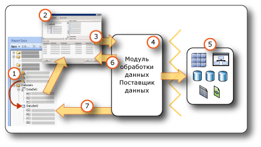

# <a name="report-embedded-datasets-and-shared-datasets-report-builder-and-ssrs"></a>Внедренные и общие наборы данных отчета (построитель отчетов и службы SSRS)
  Набор данных указывает данные, которые надо извлечь через соединение с данными. Набор данных основывается на подключении к данным, сохраненном в отчете как внедренный источник данных или как ссылка на общий источник данных на сервере отчетов. Набор данных включает в себя запрос, указывающий на набор полей. При перетаскивании этих полей в область конструктора создаются выражения, значением которых при выполнении отчета являются фактические данные.  
  
 Существует два типа наборов данных.  
  
-   **Общий набор данных.** Общий набор данных определяется на сервере отчетов. Можно войти на сервер для создания общего набора данных или для выбора одного из стандартных для добавления в отчет. Общий набор данных полезен, если нужно создать запрос, который будет использоваться в нескольких отчетах. Общие наборы данных хранятся на сервере отчетов и управляются независимо от отчетов и общих источников данных. Например, администратор сервера отчетов может обновить запрос, чтобы воспользоваться улучшенными возможностями по индексированию и другой оптимизации производительности запросов.  
  
-   **Внедренный набор данных.** Внедренный набор данных определяется и используется только в отчете, в который он внедрен. Применяйте внедренный набор данных, если необходимо, чтобы данные из внешнего источника данных использовались только в одном отчете. Внедренные наборы данных используются при необходимости создания запроса, не имеющего других зависимостей. Эти наборы данных не должны использоваться несколькими отчетами.  
  
 Набор данных также включает в себя параметры, фильтры, параметры данных, включая учет регистра, тип японской азбуки, ширину символов, диакритические знаки и параметры сортировки.  
  
   
  
1.  **Наборы данных в области данных отчета** Набор данных появляется в области данных отчета после создания внедренного набора данных или добавления общего набора данных. Набор данных основан на источнике данных.  
  
2.  **Конструктор запросов.** При конструировании запроса к набору данных открывается конструктор запросов, связанный с этим типом источника данных.  
  
3.  **Команда запроса.** Конструктор запросов помогает строить команду запроса. Синтаксис команды определяется поставщиком данных.  
  
4.  **Модуль обработки данных/поставщик данных** . Соединение с данными может проходить через несколько уровней доступа к данным.  
  
5.  **Внешние источники данных.** Получение данных из реляционных баз данных, многомерных баз данных, списков SharePoint, веб-служб или моделей отчетов.  
  
6.  **Результаты запроса.** Можно запустить запрос и просмотреть примерный результирующий набор. Для выполнения запроса необходимо наличие учетных данных времени разработки.  
  
7.  **Метаданные из схемы.** Поставщик данных запускает команду запроса к схеме отдельно из запроса, чтобы получить метаданные для коллекции полей набора данных. Например, следующая инструкция [!INCLUDE[tsql](../../includes/tsql-md.md)] **SELECT** statement returns the column names for a database table. Чтобы развернуть набор данных для просмотра коллекции полей набора данных, воспользуйтесь областью данных отчета.  
  
 Данные также можно включить в отчет при помощи стандартных наборов данных и элементов отчетов. Для этих элементов уже имеются необходимые сведения о подключении к данным. Дополнительные сведения см. в разделе [наборов данных отчета &#40; Службы SSRS &#41; ](../../reporting-services/report-data/report-datasets-ssrs.md) и [отчетов частей &#40; Построитель отчетов и службы SSRS &#41; ](../../reporting-services/report-design/report-parts-report-builder-and-ssrs.md).  
  
 Дополнительные сведения о встроенных типах источников данных и модулях обработки данных см. в разделе [Добавление данных из внешних источников данных (службы SSRS)](../../reporting-services/report-data/add-data-from-external-data-sources-ssrs.md).  
  
> [!NOTE]  
>  [!INCLUDE[ssRBRDDup](../../includes/ssrbrddup-md.md)]  
  
##  <a name="Overview"></a> Общие сведения о наборах данных отчета и запросах  
 Набор данных отчета содержит команду запроса, запускающуюся на внешнем источнике данных и указывающую, какие данные надо извлечь. Для построения команды запроса используется конструктор запросов, связанный с модулем обработки данных для внешнего источника данных. В конструкторе запросов можно запустить запрос на выполнение и просмотреть результирующий набор. Результирующий набор представляет собой прямоугольный набор строк с именами столбцов и строками с одинаковым количеством значения в каждой. Иерархические данные, называемые также *неоднородной иерархией*, не поддерживаются. Имена столбцов хранятся в определении отчета как список полей набора данных.  
  
 После добавления наборов данных в отчет надо перетащить поля из их коллекции полей из области данных отчета в таблицы, диаграммы или другие элементы отчета, используемые в макете. Дополнительные сведения о работе с полями см. в разделе [Коллекция полей набора данных (построитель отчетов и службы SSRS)](../../reporting-services/report-data/dataset-fields-collection-report-builder-and-ssrs.md).  
  
### <a name="understanding-data-from-a-report-dataset"></a>Основные сведения о данных из набора данных  
 В зависимости от модуля обработки данных, набор данных отчета может содержать следующие типы данных.  
  
-   Результирующий набор из реляционной базы данных, которые могут исходить от выполняемых команд базы данных, хранимых процедур и определяемых пользователем функций. Если несколько результирующих наборов получаются одним запросом, обрабатывается только первый из них, а все остальные результирующие наборы игнорируются. Например, при запуске следующего запроса в текстовом конструкторе запросов на панели результатов будет отображен только результирующий набор для `Production.Product` :  
  
    ```  
    SELECT ProductID FROM Production.Product  
    GO  
    SELECT ContactID FROM Person.Contact  
    ```  
  
-   Плоский набор строк из многомерных источников данных, которые используют протокол XML для аналитики. Некоторые поставщики данных предоставляют дополнительные свойства измерений и ячеек из источника данных, которые нельзя увидеть в результирующем наборе, доступном в отчете.  
  
-   Плоский результирующий набор из источников XML-данных, который включает XML-элементы, их атрибуты и дочерние элементы.  
  
-   Результирующий набор из любого зарегистрированного и настроенного поставщика данных [!INCLUDE[dnprdnshort](../../includes/dnprdnshort-md.md)] .  
  
-   Данные из модели отчета, разработанной для конкретного источника данных, со стандартными сущностями, связями сущностей и полями. Дополнительные сведения см. в разделе «Использование моделей отчетов в качестве источников данных» в [документации по службам Reporting Services](http://go.microsoft.com/fwlink/?linkid=121312) , входящей в состав электронной документации по SQL Server.  
  
 Если отчет обрабатывается во время выполнения, фактический результирующий набор, возвращаемый для запроса, может не содержать ни одной строки или содержать несколько строк. Также возможно, что столбцы, определенные в запросе, могут отсутствовать в источнике данных. Значения NULL из источника данных сопоставляются со значением [!INCLUDE[dnprdnshort](../../includes/dnprdnshort-md.md)] System.DBNull.Value **платформы**.  
  
 Дополнительные сведения о полях наборов данных см. в разделе [Коллекция полей набора данных (построитель отчетов и службы SSRS)](../../reporting-services/report-data/dataset-fields-collection-report-builder-and-ssrs.md).  
  
### <a name="dataset-query"></a>Запрос набора данных  
 При запуске запроса набора данных в конструкторе запросов во время разработки отображается набор строк из источника данных, которые показывают данные образца. Когда пользователь просматривает отчет во время выполнения, запрос может принести различные значения, так как данные в источнике данных изменились. Каждый раз при обработке отчета могут появляться различные данные.  
  
 При определении каждого набора данных построитель отчетов открывает конструктор запросов, который соответствует типу источника данных, что облегчает создание запросов. Например, для определения запроса к данным реляционной базы данных SQL Server мастера таблиц или матриц, диаграмм и карт открывают простой графический интерфейс для построения запроса, в котором необходимо просто выбрать поля для включения в набор данных.  
  
 В конструкторе запросов можно выполнить следующие действия.  
  
-   Переключаться между графическим и текстовым представлениями запроса. Использовать графический вид для просмотра схем, таблиц, представлений и хранимых процедур для источника данных. Использовать текстовое представление для ввода, вставки или просмотра существующих запросов, как правило, требуется для построения сложных запросов, которые невозможно отобразить в графическом конструкторе запросов. Например, можно импортировать запрос из файла [!INCLUDE[tsql](../../includes/tsql-md.md)] (SQL), из другого отчета с сервера отчетов или из определения отчета в RDL-файле из общей папки.  
  
-   Запустить запрос, чтобы просмотреть данные. Запрос возвращает результирующий набор. Столбцы в результирующем наборе становятся коллекцией полей набора данных. Строки результата становятся данными для набора данных. С запросом можно работать, пока не будут получены необходимые столбцы.  
  
-   Добавить параметры запроса, помогающие получить только данные, необходимые для отчета. Для параметров запроса автоматически создаются совпадающие с параметрами отчета. Для источника данных модели отчета указанный фильтр автоматически создает совпадающий с ним параметр отчета. Параметры отчета позволяют пользователям указать необходимые данные отчета при запуске отчета. Например, пользователь может выбрать категории продуктов, по которым будут представлены данные, и тогда при выполнении отчета в нем будут показаны только данные по этим категориям.  
  
-   Импортировать существующий запрос из другого отчета.  
  
 Конструкторы запросов могут предоставлять графический или текстовый режимы в зависимости от типа источника данных. При выборе текстового режима необходимо использовать соответствующий синтаксис запросов для источника данных.  
  
 Кроме того, при определении набора данных отчета свойства данных можно задать в запросе или принять свойства по умолчанию, заданные поставщиком данных. Тип данных можно изменить одним из следующих способов:  
  
-   Перезаписать запрос набора данных, чтобы специально преобразовать поле к другому типу данных.  
  
-   Изменить поле в наборе данных и предоставить специальный формат.  
  
-   Создать новое специальное поле на основе поля базы данных и предоставить специальный формат.  
  
 Дополнительные сведения см. в разделах [Коллекция полей набора данных (построитель отчетов и службы SSRS)](../../reporting-services/report-data/dataset-fields-collection-report-builder-and-ssrs.md).  
  
### <a name="importing-existing-queries-for-a-dataset"></a>Импорт существующих запросов для набора данных  
 При создании набора данных можно создать новый запрос или импортировать существующий запрос из файла или другого отчета. При импорте запроса из другого отчета можно выбрать запрос для импорта из списка наборов данных в отчете.  
  
 Поддерживаются только типы SQL- и RDL-файлов. Запросы с многомерными выражениями (MDX), запросы прогноза интеллектуального анализа данных (DMX) и модельные запросы (SMQL) могут быть созданы только соответствующим конструктором запросов.  
  
##  <a name="Compare"></a> Сравнение и создание общих наборов данных и внедренных наборов данных  
 Внедренные наборы данных определяются в отчете или в опубликованном элементе отчета. Изменения во внедренных наборах данных влияют только на такие отчеты или на части отчетов.  
  
 Общие наборы данных определяются на сервере отчетов или на сайте SharePoint, основываются на общем источнике данных и могут использоваться несколькими отчетами или элементами отчетов. Изменения в определении общего набора данных влияют на все отчеты и все элементы отчетов, которые его используют.  
  
 При добавлении общего набора данных в отчет коллекция полей набора данных обновляется с учетом текущего определения на сервере отчетов. Пользователь не получает уведомлений об обновлениях, сделанных на сервере отчетов. Для синхронизации локальной копии коллекции полей со сделанными изменениями в определении общего набора данных на сервере отчетов необходимо обновить локальную коллекцию полей. Дополнительные сведения см. в разделе [Добавление, изменение и обновление полей в области данных отчета (построитель отчетов и службы SSRS)](../../reporting-services/report-data/add-edit-refresh-fields-in-the-report-data-pane-report-builder-and-ssrs.md).  
  
 Опубликованные элементы отчета содержат внедренные или общие наборы данных, от которых они зависят. Дополнительные сведения см. в разделе [Элементы отчета и наборы данных в построителе отчетов](../../reporting-services/report-data/report-parts-and-datasets-in-report-builder.md).  
  
 Различие между общими и внедренными источниками данных состоит в способе создания, хранения и управления. В следующей таблице приведены все различия между внедренными и общими источниками данных.  
  
|Description|Внедренный<br /><br /> Источник данных|Shared<br /><br /> Источник данных|  
|-----------------|------------------------------|----------------------------|  
|Подключение к данным внедрено в определение отчета.|||  
|Указатель на подключение к данным на сервере ответов внедрен в определение отчета.|||  
|Управляется на сервере отчетов|||  
|Необходим для общих наборов данных|||  
|Необходим для компонентов|||  
  
 В конструкторе отчетов можно создавать общие наборы данных в качестве частей проекта отчета, а также указывать, следует ли развертывать их на сервере отчетов. Нельзя выбрать общий набор данных на сервере отчетов и добавить его в отчет.  
  
 В построителе отчетов можно сделать следующее.  
  
-   Чтобы создать общий набор данных, используйте конструктор общих наборов данных. Для последующего использования в других отчетах его нужно сохранить на сервере отчетов или на сайте SharePoint. Также можно изменить существующие общие наборы данных на сервере отчетов. В этом представлении можно создать запрос и задать все параметры набора данных. Дополнительные сведения см. в разделе [общий конструктор наборов данных &#40; Построитель отчетов &#41; ](../../reporting-services/report-builder/shared-dataset-design-view-report-builder.md).  
  
-   Чтобы добавить к отчету общий набор данных, откройте построитель отчетов в представлении конструктора отчетов. В мастере или в области данных отчета перейдите на сервер отчетов и выберите общий набор данных для добавления к отчету. В этом представлении нельзя изменять запрос (разрешается только добавление полей). Можно переопределять другие параметры данных, а также добавлять фильтры. Удалять фильтры нельзя.  
  
 В следующей таблице описывается сравнение свойств, которые можно настроить для определения общего набора данных на сервере отчетов и экземпляра общего набора данных в определении отчета.  
  
|Свойство|Замечания о конфигурации для определения|Замечания о конфигурации для экземпляра|  
|--------------|--------------------------------------------|------------------------------------------|  
|Текст запроса|Настройка запроса, включая определение выражения.|Невозможно изменить запрос|  
|Параметры запроса|Не может ссылаться на параметры отчета<br /><br /> Включает значения по умолчанию<br /><br /> Включает флаг «только для чтения»|Настройка параметров, не помеченных «только для чтения» в определении|  
|Фильтры|Определение фильтров|Не может просматривать или изменять фильтры наборов данных, которые являются частью определения<br /><br /> Можно создавать дополнительные фильтры|  
|Источник данных|Должен быть общим источником данных|Невозможно изменить источник данных|  
|Поля|Поля из команды запроса<br /><br /> Вычисляемые поля не являются частью определения набора данных|Может просматривать поля, но не может их изменять<br /><br /> Коллекция полей является статической и создается на основе запроса на момент добавления общего набора данных в отчет. Для обновления нажмите кнопку **Обновить поля** в диалоговом окне **Свойства набора данных** . Фактическая коллекция полей включает все поля, возвращаемые текущим запросом в определении<br /><br /> Добавить вычисляемые поля|  
|Набор данных|Параметры данных, такие как чувствительность к регистру|Переопределение параметров данных в экземпляре|  
  
 Дополнительные сведения о создании наборов данных см. в разделах [Создание общего или внедренного набора данных (построитель отчетов и службы SSRS)](../../reporting-services/report-data/create-a-shared-dataset-or-embedded-dataset-report-builder-and-ssrs.md) и [Инструментальные средства служб Reporting Services](../../reporting-services/tools/reporting-services-tools.md) [документации к службам Reporting Services](http://go.microsoft.com/fwlink/?linkid=121312), входящей в состав электронной документации по SQL Server.  
  
##  <a name="SortGroupFilter"></a> Фильтрация, сортировка и группирование данных в наборе данных  
 Данные в наборе данных появляются после запуска команды запроса ко внешнему источнику данных. Синтаксис команды запроса для модуля обработки данных определяет, будут ли данные отсортированы или сгруппированы. Сортировка или группирование применяется в запросе до извлечения данных для отчета. Фильтрация данных применяется после их извлечения для отчета.  
  
 Дополнительные сведения см. в разделе [Фильтрация, группирование и сортировка данных (построитель отчетов и службы SSRS)](../../reporting-services/report-design/filter-group-and-sort-data-report-builder-and-ssrs.md).  
  
### <a name="filtering-data-in-a-dataset"></a>Фильтрация данных в наборе данных  
 Фильтры, которые являются частью определения набора данных в отчете. Фильтры наборов данных используются для указания того, какие именно данные необходимо включить в отчет. При указании фильтров для набора данных все области данных, основанные на этом наборе данных, будут отображать только данные, прошедшие через этот фильтр.  
  
 Фильтры, которые являются частью определения общего набора данных. Фильтры общего набора данных влияют на все отчеты, которые включают этот набор данных. После добавления общего набора данных в отчет или после добавления компонента с зависимым общим набором данных можно создать дополнительные фильтры набора данных. Созданные фильтры используются только в этом отчете и не являются частью определения общего набора данных на сервере отчетов.  
  
 Можно установить дополнительные фильтры для области данных или группы областей данных. Также можно использовать сочетание параметров и фильтров, позволяющее пользователям выбирать данные, которые должны отображаться в отчете. Дополнительные сведения см. в разделе [Параметры отчета (построитель отчетов и конструктор отчетов)](../../reporting-services/report-design/report-parameters-report-builder-and-report-designer.md).  
  
### <a name="sorting-data-in-a-dataset"></a>Сортировка данных в наборе данных  
 В наборах данных порядок данных определяется порядком их извлечения из внешнего источника данных. Этот же порядок указывается при выполнении запроса в конструкторе запросов. Если синтаксис команд запроса поддерживает сортировку, то можно изменять порядок сортировки данных для источника до того, как эти данные будут извлечены в отчет. Например, для запроса [!INCLUDE[tsql](../../includes/tsql-md.md)] порядком сортировки управляет инструкция ORDER BY.  
  
 Для сортировки данных после их извлечения в отчет определяются выражения сортировки для областей данных и групп областей данных. Дополнительные сведения см. в разделе для конкретного типа области данных, например, [таблиц, матриц и списков &#40; Построитель отчетов и службы SSRS &#41; ](../../reporting-services/report-design/tables-matrices-and-lists-report-builder-and-ssrs.md).  
  
 Также можно добавить сочетание параметров и выражений сортировки, которая позволит пользователям выбирать порядок сортировки данных в отчете. Дополнительные сведения см. в разделе [Параметры отчета (построитель отчетов и конструктор отчетов)](../../reporting-services/report-design/report-parameters-report-builder-and-report-designer.md).  
  
### <a name="grouping-data-in-a-dataset"></a>Группирование данных в наборе данных  
 Сгруппировать данные в наборе данных нельзя. Для агрегации данных в наборе данных можно изменить команду запроса для вычисления статистических значений до извлечения данных в отчет. Они известны как *серверные статистические значения*. В выражениях для обозначения таких значений в качестве заранее вычисленных статистических значений используется агрегатная функция. Дополнительные сведения см. в разделе [Агрегатная функция (построитель отчетов и службы SSRS)](../../reporting-services/report-design/report-builder-functions-aggregate-function.md).  
  
##  <a name="Parameters"></a> Использование параметров и наборов данных  
 Для внедренного запроса к набору данных, который содержит переменные, параметры запроса и соответствующие параметры отчета создаются автоматически. При выполнении отчета значение параметра отчета связывается с параметром запроса к набору данных. Таким образом, команда запроса, выполненная на внешнем источнике данных, включает значения, указанные в параметрах отчета. Параметры отчета позволяют пользователям выбрать необходимые данные для отображения в отчете. Можно просмотреть, как параметры запроса и параметры отчета связаны в [диалоговое окно свойств набора данных, параметры &#40; Построитель отчетов &#41; ](http://msdn.microsoft.com/library/3a0672ad-c969-455b-b952-585164ce1dda) страницы.  
  
 Для общего набора данных параметры запроса являются частью определения общего набора данных, который управляется на сервере отчетов отдельно от самого отчета. В следующем списке описывается поддержка значений для параметров запроса.  
  
-   Может быть основано на выражении.  
  
-   Может включать значения по умолчанию.  
  
-   Может быть установлен режим только для чтения. Параметры, доступные только для чтения, не могут быть изменены в экземпляре общего набора данных в отчете.  
  
-   Не может включать ссылки на встроенную коллекцию Parameters, представляющую параметры отчета.  
  
 Чтобы настроить значения параметров запроса для общего набора данных в режиме конструктора набора данных, найдите и откройте общего набора данных с сервера отчетов и задание параметров на [диалоговое окно свойств набора данных, параметры &#40; Построитель отчетов &#41; ](http://msdn.microsoft.com/library/3a0672ad-c969-455b-b952-585164ce1dda) страницы. Дополнительные сведения см. в разделе [Create a Shared Dataset or Embedded Dataset &#40;Report Builder and SSRS&#41;](../../reporting-services/report-data/create-a-shared-dataset-or-embedded-dataset-report-builder-and-ssrs.md).  
  
 Для некоторых многомерных источников данных, таких как службы [!INCLUDE[ssASnoversion](../../includes/ssasnoversion-md.md)], графический конструктор запросов позволяет указать фильтры запросов и выбрать вариант для создания соответствующего параметра запроса. При выборе параметра модуль обработки данных автоматически создает отдельный набор данных отчета со значениями для раскрывающегося списка этого параметра. По умолчанию эти скрытые наборы данных не отображаются в области данных отчета.  
  
 Параметры отчета, связанные с параметрами запроса, помогают фильтровать данные до их извлечения в отчет из внешнего источника данных. Также можно фильтровать данные в отчете с помощью фильтров, являющихся частью определения отчета. Дополнительные сведения см. в разделе [Фильтрация, группирование и сортировка данных (построитель отчетов и службы SSRS)](../../reporting-services/report-design/filter-group-and-sort-data-report-builder-and-ssrs.md).  
  
### <a name="displaying-hidden-datasets"></a>Отображение скрытых наборов данных  
 При создании параметризованного запроса для некоторых многомерных источников данных наборы данных с правильными значениями параметров создаются автоматически. В некоторых конструкторах запросов это делается путем указания фильтров и последующего выбора варианта создания параметров. По умолчанию эти наборы данных не отображаются в области данных отчета, но они могут быть показаны. Дополнительные сведения см. в разделе [Отображение скрытых наборов данных для значений параметра в многомерных данных (построитель отчетов и службы SSRS)](../../reporting-services/report-data/show-hidden-datasets-for-parameter-values-multidimensional-data.md).  
  
##  <a name="Maps"></a> Использование карт и наборов данных  
 При включении карты в отчет необходимо предоставить пространственные данные. Пространственные данные могут извлекаться из наборов данных, из карты в галерее карт или из шейп-файла ESRI. Пространственные данные из отчета или из файла фигуры ESRI не появляются в качестве набора данных в области данных отчета. Дополнительные сведения см. в разделе [Карты (построитель отчетов и службы SSRS)](../../reporting-services/report-design/maps-report-builder-and-ssrs.md).  
  
##  <a name="Multiple"></a> Отображение данных из нескольких наборов данных  
 Обычно объект имеет больше одного набора данных. Следующий список описывает способ использования наборов данных в отчете:  
  
-   Данные из каждого набора данных отображаются с использованием отдельной области данных. Дополнительные сведения см. в разделе [областей данных и карты &#40; Построитель отчетов и службы SSRS &#41; ](../../reporting-services/report-design/data-regions-and-maps-report-builder-and-ssrs.md).  
  
-   К одному и тому же набору данных можно привязать несколько областей данных и обеспечить несколько представлений одних и тех же данных. Дополнительные сведения см. в разделе [Связывание нескольких областей данных с одним набором данных (построитель отчетов и службы SSRS)](../../reporting-services/report-design/linking-multiple-data-regions-to-the-same-dataset-report-builder-and-ssrs.md).  
  
-   С использованием наборов данных можно предоставить раскрывающийся список допустимых значений по умолчанию для параметра отчета. Дополнительные сведения см. в разделе [Параметры отчета (построитель отчетов и конструктор отчетов)](../../reporting-services/report-design/report-parameters-report-builder-and-report-designer.md).  
  
-   Связанные данные из нескольких наборов данных можно объединить, используя параметры с вложенными или детализированными отчетами. Например, отчет о продажах может показывать сводку данных для всех магазинов, а ссылка детализации может указывать идентификатор магазина в качестве параметра отчета с запросом набора данных, который получает сведения об отдельных продажах для определенного магазина. Дополнительные сведения см. в разделе [детализация, Углубленная детализация, вложенные отчеты и вложенные области данных &#40; Построитель отчетов и службы SSRS &#41; ](../../reporting-services/report-design/drillthrough-drilldown-subreports-and-nested-data-regions.md) и [вложенные отчеты &#40; Построитель отчетов и службы SSRS &#41; ](../../reporting-services/report-design/subreports-report-builder-and-ssrs.md).  
  
-   Нельзя показать подробные данные из нескольких наборов данных в одной области данных. Однако, можно отображать значения статистической или встроенной функции для нескольких наборов данных в области данных. Дополнительные сведения см. в разделе [Справочник по агрегатным функциям (построитель отчетов и службы SSRS)](../../reporting-services/report-design/report-builder-functions-aggregate-functions-reference.md). Если нужно объединить подробные данные из нескольких наборов данных в одной области данных, то необходимо переписать запрос, чтобы извлечь данные как один набор данных.  
  
##  <a name="NoRows"></a> Отображение сообщения, когда строки данных недоступны  
 Во время обработки отчета, когда выполняется набор данных, результирующий набор может содержать строки. В готовом для просмотра отчете область данных, связанная с пустым набором данных, отображает пустую область данных. Можно указать текст, отображаемый в готовом для просмотра отчете вместо пустой области данных. Можно также задать сообщение для вложенных отчетов, если запросы для всех наборов данных не выдают данных во время выполнения. Дополнительные сведения см. в разделе [Установка сообщения об отсутствии данных для области данных (построитель отчетов и службы SSRS)](../../reporting-services/report-data/set-a-no-data-message-for-a-data-region-report-builder-and-ssrs.md).  
  
##  <a name="Options"></a> Настройка параметров набора данных  
 Для источников данных, которые поддерживают данные на разных языках, может потребоваться настроить свойства набора данных, которые влияют на порядок сортировки, свойства символов разных языков и чувствительности к регистру. В числе этих свойств — регистр, тип каны (японского алфавита), ширина, использование диакритических знаков и параметры сортировки. Дополнительные сведения см. в разделах «Вопросы международного использования баз данных и приложений компонента Database Engine» и «Работа с параметрами сортировки» [электронной документации по SQL Server](http://go.microsoft.com/fwlink/?linkid=98335). Дополнительные сведения об установке этих свойств см. в разделе [диалоговое окно свойств набора данных, параметры &#40; Построитель отчетов &#41; ](../../reporting-services/report-data/dataset-properties-dialog-box-options-report-builder.md).  
  
## <a name="see-also"></a>См. также:  
 [Коллекция полей набора данных (построитель отчетов и службы SSRS)](../../reporting-services/report-data/dataset-fields-collection-report-builder-and-ssrs.md)   
 [Подключения к данным, источники данных и строки подключения в построителе отчетов](http://msdn.microsoft.com/library/7e103637-4371-43d7-821c-d269c2cc1b34)   
 [Наборы данных отчетов (службы SSRS)](../../reporting-services/report-data/report-datasets-ssrs.md)  
  
  
