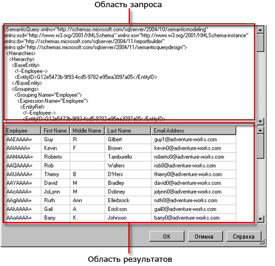

# Пользовательский интерфейс конструктора запросов моделей отчетов
  Конструктор отчетов содержит два конструктора запросов, которые помогают уточнить, какие именно данные из источника данных «Модель сервера отчетов» необходимо использовать в отчете. Используйте графический конструктор запросов для просмотра и выбора сущностей модели и полей сущности. Используйте текстовый редактор запросов, чтобы работать напрямую со спецификацией на языке определения семантических моделей (SMDL) в XML-формате.  
  
> [!IMPORTANT]  
>  При создании и выполнении запросов пользователи получают доступ к источникам данных. Следует предоставить минимальные разрешения на источники данных, например разрешение только на чтение.  
  
## Графический конструктор запросов  
 Конструктор отчетов содержит графический конструктор запросов, который позволяет разрабатывать и выполнять запросы на языке определения семантических моделей, которые в ходе обработки отчета заполняют коллекцию полей для набора данных отчета. Графический конструктор запросов состоит из трех панелий.  
  
 На следующем рисунке показана каждая панель.  
  
   
  
 В следующей таблице описываются функции каждой панели.  
  
|Панель|Функция|  
|----------|--------------|  
|Панель обозревателя|Отображает графическое представление сущностей и полей сущности в модели. Используйте эту панель для просмотра сущностей, относящихся к ним сущностей и полей.|  
|Область конструирования|Отображает список полей в модели. Используйте эту панель для размещения выбранных полей.|  
|Панель результатов|Отображает результаты запроса. Чтобы выполнить запрос, щелкните правой кнопкой мыши любую область и выберите команду **Выполнить** либо нажмите кнопку **Выполнить** () на панели инструментов.|  
  
 Изменение данных на панелях «Обозреватель» и «Область конструирования» повлияет на содержимое панели результатов при выполнении команды **Выполнить**.  
  
 Для выполнения действий на определенной панели (например: для удаления столбца в области конструирования) щелкните правой кнопкой столбец и выберите соответствующую команду меню.  
  
### Панель инструментов графического конструктора запросов  
 При проектировании запроса также можно использовать кнопки панели инструментов. В следующей таблице представлен список кнопок панели инструментов и их функции.  
  
|Кнопка|Description|  
|------------|-----------------|  
|**Редактировать как текст**|Переключиться из текстового конструктора запросов в графический и обратно. Запросом для источника данных модели сервера отчетов является спецификация языка запросов семантической модели (SMQL) в формате XML.|  
|**Импорт**|Импортировать существующий запрос из файла определения отчета (RDL), расположенного в файловой системе. Дополнительные сведения см. в разделе [Внедренные и общие наборы данных отчета (построитель отчетов и службы SSRS)](../../reporting-services/report-data/report-embedded-datasets-and-shared-datasets-report-builder-and-ssrs.md).|  
||Отменить последнее действие.|  
||Повторить последнее действие.|  
||Выполнить запрос и показать итоговые строки на панели результатов.|  
||Открыть диалоговое окно **Фильтрация данных** , которое позволяет указать данные, которые необходимо фильтровать. Можно указать фильтры независимо от текущих данных, указанных в области конструирования.|  
  
## Текстовый конструктор запросов  
 Если создается запрос к набору данных модели сервера отчетов, то по умолчанию будет использоваться графический конструктор запросов. Чтобы переключиться в текстовый конструктор запросов, нажмите кнопку переключателя **Редактировать как текст** на панели инструментов.  
  
 Окно текстового конструктора запросов состоит из двух панелей: панели запроса SMQL и панели результатов. Это представление конструктора запросов в основном полезно при наличии спецификации запроса SMQL, полученной из какого-либо другого источника, и при необходимости вставить ее на панель запросов. В отличие от графического конструктора запросов, текстовый конструктор запросов не проверяет синтаксис запроса и не изменяет структуру запроса. Если нажать кнопку **Выполнить** на панели инструментов, запрос выполняется в источнике данных, а результаты отображаются в области результатов.  
  
 На следующем рисунке показана каждая панель.  
  
   
  
 В следующей таблице описываются функции каждой панели.  
  
|Панель|Функция|  
|----------|--------------|  
|Панель запросов|Отображает текст спецификации SMQL.|  
|Панель результатов|Отображает результаты запроса. Чтобы выполнить запрос, щелкните правой кнопкой мыши любую область и выберите команду **Выполнить** либо нажмите кнопку **Выполнить** на панели инструментов.|  
  
### Панель инструментов текстового конструктора запросов  
 При проектировании запроса также можно использовать кнопки панели инструментов. В следующей таблице представлен список кнопок панели инструментов и их функции.  
  
|Кнопка|Description|  
|------------|-----------------|  
|**Редактировать как текст**|Переключиться из текстового конструктора запросов в графический и обратно.|  
|**Импорт**|Импортировать запрос из существующего запроса.|  
||Выполнить текст запроса и отобразить результирующий набор строк на панели результатов.|  
  
## См. также  
 [Средства проектирования запросов (службы SSRS)](../../reporting-services/report-data/query-design-tools-ssrs.md)   
 [Добавление данных из внешних источников данных (службы SSRS)](../../reporting-services/report-data/add-data-from-external-data-sources-ssrs.md)   
 [Соединение с моделью отчета (службы SSRS)](../../reporting-services/report-data/report-model-connection-ssrs.md)   
 [Файл конфигурации RSReportDesigner](../../reporting-services/report-server/rsreportdesigner-configuration-file.md)  
  
  