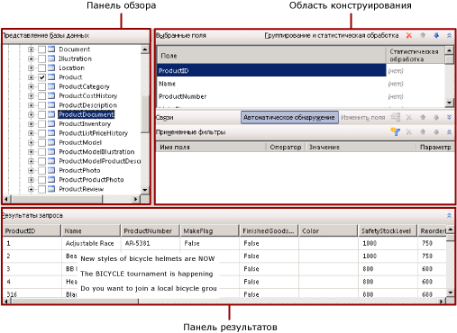

# Конструктор запросов к спискам SharePoint (построитель отчетов)
  Построитель и конструктор отчетов предоставляют как графический, так и текстовый конструктор запросов, которые помогают создавать запросы, указывающие, какие данные следует получить с сайта SharePoint для набора данных отчета. Графический конструктор запросов используется для просмотра метаданных списка SharePoint, интерактивного создания запроса, а также для просмотра его результатов. Текстовый конструктор запросов используется для просмотра запроса, созданного графическим конструктором запросов, для его изменения или ввода команд запроса. Также можно импортировать существующий запрос из файла или отчета.  
  
> [!IMPORTANT]  
>  При создании и выполнении запросов пользователи получают доступ к источникам данных. Следует предоставить минимальные разрешения на источники данных, например разрешение только на чтение.  
  
## Графический конструктор запросов  
 Графический конструктор запросов позволяет просматривать сайт SharePoint, в интерактивном режиме формировать команду, получающую данные списка SharePoint для набора данных. Следует выбрать поля, включаемые в набор данных, и при необходимости указать фильтры, ограничивающие данные в наборе данных. Можно указать, что фильтры используются в качестве параметров, и указывать значение фильтра во время выполнения.  
  
 Списки SharePoint содержат большое количество специальных полей SharePoint, которые совершенно не нужно включать в отчеты. В конструкторе запросов предусмотрен параметр для скрытия этих полей, что позволяет находить нужные поля гораздо проще и быстрее.  
  
 Графический конструктор запросов состоит из трех областей  
  
-   Просмотрите панель, на которой выбираются элементы списка и их поля для использования.  
  
-   Область конструирования, в которой создается запрос.  
  
-   Панель результатов, на которой просматриваются результаты запроса.  
  
 На следующем рисунке показан графический конструктор запросов при использовании списков SharePoint.  
  
   
  
 В следующей таблице описываются функции каждой панели.  
  
 [Списки SharePoint](#DatabaseView)  
 Отображает списки SharePoint и поля внутри каждого элемента списка.  
  
 [Выбранные поля](#SelectedFields)  
 Отображается список имен полей списка SharePoint из выбранных элементов на панели «Списки SharePoint». Эти поля становятся коллекцией полей для набора данных отчета.  
  
 [Примененные фильтры](#AppliedFilters)  
 Отображается список полей и условия фильтра для таблиц или представлений в области представления базы данных.  
  
 [Результаты запроса](#QueryResults)  
 Отображает образец данных для результирующего набора автоматически созданного запроса.  
  
###   Панель «Списки SharePoint»  
 На панели «Списки SharePoint» отображаются метаданные объектов базы данных, для просмотра которых у пользователя есть разрешения, определяемые соединением с источником данных и учетными данными. В иерархическом представлении отображаются объекты базы данных, организованные схемой базы данных. Можно развернуть узлы для каждой схемы, чтобы просмотреть таблицы, представления, хранимые процедуры и возвращающие табличное значение функции. Разверните таблицу или представление, чтобы отобразить столбцы.  
  
###   Панель «Выбранные поля»  
 На панели «Выбранные поля» отображаются поля элементов списка, выбранных в качестве элементов списка SharePoint. Поля, отображаемые в этой панели, становятся коллекцией полей для набора данных отчета. После создания набора данных и запроса область данных отчета можно использовать для просмотра коллекции полей для набора данных отчета. Эти поля представляют данные, которые могут быть отображены в таблицах, представлениях, диаграммах и других элементах отчета при его просмотре.  
  
 Чтобы добавить или удалить поля с этой панели, следует установить или снять флажки на панели «Списки SharePoint», соответствующие полям таблицы или представления.  
  
###   Панель «Примененные фильтры»  
 На панели «Примененные фильтры» отображаются условия, используемые для ограничения числа строк данных, возвращаемых во время выполнения. Условия, указанные в этой панели, используются для создания предложения [!INCLUDE[tsql](../../includes/tsql-md.md)] WHERE. При выборе режима параметров происходит автоматическое создание параметра отчета. Параметры отчета, основанные на параметрах запроса, позволяют пользователю указывать для запроса значения, управляющие данными в отчете.  
  
 Отображаются следующие столбцы.  
  
-   **Имя поля.** Отображается имя поля, к которому будет применено условие.  
  
-   **Оператор.** Отображается операция, которая будет использована в критерии фильтра.  
  
-   **Значение.** Отображается значение, которое будет использовано в критерии фильтра.  
  
-   **Параметр** Отображается параметр для добавления параметра к запросу. С помощью диалогового окна «Свойства набора данных» можно просмотреть связи между параметрами запроса и параметрами отчета.  
  
###   Область результатов запроса  
 На панели результатов запроса отображаются результаты автоматически созданного запроса, заданного выбором в других областях. Столбцы результирующего набора — это поля, указанные на панели «Выбранные поля». Данные строк ограничиваются фильтрами, указанными на панели «Примененные фильтры».  
  
 Эти данные представляют значения из источника данных на время выполнения запроса. Данные не сохраняются в определении отчета. При обработке в отчет возвращаются реальные данные.  
  
 Порядок сортировки в результирующем наборе определяется порядком получения данных из источника данных. Порядок сортировки может быть изменен путем изменения запроса или после получения данных для отчета.  
  
### Панель инструментов графического конструктора запросов  
 На панели инструментов конструктора реляционных запросов расположены следующие кнопки, помогающие указать или просмотреть результаты запроса.  
  
|Кнопка|Description|  
|------------|-----------------|  
|**Редактировать как текст**|Переключение в режим текстового конструктора запросов, чтобы просмотреть или изменить автоматически созданный запрос.|  
|**Импорт**|Импорт существующего запроса из файла или отчета. Поддерживаются SQL и RDL-файлы.|  
|**Выполнить запрос**|Выполните запрос. Результирующий набор отображается на панели результатов запроса.|  
|**Показать скрытые поля**|Переключите, чтобы показать или скрыть поля, которые создаются SharePoint автоматически (например, ProgId и Level для элементов ссылок SharePoint), но, как правило, не используются в отчетах. Скрытие этих полей позволяет сделать список полей короче и удобнее в использовании.|  
  
## См. также  
 [Конструкторы запросов (построитель отчетов)](http://msdn.microsoft.com/library/553f0d4e-8b1d-4148-9321-8b41a1e8e1b9)  
  
  

