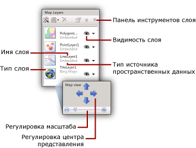

# Добавление, изменение или удаление карты или слоя карты (построитель отчетов и службы SSRS)
  Карта представляет собой набор слоев. При добавлении карты в отчет [!INCLUDE[ssRSnoversion_md](../../includes/ssrsnoversion-md.md)] с разбиением на страницы необходимо определить первый ее слой. Дополнительные слои можно создать с помощью мастера «Слой карты».  
  
 Добавить или удалить слой либо изменить его параметры проще всего с помощью мастера «Слой карты». Также параметры можно изменить вручную с помощью панели «Карта». Чтобы отобразить панель **Карта** , щелкните карту в области конструктора отчетов. На следующем рисунке изображены составные части панели:  
  
   
  
 Слои карты отрисовываются снизу вверх в порядке отображения на панели «Карта». На предыдущем рисунке первым отрисовывается мозаичный слой, а последним — слой многоугольников. Слои, которые отрисовываются позже, могут скрывать элементы карты, расположенные на слоях, которые отрисовываются раньше. Порядок слоев можно изменить с помощью кнопок со стрелками на панели инструментов панели «Карта». Чтобы показать или скрыть слой, переключите значок видимости слоя. Прозрачность слоя можно изменить на странице **Видимость** диалогового окна **Свойства данных слоя** .  
  
 В следующей таблице содержатся значки панели инструментов панель **Карта** .  
  
|Символ|Description|Назначение|  
|------------|-----------------|-----------------|  
||Мастер «Слой карты»|Чтобы добавить слой с помощью мастера, нажмите кнопку **Мастер создания слоя**.|  
||Добавить слой|Чтобы добавить слой вручную, нажмите кнопку **Добавить слой**и выберите тип добавляемого слоя карты.|  
||Слой многоугольников|Добавление слоя карты, отображающего области или фигуры, заданные наборами координат вершин многоугольников.|  
||Слой линий|Добавление слоя карты, отображающего пути или маршруты, заданные наборами координат точек линий.|  
||Слой точек|Добавление слоя карты, отображающего местоположения, заданные наборами координат точек.|  
||Мозаичный слой|Добавление слоя карты, отображающего элементы мозаики Bing Map, соответствующие области видимости текущей карты, определенной областью просмотра.|  
  
 В нижней части панели «Карта» отображается область просмотра карты. Чтобы изменить параметры центрирования и масштабирования, заданные для карты, используйте кнопки со стрелками для настройки центра представления и ползунок для выбора масштаба.  
  
 Дополнительные сведения см. в разделе [Карты (построитель отчетов и службы SSRS)](../../reporting-services/report-design/maps-report-builder-and-ssrs.md).  
  
> [!NOTE]  
>  [!INCLUDE[ssRBRDDup](../../includes/ssrbrddup-md.md)]  
  
##   Добавление слоя с помощью мастера слоя карты  
  
-   На ленте в меню **Вставка** выберите **Карта**, затем **Карта Wizard.** . Этот мастер позволяет добавить слой в существующую карту. Большая часть страниц мастера создания карты и мастера создания слоя карты идентичны.  
  
     Дополнительные сведения см. в разделе [Мастер карт и мастер слоев карт (построитель отчетов и службы SSRS)](../../reporting-services/report-design/map-wizard-and-map-layer-wizard-report-builder-and-ssrs.md).  
  
##   Изменение параметров слоя с помощью мастера «Слой карты»  
  
-   Запустите мастер «Слой карты». Этот мастер используется для изменения параметров слоя, созданного с помощью мастера «Слой карты». На панели "Карта" щелкните правой кнопкой мыши слой и на панели инструментов нажмите кнопку мастера слоя ().  
  
     Дополнительные сведения см. в разделе [Мастер карт и мастер слоев карт (построитель отчетов и службы SSRS)](../../reporting-services/report-design/map-wizard-and-map-layer-wizard-report-builder-and-ssrs.md).  
  
##   Добавление слоя точек, линий или многоугольников с помощью панели инструментов панели «Карта»  
  
1.  Щелкните карту, чтобы отобразить панель «Карта».  
  
2.  На панели инструментов нажмите кнопку **Добавить слой** и выберите в раскрывающемся списке тип добавляемого слоя: **Точка**, **Линия**или **Многоугольник**.  
  
    > [!NOTE]  
    >  Хотя слой карты можно добавить и настроить вручную, для добавления новых слоев рекомендуется использовать мастер слоя. Чтобы запустить этот мастер с панели инструментов панели "Карта", нажмите кнопку мастера слоя ().  
  
3.  Щелкните правой кнопкой мыши слой и выберите пункт **Данные слоя**.  
  
4.  Выберите в списке **Использовать пространственные данные из**источник пространственных данных. Доступные параметры различаются в зависимости от сделанного выбора.  
  
     Если необходимо визуализировать в слое аналитические данные отчета, выполните следующие действия.  
  
    1.  Выберите **Аналитические данные**.  
  
    2.  Выберите в списке **Набор аналитических данных**имя набора данных, содержащего аналитические данные и поля сопоставления, определяющие связь между аналитическими и пространственными данными.  
  
    3.  Нажмите кнопку **Добавить**.  
  
    4.  Введите имя поля сопоставления в наборе пространственных данных.  
  
    5.  Введите имя поля сопоставления в наборе аналитических данных.  
  
     Дополнительные сведения о создании связи между пространственными и аналитическими данными см. в разделе [Настройка данных и отображения карты или слоя карты (построитель отчетов и службы SSRS)](../../reporting-services/report-design/customize-the-data-and-display-of-a-map-or-map-layer-report-builder-and-ssrs.md).  
  
5.  [!INCLUDE[clickOK](../../includes/clickok-md.md)]  
  
##   Фильтрация аналитических данных для слоя  
  
1.  Щелкните карту, чтобы отобразить панель «Карта».  
  
2.  На панели "Карта" щелкните слой правой кнопкой мыши, а затем щелкните  **Данные слоя**.  
  
3.  Перейдите на вкладку **Фильтры**.  
  
4.  Определите уравнение фильтра для ограничения аналитических данных, которые используются в отображении карты. Дополнительные сведения см. в разделе [Примеры уравнений фильтра (построитель отчетов и службы SSRS)](../../reporting-services/report-design/filter-equation-examples-report-builder-and-ssrs.md).  
  
##   Управление свойствами точек для слоя точек или для центральных точек многоугольника.  
  
1.  Страница **Общие** диалогового окна **Свойства точки карты** позволяет изменить параметры метки, всплывающей подсказки и типа маркера для следующих элементов карты.  
  
    -   Все динамические или внедренные точки слоя точек. Эти параметры переопределяются правилами для цветов, размеров и типов маркеров точек. Чтобы переопределить параметры отдельной внедренной точки, используйте страницу [Map Embedded Point Properties Dialog Box, Marker](http://msdn.microsoft.com/library/3c5eb1c5-d40a-424f-aa7c-43b112f42dec) .  
  
    -   Центральная точка всех динамических или внедренных многоугольников слоя многоугольников. Эти параметры переопределяются правилами цветов, размеров и типов маркеров для центральных точек. Чтобы переопределить параметры отдельной центральной точки, используйте страницу [Map Embedded Point Properties Dialog Box, Marker](http://msdn.microsoft.com/library/3c5eb1c5-d40a-424f-aa7c-43b112f42dec) .  
  
##   Указание внедренных данных в качестве источника пространственных данных  
  
1.  Щелкните карту, чтобы отобразить панель «Карта».  
  
2.  Щелкните правой кнопкой мыши слой и выберите пункт **Данные слоя**.  
  
3.  Выберите в списке **Использовать пространственные данные из**пункт **Данные, внедренные в отчет**.  
  
4.  Чтобы загрузить элементы карты из существующего отчета или создать их на основе файла ESRI, нажмите кнопку **Обзор**, укажите файл и нажмите кнопку **Открыть**. Элементы карты внедрены в определение отчета. Указанные пространственные данные должны соответствовать типу слоя. Например, для слоя точек необходимо указать пространственные данные, содержащие набор координат точек.  
  
5.  Выберите в списке **Пространственное поле**имя поля, содержащего пространственные данные. Это имя нужно определить по источнику пространственных данных.  
  
    > [!NOTE]  
    >  Если имя этого поля неизвестно, но выбран шейп-файл ESRI, используйте вместо этого параметр **Ссылка на файл фигуры ESRI** .  
  
6.  [!INCLUDE[clickOK](../../includes/clickok-md.md)]  
  
##   Указание файла фигуры ESRI в качестве источника пространственных данных  
  
1.  Щелкните карту, чтобы отобразить панель «Карта».  
  
2.  Щелкните правой кнопкой мыши слой и выберите пункт **Данные слоя**.  
  
3.  Выберите в списке **Использовать пространственные данные из**пункт **Связать с файлом фигуры ESRI**.  
  
4.  Введите в поле **Имя файла**путь к файлу фигуры ESRI или нажмите кнопку **Обзор** и выберите файл фигуры ESRI.  
  
    > [!NOTE]  
    >  Если файл фигуры расположен на локальном компьютере, пространственные данные внедряются в определение отчета. Чтобы динамически получать данные при обработке отчета, необходимо загрузить на сервер отчетов шейп-файл ESRI с расширением SHP и его файл поддержки с расширением DBF. Дополнительные сведения см. в статье "Инструкция. Передача файла или отчета (диспетчер отчетов)" в [документации по службам Reporting Services](http://go.microsoft.com/fwlink/?linkid=121312) , входящей в состав электронной документации по SQL Server.  
  
5.  [!INCLUDE[clickOK](../../includes/clickok-md.md)]  
  
##   Указание поля набора данных отчета в качестве источника пространственных данных  
  
1.  Щелкните карту, чтобы отобразить панель «Карта».  
  
2.  Щелкните правой кнопкой мыши слой и выберите пункт **Данные слоя**.  
  
3.  Выберите в списке **Использовать пространственные данные из**пункт **Поле пространственных данных в наборе данных**.  
  
4.  Выберите в списке **Имя набора данных**имя набора данных в отчете, который содержит необходимые пространственные данные.  
  
5.  Выберите в списке **Имя пространственного поля**имя поля в наборе данных, содержащего пространственные данные.  
  
6.  [!INCLUDE[clickOK](../../includes/clickok-md.md)]  
  
##   Добавление мозаичного слоя  
  
1.  Щелкните карту, чтобы отобразить панель «Карта».  
  
2.  Нажмите на панели инструментов кнопку **Добавить слой** и выберите в раскрывающемся списке пункт **Мозаичный слой**.  
  
    > [!NOTE]  
    >  Дополнительные сведения об использовании в отчете мозаичных элементов Bing Map см. в разделах [Дополнительные условия использования](http://go.microsoft.com/fwlink/?LinkId=151371).  
  
3.  Щелкните правой кнопкой мыши мозаичный слой на панели "Карта", а затем выберите **Свойства мозаичных элементов**.  
  
4.  Выберите в окне **Параметры мозаичных элементов**стиль мозаичных элементов. Если мозаичные элементы Bing Map доступны, слой в области конструктора обновляется с применением выбранного стиля.  
  
    > [!NOTE]  
    >  Мозаичный слой можно также добавить при добавлении слоя многоугольников, линий или точек с помощью мастера создания карты или слоя карты. Выберите на странице **Параметры пространственных данных и представления карты** параметр **Добавить в данное представление карты мозаичный фон Bing Map**.  
  
##   Изменение порядка отрисовки слоев  
  
1.  Щелкните карту, чтобы отобразить панель «Карта».  
  
2.  Щелкните слой на панели «Карта», чтобы выбрать его.  
  
3.  Нажмите на панели инструментов панели «Карта» стрелку вверх или вниз, чтобы изменить порядок отрисовки каждого слоя.  
  
##   Изменение прозрачности слоя многоугольников, линий или точек  
  
1.  Щелкните карту, чтобы отобразить панель «Карта».  
  
2.  Щелкните правой кнопкой мыши слой и выберите пункт **Данные слоя**.  
  
3.  Щелкните **Видимость**.  
  
4.  Введите на странице **Параметры прозрачности**значение, выражающее процент прозрачности (например: **40**). Нулевое (0) значение прозрачности означает, что слой непрозрачен. При прозрачности, равной 100 %, слой не будет отображаться в отчете.  
  
5.  [!INCLUDE[clickOK](../../includes/clickok-md.md)]  
  
##   Изменение прозрачности мозаичного слоя  
  
1.  Щелкните карту, чтобы отобразить панель «Карта».  
  
2.  Щелкните правой кнопкой мыши слой, затем выберите пункт **Свойства мозаики**.  
  
3.  Щелкните **Видимость**.  
  
4.  Введите на странице **Параметры прозрачности**значение, выражающее процент прозрачности (например: **40**).  
  
5.  [!INCLUDE[clickOK](../../includes/clickok-md.md)]  
  
##   Указание безопасного соединения для мозаичного слоя  
  
1.  Щелкните карту, чтобы отобразить панель «Карта».  
  
2.  На панели «Карта» щелкните мозаичный слой, чтобы выбрать его. На панели свойств отображаются свойства этого мозаичного слоя.  
  
3.  На панели "Свойства" задайте для параметра UseSecureConnection значение **True**.  
  
 При соединении с веб-службой карт Bing для получения мозаичных элементов для этого слоя будет использоваться HTTP-служба протокола SSL.  
  
##   Выбор языка для меток мозаичных элементов  
  
1.  По умолчанию для стилей мозаичных элементов, использующихся для отображения меток язык определяется локалью по умолчанию для построителя отчетов. Языковые настройки для меток мозаичных элементов можно изменить следующим образом.  
  
    -   Чтобы выбрать карту, щелкните карту за пределами окна просмотра. На панели "Свойства" выберите для свойства TileLanguage в раскрывающемся списке значение культуры.  
  
    -   Чтобы выбрать отчет, щелкните фон отчета. На панели "Свойства" для свойства Language выберите в раскрывающемся списке значение культуры.  
  
     Порядок приоритета при определении языка: свойство отчета TileLanguage, локаль по умолчанию для построителя отчетов, свойство карты TileLanguage.  
  
##   Скрытие слоя по условию с учетом масштаба области просмотра  
  
1.  Параметры **Видимость** управляют отображением слоя карты.  
  
    -   На панели "Слои карты" выберите слой, щелкнув его правой кнопкой мыши, затем на панели инструментов "Слои карты" щелкните "Свойства", чтобы открыть диалоговое окно **Свойства слоя карты**.  
  
    -   Щелкните **Видимость**.  
  
    -   В разделе «Видимость слоя» выберите **Отображать или скрывать в зависимости от масштаба**.  
  
    -   Введите минимальное и максимальное значения масштаба, при которых отображается слой.  
  
    -   Необязательно. Введите значение прозрачности.  
  
     Можно также скрывать слой по условию. Дополнительные сведения см. в разделе [Скрытие элемента (построитель отчетов и службы SSRS)](../../reporting-services/report-builder/hide-an-item-report-builder-and-ssrs.md).  
  
## См. также:  
 [Карты (построитель отчетов и службы SSRS)](../../reporting-services/report-design/maps-report-builder-and-ssrs.md)   
 [Устранение неполадок в отчетах: отчеты-карты (построитель отчетов и службы SSRS)](../../reporting-services/report-design/troubleshoot-reports-map-reports-report-builder-and-ssrs.md)  
  
  
