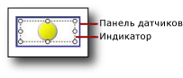

# Добавление или удаление индикатора (построитель отчетов и службы SSRS)
  В отчетах [!INCLUDE[ssRSnoversion_md](../../includes/ssrsnoversion-md.md)] с разбиением на страницы индикаторы — это минимальные датчики, обеспечивающие возможность быстрого определения состояния одиночного значения данных. Дополнительные сведения см. в разделе [Индикаторы (построитель отчетов и службы SSRS)](../../reporting-services/report-design/indicators-report-builder-and-ssrs.md).  
  
 Индикаторы обычно размещаются в ячейках таблицы или матрицы, но можно использовать сами индикаторы, параллельно с датчиками или внедренные в датчиках.  
  
 При первом добавлении индикатора он по умолчанию настраивается для использования процентных единиц измерения. Процентные диапазоны равномерно распределяются между элементами набора индикаторов, а область значений, отображаемых индикатором, является для индикатора родительским элементом, таким как таблица или матрица.  
  
 Можно обновить значения и состояния индикаторов. Дополнительные сведения см. в следующих разделах:  
  
-   [Изменение значков индикаторов и наборов индикаторов (построитель отчетов и службы SSRS)](../../reporting-services/report-design/change-indicator-icons-and-indicator-sets-report-builder-and-ssrs.md)  
  
-   [Задание и настройка единиц измерения (построитель отчетов и службы SSRS)](../../reporting-services/report-design/set-and-configure-measurement-units-report-builder-and-ssrs.md)  
  
-   [Задание области действия синхронизации (построитель отчетов и службы SSRS)](../../reporting-services/report-design/set-synchronization-scope-report-builder-and-ssrs.md)  
  
 Поскольку индикатор располагается внутри панели датчиков, необходимо выбрать вместо панели индикатор при необходимости настройки индикатора с помощью диалогового окна **Свойства индикатора** или панели **Свойства** . На следующем рисунке отображается выбранный индикатор на панели датчиков.  
  
   
  
> [!NOTE]  
>  В зависимости от ширины столбца и длины значений данных, текст в ячейках таблицы или матрицы может переноситься по словам на несколько строк. В этом случае значок индикатора может растянуться и изменить форму. В результате значок индикатора воспринимается хуже. Во избежание растяжений значка разместите индикатор внутри прямоугольника.  
  
## Добавление индикатора в таблицу или матрицу  
  
1.  Откройте существующий отчет или создайте новый отчет, содержащий таблицу и матрицу с данными, которые необходимо отобразить. Дополнительные сведения см. в разделах [Таблицы (построитель отчетов и службы SSRS)](../../reporting-services/report-design/tables-report-builder-and-ssrs.md) или [Матрицы](../../reporting-services/report-design/create-a-matrix-report-builder-and-ssrs.md).  
  
2.  Вставьте столбец в таблицу или матрицу. Дополнительные сведения см. в разделе [Вставка или удаление столбца (построитель отчетов и службы SSRS)](../../reporting-services/report-design/insert-or-delete-a-column-report-builder-and-ssrs.md).  
  
3.  При необходимости на вкладке **Вставка** нажмите кнопку **Прямоугольник**, а затем щелкните ячейку в новом столбце.  
  
4.  На вкладке **Вставка** нажмите кнопку **Индикатор**, а затем щелкните ячейку в новом столбце.  
  
     Если в ячейку был добавлен прямоугольник, щелкните эту ячейку.  
  
5.  В диалоговом окне **Выбор стиля индикатора** в левой панели выберите тип нужного индикатора, а затем выберите набор индикаторов.  
  
6.  Нажмите кнопку **ОК**.  
  
7.  Щелкните индикатор. Откроется панель **Данные датчика** .  
  
8.  В области **Значения** в раскрывающемся списке **(Не указано)** выберите поле, значения которого необходимо отобразить в качестве индикатора.  
  
     Индикатор настроен для использования значений по умолчанию. По умолчанию индикаторы настроены для использования в качестве единиц измерения процентных соотношений, диапазоны процентного соотношения равномерно распределяются между элементами индикатора, а для значений, указываемых индикатором, используется область ближайшей группы.  
  
## Удаление индикатора из таблицы или матрицы  
  
1.  Щелкните индикатор правой кнопкой мыши и выберите **Удалить**.  
  
    > [!NOTE]  
    >  Индикатор должен быть расположен на панели датчиков, содержащей другие индикаторы или датчики. Если панель датчиков содержит несколько элементов, убедитесь, что для их удаления выбран индикатор, а не панель датчиков. Если нажать и удалить панель датчиков, то будут удалены панели датчиков и все элементы в них.  
  
2.  Щелкните **Удалить**.  
  
## См. также  
 [Индикаторы (построитель отчетов и службы SSRS)](../../reporting-services/report-design/indicators-report-builder-and-ssrs.md)  
  
  
