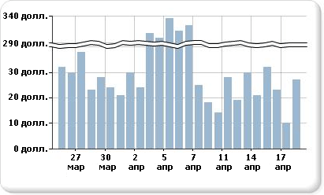

# Добавление в диаграмму разрывов шкалы (построитель отчетов и службы SSRS)

  Разрыв шкалы представляет собой полосу, нарисованную в области построения диаграммы, обозначающую нарушение непрерывной последовательности изменения значений от малых к большим на оси значений (обычно это вертикальная ось, или ось Y). Разрыв шкалы используется, чтобы отобразить два разных диапазона в одной и той же области диаграммы.  
  
   
  
> [!NOTE]  
>  Положение разрыва шкалы указать на диаграмме нельзя. Диаграмма на основе значений набора данных самостоятельно вычисляет, где имеется значительный разрыв между диапазонами данных, чтобы поместить разрыв шкалы на оси значений (оси Y) во время выполнения.  
  
 Пример диаграммы с разрывами шкалы доступен в виде образца отчета. Дополнительные сведения о скачивании этого и других примеров отчетов см. в статье [Report Builder and Report Designer sample reports](https://go.microsoft.com/fwlink/?LinkId=198283).  
  
> [!NOTE]  
>  [!INCLUDE[ssRBRDDup](../../includes/ssrbrddup-md.md)]  
  
### Включение разрывов шкалы на диаграмме  
  
1.  Щелкните правой кнопкой мыши вертикальную ось и выберите пункт **Свойства оси**. Откроется диалоговое окно **Свойства вертикальной оси** .  
  
2.  Установите флажок **Включить разрывы шкалы** .  
  
### Изменение стиля разрыва шкалы  
  
1.  Откройте панель «Свойства».  
  
2.  В области конструктора щелкните правой кнопкой мыши ось Y диаграммы. На панели «Свойства» будут отображены свойства объекта оси Y (по умолчанию называемой «Ось диаграммы»).  
  
3.  В разделе **Шкала** раскройте свойство ScaleBreakStyle.  
  
4.  Измените значения свойства ScaleBreakStyle, такие как BreakLineType и Spacing. Дополнительные сведения о свойствах разрыва шкалы см. в разделе [Отображение на диаграмме ряда с несколькими диапазонами данных (построитель отчетов и службы SSRS)](../../reporting-services/report-design/displaying-a-series-with-multiple-data-ranges-on-a-chart.md).  

## Дальнейшие действия

[Диаграммы](../../reporting-services/report-design/charts-report-builder-and-ssrs.md)   
[Форматирование диаграммы](../../reporting-services/report-design/formatting-a-chart-report-builder-and-ssrs.md)   
[Диалоговое окно "Свойства оси" — "Параметры оси"](https://msdn.microsoft.com/library/b276e210-7a12-48ae-971b-7dabae51df11)  

Остались вопросы? [Посетите форум служб Reporting Services](https://go.microsoft.com/fwlink/?LinkId=620231).
