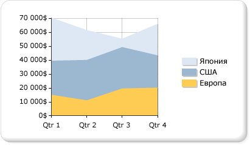

# Диаграммы с областями (построитель отчетов и службы SSRS)
  В диаграммах с областями данные выводятся в виде точек, соединенных линией, с закрашенными ниже этой линии областями. Дополнительные сведения о добавлении данных в диаграммы с областями см. в разделе [Диаграммы (построитель отчетов и службы SSRS)](../../reporting-services/report-design/charts-report-builder-and-ssrs.md).  
  
 На следующей иллюстрации показан пример диаграммы с областями с накоплением. Рассматриваемые данные хорошо подходят для отображения на диаграмме с областями с накоплением, поскольку эта диаграмма позволяет отображать итоги для всех рядов, а также пропорциональную долю каждого ряда в общем итоге.  
  
   
  
> [!NOTE]  
>  [!INCLUDE[ssRBRDDup](../../includes/ssrbrddup-md.md)]  
  
## Варианты  
  
-   **С областями с накоплением**. Диаграмма с областями, в которой несколько рядов наложены по вертикали. Если в диаграмме только один ряд, то диаграмма с областями с накоплением будет выглядеть точно так же, как обычная диаграмма с областями.  
  
-   **С областями с накоплением процентных значений**. Диаграмма с областями, в которой несколько рядов наложены по вертикали для подгонки под всю область диаграммы. Если в диаграмме только один ряд, то диаграмма с областями с накоплением будет выглядеть точно так же, как обычная диаграмма с областями.  
  
-   **Гладкая диаграмма с областями**. Диаграмма с областями, в которой точки данных соединены сглаженной, а не ломаной линией. Гладкая диаграмма с областями используется вместо обычной диаграммы с областями, если более важно показать тренды, а не представить значения отдельных точек данных.  
  
## Данные для диаграмм с областями  
  
-   Не считая графика, диаграмма с областями представляет собой единственный тип диаграммы, на которой данные представлены с помощью гладкой кривой. Поэтому диаграммы с областями обычно используются для представления данных, относящихся к непрерывному промежутку времени.  
  
-   Диаграмма с областями с накоплением процентных значений может применяться для отображения пропорциональных данных, которые изменяются во времени.  
  
-   Если имеется только один ряд, то диаграмма с областями с накоплением отображается как простая диаграмма с областями.  
  
-   Если простая диаграмма с областями используется для представления нескольких рядов с похожими значениями, области могут перекрываться, скрывая значения важных точек данных. Эту проблему можно решить, изменив тип диаграммы на диаграмму с областями с накоплением, которая предназначена для отображения в области диаграммы нескольких рядов.  
  
-   Если диаграмма с областями с накоплением содержит пропуски, это может означать, что набор данных включает пустые значения, которые отображаются как свободные разделы на диаграмме с областями с накоплением. Если набор данных включает пустые значения, рассмотрите возможность вставки пустых точек на диаграмме. При добавление пустых точек пустые области диаграммы будут заполнены отличающимся цветом, чтобы указать нулевые значения или значения NULL. Дополнительные сведения см. в разделе [Добавление пустых точек на диаграмму (построитель отчетов и службы SSRS)](../../reporting-services/report-design/add-empty-points-to-a-chart-report-builder-and-ssrs.md).  
  
-   По своему назначению типы диаграммы с областями очень похожи на гистограммы и графики. Если сравнивается несколько рядов, рассмотрите возможность использования гистограммы вместо диаграммы с областями. Если проводится анализ трендов за какой-то промежуток времени, рассмотрите возможность использования графика.  
  
## См. также:  
 [Диаграммы (построитель отчетов и службы SSRS)](../../reporting-services/report-design/charts-report-builder-and-ssrs.md)   
 [Типы диаграмм (построитель отчетов и службы SSRS)](../../reporting-services/report-design/chart-types-report-builder-and-ssrs.md)   
 [Графики (построитель отчетов и службы SSRS)](../../reporting-services/report-design/line-charts-report-builder-and-ssrs.md)   
 [Изменение типа диаграммы (построитель отчетов и службы SSRS)](../../reporting-services/report-design/change-a-chart-type-report-builder-and-ssrs.md)   
 [Точки данных со значением NULL и пустые точки в диаграммах (построитель отчетов и службы SSRS)](../../reporting-services/report-design/empty-and-null-data-points-in-charts-report-builder-and-ssrs.md)  
  
  
