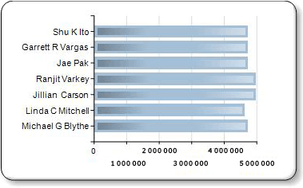

# Эффекты для диаграммы - добавить Рельеф, рельефный, или текстуры (построитель отчетов)
  При использовании диаграмм определенных типов можно ввести в действие эффекты рисования для повышения внешней привлекательности диаграммы. Эти эффекты рисования применяются только к ряду, представленному на диаграмме. Они не оказывают никакого влияния на другие элементы диаграммы.  
  
 Если используется какой-либо вариант круговой или кольцевой диаграммы, можно определить стиль рисования с применением размытых краев или вогнутых участков, аналогичный стилю с эффектами скоса или выпуклости, которые могут быть применены к изображению.  
  
 Если используется какой-либо вариант линейчатой диаграммы или гистограммы, то можно применить стили текстуры, такие как оформление в виде цилиндра, клина и переход от светлого к темному, к отдельным линейкам или столбцам.  
  
 Кроме этих стилей рисования можно добавлять границы и тени ко многим элементам диаграммы для создания иллюзии глубины. Дополнительные сведения о других способах форматирования диаграммы см. в разделе [Форматирование диаграммы (построитель отчетов и службы SSRS)](../../reporting-services/report-design/formatting-a-chart-report-builder-and-ssrs.md).  
  
> [!NOTE]  
>  [!INCLUDE[ssRBRDDup](../../includes/ssrbrddup-md.md)]  
  
### Добавление стилей скоса или выпуклости к круговой или кольцевой диаграмме  
  
1.  На вкладке **Представление** выберите **Свойства** , чтобы открыть панель «Свойства».  
  
2.  Выберите круговую или кольцевую диаграмму, которую необходимо сделать более привлекательной. Выберите поле данных на диаграмме, а не всю диаграмму.  
  
3.  На панели «Свойства» разверните узел **CustomAttributes** .  
  
4.  Для PieDrawingStyle выберите стиль из раскрывающегося списка.  
  
> [!NOTE]  
>  На одной диаграмме не могут применяться объемный и рельефный или приподнятый стили. Если для диаграммы включен объемный стиль, свойство PieDrawingStyle не будет выводиться.  
  
   
  
### Чтобы добавить стили текстуры к линейчатой диаграмме или гистограмме  
  
1.  Выберите линейчатую диаграмму или гистограмму, которую необходимо сделать более привлекательной. Выберите поле данных на диаграмме, а не всю диаграмму.  
  
2.  Откройте панель «Свойства».  
  
3.  Разверните узел **CustomAttributes** .  
  
4.  Для DrawingStyle выберите стиль из раскрывающегося списка.  
  
> [!NOTE]  
>  На одной диаграмме не могут применяться объемный и рельефный или приподнятый стили. Если для диаграммы включен объемный стиль, свойство PieDrawingStyle не будет выводиться.  
  
   
  
## См. также:  
 [Линейчатые диаграммы (построитель отчетов и службы SSRS)](../../reporting-services/report-design/bar-charts-report-builder-and-ssrs.md)   
 [Гистограммы (построитель отчетов и службы SSRS)](../../reporting-services/report-design/column-charts-report-builder-and-ssrs.md)   
 [Круговые диаграммы (построитель отчетов и службы SSRS)](../../reporting-services/report-design/pie-charts-report-builder-and-ssrs.md)   
 [Форматирование диаграммы (построитель отчетов и службы SSRS)](../../reporting-services/report-design/formatting-a-chart-report-builder-and-ssrs.md)  
  
  
