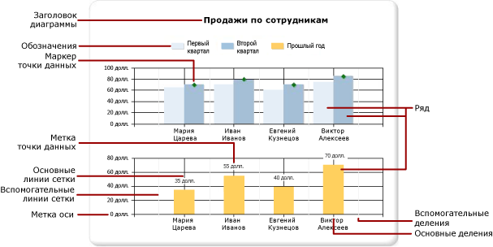
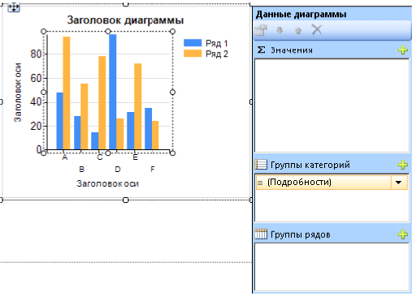
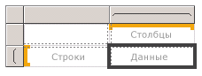
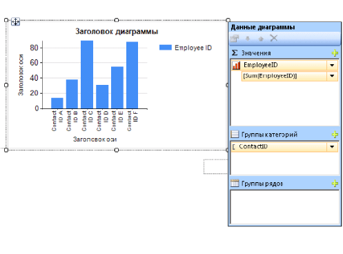

# Диаграммы (построитель отчетов и службы SSRS)
Узнайте, как использовать области данных на диаграммах, чтобы помочь читателям ваших отчетов [!INCLUDE[ssRSnoversion_md](../../includes/ssrsnoversion-md.md)] с разбивкой на страницы в восприятии больших объемов статистических данных.  

Чем больше времени вы потратите на тщательное изучение и подготовку данных перед разработкой диаграммы, тем проще и эффективнее будет процесс ее создания. Чтобы выбрать подходящий тип диаграммы, обратитесь к разделу [Типы диаграмм](../../reporting-services/report-design/chart-types-report-builder-and-ssrs.md). Чтобы сразу начать экспериментировать с диаграммами, обратитесь к учебникам по линейчатым диаграммам, гистограммам, спарклайнам и круговым диаграммам в [серии учебников по построителю отчетов](../../reporting-services/report-builder-tutorials.md).  
  
 На следующей иллюстрации показывается, как много различных элементов используется в диаграмме.  
  
   
  
 Диаграммы можно опубликовать отдельно от отчета как *элементы отчета*. Дополнительные сведения см. в разделе [Элементы отчета](../../reporting-services/report-design/report-parts-report-builder-and-ssrs.md).
  
 
##   Проектирование диаграммы  
 Добавив область данных диаграммы в область конструктора, можно перетаскивать поля набора данных отчета с числовыми и нечисловыми данными на панель «Данные диаграммы». При щелчке диаграммы в области конструктора появляется панель "Данные диаграммы" с тремя областями: "Группы категорий", "Группы рядов" и "Значения". Если отчет содержит общие или внедренные источники данных, поля в наборе данных появятся в области данных отчета. Перетащите поля из набора данных в соответствующую часть области "Данные диаграммы". По умолчанию при добавлении поля в одну из областей на диаграмме службы [!INCLUDE[ssRSnoversion](../../includes/ssrsnoversion-md.md)] вычисляют статистическое значения для поля. Для динамического формирования рядов также можно использовать группирование рядов. Диаграмма [организована в виде матрицы](#SimilarMatrix).  
  
   
  
> [!NOTE]  
>  Данные на диаграмме во время разработки отличаются от данных, которые обрабатываются в отчете. Это не фактические данные. Это сформированные данные, которые добавляются для того, чтобы при проектировании диаграммы можно было представить, как она будет выглядеть.  
  
##   Сходство диаграммы с матрицей  
 Один из способов понять работу диаграммы — это сравнить ее с матрицей.  
  
   
  
 По сути они устроены идентично.  
  
-   Группа столбцов в матрице похожа на область групп категорий на диаграмме.  
  
-   Группа строк в матрице похожа на область групп рядов на диаграмме.  
  
-   Область данных в матрице похожа на область значений на диаграмме.  
  
 
##   Добавление данных в диаграмму  
 Предположим, имеется отчет, в котором отображаются продажи по именам продавцов. Перетащите поле Full Name в область групп категорий и поле Sales в область значений.  
  
 При добавлении поля Sales в область значений текст поля данных появляется в условных обозначениях, а с данными из этого числового поля будет выполнено статистическое вычисление для получения одного значения. По умолчанию статистическая обработка выполняется с использованием встроенной функции Sum. Панель «Данные диаграммы» содержит простое выражение для поля. В данном примере функция `[Sum(Sales)]` появится для выражения поля `=Sum(Fields!Sales.Value)`. Если группы не указаны, на диаграмме будет показана только одна точка данных. Чтобы показать несколько точек данных, необходимо сгруппировать данные, добавив поле группирования. При добавлении поля Name в область групп категорий в диаграмму будет автоматически добавлено поле группирования с таким же именем. При добавлении полей, задающих значения по осям x и y, в диаграмме имеется достаточно данных для верного отображения.  
  
   
  
 Когда область групп рядов остается пустой, число рядов во время разработки остается фиксированным. В данном примере Sales является единственным рядом, который отображается на диаграмме.  
  
 
##   Категория и группы рядов в диаграмме  
 Диаграмма поддерживает вложенные группы категорий и рядов. Диаграммы не отображают подробных данных. Добавляйте группы к диаграмме, перетаскивая поля набора данных в области добавления категорий и рядов для выбранной диаграммы.  
  
 Фигурные диаграммы, такие круговые диаграммы, поддерживают группы категорий и вложенные группы категорий. Другие диаграммы, такие как линейчатые диаграммы, поддерживают группы категорий и группы рядов. Можно вложить группы, но необходимо убедиться, что количество категорий или рядов не мешает представлению данных в диаграмме.  
  
### Добавление групп рядов в диаграмму  
 При добавлении поля в область групп рядов число рядов зависит от данных, содержащихся в этом поле. В примере выше предположим, что в область групп рядов добавляется поле Year. Число значений в поле Year определяет число рядов, которые будут отображаться в диаграмме. Если поле Year содержит значения 2004, 2005 и 2006, то в диаграмме будут отображаться три ряда для каждого поля в области значений.  
  
##   Анализ набора данных перед созданием диаграммы  
 Диаграмма обеспечивает представление данных в виде сводки. Однако для больших наборов данных сведения на диаграмме могут стать неясными или нечитаемыми. Пропущенные и нулевые точки данных, типы данных, неподходящие для типа диаграммы и дополнительные приложения, такие как объединение диаграмм с таблицами, могут повлиять на читабельность диаграммы. Перед созданием диаграммы необходимо внимательно подготовить и проанализировать данные, чтобы создавать диаграммы быстро и эффективно.  
  
 В отчете может быть столько диаграмм, сколько необходимо. Диаграмма привязана к набору данных аналогично другим областям данных, таким как матрицы или таблицы. Чтобы отобразить несколько наборов данных на одной диаграмме, перед тем, как добавлять данные в диаграмму, можно создать дополнительный набор данных с помощью инструкций JOIN или UNION в SQL-запросе.  
  
 Если подробные данные не нужны или бесполезны, подумайте о предварительной статистической обработке данных с помощью запроса на наборе данных. Чтобы каждая точка данных отображалась понятнее, уменьшите число категорий в наборе данных. Можно отфильтровать набор данных или добавить в запрос условие, сокращающее число возвращаемых строк. 
  
##   Рекомендации по отображению данных в диаграмме  
 Диаграммы наиболее эффективны, когда число отображаемых элементов не ухудшает понятность изображения данных. Некоторые диаграммы, например точечные, дают преимущества при наличии большого количества точек данных, тогда как другие, например круговые диаграммы, более эффективны при малом количестве точек данных. В зависимости от значений в наборе данных и желаемого представления, необходимо тщательно выбирать тип диаграммы. Дополнительные сведения см. в разделе [Типы диаграмм (построитель отчетов и службы SSRS)](../../reporting-services/report-design/chart-types-report-builder-and-ssrs.md).  
  
 Существует несколько способов объединения данных на диаграмме:  
  
-   При использовании круговой диаграммы объедините мелкие срезы в один срез с названием «Другие». Это сократит число срезов на круговой диаграмме. Дополнительные сведения см. в разделе [Сбор мелких срезов на круговой диаграмме (построитель отчетов и службы SSRS)](../../reporting-services/report-design/collect-small-slices-on-a-pie-chart-report-builder-and-ssrs.md).  
  
-   Избегайте использования меток точек данных, если количество точек велико. Метки точек данных наиболее эффективны, если на диаграмме имеется только несколько точек.  
  
-   Фильтруйте нежелательные или избыточные данные. Это поможет выделить основные данные, которые нужно отобразить на диаграмме. Чтобы отфильтровать точки данных в диаграмме, нужно установить фильтр для группы категорий или группы рядов. По умолчанию диаграмма использует встроенную функцию Sum, чтобы вычислить агрегаты, принадлежащие одной группе, в отдельной точке данных ряда. При изменении агрегатной функции ряда необходимо также изменить агрегатную функцию в критерии фильтра. Дополнительные сведения см. в разделе [Фильтрация, группирование и сортировка данных (построитель отчетов и службы SSRS)](../../reporting-services/report-design/filter-group-and-sort-data-report-builder-and-ssrs.md).  
  
-   Чтобы отобразить данные отношений в таблице или шаблоне матрицы, рекомендуется воспользоваться линейным датчиком вместо линейных диаграмм. Датчики больше подходят для отображения одиночного значения внутри ячейки. Дополнительные сведения см. в разделе [Вложенные области данных (построитель отчетов и службы SSRS)](../../reporting-services/report-design/nested-data-regions-report-builder-and-ssrs.md).  
   
##   Статистическая обработка значений из поля данных в диаграмме  
 По умолчанию при добавлении поля в область значений на диаграмме службы [!INCLUDE[ssRSnoversion](../../includes/ssrsnoversion-md.md)] вычисляют статистическое значения для поля. Если поле перетаскивается на диаграмму, но не в конкретную зону перетаскивания, то принадлежность этого поля оси категорий (x) или оси значений (y) будет определена на основании типа данных поля. Статистическая обработка числовых полей, которые переносятся в область значений, выполняется с помощью функции SUM. Если поле значения в области значений имеет тип String, в диаграмме нельзя отобразить числовое значение, даже если в полях есть числа, поэтому в диаграмме будет отображаться функция COUNT. Чтобы избежать подобного поведения, убедитесь, что используемые поля имеют числовые типы данных, а не являются строками, содержащими числа. Для преобразования строковых значений в числовой тип данных можно использовать выражение Visual Basic с константой **CDbl** или **CInt** . Например, в следующем сложном выражении выполняется преобразование поля с именем `MyField` , которое содержит числовые значения в строковом формате.  
  
 `=Sum(CDbl(Fields!MyField.Value))`  
  
 Дополнительные сведения об агрегатных выражениях см. в разделе [Справочник по агрегатным функциям (построитель отчетов и службы SSRS)](../../reporting-services/report-design/report-builder-functions-aggregate-functions-reference.md).  
   
##   в этом разделе  
 [Добавление диаграммы в отчет (построитель отчетов и службы SSRS)](../../reporting-services/report-design/add-a-chart-to-a-report-report-builder-and-ssrs.md)  
 Описание первых шагов при добавлении диаграммы в отчет.  
  
 [Типы диаграмм (построитель отчетов и службы SSRS)](../../reporting-services/report-design/chart-types-report-builder-and-ssrs.md)  
 Описываются все типы и подтипы диаграмм, доступные в службах [!INCLUDE[ssRSnoversion](../../includes/ssrsnoversion-md.md)], включая вопросы применения и рекомендации по использованию различных типов диаграмм.  
  
 [Форматирование диаграммы (построитель отчетов и службы SSRS)](../../reporting-services/report-design/formatting-a-chart-report-builder-and-ssrs.md)  
 Используйте форматирование для улучшения общего вида и для выделения ключевых точек данных на диаграмме.  
  
 [Точки данных со значением NULL и пустые точки в диаграммах (построитель отчетов и службы SSRS)](../../reporting-services/report-design/empty-and-null-data-points-in-charts-report-builder-and-ssrs.md)  
 Описание вопросов, возникающих при работе с диаграммами, основанными на полях с пустыми значениями или значениями NULL.  
  
 [Отображение на диаграмме ряда с несколькими диапазонами данных (построитель отчетов и службы SSRS)](../../reporting-services/report-design/displaying-a-series-with-multiple-data-ranges-on-a-chart.md)  
 Добавление разрывов шкал в ряды с несколькими диапазонами данных.  
  
 [Несколько рядов на диаграмме (построитель отчетов и службы SSRS)](../../reporting-services/report-design/multiple-series-on-a-chart-report-builder-and-ssrs.md)  
 Некоторые методы отображения нескольких рядов на одной диаграмме, в том чисел сочетание типов диаграмм, использование вспомогательной оси, указание различных типов диаграмм и использование нескольких областей диаграмм.  
  
 [Связывание нескольких областей данных с одним набором данных (построитель отчетов и службы SSRS)](../../reporting-services/report-design/linking-multiple-data-regions-to-the-same-dataset-report-builder-and-ssrs.md)  
 Описание различных представлений данных для одного набора данных.  
  
 [Добавление или удаление группы в диаграмме (построитель отчетов и службы SSRS)](../../reporting-services/report-design/add-or-delete-a-group-in-a-chart-report-builder-and-ssrs.md)  
 Описывает добавление групп и вложенных групп к диаграмме.  
  
 [Добавление скользящего среднего в диаграмму (построитель отчетов и службы SSRS)](../../reporting-services/report-design/add-a-moving-average-to-a-chart-report-builder-and-ssrs.md)  
 Описание использования формулы скользящего среднего для вычисления средних значений данных для ряда.  
  
 [Устранение неполадок с диаграммами (построитель отчетов и службы SSRS)](../../reporting-services/report-design/troubleshoot-charts-report-builder-and-ssrs.md)  
 Описание подсказок по работе с диаграммами.  
  
## См. также:  
 [Изображения, текстовые поля, прямоугольники и линии (построитель отчетов и службы SSRS)](../../reporting-services/report-design/images-text-boxes-rectangles-and-lines-report-builder-and-ssrs.md)   
 [Интерактивная сортировка, схемы документов и ссылки (построитель отчетов и службы SSRS)](../../reporting-services/report-design/interactive-sort-document-maps-and-links-report-builder-and-ssrs.md)   
 [Вложенные области данных (построитель отчетов и службы SSRS)](../../reporting-services/report-design/nested-data-regions-report-builder-and-ssrs.md)   
 [Руководство. Добавление гистограммы к отчету (построитель отчетов)](../../reporting-services/tutorial-add-a-column-chart-to-your-report-report-builder.md)   
 [Руководство. Добавление круговой диаграммы к отчету (построитель отчетов)](../../reporting-services/tutorial-add-a-pie-chart-to-your-report-report-builder.md)   
 [Руководство. Добавление линейчатой диаграммы к отчету (построитель отчетов)](../../reporting-services/tutorial-add-a-bar-chart-to-your-report-report-builder.md)  
  
  
