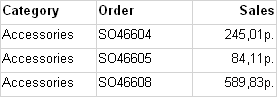
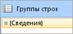
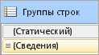
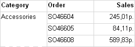
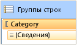
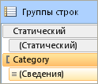
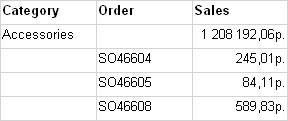
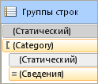

# Управление заголовками строк и столбцов (построитель отчетов и службы SSRS)
  Табличная область данных, матричная область данных или область списка данных может занимать несколько страниц по горизонтали или по вертикали. Можно указать, нужно ли повторять заголовки строк и столбцов на каждой странице. В интерактивном модуле подготовки отчетов, таком как диспетчер отчетов, или при предварительном просмотре отчета также можно указать, нужно ли закреплять заголовки строк и столбцов, чтобы они оставались видимыми во время прокрутки отчета. В таблице или матрице первая строка обычно содержит заголовки столбцов с метками для данных в каждом столбце, а первый столбец обычно содержит заголовки строк с метками для данных в каждой строке. Для вложенных групп может понадобиться повторить первоначальный набор заголовков строк и столбцов, которые содержат метки групп. По умолчанию в область данных списка заголовки не включаются.  
  
 Способ управления повторением или закреплением заголовков зависит от следующих факторов.  
  
-   Для заголовков столбцов, которые повторяются в верхней части каждой страницы:  
  
    -   Содержит ли таблица или матрица область группы столбцов, которая расширяется по горизонтали.  
  
    -   Нужно ли управлять всеми строками, сопоставленными с группами столбцов, как единым целым.  
  
-   Для заголовков строк, которые повторяются в боковой части каждой страницы.  
  
    -   Содержит ли таблица или матрица область группы строк, которая расширяется по вертикали. Заголовки строк поддерживаются только для групп строк с заголовками.  
  
> [!NOTE]  
>  [!INCLUDE[ssRBRDDup](../../includes/ssrbrddup-md.md)]  
  
## Основные сведения о строках и столбцах в области данных табликса  
 Таблица или матрица является шаблоном для базовой области данных табликса. Область данных табликса содержит четыре области: область групп строк, которая управляет строками, расширяющимися вниз по отчету, область групп столбцов, которая управляет столбцами, расширяющимися по отчету, область текста, в которой отображаются данные, и угловую область. Чтобы понять, где следует задавать свойства, управляющие повтором или закреплением заголовков, важно знать, что для области данных табликса существуют два представления.  
  
-   **В определении отчета** . Каждая строка или столбец в определении области данных табликса являются элементом табликса из определенной группы строк или столбцов. Элемент табликса может быть статическим или динамическим. Статический элемент табликса содержит метки или подытоги и повторяется один раз на группу. Динамический элемент табликса содержит значения группы и повторяется один раз для каждого уникального значения группы, также называемого экземпляром группы.  
  
-   **В области конструктора.** В области конструктора область данных табликса разделена пунктирными линиями на четыре части. Каждая ячейка в той части, которая соответствует области данных табликса, организована в виде строк и столбов. Строки и столбцы сопоставлены группам, включая группу подробностей. Для выбранной области данных табликса маркеры строк и столбцов, а также выделяющие полоски указывают на принадлежность к группе. Ячейки в области группы строк или столбцов представляют заголовки групп для элементов табликса. Одну строку или столбец можно сопоставить нескольким группам.  
  
     Дополнительные сведения см. в разделах [Область данных табликса &#40;построитель отчетов и службы SSRS&#41;](../../reporting-services/report-design/tablix-data-region-report-builder-and-ssrs.md) и [Ячейки, строки и столбцы области данных табликса &#40;построитель отчетов и службы SSRS&#41;](../../reporting-services/report-design/tablix-data-region-cells-rows-and-columns-report-builder-and-ssrs.md).  
  
 Для областей данных табликса, содержащих области групп строк или столбцов, сопоставленными строками и столбцами можно управлять, задавая свойства в области данных табликса. Во всех остальных случаях управление строками и столбцами выполняется путем установки свойств в панели «Свойства» для выбранного элемента табликса. Пошаговые инструкции см. в разделах [Отображение заголовков строк и столбцов на нескольких страницах (построитель отчетов и службы SSRS)](../../reporting-services/report-design/display-row-and-column-headers-on-multiple-pages-report-builder-and-ssrs.md) и [Сохранение заголовков видимыми при прокрутке отчета (построитель отчетов и службы SSRS)](../../reporting-services/report-design/keep-headers-visible-when-scrolling-through-a-report-report-builder-and-ssrs.md).  
  
##   Примеры  
 Наиболее распространенными примерами области данных табликса являются матрица, таблица без групп, таблица с группой строк и заголовком группы строк, а также таблица с группой строк без заголовка группы строк. Чтобы управлять повтором или закреплением заголовков, необходимо определить, сопоставлены ли нужные строки или столбцы заголовку группы в области группы строк или группы столбцов.  
  
 В следующих разделах приводятся примеры распространенных макетов области данных табликса.  
  
-   [Матрица](#Matrix)  
  
-   [Таблица без групп](#TableNoGroups)  
  
-   [Таблица с группами строк и областью групп строк](#TableRowGroupsGroupHeader)  
  
-   [Таблица с группами строк и без области групп строк](#TableRowGroupsNoGroupHeader)  
  
###   Матрица  
 По умолчанию простая матрица имеет одну группу строк и одну группу столбцов. На следующем рисунке показана матрица с группой строк, основанной на категориях, и группой столбцов, основанной на географических объектах.  
  
   
  
 Пунктирными линиями показаны четыре части табликса. Область групп строк содержит заголовок группы строк, который управляет метками категорий в первом столбце. Аналогично: область групп столбцов содержит заголовок группы столбцов, который управляет метками географических объектов в первой строке. Во время предварительного просмотра при расширении матрицы по странице в первой строке выводятся заголовки столбцов, как показано на следующем рисунке.  
  
   
  
 Чтобы повторить или закрепить заголовки столбцов в первой строке, задайте свойства для заголовков столбцов в области данных табликса. Для вложенных групп столбцов автоматически включаются заголовки столбцов.  
  
 Чтобы повторить или закрепить заголовки строк в первом столбце, задайте свойства для заголовков строк в области данных табликса. Для вложенных групп строк автоматически включаются заголовки строк.  
  
 [В начало](#Top)  
  
###   Таблица без групп строк  
 По умолчанию в простую таблицу без групп включается группа подробностей. На следующем рисунке показана таблица, в которой отображаются категория, номер заказа и данные продаж.  
  
   
  
 Пунктирные линии отсутствуют, поскольку таблица состоит только из области текста табликса. В первой строке выводятся заголовки столбцов. Эта строка представляет статический элемент табликса, который не сопоставлен группе. Во второй строке выводятся подробные данные. Она представляет динамический элемент табликса, сопоставленный группе подробностей. На следующем рисунке таблица показана в режиме предварительного просмотра.  
  
   
  
 Чтобы повторить или закрепить заголовки столбцов, задайте в элементе табликса свойства статической строки, входящей в определение области данных табликса. Чтобы выбрать статическую строку, необходимо использовать расширенный режим для панели группирования. На следующем рисунке показана панель групп строк.  
  
   
  
 На следующем рисунке в расширенном режиме показаны статические и динамические элементы табликса для групп строк в таблице.  
  
   
  
 Чтобы повторить или закрепить заголовки столбцов для элемента табликса, выберите помеченную статическую строку (с меткой**Статическая**). В панели свойств будут выведены свойства для выбранного элемента табликса. Задавая свойства для этого элемента табликса, можно управлять повторением или закреплением первой строки.  
  
 [В начало](#Top)  
  
###   Таблица с группами строк и областью групп строк  
 Если добавить в простую таблицу группу строк, в области конструктора к таблице будет добавлена область групп строк. На следующем рисунке показана таблица с группой строк, основанной на категориях.  
  
   
  
 Пунктирными линиями показаны область групп строк табликса и область текста табликса. Область групп строк содержит заголовок группы строк, но не содержит заголовка группы столбцов. На следующем рисунке эта таблица показана в режиме предварительного просмотра.  
  
   
  
 Чтобы повторить или закрепить заголовки столбцов, используйте метод, описанный в предыдущем примере. На следующем рисунке показан стандартный вид для панели групп строк.  
  
   
  
 Чтобы вывести элементы табликса, используйте **Расширенный** режим панели групп строк, как показано на следующем рисунке.  
  
   
  
 Представлены элементы табликса: **Статический**, (**Статический**), "Категория" и (**Подробности**). Если элемент табликса заключен в скобки, это означает, что отсутствует соответствующий заголовок группы. Чтобы повторить или закрепить заголовки столбцов, выберите верхний элемент табликса «Статический» и задайте свойства в панели свойств.  
  
 [В начало](#Top)  
  
###   Таблица с группами строк и без области групп строк  
 В ряде случаев таблица может содержать группы строк, но не содержать область групп строк. Такую таблицу можно получить, например, следующими способами.  
  
-   Возьмите таблицу, содержащую группы строк и область групп строк, и удалите столбцы для области групп строк. Удаляйте только столбцы, не удаляя группы. Например, может понадобиться сделать форматом таблицы простую сетку.  
  
-   Обновите отчет, созданный для предыдущей версии языка определения отчетов, когда не использовались области данных табликса.  
  
 На следующем рисунке показана таблица с группой строк, не содержащая область групп строк в области конструктора.  
  
   
  
 Таблица содержит три строки. В первой строке находятся заголовки столбцов. Во второй строке содержится значение группы и подытоги. Третья строка содержит подробные данные. Пунктирные линии отсутствуют, поскольку имеется только область текста табликса. На следующем рисунке эта таблица показана в режиме предварительного просмотра.  
  
   
  
 Чтобы управлять повтором или закреплением строк, необходимо задать в элементе табликса свойства для каждой строки. В режиме по умолчанию нет разницы между этим примером и предыдущим примером таблицы с группой строк и заголовком группы. На следующем рисунке показана панель группирования для этой таблицы в режиме по умолчанию.  
  
   
  
 Однако в расширенном режиме в данной структуре макета выводится другой набор элементов табликса. На следующем рисунке показана панель группирования для этой таблицы в расширенном режиме.  
  
   
  
 В области групп строк показаны следующие элементы табликса: (**Статический**), (Категория), (**Статический**) и (**Подробности**). Чтобы повторить или закрепить заголовки столбцов, выберите верхний элемент табликса (**Статический**) и задайте свойства в панели свойств.  
  
 [В начало](#Top)  
  
## Поддержка повторения и закрепления заголовков в модулях подготовки отчетов  
 Различные модули подготовки отчетов по-разному поддерживают повторение и закрепление заголовков.  
  
 Модули подготовки отчетов, использующие физические страницы (PDF, Image, Print), поддерживают следующие функции:  
  
-   повторение заголовков строк, если область данных табликса занимает несколько страниц по горизонтали;  
  
-   повторение заголовков столбцов, если область данных табликса занимает несколько страниц по вертикали.  
  
 Кроме того, модули подготовки отчетов, использующие мягкие разрывы страниц (диспетчер отчетов, предварительный просмотр отчетов, элемент управления средством просмотра отчетов), поддерживают следующие функции:  
  
-   сохранение заголовков строк в видимой области во время горизонтальной прокрутки отчета;  
  
-   сохранение заголовков столбцов в видимой области во время вертикальной прокрутки отчета.  
  
 Дополнительные сведения см. в разделе [Поведение при подготовке к просмотру (построитель отчетов и службы SSRS)](../../reporting-services/report-design/rendering-behaviors-report-builder-and-ssrs.md).  
  
## См. также:  
 [Фильтрация, группирование и сортировка данных (построитель отчетов и службы SSRS)](../../reporting-services/report-design/filter-group-and-sort-data-report-builder-and-ssrs.md)   
 [Таблицы, матрицы и списки (построитель отчетов и службы SSRS)](../../reporting-services/report-design/tables-matrices-and-lists-report-builder-and-ssrs.md)   
 [Разбиение на страницы в службах Reporting Services (построитель отчетов и службы SSRS)](../../reporting-services/report-design/pagination-in-reporting-services-report-builder-and-ssrs.md)   
 [Экспорт отчетов (построитель отчетов и службы SSRS)](../../reporting-services/report-builder/export-reports-report-builder-and-ssrs.md)  
  
  
