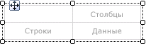
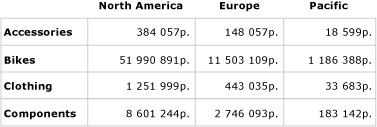
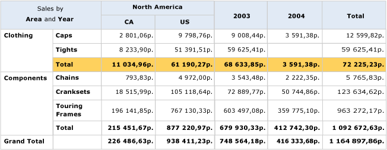
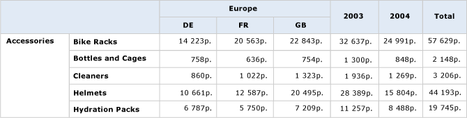

# Создание матрицы (построитель отчетов 3.0 и службы SSRS)
  Матрица используется для отображения сгруппированных данных и сводной информации. Данные можно группировать по нескольким полям либо выражениям в группах строк и столбцов. Матрицы обеспечивают функциональность, подобную перекрестным и сводным таблицам. Во время выполнения, по мере объединения данных отчета и областей данных матрица растет на странице в горизонтальном и вертикальном направлении. Значения в ячейках матрицы отображают статистические значения пересечения групп строк и столбцов, которым принадлежит ячейка. Строки и столбцы можно форматировать, чтобы выделить нужные данные. Можно также включить переключатели детализации, которые по умолчанию скрывают подробные данные, чтобы пользователи могли по желанию отобразить подробные сведения.  
  
 После завершения проектирования можно продолжить разработку матрицы для улучшения условий просмотра пользователями. Дополнительные сведения см. в разделе [Управление отображением области данных табликса на странице отчетов (построитель отчетов и службы SSRS)](../../reporting-services/report-design/controlling-the-tablix-data-region-display-on-a-report-page.md).  
  
 Чтобы быстро приступить к работе с матрицами, см. раздел [Учебник. Создание матричного отчета (построитель отчетов)](../../reporting-services/tutorial-creating-a-matrix-report-report-builder.md).  
  
> [!NOTE]  
>  Списки можно публиковать отдельно от отчета как элементы отчета. Дополнительные сведения см. в разделе [Элементы отчета (построитель отчетов и службы SSRS)](../../reporting-services/report-design/report-parts-report-builder-and-ssrs.md).  
  
##   Добавление матрицы к отчету  
 Добавьте матрицу в область конструктора из вкладки «Вставка» на ленте. Предусмотрена возможность добавить матрицу с использованием мастера «Таблица» или «Матрица», что включает создание соединения с источником данных и набора данных, а также настройку матрицы или добавление матрицы на основе шаблона матрицы.  
  
> [!NOTE]  
>  Мастер доступен только в [!INCLUDE[ssRBDenali](../../includes/ssrbdenali-md.md)].  
  
 В целях описания способа настройки таблицы от начала до конца в этом разделе используется шаблон матрицы.  Первоначально в матрице имеется группа строк, группа столбцов, угловая ячейка и ячейка данных, как показано на следующем рисунке.  
  
   
  
 При выборе матрицы в области конструктора появляются маркеры строк и столбцов, как показано на следующем рисунке.  
  
   
  
 Добавьте группу, перетащив поля набора данных в панель групп строк и групп столбцов в панель «Группирование». Первое поле, которое перетаскивается на панель группы строк или столбцов, замещает первоначальную пустую группу по умолчанию. Затем для каждой ячейки можно применить форматирование, в зависимости от содержащихся в ней данных.  
  
   
  
 В режиме просмотра матрица расширяется для отображения значений группы строк и группы столбцов. В ячейках выводятся сводные значения, как показано на следующем рисунке.  
  
   
  
 Первоначальная матрица является шаблоном на основе области данных табликса. Можно продолжить разработку матрицы, добавив вложенные или смежные группы строк либо столбцов или даже строки подробностей. Дополнительные сведения см. в разделе [Изучение возможностей области данных табликса (построитель отчетов и службы SSRS)](../../reporting-services/report-design/exploring-the-flexibility-of-a-tablix-data-region-report-builder-and-ssrs.md).  
  
  
##   Добавление родительской или дочерней группы в матрицу  
 Чтобы добавить группу, основанную на одном поле набора данных, перетащите это поле из панели данных отчета на соответствующую панель группы строк или столбцов на панели группировки. Перетащите поле в иерархию группы, чтобы установить ее связь с существующими группами. Перетащите поле в иерархию над существующей группой, чтобы создать родительскую группу, или ниже нее, чтобы создать дочернюю группу.  
  
 При помещении поля на панель **Группирование** происходит следующее.  
  
-   Автоматически создается новая группа с уникальным именем на основе имени поля. Выражению группы присваивается значение простой ссылки на имя поля, например `[Category]`.  
  
-   В области соответствующей группы строк или столбцов появится новая строка или столбец.  
  
-   В новом столбце появится ячейка группы строк для строк данных по умолчанию из набора данных отчета. Ячейки в теле табликса для этой строки теперь являются элементами группы строк. Если определена какая-либо группа столбцов, ячейки столбцов являются элементами этой группы столбов. Индикаторы групп визуально отображают членство в группе для каждой ячейки.  
  
 Для настройки группы после ее создания, используется диалоговое окно **Группа табликсов** . Можно переименовать группу, а также изменить или добавить дополнительные выражения к определению группы. Сведения о добавлении и удалении строк в таблице см. в разделе [Вставка или удаление строки (построитель отчетов и службы SSRS)](../../reporting-services/report-design/insert-or-delete-a-row-report-builder-and-ssrs.md).  
  
 При выполнении отчета заголовки динамических столбцов расширяются вправо (или влево, если параметр матрицы Direction имеет значение RTL) на столько столбцов, сколько имеется уникальных значений групп. Динамические строки расширяются по странице вниз. Данные, отображающиеся в ячейках тела табликса, являются статистическими выражениями, основанными на пересечениях групп строк и столбцов, как показано на следующем рисунке.  
  
   
  
 В режиме просмотра отчет отображается в том виде, в каком показан на следующем рисунке.  
  
   
  
 Чтобы записать выражение, задающее область, отличающуюся от области по умолчанию, необходимо указать имя набора данных, область данных или группу в агрегатной функции ALL. Чтобы вычислить процент значений каждой подкатегории в категории «Одежда», добавьте столбец в группу «Категория» рядом со столбцом Total, отформатируйте текстовое поле для отображения процентов и добавьте выражение, которое использует область по умолчанию в числителе и область группы категорий в знаменателе, как показано на следующем рисунке.  
  
 `=SUM(Fields!Linetotal.Value)/SUM(Fields! Linetotal.Value,"Category")`  
  
 Дополнительные сведения см. в разделе [Область выражения для суммирования, агрегатных функций и встроенных коллекций (построитель отчетов и службы SSRS)](../../reporting-services/report-design/expression-scope-for-totals-aggregates-and-built-in-collections.md).  
  
  
##   Добавление смежной группы в матрицу  
 Для добавления смежной группы, основанной на одном поле набора данных, используется контекстное меню панели группировки. Дополнительные сведения см. в разделе [Добавление или удаление группы в области данных (построитель отчетов и службы SSRS)](../../reporting-services/report-design/add-or-delete-a-group-in-a-data-region-report-builder-and-ssrs.md). На следующем рисунке показана группа на основе географических данных и смежная группа на основе года.  
  
   
  
 В следующем примере запрос фильтрует данные, чтобы вернуть значения только для Европы и только для 2003 и 2004 годов. Тем не менее, фильтры можно установить независимо в каждой группе. В режиме просмотра отчет отображается в том виде, в каком показан на следующем рисунке.  
  
   
  
 Чтобы добавить общий столбец для каждой смежной группы, щелкните ячейку определения группы столбцов и выберите **Добавить итог** . Рядом группой столбцов появится новый статический столбец со статистическим выражением суммы по умолчанию для каждого числового поля в существующих строках. Чтобы изменить выражение, измените его вручную, например `Avg([Sales])`. Дополнительные сведения см. в разделе [Добавление итога в группу или область данных табликса (построитель отчетов и службы SSRS)](../../reporting-services/report-design/add-a-total-to-a-group-or-tablix-data-region-report-builder-and-ssrs.md).  
  
  
## См. также:  
 [Справочник по агрегатным функциям (построитель отчетов и службы SSRS)](../../reporting-services/report-design/report-builder-functions-aggregate-functions-reference.md)   
 [Примеры выражений (построитель отчетов и службы SSRS)](../../reporting-services/report-design/expression-examples-report-builder-and-ssrs.md)  
  
  
