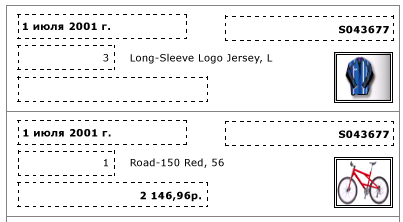
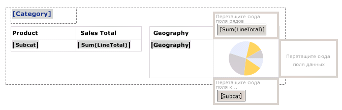
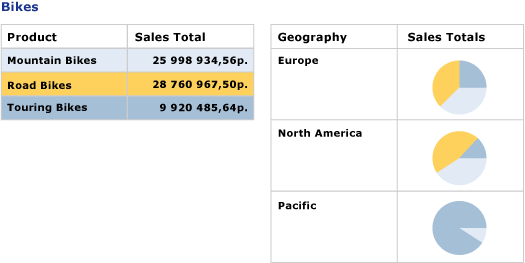

# Создание счета-фактуры и формы со списками (построитель отчетов и службы SSRS)
  Область списка данных повторяется с каждой группой или строкой набора данных отчета с разбиением на страницы [!INCLUDE[ssRSnoversion](../../includes/ssrsnoversion-md.md)] . Список может использоваться для создания отчетов произвольного формата, таких как счета, либо совместно с другими областями данных. Можно определять списки, содержащие любое количество элементов отчета. Список может быть вложен  
  
 Чтобы быстро приступить к работе со списками, см. раздел [Учебник. Создание отчета в свободной форме (построитель отчетов)](../../reporting-services/tutorial-creating-a-free-form-report-report-builder.md).  
  
> [!NOTE]  
>  Списки можно публиковать отдельно от отчета как элементы отчета. Дополнительные сведения см. в разделе [Элементы отчета (построитель отчетов и службы SSRS)](../../reporting-services/report-design/report-parts-report-builder-and-ssrs.md).  
  
##   Добавление списка к отчету  
 Добавьте список в область конструктора из вкладки «Вставка» на ленте. По умолчанию поначалу список имеет единственную ячейку в строке, связанной с группой сведений.  
  
   
  
 При выборе списка в области конструктора появляются маркеры строки и столбца, как показано на следующем рисунке.  
  
   
  
 Начальный список представляет собой шаблон в области данных табликса. После добавления списка можно продолжить конструирование, изменяя содержимое или внешний вид списка путем назначения выражений фильтрации, сортировки или группы или изменяя способ отображения списка на страницах отчетов. Дополнительные сведения см. в разделе [Управление отображением области данных табликса на странице отчетов (построитель отчетов и службы SSRS)](../../reporting-services/report-design/controlling-the-tablix-data-region-display-on-a-report-page.md). Хотя начальный список состоит из единственных строки и столбца, можно развивать структуру списка, добавляя вложенные или смежные группы строк или группы столбцов, или добавляя дополнительные строки подробностей. Дополнительные сведения см. в разделе [Изучение возможностей области данных табликса (построитель отчетов и службы SSRS)](../../reporting-services/report-design/exploring-the-flexibility-of-a-tablix-data-region-report-builder-and-ssrs.md).  
  
  
##   Отображение данных в макете свободной формы  
 Чтобы организовать данные отчета в макете свободной формы вместо сетки, можно добавить список в область конструктора. Перетащите поля из области данных отчета в ячейку. По умолчанию ячейка содержит прямоугольник, который служит контейнером. Перемещайте каждое поле в контейнере, пока не будет получена нужная структура. Используйте линии привязки, которые отображаются при перетаскивании текстовых полей в прямоугольном контейнере, чтобы выровнять края вертикально и горизонтально. Удалите ненужное пробельное пространство, корректируя размер ячейки. Дополнительные сведения см. в разделе [Изменение высоты строки или ширины столбца (построитель отчетов и службы SSRS)](../../reporting-services/report-design/change-row-height-or-column-width-report-builder-and-ssrs.md).  
  
 На следующем рисунке показан список, в котором отображаются сведения о заказе, в том числе поля: Date, Order, Qty, Product, LineTotal и изображение.  
  
   
  
 В области предварительного просмотра список повторяется, чтобы показать данные полей в свободном формате, как показано на следующем рисунке.  
  
   
  
> [!NOTE]  
>  Пунктирные линии на этих рисунках показывают размещение свободной формы для каждого значения поля. Обычно пунктирные линии не используются в производственном отчете.  
  
  
##   Отображение данных с одним уровнем группирования  
 Поскольку список автоматически предоставляет контейнер, можно использовать список для отображения сгруппированных данных с несколькими представлениями. Чтобы изменить список по умолчанию для задания группы, отредактируйте группы подробностей, укажите новое имя и задайте выражение группирования.  
  
 Например, можно встроить таблицу и диаграмму, которые показывают различные представления одного набора данных. Можно добавить группу в список, чтобы вложенные элементы отчета повторялись один раз для каждого значения группы. На следующем рисунке показан список, сгруппированный по категории продукта. Обратите внимание на отсутствие строки подробностей. Две таблицы вложены в список рядом. Первая таблица отображает подкатегории с суммарным объемом продаж. Вторая таблица отображает категорию, сгруппированную по географическому региону, с диаграммой, показывающей распределение подкатегорий.  
  
   
  
 В области предварительного просмотра таблица отображает суммарный объем продаж для всех подкатегорий велосипедов, а таблица рядом с ней отображает разбиение продаж по географическим регионам. Используя выражение для задания фонового цвета таблицы и пользовательскую палитру для диаграммы, первая таблица также содержит условные обозначения цветов диаграммы.  
  
   
  
  
## См. также:  
 [Справочник по агрегатным функциям &#40; Построитель отчетов и службы SSRS &#41;](../../reporting-services/report-design/report-builder-functions-aggregate-functions-reference.md)   
 [Примеры выражений &#40; Построитель отчетов и службы SSRS &#41;](../../reporting-services/report-design/expression-examples-report-builder-and-ssrs.md)  
  
  
