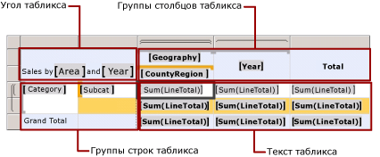

# Отображение заголовков строк и столбцов на нескольких страницах (построитель отчетов и службы SSRS)
  Пользователь может указать, следует ли повторять заголовки строк и столбцов на каждой странице отчета [!INCLUDE[ssRSnoversion_md](../../includes/ssrsnoversion-md.md)] с разбивкой на страницы для области данных табликса (таблица, матрица или список), которая занимает несколько страниц.
  
 Управление строками и столбцами зависит от того, имеет ли область данных табликса заголовки групп. Если щелкнуть область данных табликса, имеющую заголовки групп, пунктирная линия отобразит области табликса, как показано на следующем рисунке.  
  
   
  
 Заголовки групп строк и столбцов создаются автоматически во время добавления групп с помощью мастера создания таблицы или матрицы, мастера создания диаграммы, путем добавления полей на панель группирования или с помощью контекстных меню. Если область данных табликса содержит только область текста табликса и не содержит заголовков групп, строки и столбцы являются элементами табликса.  
  
 Для статических элементов можно отобразить строки, прилегающие к верхней части или столбцы, прилегающие к боковой части, на нескольких страниц.  
  
## Отображение заголовков строк на нескольких страницах  
  
1.  Щелкните правой кнопкой мыши маркер строки или столбца либо угловой маркер области данных табликса, а затем выберите пункт **Свойства табликса**.  
  
2.  В разделе **Заголовки строк**выберите пункт **Повторять строки заголовка на каждой странице**.  
  
3.  [!INCLUDE[clickOK](../../includes/clickok-md.md)]  
  
## Отображение заголовков столбцов на нескольких страницах  
  
1.  Щелкните правой кнопкой мыши маркер строки или столбца либо угловой маркер области данных табликса, а затем выберите пункт **Свойства табликса**.  
  
2.  В разделе **Заголовки столбцов**выберите пункт **Повторять столбцы заголовка на каждой странице**.  
  
3.  [!INCLUDE[clickOK](../../includes/clickok-md.md)]  
  
## Отображение статической строки или статического столбца на множестве страниц  
  
1.  В области конструктора щелкните маркер строки или столбца области данных табликса, чтобы выделить этот дескриптор. На панели группирования будут отображены группы столбцов и строк.  
  
2.  На правой стороне панели группирования щелкните стрелку вниз и нажмите кнопку **Расширенный режим**. В панели «Группы строк» отображаются иерархические статические и динамические члены для иерархии групп строк, а в панели «Группы столбцов» аналогично отображается иерархия групп столбцов.  
  
3.  Щелкните статический элемент, соответствующий статическому элементу (строке или столбцу), который необходимо оставить видимым во время прокрутки. В панели «Свойства» отображаются свойства **Элемент табликса** .  
  
     Если панель свойств не отображается, перейдите на вкладку **Вид** в верхней части окна построителя отчетов и выберите **Свойства**.  
  
4.  В панели «Свойства» присвойте параметру **RepeatOnNewPage** значение True.  
  
5.  Задайте для поля **KeepWithGroup** значение «После».  
  
6.  Повторите эту процедуру для всех элементов, которые нужно повторить.  
  
7.  Просмотрите отчет.  
  
 При просмотре страницы отчета, которую занимает область данных табликса, статические элементы табликса повторяются на каждой странице.  
  
## См. также раздел  
 [Поиск, просмотр отчетов и управление ими (построитель отчетов и службы SSRS)](../../reporting-services/report-builder/finding-viewing-and-managing-reports-report-builder-and-ssrs.md)   
 [Экспорт отчетов (построитель отчетов и службы SSRS)](../../reporting-services/report-builder/export-reports-report-builder-and-ssrs.md)   
 [Управление разрывы страниц, заголовками, столбцов и строк &#40; Построитель отчетов и службы SSRS &#41;](../../reporting-services/report-design/controlling-page-breaks-headings-columns-and-rows-report-builder-and-ssrs.md)   
 [Отображение верхних и нижних колонтитулов группы &#40; Построитель отчетов и службы SSRS &#41;](../../reporting-services/report-design/display-headers-and-footers-with-a-group-report-builder-and-ssrs.md)   
 [Сохранение заголовков видимыми при прокрутке отчета (построитель отчетов и службы SSRS)](../../reporting-services/report-design/keep-headers-visible-when-scrolling-through-a-report-report-builder-and-ssrs.md)  
  
  

