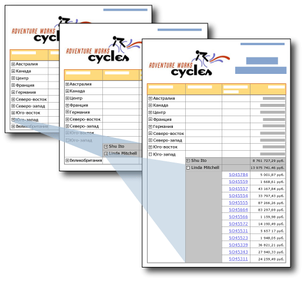

# Действие детализации (построитель отчетов и службы SSRS)
Размещение значков плюса и минуса в текстовом поле позволяет пользователям интерактивно скрывать и отображать элементы. Это действие называется *углубленной детализацией* . Для таблицы или матрицы можно показывать или скрывать статические строки и столбцы или строки и столбцы, связанные с группами.  
  
   
  
 На этом рисунке пользователь щелкает в отчете значок плюса (+), чтобы отобразить подробные данные.  
  
 Например, можно первоначально скрыть все строки, за исключением строки итогов внешней группы для таблицы с группами строк. Для каждой внутренней группы (включая группу подробностей) следует добавить переключатель в ячейку группирования объемлющей группы. После подготовки отчета к просмотру пользователь может щелкать текстовое поле, чтобы раскрыть или свернуть подробные данные. Дополнительные сведения см. в разделе [Таблицы (построитель отчетов и службы SSRS)](../../reporting-services/report-design/tables-report-builder-and-ssrs.md).  
  
 Чтобы разрешить пользователям разворачивать и сворачивать элемент, необходимо задать свойства видимости для этого элемента.  
  
> [!NOTE]  
>  При создании отчета с действием углубленной детализации сведения о видимости должны быть заданы для группы, столбца или строки, которые требуется скрыть, а не просто для отдельного текстового поля в строке или столбце. Кроме того, текстовое поле, используемое для переключателя, должно находиться в области, где расположен элемент, предназначенный для показа или скрытия.  
>   
>  Например, чтобы скрыть строку, связанную с вложенной группой, текстовое поле должно находиться в строке, связанной с родительской группой или группой, находящейся выше в иерархии контейнеров.  
>   
>  Сведения о задании сведений о видимости параметров для группы, столбца или строки см. в разделе [Добавление действия "Развернуть" или "Свернуть" к элементу (построитель отчетов и службы SSRS)](../../reporting-services/report-design/add-an-expand-or-collapse-action-to-an-item-report-builder-and-ssrs.md).  
  
 Дополнительные сведения о скрытии элементов отчета см. в разделе [Скрытие элемента (построитель отчетов и службы SSRS)](../../reporting-services/report-builder/hide-an-item-report-builder-and-ssrs.md).  
  
> [!NOTE]  
>  [!INCLUDE[ssRBRDDup](../../includes/ssrbrddup-md.md)]  
  
## Сравнение детализированных отчетов и отчетов с углубленной детализацией  
 В отчете с углубленной детализацией пользователь раскрывает или сворачивает раздел отчета для отображения подробных данных с помощью кнопки «плюс» или «минус». В детализированном отчете пользователь переходит по ссылке к сводному значению, при этом открывается отдельный, связанный отчет для отображения подробных данных. Получение подробных данных происходит только при запуске подробного отчета. Детализированные отчеты обычно требуют меньше ресурсов, чем отчеты с углубленной детализацией. Дополнительные сведения см. в разделе [Детализация, углубленная детализация, вложенные отчеты и вложенные области данных (построитель отчетов и службы SSRS)](../../reporting-services/report-design/drillthrough-drilldown-subreports-and-nested-data-regions.md).  
  
## Поддержка скрытых элементов отчета модулями подготовки отчетов  
 Переключение "скрыть-показать" для элементов отчета поддерживается только в модулях подготовки отчетов, обеспечивающих интерактивное взаимодействие с пользователем, таких как модуль подготовки отчетов в формате HTML, который используется при выполнении отчета, например в построителе отчетов или на веб-портале. Другие модули подготовки отчетов отображают скрытые элементы. В следующем списке описана поддержка элементов отчета с условной видимостью:  
  
-   В модуле подготовки HTML скрытые элементы не видны в источнике HTML.  
  
-   Модули подготовки отчетов в формате XML отображают все элементы отчета, вне зависимости от того, являются ли они скрытыми.  
  
-   Модуль подготовки отчетов в формате Excel отображает и развертывает скрытые строки и столбцы таблицы, матрицы или списка. Все строки и столбцы являются видимыми.  
  
 Дополнительные сведения см. в разделе [Поведение при подготовке к просмотру (построитель отчетов и службы SSRS)](../../reporting-services/report-design/rendering-behaviors-report-builder-and-ssrs.md).  
  
## См. также:  
 [Детализация, углубленная детализация, вложенные отчеты и вложенные области данных (построитель отчетов и службы SSRS)](../../reporting-services/report-design/drillthrough-drilldown-subreports-and-nested-data-regions.md)   
 [Интерактивная сортировка, схемы документов и ссылки (построитель отчетов и службы SSRS)](../../reporting-services/report-design/interactive-sort-document-maps-and-links-report-builder-and-ssrs.md)   
 [Примеры выражений (построитель отчетов и службы SSRS)](../../reporting-services/report-design/expression-examples-report-builder-and-ssrs.md)  
  
  
