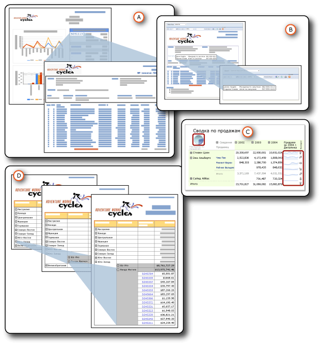

# Детализация, углубленная детализация, вложенные отчеты и вложенные области данных
  Данные можно организовать различными способами, чтобы показать отношение общего к частному.  Можно вложить все данные в отчет, но скрыть их до тех пор, пока пользователь не раскроет подробное представление; это действие называется *углубленной детализацией* . Можно отобразить данные в области данных, например таблице или диаграмме, которая *вложена* в другую область данных, например таблицу или матрицу. Можно отобразить данные во *вложенном отчете* , который содержится полностью в основном отчете. Либо можно вложить подробные данные в отчеты с *углубленной детализацией* , то есть отдельные отчеты, которые отображаются при нажатии пользователем ссылки.  
  
   
  
 A. Детализированный отчет  
  
 Б. вложенном отчете  
  
 В. Вложенные области данных  
  
 Г. Действие углубленной детализации  
  
 Все эти элементы имеют общие черты, однако они служат разным целям и имеют разные функции. Два из них, детализированные отчеты и вложенные отчеты, являются отдельными отчетами. Вложение Ї это способ вложения одной области данных в другую. Углубленная детализация Ї это действие, которое можно применить к любому элементу отчета, чтобы скрыть или отобразить другие элементы отчета. Все это способы организации и отображения данных, чтобы пользователи лучше понимали созданный отчет.  
  
> [!NOTE]  
>  [!INCLUDE[ssRBRDDup](../../includes/ssrbrddup-md.md)]  
  
##   Сводка характеристик  
 В следующей таблице перечислены различия. Подробные сведения описаны в отдельных подразделах ниже в этом разделе. Углубленная детализация не включена в эти разделы, поскольку данное действие можно применить к любому элементу отчета.  
  
|Характерная особенность|Подотчет|углубленной детализацией|вложена|  
|-----------|---------------|------------------|------------|  
|Использует набор данных основного отчета|Тот же элемент или другой|Тот же элемент или другой|То же|  
|Извлекает данные|Данные извлекаются одновременно с основным отчетом|Данные извлекаются по одному детализированному отчету за один раз|Данные извлекаются все вместе одновременно с основным отчетом|  
|Обрабатывается и подготавливается к просмотру|Вместе с основным отчетом|При нажатии ссылки|Вместе с основным отчетом|  
|Выполняет|Медленнее (но извлекает все данные вместе с основным отчетом)|Быстрее (но не извлекает все данные вместе с основным отчетом)|Быстрее (и извлекает все данные вместе с основным отчетом)|  
|Использует параметры|Да|Да|нет|  
|Может быть использован повторно|В виде отчета, вложенного отчета или детализированного отчета в других отчетах|В виде отчета, вложенного отчета или детализированного отчета в других отчетах|Нельзя использовать повторно.|  
|Находится|Внешне по отношению к основному отчету, тот же или другой сервер отчетов|Внешне по отношению к основному отчету, тот же сервер отчетов|Внутри основного отчета|  
|Отображается|В основном отчете|В другом отчете|В основном отчете|  
  
  
##   Сведения о характеристиках  
  
###   Используемые наборы данных  
 Вложенные отчеты и детализированные отчеты могут использовать один и тот же набор данных в основном отчете либо использовать другой набор данных. Вложенные области данных используют один и тот же набор данных.  
  
###   Извлечение данных  
 Вложенные отчеты и вложенные области данных извлекают данные одновременно с основным отчетом. Детализированные отчеты не делают этого. Каждый детализированный отчет извлекает данные при нажатии пользователем соответствующей ссылки. Это важно, если данные для основного отчета и дополнительного отчета необходимо извлечь одновременно.  
  
###   Обработка и подготовка к просмотру  
 Вложенный отчет обрабатывается в составе основного отчета. Например, если вложенный отчет, отображающий подробные сведения о заказе, добавляется в ячейку таблицы в строке детализации, он обрабатывается один раз для каждой строки и готовится к просмотру в составе основного отчета. Детализированный отчет обрабатывается и готовится к просмотру, только если пользователь щелкает ссылку детализации в сводке по основному отчету.  
  
###   Производительность  
 Вместо вложенного отчета можно использовать область данных, особенно если такой вложенный отчет не используется во многих отчетах. Поскольку каждый экземпляр вложенного отчета обрабатывается как отдельный отчет, это может повысить нагрузку на сервер отчетов. Области данных в целом обеспечивают ту же функциональность и гибкость, что и вложенные отчеты, но области данных значительно более эффективны с точки зрения производительности. Детализированные отчеты более производительны, чем вложенные отчеты, поскольку они не извлекают все данные одновременно с основным отчетом.  
  
###   Использование параметров  
 Обычно детализированные отчеты и вложенные отчеты имеют параметры отчета, указывающие, какие данные отчета следует отображать. Например, при щелчке номера заказа на продажу в основном отчете откроется детализированный отчет, который принимает номер заказа в виде параметра, и отображает все данные по этому заказу. При создании ссылки в основном отчете необходимо указать значения для передачи в виде параметров в детализированный отчет.  
  
 Чтобы создать детализированный отчет или вложенные отчет, необходимо сначала разработать целевой детализированный отчет или вложенный отчет и затем создать действие детализации или добавить ссылку к основному отчету.  
  
###   Повторное использование  
 Вложенные отчеты и детализированные отчеты Ї это отдельные отчеты. Поэтому их можно использовать в нескольких отчетах или отображать как автономные отчеты. Вложенные области данных не могут быть использованы повторно. Их нельзя сохранить как элементы отчета, поскольку они вкладываются в область данных. Можно сохранить область данных, которая содержит их, как элемент отчета, но не как вложенную область данных.  
  
###   Местоположение  
 Дополнительные отчеты и детализированные отчеты Ї это отдельные отчеты, поэтому они сохраняются внешне по отношению к основному отчету. Вложенные отчеты могут находиться на этом же или другом сервере отчетов, а детализированные — только на этом же сервере отчетов. Вложенные области данных являются частью основного отчета.  
  
###   Отобразить  
 Вложенные отчеты и вложенные области данных отображаются в основном отчете. Детализированные отчеты отображаются самостоятельно.  
  
  
##   в этом разделе  
 [Детализированные отчеты (построитель отчетов и службы SSRS)](../../reporting-services/report-design/drillthrough-reports-report-builder-and-ssrs.md)  
 Объясняет отчеты, которые открываются при нажатии пользователем ссылки в основном отчете.  
  
 [Вложенные отчеты (построитель отчетов и службы SSRS)](../../reporting-services/report-design/subreports-report-builder-and-ssrs.md)  
 Объясняет отчеты, отображаемые в тексте основного отчета.  
  
 [Вложенные области данных (построитель отчетов и службы SSRS)](../../reporting-services/report-design/nested-data-regions-report-builder-and-ssrs.md)  
 Объясняет вложение областей данных друг в друга, например вложение диаграммы в матрицу.  
  
 [Действие детализации (построитель отчетов и службы SSRS)](../../reporting-services/report-design/drilldown-action-report-builder-and-ssrs.md)  
 Объясняет использование действия углубленной детализации для скрытия и отображения элементов отчета.  
  
 [Указание путей к внешним элементам (построитель отчетов и службы SSRS)](../../reporting-services/report-design/specifying-paths-to-external-items-report-builder-and-ssrs.md)  
 Объясняет создание ссылок на элементы, которые являются внешними по отношению к файлу определения отчета.  
  
## См. также:  
 [Параметры отчета (построитель отчетов и конструктор отчетов)](../../reporting-services/report-design/report-parameters-report-builder-and-report-designer.md)  
  
  
