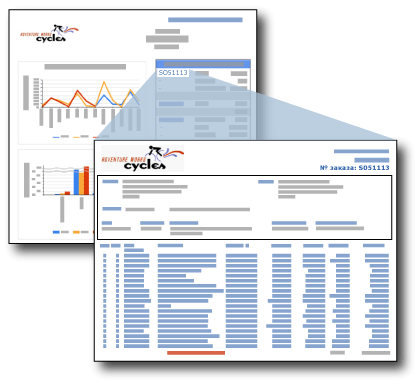

# Детализированные отчеты (построитель отчетов и службы SSRS)
  Детализированный отчет — это отчет, открываемый пользователем щелчком по ссылке в другом отчете. Обычно детализированный отчет содержит подробности об элементе, содержащемся в исходном сводном отчете. Например, на этом рисунке в сводном отчете по продажам содержатся заказы на продажу и итоговые данные. Когда пользователь щелкает номер заказа в сводном списке, открывается другой отчет, содержащий подробности о заказе.  
  
   
  
 Данные детализированного отчета не извлекаются до тех пор, пока пользователь не щелкнет ссылку в основном отчете, открывающую детализированный отчет. Если данные основного и детализированного отчета необходимо получать одновременно, рассмотрите возможность использования вложенного отчета. Дополнительные сведения см. в разделе [Вложенные отчеты (построитель отчетов и службы SSRS)](../../reporting-services/report-design/subreports-report-builder-and-ssrs.md).  
  
> [!NOTE]  
>  Во время работы в построителе отчетов необходимо подключение к серверу отчетов для просмотра детализированного отчета, открывающегося при щелчке ссылки детализации в основном отчете.  
  
 Чтобы быстро приступить к работе с детализированными отчетами, см. [Учебник. Создание детализированных и главных отчетов (построитель отчетов)](../../reporting-services/tutorial-creating-drillthrough-and-main-reports-report-builder.md). 
   
## Параметры детализированных отчетов  
 Детализированный отчет обычно содержит параметры, передаваемые ему сводным отчетом. В примере со сводным отчетом по продажам сводка по отчету содержит поле [OrderNumber] в текстовом поле в ячейке таблицы. Детализированный отчет содержит параметр, принимающий в качестве значения номер заказа. При установке ссылки детализированного отчета на это текстовое поле для поля [OrderNumber] также следует установить параметр целевого отчета для поля [OrderNumber]. Если пользователь щелкнет номер заказа в сводном отчете, откроется целевой детализированный отчет, в котором отобразятся сведения об этом номере заказа. Инструкции по созданию детализированных отчетов, изменяемых на основе значений параметров, см. в разделах [Параметры отчета (построитель отчетов и конструктор отчетов)](../../reporting-services/report-design/report-parameters-report-builder-and-report-designer.md) и [Функция InScope (построитель отчетов и службы SSRS)](../../reporting-services/report-design/report-builder-functions-inscope-function.md).  
  
## Создание детализированного отчета  
 Чтобы создать детализированный отчет, перед добавлением действия детализации в основном отчете необходимо разработать детализированный отчет.  
  
 Любой отчет может служить детализированным отчетом. Как правило, детализированный отчет принимает один или несколько параметров, которые определяют отображаемые данные, по ссылке из основного отчета. Например, если ссылка из основного отчета была от заказа на продажу, то в детализированный отчет передается номер заказа.  
  
## Создание действия детализации в основном отчете  
 Ссылки детализации можно добавлять к текстовым полям (включение текста в ячейки таблицы или матрицы), изображениям, диаграммам, датчикам и другим элементам отчета, имеющим страницу свойств «Действие». Дополнительные сведения см. в разделе [Добавление действия детализации в отчет &#40;построитель отчетов и службы SSRS&#41;](../../reporting-services/report-design/add-a-drillthrough-action-on-a-report-report-builder-and-ssrs.md).  
  
 Действие детализации в основном отчете может быть создано в виде действия отчета или действия URL-адреса. Для действия отчета детализированный отчет должен существовать на одном с основным отчетом сервере отчетов. Для действия URL-адреса отчет должен существовать по полному URL-адресу. Метод указания отчета может различаться в зависимости от сервера отчетов или сайта SharePoint, интегрированного с сервером отчетов. Если сервер отчетов настроен для работы в режиме интеграции с SharePoint, поддерживаются только действия URL-адреса.  
  
 Дополнительные сведения см. в разделах [Добавление действия детализации в отчет (построитель отчетов и службы SSRS)](../../reporting-services/report-design/add-a-drillthrough-action-on-a-report-report-builder-and-ssrs.md) и [Указание путей к внешним элементам (построитель отчетов и службы SSRS)](../../reporting-services/report-design/specifying-paths-to-external-items-report-builder-and-ssrs.md).  
  
## Просмотр детализированного отчета  
 Чтобы просмотреть сводный отчет со ссылками детализации после его опубликования, следует убедиться, что детализированные отчеты находятся на том же сервере отчетов, что и сводный отчет. Во всех случаях для просмотра детализированного отчета пользователь должен обладать разрешениями на доступ к отчету.  
  
## См. также:  
 [Детализация, углубленная детализация, вложенные отчеты и вложенные области данных (построитель отчетов и службы SSRS)](../../reporting-services/report-design/drillthrough-drilldown-subreports-and-nested-data-regions.md)  
  
  
