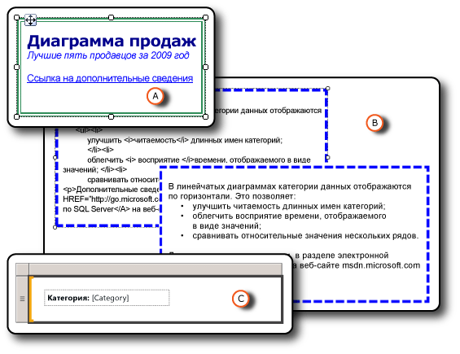

# Форматирование элементов отчета (построитель отчетов и службы SSRS)
  Форматирование элементов отчета делает отчет более привлекательным и упрощает его восприятие. В режиме конструктора отчетов можно форматировать текстовые поля и отдельные элементы в их составе, изображения, выражения и данные.  
  
   
  
 A. Текстовое поле с двойной границей и набором стилей форматирования, включая ссылку.  
  
 Б. Текстовое поле со штриховой границей, необработанным HTML и подготовленным HTML.  
  
 В. Текстовое поле с текстовой меткой и заполнителем.  
  
 Чтобы изменить параметры форматирования, выберите нужный элемент и откройте для него диалоговое окно «Свойства». Например, если требуется изменить форматирование всего содержимого текстового поля или отдельного слова в текстовом поле, нужно щелкнуть этот элемент правой кнопкой мыши и выбрать **Свойства текстового поля**. Затем можно применять нужные стили форматирования.  
  
 Чтобы быстро приступить к работе, см. раздел [Учебник. Форматирование текста (построитель отчета)](../../reporting-services/tutorial-format-text-report-builder.md).  
  
> [!NOTE]  
>  [!INCLUDE[ssRBRDDup](../../includes/ssrbrddup-md.md)]  
  
## в этом разделе  
 [Форматирование текста и заполнителей (построитель отчетов и службы SSRS)](../../reporting-services/report-design/formatting-text-and-placeholders-report-builder-and-ssrs.md)  
 Описывает форматирование текста и настройки параметров форматирования для различных блоков текста в пределах одного текстового поля.  
  
 [Импорт HTML в отчет (построитель отчетов и службы SSRS)](../../reporting-services/report-design/importing-html-into-a-report-report-builder-and-ssrs.md)  
 Описывает вставку и использование HTML в отчетах.  
  
 [Форматирование чисел и дат (построитель отчетов и службы SSRS)](../../reporting-services/report-design/formatting-numbers-and-dates-report-builder-and-ssrs.md)  
 Описывает использование стандартных и пользовательских строк форматирования, поддерживаемых службами [!INCLUDE[ssRSnoversion](../../includes/ssrsnoversion-md.md)].  
  
 [Форматирование линий, цветов и изображений (построитель отчетов и службы SSRS)](../../reporting-services/report-design/formatting-lines-colors-and-images-report-builder-and-ssrs.md)  
 Описывает форматирование линий, сетки, цветов и изображений в элементах отчета и областях данных.  
  
 [Задание локали для отчета или текстового поля (службы Reporting Services)](../../reporting-services/report-design/set-the-locale-for-a-report-or-text-box-reporting-services.md)  
 Описывает, как изменить настройки для форматов отображения данных, зависящих от языка и региона, таких как дата, валюта и числовые значения.  
  
## См. также:  
 [Форматирование диаграммы (построитель отчетов и службы SSRS)](../../reporting-services/report-design/formatting-a-chart-report-builder-and-ssrs.md)  
  
  
