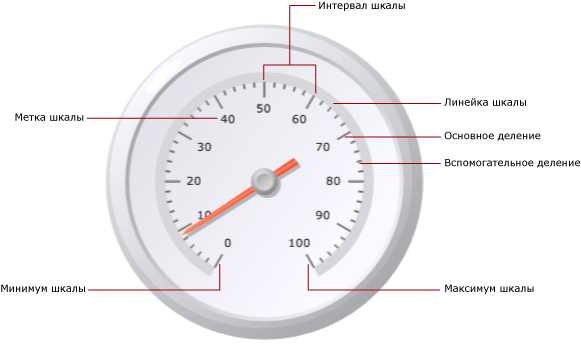
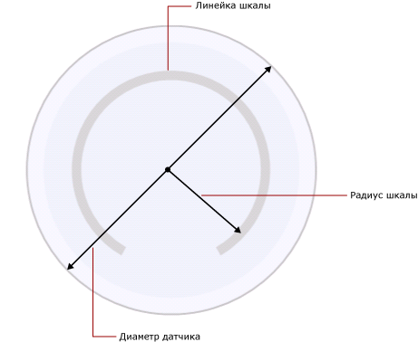

# Форматирование шкал на датчике (построитель отчетов и службы SSRS)
  В отчете [!INCLUDE[ssRSnoversion_md](../../includes/ssrsnoversion-md.md)] с разбиением на страницы шкала датчика представляет собой отображаемый на датчике диапазон чисел, ограниченный максимальным и минимальным значениями. Обычно шкала датчика содержит метки и деления, что упрощает считывание показаний указателя датчика. Шкала датчика обычно связана с одним или несколькими указателями. На одном и том же датчике может быть несколько шкал.  
  
   
  
 В отличие от диаграммы, где определяется несколько групп, датчик выводит только одно значение. Выберите минимальное и максимальное численные значения для шкалы. Значения интервала вычисляются автоматически на основе минимального и максимального значений.  
  
 При добавлении второй шкалы свойства, определяющие внешний вид существующей шкалы, будут скопированы для новой.  
  
 Свойства шкалы можно задать, щелкнув ее метки или деления правой кнопкой мыши и выбрав **Свойства радиальной шкалы** или **Свойства линейной шкалы**. Каждый тип датчика содержит по крайней мере одну шкалу с одинаковым набором свойств. Некоторые свойства есть только у конкретных типов шкал.  
  
-   Для радиального датчика можно задать радиус, начальный угол и угол поворота шкалы.  
  
-   Для линейного датчика можно задать ширину начального и конечного полей относительно конечных точек датчика.  
  
 Чтобы быстро приступить к работе по форматированию шкал, см. раздел [Установка минимума и максимума на датчике (построитель отчетов и службы SSRS)](../../reporting-services/report-design/set-a-minimum-or-maximum-on-a-gauge-report-builder-and-ssrs.md).  
  
##   Определение минимального значения, максимального значения и интервалов шкалы  
 Датчики часто используются для вывода ключевых показателей эффективности, измеряемых в процентах, от 0 до 100, поэтому свойства минимума и максимума по умолчанию получают именно эти значения. Однако бывает нужно вывести другой диапазон величин. Поскольку в датчике нет встроенной логики, показывающей, какой именно ключевой показатель эффективности представляет поле данных, датчик не вычисляет минимальное и максимальное значения автоматически. Если поле данных ключевого показателя эффективности изменяется не от 0 до 100, нужно явным образом задать минимум и максимум, чтобы обеспечить контекст для единственного значения, выводимого на датчике.  
  
 На шкале находятся основное и вспомогательное деления. Кроме этого, у шкалы есть метки, которые обычно связаны с основными делениями. Например, основные деления шкалы могут располагаться у значений 0, 20, 40, 60, 80 и 100. Метки должны соответствовать этим делениям. Разность между значениями меток называется интервалом шкалы. В данном примере интервал шкалы равен 20. Свойство «Интервал» можно установить в диалоговом окне **Свойства радиальной шкалы** или **Свойства линейной шкалы** .  
  
 Приложение вычисляет интервалы шкалы по следующей процедуре:  
  
1.  Задание минимального и максимального значений. Минимальное и максимальное значения не вычисляются автоматически на основе набора данных. Их нужно задать в диалоговом окне **Свойства** датчика.  
  
2.  Если значение интервала не указано, по умолчанию будет использовано значение Auto. Это значит, что приложение вычислит равноудаленное число интервалов на основании минимального и максимального значений, указанных на первой стадии. Если задать значение свойства «Интервал», датчик вычислит разность между минимальным и максимальным значениями и разделит их на величину, заданную в свойстве «Интервал».  
  
 Есть также свойства, определяющие интервалы меток и делений. Если задать значения этих свойств, они переопределят значение, заданное для свойства интервала шкалы. Например, если для интервала шкалы указано значение Auto, а для интервала метки — значение 4, метки будут выведены у позиций 0, 4, 8 и т. п., но основные деления по-прежнему будут вычисляться счетчиком. В результате может оказаться, что метки не соответствуют делениям. При задании интервала меток можно спрятать деления.  
  
 Смещение интервала определяет число пропущенных единиц, предшествующих первой видимой метке. Все последующие деления и метки на шкале будут использовать заданный интервал. Задать 0 для интервала метки или деления эквивалентно установлению для этого интервала значения Auto.  
  
##   Устранение конфликтов меток с помощью коэффициентов пересчета  
 Если метки состоят из нескольких разрядов, они могут затруднять чтение показаний датчика. Масштаб величин шкалы можно увеличить или уменьшить, используя коэффициент пересчета шкалы. Если задан коэффициент пересчета, каждое первоначальное значение шкалы перед выводом умножается на этот коэффициент. Чтобы задать коэффициент пересчета для уменьшения масштаба, нужно задать десятичное число. Например, если на шкале находятся значения от 0 до 10000, но нужно показывать на датчике цифры от 0 до 10, можно использовать коэффициент пересчета 0,001.  
  
> [!NOTE]  
>  Настоящее значение статистического поля, которое использует датчик, не изменяется при использовании коэффициента пересчета. Этот коэффициент действует только на значения меток, выводимые на датчике после задания минимума, максимума и интервалов. При использовании коэффициента пересчета лучше использовать автоматическое вычисление интервалов.  
  
##   Задание ширины линейки, радиуса и угла радиальной шкалы  
 Для задания ширины линейки, радиуса, начального угла и угла поворота радиальной шкалы используется страница **Макет** диалогового окна **Свойства радиальной шкалы** . Эти свойства можно использовать для настройки размера и формата шкалы. Например, если метки шкалы находятся с ее внешней стороны, нужно изменить радиус шкалы, чтобы метки уместились внутри датчика.  
  
> [!NOTE]  
>  Если щелкнуть шкалу датчика, вокруг нее появится линия из точек. Этот контур не является линейкой шкалы и не используется при вычислении параметров датчика. Он доступен только во время разработки, чтобы можно было выделить шкалу для получения доступа к ее свойствам.  
  
 Все параметры основаны на свойствах линейки шкалы. При выборе датчика ширина линейки шкалы не показывается. Если задать значение для линейки шкалы, это поможет определить все остальные измерения, имеющие отношение к этой шкале. Чтобы увидеть линейку шкалы, нужно задать для свойства **Ширина линейки шкалы** на странице **Макет** диалогового окна **Свойства радиальной шкалы** значение, большее 0. Ширина линейки шкалы радиального датчика задается в процентах от диаметра датчика. Ширина линейки шкалы линейного датчика задается в процентах от меньшего из двух параметров датчика: длины и ширины.  
  
 Радиус шкалы представляет собой расстояние от центра датчика до середины линейки шкалы. Значение радиуса шкалы измеряется в процентах от диаметра датчика. Рекомендуется использовать радиусы шкалы, не превышающие 35. Для больших радиусов шкала, скорее всего, будет нарисована за пределами границ датчика. На рисунке показано, как измеряется радиус шкалы относительно диаметра датчика, на линейке шкалы.  
  
   
  
 Начальный угол — это угол поворота, в диапазоне от 0 до 360 градусов, на котором начинается шкала. Нулевая (0) позиция находится в нижней точке датчика, а начальный угол отсчитывается по часовой стрелке. Например, шкала с начальным углом, равным 90 градусов, будет начинаться там, где на циферблате часов располагается цифра 9.  
  
 Угол поворота — это число градусов, в диапазоне от 0 до 360, покрываемых шкалой. Если задать угол поворота, равный 360 градусам, шкала покроет полный круг. Это полезно, если создаваемый датчик должен выглядеть как циферблат часов.  
  
##   Расположение меток на линейной и радиальной шкалах  
 Расположение меток задается двумя свойствами. Свойство размещения меток указывает, как размещаются метки — внутри линейки шкалы, снаружи, или пересекают ее. Свойство расстояния указывает расстояние от меток до шкалы, начиная от линейки шкалы. Если нужно, чтобы метки располагались внутри линейки шкалы, следует задать отрицательное число. Например, метки располагаются снаружи шкалы и задано расстояние 10. Метки будут показаны снаружи шкалы, на расстоянии 10 единиц от места, где они обычно располагаются. За 1 единицу принимается:  
  
-   1% диаметра для радиального датчика или  
  
-   1% от наименьшего из значений высоты или ширины для линейного датчика.  
  
## См. также:  
 [Форматирование диапазонов на датчике (построитель отчетов и службы SSRS)](../../reporting-services/report-design/formatting-ranges-on-a-gauge-report-builder-and-ssrs.md)   
 [Форматирование указателей на датчике &#40;построитель отчетов и службы SSRS&#41;](../../reporting-services/report-design/formatting-pointers-on-a-gauge-report-builder-and-ssrs.md)   
 [Форматирование меток оси в виде значений даты или валюты &#40;построитель отчетов и службы SSRS&#41;](../../reporting-services/report-design/format-axis-labels-as-dates-or-currencies-report-builder-and-ssrs.md)   
 [Форматирование меток оси на диаграмме (построитель отчетов и службы SSRS)](../../reporting-services/report-design/formatting-axis-labels-on-a-chart-report-builder-and-ssrs.md)   
 [Датчики (построитель отчетов и службы SSRS)](../../reporting-services/report-design/gauges-report-builder-and-ssrs.md)  
  
  
