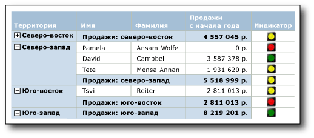
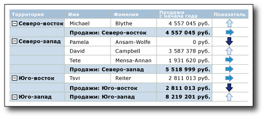

# Индикаторы (построитель отчетов и службы SSRS)
  В отчетах [!INCLUDE[ssRSnoversion_md](../../includes/ssrsnoversion-md.md)] с разбиением на страницы индикаторы — это минимальные датчики, обеспечивающие возможность быстрого определения состояния одиночного значения данных. Значки, которые представляют индикаторы и их состояния, просты и визуально эффективны, даже если они имеют небольшие размеры.  
  
 Индикаторы состояния можно использовать в отчетах для отображения следующих показателей.  
  
-   **Тренды** с использованием трендовых стрелок вверх, горизонтальных стрелок (без изменений) или трендовых стрелок вниз.  
  
-   **Состояние** с использованием наиболее распознаваемых символов, таких как галочки и восклицательные знаки.  
  
-   **Условия** с использованием наиболее распознаваемых форм, таких как светофор и знаки.  
  
-   **Оценки** с использованием наиболее распознаваемых форм и символов, которые показывают ход выполнения, например количество квадрантов в квадрате и звездочки.  
  
 Индикаторы можно использовать отдельно на панелях мониторинга или в отчетах произвольной формы, но обычно их применяют в таблицах или матрицах для визуального представления данных в строках или столбцах. На следующей диаграмме представлена таблица с индикатором в виде светофора, который представляет годовые продажи по менеджерам и территориям.  
   
   
  
 [!INCLUDE[ssRSnoversion](../../includes/ssrsnoversion-md.md)] содержат наборы встроенных индикаторов и значков индикаторов, которые используются в изначальном виде. При этом можно также создавать свои значки и наборы индикаторов.  
  
 Дополнительные сведения об использовании индикаторов в качестве ключевых показателей эффективности см. в разделе [Учебник. Добавление в отчет ключевого показателя эффективности (построитель отчетов)](../../reporting-services/tutorial-adding-a-kpi-to-your-report-report-builder.md).  
  
> [!NOTE]  
>  Индикаторы можно публиковать отдельно от отчета в виде элементов отчета. Узнайте больше об [элементах отчета](../../reporting-services/report-design/report-parts-report-builder-and-ssrs.md).  
  
##   Сравнение индикаторов и датчиков  
 Хотя внешне индикаторы выглядят иначе, на самом деле это простые датчики. Как индикаторы, так и датчики показывают единственное значение данных. Ключевые отличия заключаются в том, что датчики имеют элементы — рамки и указатели. Индикаторы имеют только состояния, значки и (необязательно) метки. Состояния индикаторов аналогичны диапазонам датчиков.  
  
 Как и датчики, индикаторы располагаются внутри панели датчиков. Если нужно настроить индикатор при помощи диалогового окна **Свойства индикаторов** или панели «Свойства», следует выбирать индикатор, а не панель. В противном случае доступные параметры применяются к панели датчиков, а индикатор будет недоступен для настройки. На следующем рисунке отображается выбранный индикатор на панели датчиков.  
  
   
  
 В зависимости от нужного способа отображения значения данных датчики могут оказаться более эффективными, чем индикаторы. Дополнительные сведения см. в разделе [Датчики (построитель отчетов и службы SSRS)](../../reporting-services/report-design/gauges-report-builder-and-ssrs.md).  
  
##   Выбор типа индикатора  
 Правильный выбор набора индикаторов является важнейшим фактором быстрой интерпретации данных, независимо от того, находятся ли данные в строке сведений или группе строк или столбцов в таблице или матрице, в тексте отчета или панели мониторинга. Встроенные наборы индикаторов имеют три значка или более. Эти значки могут отличаться формой и цветом. Каждый значок определяет свое состояние данных.  
  
 В следующей таблице приведен список наборов встроенных индикаторов и описание их общего применения.  
  
|Набор индикаторов|Тип индикатора|  
|-------------------|--------------------|  
||Направленные: показывают тренд с помощью стрелок вверх, вниз, горизонтальных стрелок (без изменения), трендовых стрелок вверх или трендовых стрелок вниз.|  
||Символы: показывают состояния с использованием самых узнаваемых символов — галочек и восклицательных знаков.|  
||Фигуры: показывают условия с использованием самых узнаваемых символов, например дорожных знаков и ромбовидных фигур.|  
||Оценки: показывают оценки с использованием самых узнаваемых фигур или символов, которые показывают ход выполнения, например количество квадрантов в квадрате.|  
  
 После выбора набора индикаторов можно настроить вид каждого индикатора в наборе, изменяя его свойства в диалоговых окнах для индикаторов или на панели «Свойства». Можно использовать встроенные цвета, значки, размеры или выражения для настройки индикаторов.  
  
##   Настройка индикаторов  
 Индикаторы можно настроить по своему усмотрению. Наборы индикаторов, а также отдельные значки индикаторов можно изменять внутри набора одним из следующих способов.  
  
-   Изменение цвета значка индикатора Например, можно сделать цветовую схему наборов индикаторов монохромной или использовать цвета, отличные от цветов по умолчанию.  
  
-   Изменение значка в наборе индикаторов. Например, можно использовать звезду, круг или квадрат в одном наборе индикаторов.  
  
-   Укажите индикатор, начальное и конечное значения. Например, можно наклонить отображение данных, используя значок на 75 % от значений индикатора.  
  
-   Добавление значка к набору индикаторов. Например, можно добавить дополнительные значки к наборам индикаторов, чтобы более детально дифференцировать значения индикаторов.  
  
-   Можно удалить значки из набора индикаторов, чтобы упростить отображение данных за счет использования небольшого количества значков.  
  
 Дополнительные сведения см. в разделе [Изменение значков индикаторов и наборов индикаторов (построитель отчетов и службы SSRS)](../../reporting-services/report-design/change-indicator-icons-and-indicator-sets-report-builder-and-ssrs.md).  
  
##   Использование индикаторов в таблицах и матрицах  
 Простота формы индикатора делает его идеальным для использования в таблицах и матрицах. Индикаторы эффективны даже с маленькими размерами. Это делает их полезными в строках подробностей или группирования.  
  
 На следующей диаграмме представлен отчет с таблицей, использующей набор направленных индикаторов **Четыре стрелки (цветные)** для отображения продаж. Значки индикатора в отчете настраиваются для использования оттенков синего цвета вместо цветов по умолчанию: красного, желтого и зеленого.  
  
   
  
 Дополнительные сведения о добавлении, изменении и удалении индикаторов см. в разделе [Добавление или удаление индикатора (построитель отчетов и службы SSRS)](../../reporting-services/report-design/add-or-delete-an-indicator-report-builder-and-ssrs.md).  
  
 При первом добавлении индикатора в отчет индикатор использует значения по умолчанию. Можно изменить значения так, чтобы индикатор отображал данные нужным образом. Можно изменить вид значков индикатора, способ выбора индикатором значков, а также изменить значки, используемые набором индикаторов. Дополнительные сведения см. в разделе [Изменение значков индикаторов и наборов индикаторов (построитель отчетов и службы SSRS)](../../reporting-services/report-design/change-indicator-icons-and-indicator-sets-report-builder-and-ssrs.md).  
  
 По умолчанию индикаторы настроены на использование процентов в качестве единиц измерения и автоматически определяют минимальное и максимальное значения данных. Каждый значок в наборе индикаторов имеет процентный диапазон. Количество процентных диапазонов зависит от количества значков в наборе, диапазоны имеют одинаковый размер и являются последовательными. Например, если в наборе пять значков, будет пять процентных диапазонов, каждый по 20 процентов. Первый начинается с 0 и заканчивается на 20, второй начинается с 20 и заканчивается на 40 и т. д. Индикатор использует значок из набора индикаторов, имеющего процентный диапазон, в который попадают значения данных индикатора. Можно изменить процентный диапазон для каждого значка в наборе. Минимальное и максимальное значения можно задать явно, указав значение или выражение. Можно изменить единицы измерения на числовые значения. В этом случае не надо указывать минимальное и максимальное значения данных. Вместо этого для каждого значка, используемого индикатором, нужно указать начальное и конечное значения. Дополнительные сведения см. в разделе [Задание и настройка единиц измерения (построитель отчетов и службы SSRS)](../../reporting-services/report-design/set-and-configure-measurement-units-report-builder-and-ssrs.md).  
  
 Индикаторы показывают значения данных, выполняя синхронизацию значений данных индикаторов в пределах указанной области действия. По умолчанию областью действия родительского контейнера индикатора является объект, который содержит индикатор, такой как таблица или матрица. Можно вносить изменения в синхронизацию, выбирая другую область действия, в зависимости от макета конкретного отчета. Индикатор позволяет пропускать синхронизацию. Дополнительные сведения см. в разделе [Задание области действия синхронизации (построитель отчетов и службы SSRS)](../../reporting-services/report-design/set-synchronization-scope-report-builder-and-ssrs.md).  
  
 Общие сведения о работе и определении областей действия в отчетах см. в разделе [Область выражения для суммирования, агрегатов и встроенных коллекций &#40;построитель отчетов и службы SSRS&#41;](../../reporting-services/report-design/expression-scope-for-totals-aggregates-and-built-in-collections.md).  
  
 Индикаторы используют только одно значение. Если необходимо показать несколько значений данных, используйте вместо индикатора спарклайн или гистограмму. Они могут представлять несколько значений данных, но также просты для понимания в маленьких размерах и хорошо работают в таблицах и матрицах. Дополнительные сведения см. в разделе [Спарклайны и гистограммы (построитель отчетов и службы SSRS)](../../reporting-services/report-design/sparklines-and-data-bars-report-builder-and-ssrs.md).  
  
##   Изменение размера индикаторов для улучшения визуального восприятия  
 Помимо цвета, направления и формы, для изменения визуального представления индикатора можно использовать его размер. Например, представим отчет, в котором индикаторы используются для отображения уровня удовлетворенности потребителей различными типами велосипедов. Значок, используемый индикатором, может иметь разные размеры в зависимости от степени удовлетворенности потребителей. Чем больше удовлетворенность, тем больше значок в отчете. На следующем изображении показан отчет о продажах велосипедов, при этом размеры значков отображают объем продаж.  
  
 Можно использовать выражения для динамического изменения размера звездочек на основе значений поля, используемого индикатором. Дополнительные сведения см. в разделе [Указание размера индикатора с помощью выражения (построитель отчетов и службы SSRS)](../../reporting-services/report-design/specify-the-size-of-an-indicator-using-an-expression-report-builder-and-ssrs.md).  
  
 Дополнительные сведения о написании и использовании выражений см. в разделе [Выражения (построитель отчетов и службы SSRS)](../../reporting-services/report-design/expressions-report-builder-and-ssrs.md).  
  
##   Включение индикаторов и датчиков на панели датчиков  
 Индикаторы всегда располагаются внутри панели датчиков. Панель датчиков — это контейнер верхнего уровня, который может содержать один или несколько датчиков и индикаторов состояния. Панель датчиков может содержать дочерние или соседние датчики или индикаторы. Если индикатор используется в качестве дочернего элемента по отношению к датчику, то можно визуализировать данные через состояние значения, отображаемого в датчике. Например, индикатор внутри датчика может показывать зеленый круг, что будет означать, что значение датчика находится в верхнем сегменте 33 % диапазона значений. Совместное использование датчика и индикатора помогает представлять данные различными способами. В любом случае индикатор и датчик могут использовать одни и те же или различные поля с данными.  
  
 На следующей диаграмме показан индикатор рядом с датчиком и внутри датчика.  
  
   
  
 Дополнительные сведения см. в разделе [Добавление индикаторов и датчиков на панель датчиков (построитель отчетов и службы SSRS)](../../reporting-services/report-design/include-indicators-and-gauges-in-a-gauge-panel-report-builder-and-ssrs.md).  
  
 Дополнительные сведения об использовании датчиков см. в разделе [Датчики (построитель отчетов и службы SSRS)](../../reporting-services/report-design/gauges-report-builder-and-ssrs.md).  
  
##   Последовательность состояний индикатора  
 Последовательность состояний индикатора на вкладке **Значение и состояния** диалогового окна **Свойства индикатора** указывает на то, какой значок индикатора будет отображаться для значения данных при взаимном перекрытии значений, заданных для определенных состояний индикатора.  
  
 Это может происходить при использовании процентных или числовых единиц измерения состояния. Такое наиболее вероятно при использовании числовых единиц измерения, поскольку для этих единиц измерения задаются конкретные значения. Также такое поведение вероятно при округлении значений, поскольку при этом снижается уровень дискретности значений.  
  
 В следующих сценариях описано, как изменяются показатели визуализации данных при изменении последовательности трех состояний индикатора направления **Три стрелки (цветные)** . Последовательность по умолчанию такова:  
  
1.  Красная стрелка вниз  
  
2.  Желтая горизонтальная стрелка  
  
3.  Зеленая стрелка вверх  
  
 В следующих сценариях показывается четыре разные последовательности состояний, их диапазоны значений и то, как эти последовательности отражаются на визуализации данных.  
  
 В этих сценариях для индикатора **Три стрелки (цветные)** используются числовые меры состояния.  
  
|Последовательность состояний|Стартовое значение|Конечное значение|  
|--------------------|-----------------|---------------|  
|Красный|0|3500|  
|Желтый|3500|5000|  
|Зеленый|5000|10000|  
  
 Красная стрелка вниз отображает значение 3500, а горизонтальная желтая стрелка указывает на значение 5000.  
  
|Последовательность состояний|Стартовое значение|Конечное значение|  
|--------------------|-----------------|---------------|  
|Зеленый|5000|10000|  
|Желтый|3500|5000|  
|Красный|0|3500|  
  
 Желтая горизонтальная стрелка указывает на значение 3500, а зеленая стрелка вверх указывает на значение 5000.  
  
|Последовательность состояний|Стартовое значение|Конечное значение|  
|--------------------|-----------------|---------------|  
|Зеленый|5000|10000|  
|Красный|0|3500|  
|Желтый|3500|5000|  
  
 Красная стрелка вниз указывает на значение 3500, а зеленая стрелка вверх указывает на значение 5000.  
  
|Последовательность состояний|Стартовое значение|Конечное значение|  
|--------------------|-----------------|---------------|  
|Желтый|3500|5000|  
|Красный|0|3500|  
|Зеленый|5000|10000|  
  
 Желтая стрелка вниз теперь указывает как на значение 3500, так и на значение 5000.  
  
 То есть оценка начинается, и в верхней части списка состояний индикатора, а также в отчете отобразится значок индикатора, связанный с первым состоянием индикатора, назначенного диапазону, в котором находится соответствующее значение, в которое попадают данные. Изменение последовательностей состояний индикатора отражается на визуальном отображении значений данных.  
  
##   Инструкции  
 В этом разделе содержится список инструкций, которые показывают, как добавить, изменить или удалить индикатор, как настроить индикатор и как использовать индикаторы в датчиках.  
  
-   [Добавление или удаление индикатора (построитель отчетов и службы SSRS)](../../reporting-services/report-design/add-or-delete-an-indicator-report-builder-and-ssrs.md)  
  
-   [Изменение значков индикаторов и наборов индикаторов (построитель отчетов и службы SSRS)](../../reporting-services/report-design/change-indicator-icons-and-indicator-sets-report-builder-and-ssrs.md)  
  
-   [Задание и настройка единиц измерения (построитель отчетов и службы SSRS)](../../reporting-services/report-design/set-and-configure-measurement-units-report-builder-and-ssrs.md)  
  
-   [Задание области действия синхронизации (построитель отчетов и службы SSRS)](../../reporting-services/report-design/set-synchronization-scope-report-builder-and-ssrs.md)  
  
-   [Указание размера индикатора с помощью выражения (построитель отчетов и службы SSRS)](../../reporting-services/report-design/specify-the-size-of-an-indicator-using-an-expression-report-builder-and-ssrs.md)  
  
-   [Добавление индикаторов и датчиков на панель датчиков (построитель отчетов и службы SSRS)](../../reporting-services/report-design/include-indicators-and-gauges-in-a-gauge-panel-report-builder-and-ssrs.md)  
  
## См. также:  
 [Датчики (построитель отчетов и службы SSRS)](../../reporting-services/report-design/gauges-report-builder-and-ssrs.md)   
 [Спарклайны и гистограммы (построитель отчетов и службы SSRS)](../../reporting-services/report-design/sparklines-and-data-bars-report-builder-and-ssrs.md)   
 [Диаграммы (построитель отчетов и службы SSRS)](../../reporting-services/report-design/charts-report-builder-and-ssrs.md)  
  
  
