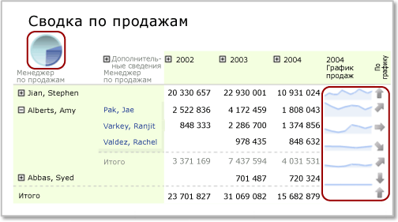

# Вложенные области данных (построитель отчетов и службы SSRS)
  Одни области данных, например диаграмма, могут быть вложены в другие, например в матрицу. Обычно это делается для выведения сводок данных в кратком и понятном виде, или для визуального представления данных, дополняющего табличное или матричное представление.  
  
 Например, для матрицы (иначе называемой *табликс*), содержащей заказы на покупку, где строки сгруппированы по магазинам, а столбцы по кварталам, в угловую ячейку можно добавить таблицу или диаграмму, содержащие сводку продаж для всех магазинов. Можно также добавить в заголовок столбца матрицы диаграмму, которая показывает, какой процент составляют данные по продажам из этого столбца от общей суммы продаж.  
  
   
  
 На этом рисунке круговая диаграмма в угловой ячейке и спарклайн-диаграммы в строках являются вложенными областями данных.  
  
 По определению вложенные области данных основаны на одном и том же наборе данных отчета. Нельзя вкладывать друг в друга области данных, основанные на различных наборах данных. Чтобы вывести данные из разных наборов, можно использовать детализированные отчеты или вложенные отчеты. Дополнительные сведения см. в разделе [Детализация, углубленная детализация, вложенные отчеты и вложенные области данных (построитель отчетов и службы SSRS)](../../reporting-services/report-design/drillthrough-drilldown-subreports-and-nested-data-regions.md).  
  
> [!NOTE]  
>  [!INCLUDE[ssRBRDDup](../../includes/ssrbrddup-md.md)]  
  
## Основные сведения об области видимости для вложенных областей данных  
 Область видимости данных для вложенных областей данных определяется автоматически на основании позиции этих данных в родительской области данных. Например, областью данных диаграммы, вложенной в угловую ячейку табликса, будут данные из набора данных, привязанного к области данных табликса, после применения фильтров к набору данных, области данных табликса и области данных диаграммы. Областью табликса, вложенного в ячейку табликса, является та же область, что для угловой ячейки, которая дополнительно ограничена членством в группе строк и столбцов ячейки, в которую он вложен, после применения соответствующих фильтров группы. Дополнительные сведения об области см. в разделе [Область выражения для суммирования, агрегатных функций и встроенных коллекций (построитель отчетов и службы SSRS)](../../reporting-services/report-design/expression-scope-for-totals-aggregates-and-built-in-collections.md).  
  
 В следующем списке перечислены области для ячеек в следующих областях табликса.  
  
-   **Угловая ячейка табликса.** Это данные в области данных, связанной с областью данных табликса, после применения выражений фильтрации и сортировки для набора данных и внешнего табликса.  
  
-   **Группа столбцов табликса.** Это данные в самой внутренней группе столбцов, после применения выражений фильтрации и сортировки для набора данных, внешнего табликса и групп столбцов.  
  
-   **Группа строк табликса.** Это данные в самой внутренней группе строк, после применения выражений фильтрации и сортировки для набора данных, внешнего табликса и групп строк.  
  
-   **Тело табликса.** Это данные в самой внутренней группе данных, образованной пересечением групп строк и групп столбцов, после применения выражений фильтрации и сортировки для набора данных, внешнего табликса и групп столбцов и строк.  
  
 Дополнительные сведения см. в разделе [Области данных табликса &#40;построитель отчетов и службы SSRS&#41;](../../reporting-services/report-design/tablix-data-region-areas-report-builder-and-ssrs.md).  
  
## Добавление вложенных диаграмм, спарклайн-диаграмм или гистограмм в табликс  
 При добавлении диаграммы (включая спарклайн-диаграмму или гистограмму) в строку верхнего или нижнего колонтитула группы столбцов табликса или в тело ячейки табликса данные, передаваемые в диаграмму, ограничиваются подмножеством данных для этой ячейки. По умолчанию при добавлении диаграммы в ячейку табликса размеры диаграммы увеличиваются для заполнения ячейки.  
  
> [!NOTE]  
>  Чтобы более точно управлять размерами диаграммы в ячейке табликса, сначала добавьте диаграмму в прямоугольник, а потом этот прямоугольник в ячейку табликса.  
  
 По умолчанию цвета условных обозначений диаграммы определяются цветами точек данных в ряде диаграммы. Сделать так, чтобы все вложенные диаграммные области данных использовали одинаковые цвета для одних и тех же категорий данных, можно использовать пользовательские цвета и задать выражения сортировки для данных. Дополнительные сведения см. в разделах [Указание согласованных цветов для нескольких фигурных диаграмм (построитель отчетов и службы SSRS)](../../reporting-services/report-design/specify-consistent-colors-across-multiple-shape-charts-report-builder-and-ssrs.md) и [Сортировка данных в области данных (построитель отчетов и службы SSRS)](../../reporting-services/report-design/sort-data-in-a-data-region-report-builder-and-ssrs.md).  
  
## Добавление вложенного датчика или индикатора в табликс  
 Датчик или индикатор можно сделать вложенным в таблицу, матрицу или список, чтобы показать ключевой показатель эффективности (KPI). При размещении датчика или индикатора внутри таблицы он будет изображен на каждой строке табликса. Дополнительные сведения о добавлении индикаторов в табликс см. в разделе [Индикаторы (построитель отчетов и службы SSRS)](../../reporting-services/report-design/indicators-report-builder-and-ssrs.md).  
  
### Добавление датчика в табликс  
 Существует два способа добавления датчика в область данных табликса.  
  
-   Щелкните внутри ячейки табликса и вставьте датчик. Откроется диалоговое окно **Выбор типа датчика** . После выбора типа область данных датчика будет размещена внутри выбранной ячейки табликса. Скорее всего, для форматирования датчика придется изменить размеры табликса.  
  
-   Щелкните снаружи таблицы и вставьте датчик. Откроется диалоговое окно **Выбор типа датчика** . После выбора типа область данных датчика будет размещена в верхнем левом углу отчета. После добавления данных и форматирования датчика его можно перетащить в ячейку табликса.  
  
 Как и в случае с диаграммой, набор данных, передаваемый датчику, ограничивается подмножеством данных для этой ячейки. При помещении датчика в ячейку табликса он будет всегда статистически обрабатывать только одну строку данных.  
  
 Если данные табликса содержат группирование, область данных датчика, вложенная в табликс, необязательно автоматически унаследует эту группу. Чтобы датчик выводил ту же информацию, что показана в табликсе, нужно добавить к этому датчику соответствующее выражение группы. Например, если данные в табликсе группируются по продукту, нужно добавить выражение группы по продукту к датчику, чтобы он показывал те же данные. Дополнительные сведения см. в разделах [Датчики (построитель отчетов и службы SSRS)](../../reporting-services/report-design/gauges-report-builder-and-ssrs.md) и [Добавление или удаление группы в области данных (построитель отчетов и службы SSRS)](../../reporting-services/report-design/add-or-delete-a-group-in-a-data-region-report-builder-and-ssrs.md).  
  
 Выберите минимальное и максимальное численные значения для вывода на шкале датчика. Максимальное значения шкалы датчика можно задать с помощью выражения — например, `=Max!MyField.Value`. Однако это выражение оценивается в области данных только для ячейки, максимальные значения датчиков в разных строках табликса могут различаться. Это затрудняет сравнение различных датчиков табликса. Другой способ — указать для максимального значения статическое значение. В результате во всех строках табликса будут выведены датчики с этим максимальным значением. Дополнительные сведения см. в разделе [Установка минимума и максимума на датчике (построитель отчетов и службы SSRS)](../../reporting-services/report-design/set-a-minimum-or-maximum-on-a-gauge-report-builder-and-ssrs.md).  
  
 Если данные, выводимые в датчике, слишком велики, можно использовать коэффициент пересчета для снижения количества выводимых разрядов. Чтобы задать коэффициент пересчета, щелкните правой кнопкой мыши шкалу и выберите **Свойства шкалы**. В диалоговом окне **Свойства шкалы** укажите значение свойства **Коэффициент пересчета**.  
  
## Таблица или матрица и диаграмма, вложенные в список  
 Чтобы создать несколько областей данных, вложенных в список, сначала добавьте в него прямоугольник, а затем к этому прямоугольнику добавьте области данных.  
  
 Можно определить группу для области данных списка, а затем добавить табликс и диаграмму, чтобы создать различные представления одних и тех же данных. Чтобы этого добиться, нужно определить одинаковые выражения группирования и сортировки для внедренных табликса и диаграммы. Табликс и диаграмма по определению используют данные из набора данных области данных родительского списка.  
  
> [!NOTE]  
>  По умолчанию при добавлении области данных списка к области конструктора этот список будет содержать строку подробностей. Эту настройку по умолчанию можно изменить, добавив строку группы и удалив строку подробностей. Дополнительные сведения см. в разделе [Изучение возможностей области данных табликса (построитель отчетов и службы SSRS)](../../reporting-services/report-design/exploring-the-flexibility-of-a-tablix-data-region-report-builder-and-ssrs.md).  
  
 Дополнительные сведения см. в разделах [Основные сведения о группах (построитель отчетов и службы SSRS)](../../reporting-services/report-design/understanding-groups-report-builder-and-ssrs.md) и [Добавление, перемещение или удаление таблицы, матрицы или списка (построитель отчетов и службы SSRS)](../../reporting-services/report-design/add-move-or-delete-a-table-matrix-or-list-report-builder-and-ssrs.md).  
  
## См. также:  
 [Фильтрация, группирование и сортировка данных (построитель отчетов и службы SSRS)](../../reporting-services/report-design/filter-group-and-sort-data-report-builder-and-ssrs.md)   
 [Таблицы, матрицы и списки (построитель отчетов и службы SSRS)](../../reporting-services/report-design/tables-matrices-and-lists-report-builder-and-ssrs.md)   
 [Диаграммы (построитель отчетов и службы SSRS)](../../reporting-services/report-design/charts-report-builder-and-ssrs.md)   
 [Датчики (построитель отчетов и службы SSRS)](../../reporting-services/report-design/gauges-report-builder-and-ssrs.md)   
 [Выражения (построитель отчетов и службы SSRS)](../../reporting-services/report-design/expressions-report-builder-and-ssrs.md)   
 [Форматирование элементов отчета (построитель отчетов и службы SSRS)](../../reporting-services/report-design/formatting-report-items-report-builder-and-ssrs.md)   
 [Руководство. Добавление в отчет ключевого показателя эффективности (построитель отчетов)](../../reporting-services/tutorial-adding-a-kpi-to-your-report-report-builder.md)   
 [Форматирование шкал на датчике (построитель отчетов и службы SSRS)](../../reporting-services/report-design/formatting-scales-on-a-gauge-report-builder-and-ssrs.md)  
  
  
