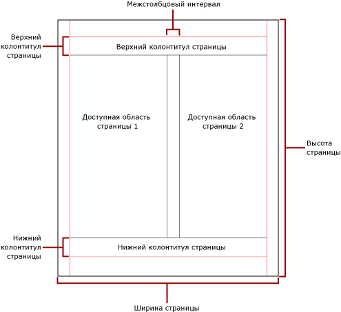

# Разбиение на страницы в службах Reporting Services (построитель отчетов и службы SSRS)
  От разбиения на страницы зависит количество страниц в отчете и размещение элементов отчета на этих страницах. Результаты разбиения на страницы в службах [!INCLUDE[ssRSnoversion](../../includes/ssrsnoversion-md.md)] зависят от модуля подготовки отчетов, применяемого для просмотра и доставки отчета. Если отчет выполняется на сервере отчетов, отчет использует модуль подготовки отчетов в формате HTML. Код HTML следует конкретному набору правил разбиения на страницы. Например, если тот же отчет экспортируется в документ PDF, то используется модуль подготовки отчетов PDF и применяется другой набор правил, поэтому разбиение отчета на страницы происходит по-другому. Чтобы успешно спроектировать удобный для чтения пользователями отчет, оптимизированный для модуля подготовки отчетов, который планируется использовать при доставке отчета, необходимо учитывать, какие правила служат для управления разбиением на страницы в службах [!INCLUDE[ssRSnoversion](../../includes/ssrsnoversion-md.md)].  
  
 В этом разделе рассматривается влияние физического размера страницы и макета отчета на подготовку отчета к просмотру модулем подготовки жестких разрывов страниц. Можно установить свойства, чтобы изменить физический размер страницы и ее полей, а также разделить отчет на столбцы с помощью панели **Свойства отчета** на панели **Свойства** или в диалоговом окне **Параметры страницы** . Открыть панель **Свойства отчета** можно, щелкнув правой кнопкой мыши синюю область за пределами текста отчета. Открыть диалоговое окно **Параметры страницы** можно, нажав кнопку **Выполнить** на вкладке «Главная» и кнопку **Параметры страницы** на вкладке «Выполнить».  
  
> [!NOTE]  
>  Если необходимо, чтобы отчет занимал в ширину одну страницу, но результат подготовки к просмотру содержит несколько страниц, убедитесь, чтобы ширина текста отчета, включая поля, не превышала по ширине физическую страницу. Чтобы предотвратить добавление к отчету пустых страниц, можно уменьшить размер контейнера, перетаскивая угол контейнера влево.  
  
> [!NOTE]  
>  [!INCLUDE[ssRBRDDup](../../includes/ssrbrddup-md.md)]  
  
## Текст отчета  
 Текст отчета представляет собой прямоугольный контейнер, отображаемый в виде пустого пространства в области конструктора. Это пространство может расширяться или сужаться, чтобы вместить элементы отчета, содержащиеся в нем. По размерам текста отчета нельзя судить о размере физической страницы, и в действительности текст отчета может выходить за границы физической страницы, охватывая несколько страниц отчета. Некоторые модули подготовки отчетов, такие как [!INCLUDE[ofprexcel](../../includes/ofprexcel-md.md)], Word, HTML и MHTML, подготавливают к просмотру отчеты, которые могут занимать большее или меньшее пространство в зависимости от содержимого страницы. Отчеты, подготовленные к просмотру в этих форматах, оптимизированы для просмотра с помощью экрана, как в веб-браузере. Эти модули подготовки отчетов при необходимости добавляются вертикальные разрывы страниц.  
  
 Можно форматировать текст отчета, чтобы задать цвет границы, стиль границы и ширину границы. Также можно добавить цвет фона и фоновое изображение.  
  
## Физическая страница  
 Физический размер страницы представляет собой размер бумаги. Подготовка отчета к просмотру зависит от размера бумаги, указанного для отчета. Отчеты, подготовленные к просмотру в форматах с жесткими разрывами страниц, содержат разрывы страниц по горизонтали и вертикали, которые вставлены с учетом физических размеров страницы, чтобы оптимизировать удобство при чтении файла в формате с жесткими разрывами страниц после его печати или отображении на экране. В отчетах, подготовленных в форматах с мягкими разрывами страниц, вставка разрывов страниц по горизонтали осуществляется с учетом физических размеров, обеспечивающего наибольшее удобство чтения при просмотре в веб-браузере.  
  
 По умолчанию страница имеет размеры 21 x 29,7 см, но этот размер можно изменить с помощью панели **Свойства отчета** , диалогового окна **Параметры страницы** или при изменении свойств PageHeight и PageWidth на панели **Свойства** . Размеры страницы не увеличиваются и не уменьшаются, чтобы вместить содержимое текста отчета. Если необходимо, чтобы отчет появился на единственной странице, все содержимое текста отчета должно быть подогнано к одной физической странице. Если не удается выполнить такую подгонку и используется формат с жесткими разрывами страниц, для отчета потребуются дополнительные страницы. Если текст отчета выходит за правый край физической страницы, разрыв страницы вставляется по горизонтали. Если текст отчета выходит за нижний край физической страницы, разрыв страницы вставляется по вертикали.  
  
 Если необходимо переопределить размер физический страницы, определенный в отчете, можно указать размер физический страницы с помощью настройки сведений об устройстве для конкретного модуля подготовки отчетов, который используется для экспорта отчета. Дополнительные сведения см. в разделе [Настройки сведений об устройстве в службах Reporting Services](https://go.microsoft.com/fwlink/?LinkId=102515).  
  
### Поля  
 Поля выводятся от края физической страницы внутрь до указанной ширины поля. Если какой-либо элемент отчета распространяется на область поля, он обрезается, поэтому перекрывающиеся области не подготавливаются к просмотру. Если указаны размеры полей, из-за которых ширина страницы по горизонтали или вертикали становится равной нулю, параметры полей по умолчанию устанавливаются равными нулю. Поля указываются с помощью панели **Свойства отчета** диалогового окна **Параметры страницы** или изменением свойств TopMargin, BottomMargin, LeftMargin и RightMargin на панели **Свойства** . Если необходимо переопределить размер поля, который определен в отчете, можно указать размер поля с помощью настройки сведений об устройстве для конкретного модуля подготовки отчетов, который используется для экспорта отчета.  
  
 Область физической страницы, остающаяся после распределения пространства для полей, расстояний между столбцами, верхнего и нижнего колонтитулов страницы, называется *полезной площадью страницы*. Поля применяются, только если подготовка к просмотру и печать отчета осуществляются в форматах модуля подготовки жестких разрывов страниц. На следующем изображении показаны поля и полезная площадь страницы на физической странице.  
  
   
  
### Столбцы в стиле газетной верстки  
 Отчет может быть разделен на столбцы, подобные столбцам в газете, которые рассматриваются как логические страницы, подготавливаемые к просмотру на одной и той же физической странице. Эти столбцы упорядочиваются слева направо и сверху вниз и отделяются друг от друга пробелами. Если отчет разделен на несколько столбцов, то физическая страница делится по вертикали на столбцы, каждый из которых рассматривается как логическая страница. Например, предположим, что на физической странице имеются два столбца. Содержимое отчета вначале используется для заполнения первого столбца, а затем второго столбца. Если отчет не помещается полностью в первых двух столбцах, отчет заполняет первый столбец, а затем второй столбец на следующей странице. Заполнение столбцов продолжается слева направо, сверху вниз до тех пор, пока не будут подготовлены к просмотру все элементы отчета. Если указаны размеры столбца, из-за которых ширина по горизонтали или вертикали становится равной нулю, расстояние между столбцами по умолчанию становится равной нулю.  
  
 Столбцы указываются с помощью панели **Свойства отчета** диалогового окна **Параметры страницы** или изменением свойств TopMargin, BottomMargin, LeftMargin и RightMargin на панели **Свойства** . Если необходимо использовать размер поля, который не определен, можно указать размер поля с помощью настройки сведений об устройстве для конкретного модуля подготовки отчетов, который используется для экспорта отчета. Столбцы могут применяться только при подготовке к просмотру и печати отчетов в формате PDF или формате изображения. На следующем изображении показана полезная область страницы, содержащей столбцы.  
  
   
  
## Разрывы страниц и имена страниц  
 Отчет становится более читабельным и его данные проще проверять и экспортировать, когда у страниц отчета есть имена. Служба Reporting Services предоставляет свойства для отчетов и областей данных табликса (таблица, матрица, список), групп и прямоугольников в отчете для контроля разбиения на страницы, сбрасывания нумерации страниц, и обеспечивает имена для новых страниц отчета на разрыве страниц. Эти возможности могут улучшить отчет независимо от формата подготовки отчета, однако, они особенно полезны при экспорте отчетов в формат Excel.  
  
 Свойство InitialPageName задает первоначальное имя страницы отчета. Если отчет не содержит имен страниц отчета на разрывах страниц, то применяется первоначальное имя страницы для всех новых страниц, созданных после разрывов. Использовать первоначальное имя страницы необязательно.  
  
 Отчет, готовый для просмотра, может предлагать новое имя страницы для новой страницы после разрыва. Для предоставления имени страницы нужно установить свойство PageName для таблиц, матриц, списков, групп и прямоугольников. Не требуется указывать имена страниц на разрывах. Если это не будет сделано, будет использовано значение InitialPageName. Если значение InitialPageName также не указано, новая страница будет безымянной.  
  
 Области данных табликса (таблица, матрица и список), группы и прямоугольники поддерживают разрывы страниц.  
  
 Разрывы страниц включают следующие свойства:  
  
-   Свойство BreakLocation указывает место разрыва в элементе отчета, допускающем разрыв страницы: в начале, в конце или в начале и конце. В группах BreakLocation может также размещаться между группами.  
  
-   Свойство Disabled указывает, применяется ли разрыв страницы к элементу отчета. Если значение этого свойства равно True, разрыв страницы пропускаются. Это свойство используется для динамической отмены разрывов страниц на основании выражений при выполнении отчета.  
  
-   Свойство ResetPageNumberindicates указывает, должна ли нумерация страниц отчета снова начинаться с 1 после разрыва страницы. Если значение этого свойства равно True, нумерация страниц сбрасывается.  
  
 Свойство BreakLocation можно установить в диалоговом окне **Свойства табликса**, **Свойства прямоугольника**или **Свойства группы** , но свойства Disabled, ResetPageNumber и PageName необходимо указывать в построителе отчетов на панели "Свойства". Если свойства на панели «Свойства» организованы по категориям, эти свойства будут находиться в категории **Разрыв страницы** . Для групп категория **Разрыв страницы** находится внутри категории **Группа** .  
  
 Можно использовать константы и простые или сложные выражения для установки значений свойств Disabled и ResetPageNumber. Однако нельзя использовать выражения со свойством BreakLocation. Дополнительные сведения о написании и использовании выражений см. в разделе [Выражения (построитель отчетов и службы SSRS)](../../reporting-services/report-design/expressions-report-builder-and-ssrs.md).  
  
 В отчете можно писать выражения, ссылающиеся на имена текущих страниц или номера страниц с помощью коллекции **Globals** . Дополнительные сведения см. в разделе [Встроенные глобальные значения и ссылки на пользовательские поля (построитель отчетов и службы SSRS)](../../reporting-services/report-design/built-in-collections-built-in-globals-and-users-references-report-builder.md).  
  
### Именование вкладок листов Excel  
 Эти свойства полезны при экспорте отчетов в книги Excel. Используйте свойство InitialPage для задания имени по умолчанию для вкладки листа при экспорте отчета и примените разрывы страниц и свойство PageName для предоставления разных имен для каждого листа. Каждая новая страница отчета, определенная с помощью разрыва страницы, экспортируется в отдельный лист с именем, определенным свойством PageName. Если свойство PageName не определено, но для отчета указано первоначальное имя страницы, все листы в книге Excel будут иметь это имя.  
  
 Дополнительные сведения об использовании этих свойств при экспорте отчетов в Excel см. в разделе [Экспорт в Microsoft Excel (построитель отчетов и службы SSRS)](../../reporting-services/report-builder/exporting-to-microsoft-excel-report-builder-and-ssrs.md).  
  
## См. также:  
 [Макет страницы и подготовка к просмотру (построитель отчетов и службы SSRS)](../../reporting-services/report-design/page-layout-and-rendering-report-builder-and-ssrs.md)  
  
  
