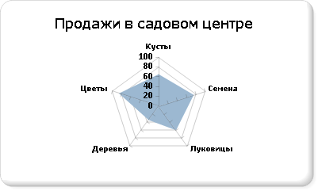

# Полярные диаграммы (построитель отчетов и службы SSRS)
  На полярной диаграмме ряд отображается как набор точек, сгруппированных по категориям на площади круга. Значения представлены расстоянием точки от центра круга. Чем дальше точка от центра, тем больше ее значение. Метки категорий отображаются на периметре диаграммы. Дополнительные сведения о добавлении данных в полярные диаграммы см. в разделе [Диаграммы (построитель отчетов и службы SSRS)](../../reporting-services/report-design/charts-report-builder-and-ssrs.md).  
  
> [!NOTE]  
>  [!INCLUDE[ssRBRDDup](../../includes/ssrbrddup-md.md)]  
  
## Варианты  
  
-   **Лепестковая диаграмма**. На лепестковой диаграмме ряды отображаются в виде окружностей или областей. В отличие от полярных диаграмм, на лепестковых диаграммах данные отражаются не в виде полярных координат.  
  
## Соображения касательно данных в полярных диаграммах  
  
-   Лепестковые диаграммы удобны для сравнения нескольких рядов данных, разбитых на категории.  
  
-   Полярные диаграммы обычно используются для отображения полярных данных, когда любая из точек данных определяется углом и расстоянием.  
  
-   Полярная диаграмма несовместима с другими типами диаграмм в одной области диаграммы.  
  
## Пример  
 В следующем примере показано использование лепестковой диаграммы. В следующей таблице содержится образец данных для диаграммы.  
  
|Имя|Sales|  
|----------|-----------|  
|Кусты|61|  
|Начальные значения|78|  
|Клубни|60|  
|Деревья|38|  
|Цветы|81|  
  
 В данном примере поле Name помещается в область групп категорий. Поле Sales помещается в область значений. После перетаскивания происходит автоматическая статистическая обработка поля «Продажи» для диаграммы. Лепестковая диаграмма вычисляет расположение меток, основываясь на числе значений в поле «Продажи», содержащем пять значений, и размещает метки около пяти равноудаленных точек на периметре круга. Если бы в поле «Продажи» содержалось три значения, то метки были бы расставлены у трех равноудаленных точек на периметре круга.  
  
 На следующем рисунке показана лепестковая диаграмма, основанная на представленных данных.  
  
   
  
## См. также:  
 [Диаграммы (построитель отчетов и службы SSRS)](../../reporting-services/report-design/charts-report-builder-and-ssrs.md)   
 [Форматирование диаграммы (построитель отчетов и службы SSRS)](../../reporting-services/report-design/formatting-a-chart-report-builder-and-ssrs.md)   
 [Типы диаграмм (построитель отчетов и службы SSRS)](../../reporting-services/report-design/chart-types-report-builder-and-ssrs.md)   
 [Графики (построитель отчетов и службы SSRS)](../../reporting-services/report-design/line-charts-report-builder-and-ssrs.md)   
 [Точки данных со значением NULL и пустые точки в диаграммах (построитель отчетов и службы SSRS)](../../reporting-services/report-design/empty-and-null-data-points-in-charts-report-builder-and-ssrs.md)  
  
  
