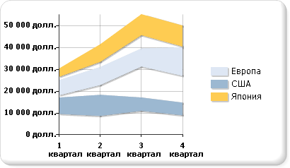

# Диаграммы диапазонов (построитель отчетов и службы SSRS)
  Тип диаграммы диапазонов предназначен для отображения набора точек данных, каждая из которых определена несколькими значениями, относящимися к одной и той же категории. Значения представлены высотой маркера на оси значений. Метки категорий отображаются на оси категорий. В простой диаграмме диапазонов заполняется область между верхним и нижним значениями для каждой точки данных.  
  
 На следующей иллюстрации показана простая диаграмма диапазонов с тремя рядами.  
  
   
  
> [!NOTE]  
>  [!INCLUDE[ssRBRDDup](../../includes/ssrbrddup-md.md)]  
  
## Разновидности  
  
-   **Гладкая диаграмма диапазонов**. На гладкой диаграмме диапазонов отображаются кривые, а не прямые линии.  
  
-   **Гистограмма диапазонов**. На гистограмме диапазонов для отображения диапазонов вместо областей используются столбцы.  
  
-   **Линейчатая диаграмма диапазонов**. На линейчатой диаграмме диапазонов для отображения диапазонов вместо областей используются линейки.  
  
## Данные для диаграмм диапазонов  
  
-   Для диаграмм диапазонов требуется по два значения на каждую точку данных. Эти значения соответствуют высокому и низкому значениям, определяющим диапазон для каждой точки данных.  
  
-   Диаграммы диапазонов могут применяться для анализа, только если высокие значения всегда выше низких значений. Если это условие не соблюдается, рассмотрите возможность использовать график. Если высокое значение меньше низкого значения, то на диаграмме диапазонов отображается абсолютная величина разности между этими значениями.  
  
-   Если указано только одно значение, диаграмма диапазонов отображается как обычная диаграмма с областями, с единственным значением для каждой точки данных.  
  
-   Диаграммы диапазонов часто используются для графического представления данных, которые содержат минимальное и максимальное значения для каждой группы категорий в наборе данных.  
  
-   Возможность отображения маркеров в каждой точке данных на диаграмме диапазонов не предусмотрена.  
  
-   Как и на диаграмме с областями, на простой диаграмме диапазонов при наличии одинаковых значений в нескольких рядах эти ряды перекрываются. В таком случае может потребоваться использовать гистограмму диапазонов или линейчатую диаграмму диапазонов вместо простой диаграммы диапазонов.  
  
-   Диаграммы Ганта могут быть созданы с помощью линейчатой диаграммы диапазонов.  
  
## См. также:  
 [Диаграммы (построитель отчетов и службы SSRS)](../../reporting-services/report-design/charts-report-builder-and-ssrs.md)   
 [Типы диаграмм (построитель отчетов и службы SSRS)](../../reporting-services/report-design/chart-types-report-builder-and-ssrs.md)   
 [Форматирование диаграммы (построитель отчетов и службы SSRS)](../../reporting-services/report-design/formatting-a-chart-report-builder-and-ssrs.md)  
  
  
