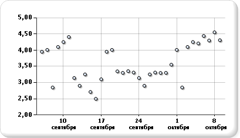

# Точечные диаграммы (построитель отчетов и службы SSRS)
  В точечной диаграмме ряды отображаются как наборы точек. Значения представлены расположением точки на плоскости диаграммы. Категории представлены различными маркерами. Точечные диаграммы обычно используются для сравнения агрегированных значений разных категорий. Дополнительные сведения о добавлении данных в точечные диаграммы см. в разделе [Диаграммы (построитель отчетов и службы SSRS)](../../reporting-services/report-design/charts-report-builder-and-ssrs.md)  
  
 На следующем рисунке показан пример точечной диаграммы.  
  
   
  
> [!NOTE]  
>  [!INCLUDE[ssRBRDDup](../../includes/ssrbrddup-md.md)]  
  
## Варианты  
  
-   **Пузырьки.** Пузырьковые диаграммы демонстрируют разницу между двумя значениями точки данных с помощью размера пузырька. Чем больше пузырек, тем больше разница.  
  
-   **Трехмерная пузырьковая диаграмма**. Пузырьковая диаграмма с трехмерным эффектом.  
  
## Вопросы работы с данными для точечной диаграммы  
  
-   Точечные диаграммы часто используются для вывода и сравнения численных значений — научных, статистических, инженерных данных.  
  
-   Точечные диаграммы рекомендуется использовать при сравнении большого количества точек данных без учета времени. Чем больше данных включено в точечную диаграмму, тем точнее сравнение.  
  
-   В пузырьковой диаграмме для каждой точки данных требуется два значения — верхнее и нижнее.  
  
-   Точечные диаграммы идеально подходят для изучения распределения величин и кластеров точек данных. Этот тип диаграммы лучше всего подходит для работы с наборами данных, содержащими много точек (например, несколько тысяч). Точечная диаграмма с несколькими рядами обычно выглядит неряшливо, и лучше не применять ее для таких случаев. В этом случае лучше использовать линейчатую диаграмму.  
  
-   По умолчанию на точечных диаграммах точки данных выводятся в виде точек. Если на точечной диаграмме необходимо вывести несколько рядов, рекомендуется использовать маркеры разной формы — треугольные, квадратные, ромбические или иные.  
  
## См. также:  
 [Диаграммы (построитель отчетов и службы SSRS)](../../reporting-services/report-design/charts-report-builder-and-ssrs.md)   
 [Типы диаграмм (построитель отчетов и службы SSRS)](../../reporting-services/report-design/chart-types-report-builder-and-ssrs.md)   
 [Форматирование диаграммы (построитель отчетов и службы SSRS)](../../reporting-services/report-design/formatting-a-chart-report-builder-and-ssrs.md)   
 [Графики (построитель отчетов и службы SSRS)](../../reporting-services/report-design/line-charts-report-builder-and-ssrs.md)  
  
  
