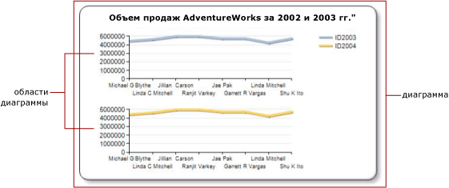

# Задание области диаграммы для ряда (построитель отчетов и службы SSRS)
  В отчетах с разбиением на страницы [!INCLUDE[ssRSnoversion_md](../../includes/ssrsnoversion-md.md)] *диаграмма* является контейнером верхнего уровня, который включает внешнюю границу, заголовок диаграммы и условные обозначения. По умолчанию диаграмма содержит одну *область диаграммы*. Область диаграммы невидима на самой диаграмме, но ее можно считать контейнером, охватывающим только метки осей, заголовки осей и область построения одного или нескольких рядов. На следующем рисунке представлены несколько областей диаграммы на одной диаграмме.  
  
   
  
 Как правило, все ряды добавляются в область диаграммы по умолчанию. При использовании диаграмм с областями, гистограмм, линейчатых и точечных диаграмм все комбинации этих рядов можно отобразить в одной области диаграммы. Если в одной области диаграммы имеется несколько рядов, ухудшается читаемость диаграммы. В этом случае удобнее разделить типы диаграмм по нескольким областям. Использование нескольких областей диаграмм улучшает читаемость и облегчает сравнение. Например, биржевые диаграммы цены и суммы выручки часто имеют разные диапазоны значений, но сравнение цены и суммы выручки можно выполнить за тот же период времени.  
  
 Столбчатые, полярные и фигурные ряды можно сочетать только с рядами того же типа диаграмм в одной области диаграммы. Если используется полярная или фигурная диаграмма, рассмотрите возможность применения отдельной области данных диаграммы для каждого отображаемого поля.  
  
> [!NOTE]  
>  [!INCLUDE[ssRBRDDup](../../includes/ssrbrddup-md.md)]  
  
## Связывание ряда с новой областью диаграммы  
  
1.  Щелкните правой кнопкой мыши в любом месте диаграммы и выберите **Добавить новую область диаграммы**. В диаграмме появится новая пустая область.  
  
2.  Щелкните правой кнопкой мыши ряд диаграммы либо ряд или поле данных в соответствующей области на панели "Данные диаграммы" и выберите пункт **Свойства ряда**.  
  
3.  На вкладке **Оси и область диаграммы**выберите область диаграммы, в которой будут отображаться ряды.  
  
4.  Выровняйте области диаграммы по вертикали (необязательно). Для этого щелкните диаграмму правой кнопкой мыши и выберите **Свойства области диаграммы**. На вкладке **Выравнивание**выберите область диаграммы, с которой нужно выровнять выбранную область.  
  
## См. также  
 [Несколько рядов на диаграмме (построитель отчетов и службы SSRS)](../../reporting-services/report-design/multiple-series-on-a-chart-report-builder-and-ssrs.md)   
 [Форматирование точек данных на диаграмме (построитель отчетов и службы SSRS)](../../reporting-services/report-design/formatting-data-points-on-a-chart-report-builder-and-ssrs.md)   
 [Задание цветов диаграммы с помощью палитры &#40;построитель отчетов и службы SSRS&#41;](../../reporting-services/report-design/define-colors-on-a-chart-using-a-palette-report-builder-and-ssrs.md)   
 [Полярные диаграммы (построитель отчетов и службы SSRS)](../../reporting-services/report-design/polar-charts-report-builder-and-ssrs.md)   
 [Фигурные диаграммы &#40;построитель отчетов и службы SSRS&#41;](../../reporting-services/report-design/shape-charts-report-builder-and-ssrs.md)   
 [Круговые диаграммы (построитель отчетов и службы SSRS)](../../reporting-services/report-design/pie-charts-report-builder-and-ssrs.md)  
  
  
