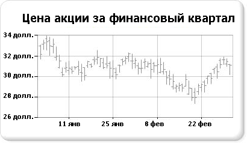

# Биржевые диаграммы (построитель отчетов и службы SSRS)
  Биржевая диаграмма — это диаграмма, специально созданная для работы с финансовыми или научными данными, в которой на каждую точку данных приходится до четырех значений. Эти значения сравниваются со значениями максимума, минимума, открытия и закрытия, используемыми для отображения биржевых данных. В этом типе диаграммы значения открытия и закрытия отображаются с помощью маркеров (обычно это линии или треугольники). В следующем примере значения открытия помечены маркерами слева, а значения закрытия — маркерами справа.  
  
   
  
 Пример биржевой диаграммы доступен в виде образца отчета построителя отчетов [!INCLUDE[ssCurrent](../../includes/sscurrent-md.md)] . Дополнительные сведения о скачивании этого и других примеров отчетов см. в статье [!INCLUDE[ssCurrent](../../includes/sscurrent-md.md)][Report Builder and Report Designer sample reports](http://go.microsoft.com/fwlink/?LinkId=198283).  
  
> [!NOTE]  
>  [!INCLUDE[ssRBRDDup](../../includes/ssrbrddup-md.md)]  
  
## Разновидности  
  
-   **Диаграмма «японские свечи»**. Диаграмма «японские свечи» — это специализированная форма биржевой диаграммы, в которой для отражения расстояния между значениями открытия и закрытия используются прямоугольники. Как и в биржевой диаграмме, в диаграмме «японские свечи» может быть отображено до четырех значений для каждой точки данных.  
  
## Соображения касательно данных в биржевых диаграммах  
  
-   При представлении большого количества биржевых точек данных, например изменения курса акций в течение года, сложно определить каждое отдельное значение максимума, минимума, открытия и закрытия каждой точки данных. В этом случае вместо биржевой диаграммы следует использовать график.  
  
-   При создании осей метки на них обычно начинаются с нуля.  Обычно колебания курса акций не так велики, как разброс значений в других наборах данных. В связи с этим можно отключить метки осей, начиная с нуля, чтобы обеспечить лучший просмотр данных. Это можно сделать, установив свойство **IncludeZero** в значение **false** в диалоговом окне **Свойства оси** окна «Свойства». Дополнительные сведения о том, как диаграмма создает метки осей, см. в разделе [Форматирование меток оси на диаграмме (построитель отчетов и службы SSRS)](../../reporting-services/report-design/formatting-axis-labels-on-a-chart-report-builder-and-ssrs.md).  
  
-   [!INCLUDE[ssRSnoversion](../../includes/ssrsnoversion-md.md)] предоставляют множество вычисляемых формул для работы с биржевыми диаграммами, включая «Индикатор цен», «Индекс относительной силы», «Схождение/расхождение скользящего среднего» и т.п.  
  
## См. также  
 [Диаграммы диапазонов (построитель отчетов и службы SSRS)](../../reporting-services/report-design/range-charts-report-builder-and-ssrs.md)   
 [Диаграммы (построитель отчетов и службы SSRS)](../../reporting-services/report-design/charts-report-builder-and-ssrs.md)   
 [Форматирование диаграммы (построитель отчетов и службы SSRS)](../../reporting-services/report-design/formatting-a-chart-report-builder-and-ssrs.md)   
 [Диалоговое окно "Свойства оси" — "Параметры оси" (построитель отчетов и службы SSRS)](../Topic/Axis%20Properties%20Dialog%20Box,%20Axis%20Options%20\(Report%20Builder%20and%20SSRS\).md)  
  
  