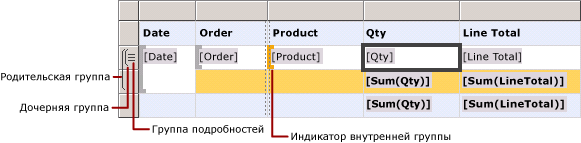
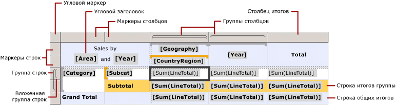
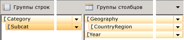
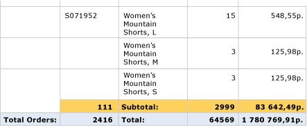

# Ячейки, строки и столбцы области данных табликса (построитель отчетов и службы SSRS)
  Чтобы эффективнее управлять процессом отображения данных в строках и столбцах области данных табликса в отчете [!INCLUDE[ssRSnoversion_md](../../includes/ssrsnoversion-md.md)] с разбиением на страницы, необходимо уметь определять метки, итоги, строки и столбцы для подробных данных и групп. Во многих случаях для отображения данных можно пользоваться структурами по умолчанию для таблиц, матриц и списков. Дополнительные сведения см. в разделах [Таблицы (построитель отчетов и службы SSRS)](../../reporting-services/report-design/tables-report-builder-and-ssrs.md), [Матрицы](../../reporting-services/report-design/create-a-matrix-report-builder-and-ssrs.md) или [Списки](../../reporting-services/report-design/create-invoices-and-forms-with-lists-report-builder-and-ssrs.md).  
  
 Область данных табликса отображает подробные данные в строках и столбцах сведений и сгруппированные данные в строках и столбцах групп. Когда группы строк и группы столбцов добавляются в область данных табликса, автоматически добавляются строки и столбцы, в которых будут отображаться эти данные. Можно вручную добавить или удалить строки и столбцы, чтобы настроить область данных табликса и управлять способом отображения данных в отчете.  
  
 Чтобы научиться настраивать область данных табликса, необходимо сначала научиться интерпретировать визуальные подсказки, отображаемые при выборе области данных табликса в области конструктора.  
  
> [!NOTE]  
>  [!INCLUDE[ssRBRDDup](../../includes/ssrbrddup-md.md)]  
  
## Основные сведения о визуальных подсказках табликса  
 Визуальные подсказки в области данных табликса помогут отобразить в ней необходимые данные.  
  
### Маркеры строк и столбцов  
 При выборе области данных табликса маркеры строк и столбцов определяют их назначение. Маркеры указывают, входит ли строка или столбец в группу. В следующей таблице показаны различные варианты отображения маркера.  
  
|Значок|Description|  
|----------|-----------------|  
||Только группа сведений в иерархии групп строк|  
||Одна внешняя группа и дочерняя группа сведений|  
||Одна внешняя группа, одна внутренняя группа, группы сведений нет|  
||Одна внешняя группа, одна внутренняя группа и одна дочерняя группа сведений|  
||Одна внешняя группа со строкой нижнего колонтитула для итогов и одна внутренняя группа|  
||Одна внешняя группа со строкой нижнего колонтитула для итогов, одна внутренняя группа со строкой нижнего колонтитула для итогов и одна строка сведений|  
||Одна внешняя группа с верхним колонтитулом для меток и нижним колонтитулом для итогов, внутренняя группа, группы сведений нет|  
  
### Строки группы  
 Строки внутри группы повторяются по одному разу для каждого значения в группе и обычно используются для статистических сводок. Строки за пределами группы повторяются в группе один раз и используются для меток и подытогов. При выборе ячейки маркеры и квадратные скобки столбца и строки в области данных табликса отображают группы, в которые входит эта ячейка. На рисунке показаны следующие визуальные подсказки.  
  
-   Маркеры строки и столбца, которые показывают связи с группами.  
  
-   Выделенные индикаторы групп, которые показывают самую внутреннюю группу, в которую входит выбранная ячейка.  
  
-   Индикаторы групп, которые показывают все группы, в которые входит выбранная ячейка.  
  
   
  
### Всего строк  
 После добавления групп строк и столбцов можно добавить строку для отображения итогов по столбцам или столбец для отображения итогов по строкам. На следующем рисунке показана матрица, содержащая группы строк и столбцов, а также итоговую строку и итоговый столбец.  
  
   
  
### Панель группировки  
 На панели группирования отображаются группы строк и столбцов для текущей выделенной области данных табликса в области конструктора. На следующем рисунке показана панель группирования для области данных табликса.  
  
   
  
 На панели группы строк содержится родительская группа Category и дочерняя группа Subcat. Панель группы столбцов содержит родительскую группу Geography, дочернюю группу CountryRegion и группу Year, которая является смежной для группы Geography. При выборе на панели группы строк группы Subcat она становится темно-оранжевой, а ячейка соответствующей группы в области конструктора выделяется.  
  
## Отображение данных в строках и столбцах  
 Связь групп строк со строками и связь групп столбцов со столбцами подчиняются одним и тем же правилам. Ниже описано, каким образом добавить строки для отображения сведений и как группировать данные в строках в области данных табликса, однако эти же принципы применимы и к добавлению столбцов для отображения подробных и сгруппированных данных.  
  
 Для каждой строки в области данных табликса строка по отношению к каждой из групп строк находится либо внутри, либо снаружи. Если строка находится внутри группы строк, то она повторяется один раз для каждого уникального значения группы, которое называется *экземпляром группы*. Если строка находится за пределами группы строк, то она повторяется в этой группе всего один раз. Строки, расположенные за пределами всех групп, являются статическими и повторяются всего один раз в пределах области данных. Например, строка верхнего или нижнего колонтитула таблицы является статической. Строки, которые повторяются хотя бы в одной из групп, являются динамическими.  
  
 При наличии вложенных групп строка может находиться внутри родительской группы, но за пределами дочерней. Такая строка повторяется для каждого значения внешней группы, однако в дочерней группе отображается всего один раз. Чтобы отображались метки или итоги группы, добавьте строку за пределами группы. Чтобы отображались данные, которые отличаются для каждого экземпляра группы, добавьте строку внутри группы.  
  
 При наличии группы сведений все строки сведений находятся внутри этой группы. Эти строки повторяются для каждого значения результирующего набора запроса.  
  
 Дополнительные сведения об иерархиях групп см. в разделе [Основные сведения о группах (построитель отчетов и службы SSRS)](../../reporting-services/report-design/understanding-groups-report-builder-and-ssrs.md).  
  
 На следующем рисунке показана область данных табликса с вложенными группами строк и группой сведений.  
  
   
  
 Для области данных табликса, в которой содержатся подробные данные, группа сведений является самой внутренней дочерней группой. Строки, добавленные в группу сведений, повторяются один раз для каждой строки результирующего набора запроса к набору данных, связанного с данной областью данных табликса. На следующем рисунке показана последняя страница отчета, готового для просмотра. На нем видны последние строки сведений и строка промежуточных итогов для последнего заказа.  
  
   
  
 Все столбцы области данных табликса подчиняются одним и тем же правилам. Например, по отношению к каждой из групп столбец может находиться либо внутри, либо снаружи. Строку итогов необходимо добавлять за пределами группы.  
  
 Чтобы удалить строки и столбцы, связанные с группой, можно удалить всю группу. При удалении группы предоставляется выбор между удалением только определения группы и удалением группы вместе со всеми связанными с ней строками и столбцами. По умолчанию удаляется только группа, а расположение строк и столбцов в области данных остается без изменений. При удалении группы со всеми связанными строками и столбцами удаляются все статические (включая верхние и нижние колонтитулы) и динамические строки и столбцы (включая экземпляры групп), связанные с этой группой.  
  
 Пошаговые инструкции по добавлению и удалению строк и столбцов см. в разделах [Вставка или удаление строки (построитель отчетов и службы SSRS)](../../reporting-services/report-design/insert-or-delete-a-row-report-builder-and-ssrs.md) и [Вставка или удаление столбца (построитель отчетов и службы SSRS)](../../reporting-services/report-design/insert-or-delete-a-column-report-builder-and-ssrs.md).  
  
## Основные сведения о ячейках табликса  
 Ячейки табликса относятся к одной из четырех его областей: тексту, области группы строк, области группы столбцов или углу. Несмотря на то, что ячейка может отображать любое значение набора данных, функция по умолчанию определяется по ее местоположению. Дополнительные сведения об областях табликса см. в разделе [Области данных табликса (построитель отчетов и службы SSRS)](../../reporting-services/report-design/tablix-data-region-areas-report-builder-and-ssrs.md).  
  
 По умолчанию ячейки в областях групп строк и столбцов табликса представляют элементы группы. Эти элементы упорядочены в определении отчета в несколько древовидных структур. Иерархия группы строк расширяется по горизонтали. Иерархия группы столбцов расширяется по вертикали. Ячейки добавляются автоматически при создании группы и отображают для группы уникальные значения во время выполнения.  
  
 Ячейки в углу табликса создаются в случае, если существует как область группы строк, так и область группы столбцов. Ячейки в этой области могут объединяться, создавая метку или внедряя другой элемент отчета.  
  
 Ячейки в области текста табликса могут отображать подробные данные, если ячейка находится в строке или столбце сведений, или статистические данные группы, если ячейка находится в группе строк или столбцов. Область видимости данных в ячейке определяется пересечением самой внутренней группы строк и самой внутренней группы столбцов, в которые входит ячейка.  
  
> [!NOTE]  
>  Фактические данные, отображаемое в каждой ячейке, вычисляются содержащимся в ней выражением для элемента отчета (обычно это текстовое поле). В ячейке, принадлежащей строке или столбцу сведений, это выражение по умолчанию указывает на данные сведений (например, **[LineTotal]**). В ячейке, которая не принадлежит строке или столбцу сведений, это выражение по умолчанию равно агрегатной функции (например, **Sum[LineTotal]**). Если в выражении не содержится агрегатная функция, хотя ячейка входит в строку или столбец группы, то отображается первое значение в группе. Дополнительные сведения об агрегатах см. в разделе [Область выражения для суммирования, агрегатных функций и встроенных коллекций (построитель отчетов и службы SSRS)](../../reporting-services/report-design/expression-scope-for-totals-aggregates-and-built-in-collections.md).  
  
### Объединение и разбиение ячеек  
 В области табликса несколько смежных ячеек можно объединить в одну. Это дает возможность, например, создавать ячейки для меток, занимающие несколько строк или столбцов.  
  
 В области угла табликса несколько ячеек могут объединяться только в одном направлении за один раз: либо по горизонтали (на несколько столбцов), либо по вертикали (на несколько строк). Чтобы объединить блок ячеек, сначала их необходимо объединять по горизонтали. Объединив нужное число ячеек в каждой из строк, выделите смежные ячейки по вертикали (можно выделить весь столбец) и объедините их.  
  
 В области текста табликса ячейки могут быть объединены только по горизонтали. Объединение ячеек по вертикали не поддерживается.  
  
 Дополнительные сведения см. в разделе [Объединение ячеек в области данных (построитель отчетов и службы SSRS)](../../reporting-services/report-design/merge-cells-in-a-data-region-report-builder-and-ssrs.md).  
  
 Ранее объединенные ячейки можно разбить. Разбиение ячеек может быть выполнено как по горизонтали (на несколько столбцов), либо по вертикали (на несколько строк). Чтобы разбить ячейку на блок ячеек, сначала необходимо разбивать их по горизонтали, а затем каждую из получившихся строк — по вертикали.  
  
## См. также:  
 [Область данных табликса (построитель отчетов и службы SSRS)](../../reporting-services/report-design/tablix-data-region-report-builder-and-ssrs.md)  
  
  
