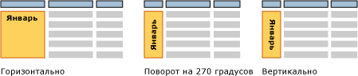

# Текстовые поля (построитель отчетов и службы SSRS)
  Часто под термином "текстовое поле" подразумевается изолированное поле с текстом, например [!INCLUDE[msCoName](../../includes/msconame-md.md)] Office PowerPoint. В отчетах с разбиением на страницы некоторые текстовые поля такие же и могут отображать статический текст для заголовков, определений и меток или динамический текст, основанный на выражениях [!INCLUDE[ssRSnoversion_md](../../includes/ssrsnoversion-md.md)] . Каждая ячейка в таблице или матрице (области данных табликса) содержит текстовое поле, которое можно форматировать аналогично изолированным текстовым полям в отчете.  
  
> [!NOTE]  
>  Если перетащить поле набора данных отчета непосредственно в область конструктора или в текстовое поле в области конструктора отчета, при выполнении отчета будет видно только первое значение результирующего набора. Чтобы увидеть все значения для поля, необходимо сначала создать таблицу, матрицу или область данных списка, а затем перетащить поле в ячейку в области данных. Таким образом, при выполнении отчета будут видны все значения в этом поле.  
  
 Чтобы отобразить повторяющийся текст в макете свободной формы, создайте область данных списка и поместите в нее текстовое поле. Используйте список, если нужно повторить форму для нескольких значений, например счет-фактуру, которая повторяется один раз для каждого заказчика. Узнайте больше о [создании счетов-фактур и форм со списками](../../reporting-services/report-design/create-invoices-and-forms-with-lists-report-builder-and-ssrs.md).  
  
 Используйте прямоугольный контейнер, если нужно управлять макетом текстового поля и пробельным пространством ниже последнего текстового поля. Дополнительные сведения см. в разделе [Прямоугольники и линии (построитель отчетов и службы SSRS)](../../reporting-services/report-design/rectangles-and-lines-report-builder-and-ssrs.md).  
  
 Выражение в текстовом поле может содержать литеральный текст, указывать на поле базы данных или вычислять данные. Все выражения отображаются в виде текста заполнителя, что позволяет форматировать числа, цвета и другие свойства отображения. Кроме того, можно совмещать заполнители с литеральным текстом в одном текстовом поле.  
  
 В каждом из текстовых полей текст может быть отформатирован с использованием нескольких шрифтов, цветов, действий и стилей. Дополнительные сведения см. в разделе [Форматирование текста и заполнителей (построитель отчетов и службы SSRS)](../../reporting-services/report-design/formatting-text-and-placeholders-report-builder-and-ssrs.md).  
  
> [!NOTE]  
>  [!INCLUDE[ssRBRDDup](../../includes/ssrbrddup-md.md)]  
  
##   Увеличение и сжатие размеров текстового поля  
 По умолчанию текстовые поля имеют фиксированный размер. Можно включить сжатие или расширение текстового поля по вертикали в зависимости от содержимого. Дополнительные сведения см. в разделе [Разрешение расширения или сжатия для текстового поля (построитель отчетов и службы SSRS)](../../reporting-services/report-design/allow-a-text-box-to-grow-or-shrink-report-builder-and-ssrs.md).  
  
## Поворот текстового поля  
 Поворот текстового поля помогает создать более удобный для чтения отчет, позволяет ориентировать текст с учетом локали, уместить больше столбцов в печатном отчете с фиксированным размером страницы и создавать более привлекательные отчеты. Направление поворота текстового поля может быть горизонтальным, вертикальным (повернутым на 90 градусов) или повернутым на 270 градусов. Вертикальный вариант чаще всего используется для восточноазиатских языков, в которых пишут сверху вниз. В большинстве модулей подготовки отчетов при вертикальном варианте используется свойство вращения глифа, которое позволяет писать текст сверху вниз, но при этом символы не переворачиваются на бок. Для остальных языков в вертикальном варианте и при повороте на 270 градусов текст пишется сбоку.  
  
 Поворот можно применять к тестовым полям, содержащим статический текст, и полям, содержащим данные из набора данных отчета или вычисляемые данные. Текстовое поле может быть изолировано в тексте отчета, в таблице или матрице или в верхнем или нижнем колонтитуле отчета.  
  
 На следующем рисунке показано три версии табличного отчета, в котором данные группируются по месяцам. Текстовое поле, содержащее месячные значения, отображается в отличной от других ориентации.  
  
   
  
 Ориентация устанавливается для текстового поля и применяется ко всему тексту в поле. Для разных частей текстового поля указать разную ориентацию нельзя.  
  
 Чтобы начать работу, обратитесь к разделу со сведениями о повороте в статьях [Учебник. Форматирование текста (построитель отчетов)](../../reporting-services/tutorial-format-text-report-builder.md) и [Задание ориентации текстового поля (построитель отчетов и службы SSRS)](../../reporting-services/report-design/set-text-box-orientation-report-builder-and-ssrs.md).  
  
##   Инструкции  
 [Добавление, перемещение или удаление текстового поля (построитель отчетов и службы SSRS)](../../reporting-services/report-design/add-move-or-delete-a-text-box-report-builder-and-ssrs.md)  
  
 [Форматирование текста в текстовом поле (построитель отчетов и службы SSRS)](../../reporting-services/report-design/format-text-in-a-text-box-report-builder-and-ssrs.md)  
  
 [Задание ориентации текстового поля (построитель отчетов и службы SSRS)](../../reporting-services/report-design/set-text-box-orientation-report-builder-and-ssrs.md)  
  
 [Разрешение расширения или сжатия для текстового поля (построитель отчетов и службы SSRS)](../../reporting-services/report-design/allow-a-text-box-to-grow-or-shrink-report-builder-and-ssrs.md)  
  
## См. также  
 [Форматирование текста и заполнителей (построитель отчетов и службы SSRS)](../../reporting-services/report-design/formatting-text-and-placeholders-report-builder-and-ssrs.md)   
 [Форматирование чисел и дат (построитель отчетов и службы SSRS)](../../reporting-services/report-design/formatting-numbers-and-dates-report-builder-and-ssrs.md)  
  
  
