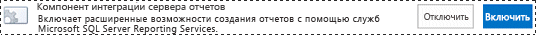
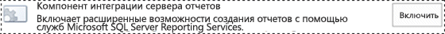
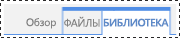
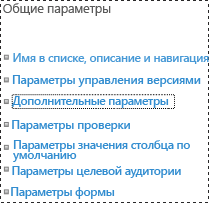
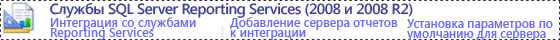
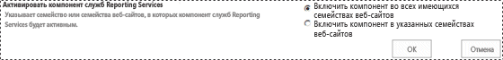

# Добавление типов содержимого служб Reporting Services в библиотеку SharePoint
  [!INCLUDE[ssRSnoversion](../../includes/ssrsnoversion-md.md)] обеспечивают стандартные типы содержимого SharePoint, предназначенные для управления файлами общих источников данных (RSDS), моделей отчетов (SMDL) и определений отчетов (RDL) построителя отчетов. После добавления в библиотеку типов содержимого **Отчет построителя отчетов**, **Модель отчета**и **Источник данных отчета** становится доступной команда **Создать** , позволяющая создавать новые документы этих типов.  
  
 **[!INCLUDE[applies](../../includes/applies-md.md)]**  [!INCLUDE[ssRSnoversion](../../includes/ssrsnoversion-md.md)] в режиме интеграции с SharePoint  
  
 Добавить типы содержимого в библиотеку может администратор веб-сайта или пользователь с разрешениями уровня «Полный доступ».  
  
 Типы содержимого служб [!INCLUDE[ssRSnoversion](../../includes/ssrsnoversion-md.md)] и управление типами содержимого будут автоматически включены во всех библиотеках документов для существующих семейств веб-сайтов, созданных на основе следующих типов шаблонов сайтов.  
  
-   **Центр бизнес-аналитики**  
  
 Для сайтов, созданных после интеграции служб [!INCLUDE[ssRSnoversion](../../includes/ssrsnoversion-md.md)] , типы содержимого служб [!INCLUDE[ssRSnoversion](../../includes/ssrsnoversion-md.md)] включены не будут.  
  
> [!TIP]  
>  Если вы еще **не** настроили типы содержимого для библиотеки, то сначала включите управление типами содержимого, а затем включите типы содержимого [!INCLUDE[ssRSnoversion](../../includes/ssrsnoversion-md.md)] . Процедуры включения управления типами содержимого приведены в библиотеке одного документа.  
  
 **Короткий видеоролик** [(SSRS) включение типов содержимого в SharePoint2010.wmv](http://www.youtube.com/watch?v=yqhm3DrtT1w) (http://www.youtube.com/watch?v=yqhm3DrtT1w).  
  
 **В этом разделе:**  
  
-   [Включение типов содержимого во всех библиотеках документов в существующем центре бизнес-аналитики](#bkmk_enable_all)  
  
-   [Активация управления типами содержимого для одной библиотеки документов (SharePoint 2013)](#bkmk_enable_content_management)  
  
-   [Добавление типов содержимого служб Reporting Services (SharePoint 2013)](#bkmk_add_single)  
  
-   [Активация управления типами содержимого для одной библиотеки документов (SharePoint 2010)](#bkmk_enable_content_management_2010)  
  
-   [Добавление типов содержимого сервера отчетов в библиотеку (SharePoint 2010)](#bkmk_add_single_2010)  
  
-   [Активация типов содержимого и управления содержимым для нескольких сайтов бизнес-аналитики](#bkmk_enable_multiple_sites)  
  
##   Включение типов содержимого во всех библиотеках документов в существующем центре бизнес-аналитики  
  
1.  Чтобы включить типы содержимого и управление содержимым во всех библиотеках документов в существующем сайте **центра бизнес-аналитики** , можно переключить компонент интеграции служб [!INCLUDE[ssRSnoversion](../../includes/ssrsnoversion-md.md)] .  
  
2.  Перейдите в раздел **Параметры сайта**.  
  
    -   В SharePoint 2013 щелкните значок **Параметры** .   
  
    -   В SharePoint 2010 щелкните **Действия сайта**и выберите **Параметры сайта**.  
  
3.  Щелкните **Компоненты коллекции веб-сайтов**.  
  
4.  Найдите в списке пункт **Компонент интеграции с сервером отчетов** и щелкните **Отключить**.  
  
       
  
5.  Обновите браузер, а затем щелкните **Активировать** для пункта **Компонент интеграции с сервером отчетов**.  
  
       
  
##   Активация управления типами содержимого для одной библиотеки документов (SharePoint 2013)  
  
1.  Откройте библиотеку, для которой нужно активировать несколько типов содержимого.  
  
2.  На ленте нажмите кнопку **Библиотека** .  
  
       
  
3.  На ленте **Библиотека** щелкните **Параметры библиотеки**. Если вы не видите кнопки **Параметры библиотеки** или если она неактивна, значит у вас нет разрешения на настройку параметров библиотеки, включая типы содержимого.  
  
       
  
4.  В разделе **Общие параметры** щелкните **Дополнительные параметры**.  
  
       
  
5.  В разделе **Типы содержимого** выберите **Да** , чтобы разрешить управление типами содержимого.  
  
6.  Нажмите кнопку **ОК**.  
  
##   Добавление типов содержимого служб Reporting Services (SharePoint 2013)  
  
1.  Откройте библиотеку, для которой нужно добавить типы содержимого служб Reporting Services.  
  
2.  На ленте нажмите кнопку **Библиотека**.  
  
3.  Нажмите кнопку **Параметры библиотеки**.  
  
4.  В разделе **Типы содержимого**выберите пункт **Добавить из типов содержимого существующего веб-сайта**.  
  
5.  В разделе **Выберите типы содержимого сайта из списка**выберите элемент **Типы содержимого служб SQL Server Reporting Services**.  
  
6.  В списке **Типы содержимого веб-сайта** щелкните элемент **Построитель отчетов**, а затем нажмите кнопку **Добавить** , чтобы переместить выбранный тип содержимого в список **Добавляемые типы содержимого** .  
  
7.  Чтобы добавить типы содержимого **Модель отчета** и **Источник данных отчета** , повторите предыдущий шаг.  
  
8.  После завершения добавления типов содержимого нажмите кнопку **ОК**.  
  
9. > [!NOTE]  
    >  Если группа типов содержимого [!INCLUDE[ssRSnoversion](../../includes/ssrsnoversion-md.md)] **Типы содержимого служб SQL Server Reporting Services** не отображается на странице **Добавление типов содержимого** , одно из нижеследующего будет верно:  
  
    -   Надстройка служб [!INCLUDE[ssRSnoversion](../../includes/ssrsnoversion-md.md)] для продуктов SharePoint еще не установлена. Дополнительные сведения см. в статье [Установка и удаление надстройки служб Reporting Services для SharePoint](../../reporting-services/install-windows/install-or-uninstall-the-reporting-services-add-in-for-sharepoint.md). Раздел включает сведения об установке надстройки и пошаговом выполнении установки файлов надстройки для обхода проблем.  
  
    -   Надстройка установлена, но компонент коллекции сайтов **Компонент интеграции сервера отчетов** неактивен. Проверьте компонент коллекции сайтов в разделе **Параметр сайта**.  
  
    -   Все типы содержимого служб [!INCLUDE[ssRSnoversion](../../includes/ssrsnoversion-md.md)] уже добавлены в библиотеку. Если типы содержимого уже есть в библиотеке, группа удаляется со страницы **Добавление типов содержимого** . Если удалить один или несколько типов содержимого служб [!INCLUDE[ssRSnoversion](../../includes/ssrsnoversion-md.md)] , группа **Типы содержимого служб SQL Server Reporting Services** снова появится на странице **Добавление типов содержимого** .  
  
##   Активация управления типами содержимого для одной библиотеки документов (SharePoint 2010)  
  
1.  Откройте библиотеку, для которой нужно активировать несколько типов содержимого. На панели меню библиотеки должны быть представлены следующие меню: **Создать**, **Передать**, **Действия**и **Настройки**. Если меню **Параметры**отсутствует, то пользователь не имеет разрешения на добавление типа содержимого.  
  
2.  На ленте **Средства работы с библиотекой** щелкните **Библиотека**.  
  
       
  
3.  В группе ленты **Параметры** выберите **Параметры библиотеки**.  
  
4.  В разделе **Общие параметры**выберите **Дополнительные параметры**.  
  
5.  В разделе **Типы содержимого** выберите **Да** , чтобы разрешить управление типами содержимого.  
  
6.  Нажмите кнопку **ОК**.  
  
##   Добавление типов содержимого сервера отчетов в библиотеку (SharePoint 2010)  
  
1.  Откройте библиотеку, для которой нужно добавить типы содержимого служб Reporting Services.  
  
2.  На вкладках ленты **Средства библиотеки** выберите вкладку **Библиотека**.  
  
3.  В группе ленты **Параметры** выберите **Параметры библиотеки**.  
  
4.  В разделе **Типы содержимого**выберите пункт **Добавить из типов содержимого существующего веб-сайта**.  
  
5.  В разделе **Выбор типов содержимого** в **Выбрать типы содержимого сайта из списка**нажмите кнопку со стрелкой, чтобы выбрать элемент **Типы содержимого служб SQL Server Reporting Services**.  
  
6.  В списке **Типы содержимого веб-сайта** щелкните элемент **Построитель отчетов**, а затем нажмите кнопку **Добавить** , чтобы переместить выбранный тип содержимого в список **Добавляемые типы содержимого** .  
  
7.  Чтобы добавить типы содержимого **Модель отчета** и **Источник данных отчета** , повторите предыдущий шаг.  
  
8.  После завершения добавления типов содержимого нажмите кнопку **ОК**.  
  
##   Активация типов содержимого и управления содержимым для нескольких сайтов бизнес-аналитики  
  
1.  Для серверов отчетов SQL Server Reporting Services 2008 и 2008 R2 можно включить типы содержимого и управление содержимым для нескольких сайтов центра бизнес-аналитики:  
  
2.  В центре администрирования SharePoint выберите **Общие параметры приложения**. В разделе **SQL Server Reporting Services (2008 и 2008 R2)** щелкните **Интеграция со службами Reporting Services**.  
  
       
  
3.  Щелкните **Включить функции во всех имеющихся семействах веб-сайтов**.  
  
       
  
4.  Нажмите кнопку **ОК**.  
  
## См. также  
 [Справочная таблица по разрешениям на сайты SharePoint и списки для элементов сервера отчетов](../../reporting-services/security/sharepoint-site-and-list-permission-reference-for-report-server-items.md)   
 [Запуск построителя отчетов](../../reporting-services/report-builder/start-report-builder.md)  
  
  
