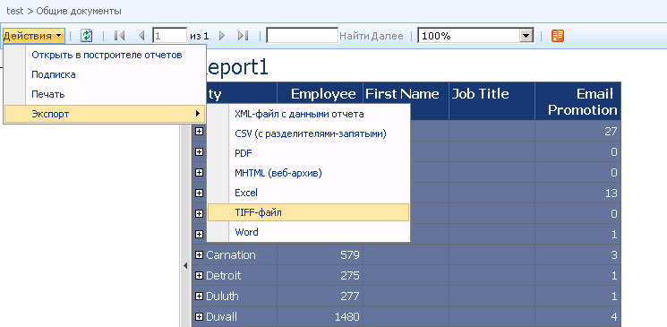

# Веб-часть средства просмотра отчетов на сайте SharePoint
  Средство просмотра отчетов — это специальная веб-часть, устанавливаемая в составе надстройки служб [!INCLUDE[ssRSnoversion](../../includes/ssrsnoversion-md.md)] для технологий SharePoint. Она позволяет просматривать, печатать и экспортировать отчеты с сервера отчетов, настроенного для работы в режиме интеграции с SharePoint. Веб-часть "Средство просмотра отчетов" связана с расширением файлов определения отчетов (RDL), которые обрабатываются сервером отчетов служб [!INCLUDE[msCoName](../../includes/msconame-md.md)] [!INCLUDE[ssNoVersion](../../includes/ssnoversion-md.md)] [!INCLUDE[ssRSnoversion](../../includes/ssrsnoversion-md.md)] . Ее нельзя использовать с отчетами, созданными с помощью других программных продуктов.  
  
 Чтобы установить веб-часть, запустите программу установки надстройки служб [!INCLUDE[ssRSnoversion](../../includes/ssrsnoversion-md.md)] . Нельзя установить или удалить веб-часть отдельно. Она является составной частью надстройки и может быть установлена только с помощью пакета установки надстройки. Имя файла веб-части «Средство просмотра отчетов» — ReportViewer.dwp. Он находится в папке «Program Files\Common Files\Microsoft Shared\web server extensions\12\template\features\reportserver» и не может быть перемещен в другое место.  
  
 Чтобы использовать эту веб-часть, необходимо установить и настроить надстройку служб [!INCLUDE[ssRSnoversion](../../includes/ssrsnoversion-md.md)] , а также настроить сервер отчетов для интеграции с SharePoint. Кроме того, необходимо иметь отчеты для отображения в программе просмотра. Открыть можно лишь отчеты, размещенные в библиотеке, в папках библиотеки, в журнале отчетов, либо отчеты, связывающие веб-часть «Библиотека» с веб-частью «Средство просмотра отчетов». Нельзя открыть отчеты, сохраненные в виде вложений в объекты пользовательских списков.  
  
 Изменяя свойства веб-части «Средство просмотра отчетов», можно управлять внешним видом панели инструментов и областей просмотра, а также связывать веб-часть с конкретным отчетом. Средство просмотра отчетов отображает либо явно связанный с ним отчет, либо открытый RDL-файл.  
  
 С одним экземпляром средства просмотра отчетов нельзя связать более одного отчета, однако, если необходимо сгруппировать отчеты, можно создать панель или страницу «Веб-часть», в которую внедрены несколько экземпляров веб-части «Средство просмотра отчетов».  
  
 Веб-часть включает в себя область просмотра, панель инструментов, свертывающуюся область для ввода учетных данных и параметров, а также свойства. На следующем рисунке изображена веб-часть с образцом отчета Company Sales и параметры экспорта, которые могут быть выбраны на панели инструментов.  
  
   
  
## Компоненты веб-части  
 В области просмотра отображается отчет в формате HTML. В зависимости от настройки веб-части область просмотра может быть развернута, чтобы отображать отчет в полностраничном режиме, или будет делить доступное пространство с соседними областями и панелью инструментов.  
  
 Панель инструментов предоставляет функции перемещения по страницам, поиска, изменения масштаба и функцию экспорта, позволяющую просматривать отчеты в форматах других приложений. Кроме того, она позволяет печатать документы, предоставляя возможность разбивки HTML-отчетов на страницы, возможности изменения параметров страницы и настройки полей. В меню**Действия**, **Открыть в построителе отчетов, Подписка**, **Экспорт** и **Печать** . Элементы управления перемещением по страницам и изменением масштаба расположены непосредственно на панели инструментов.  
  
> [!NOTE]  
>  Настройка панели инструментов не предусмотрена, однако можно задать свойства, позволяющие скрыть некоторые или все элементы управления.  
  
### Действие «Экспорт» на панели инструментов отчета  
 Команда**Экспорт** в меню **Действия** отображает форматы приложений, которые связаны с модулями подготовки отчетов, развернутыми на сервере отчетов. Чтобы определить доступность некоторого формата, можно добавить или удалить модуль подготовки отчетов на сервере отчетов либо изменить настройки конфигурации для удаления из списка того или иного формата экспорта. Кроме того, управлять доступностью форматов можно с помощью настроек конфигурации на сервере отчетов. Можно изменить поведение по умолчанию того или иного формата за счет добавления и изменения настроек конфигурации для соответствующего модуля подготовки отчетов.  
  
### Действие «Печать» на панели инструментов отчета  
 Команда**Печать** в меню **Действия** обеспечивает специальные функции печати, предоставляемые службами [!INCLUDE[ssRSnoversion](../../includes/ssrsnoversion-md.md)]. При нажатии кнопки **Печать**на компьютер клиента загружается элемент управления печатью ActiveX. В большинстве случаев пользователь, нажимающий кнопку **Печать** , должен иметь разрешения администратора локального компьютера. Как правило, правом загружать элементы управления ActiveX наделяются лишь пользователи, обладающие разрешениями администратора. Загрузку клиентского элемента управления печати можно включить или отключить с помощью центра администрирования SharePoint.  
  
### Действие «Поиск» на панели инструментов отчета  
 Команда**Найти** в меню **Действия** предоставляет возможность перемещения к нужному месту в отчете. Можно искать содержимое в отчете, вводя искомое слово или фразу. Длина строки поиска не должна превышать 256 символов. Когда искомое значение найдено в отчете, фокус перемещается к содержащему его фрагменту отчета.  
  
 При вводе значения для поиска, его следует указывать так, как оно должно выглядеть в отчете. Не следует вводить вопросы (например, «какова средняя прибыль за текущий месяц»), если только каждое слово этого предложения не содержится в отчете.  
  
 За один раз может быть выполнен поиск только одного термина или значения. Невозможно использовать операторы поиска (такие как **AND** и **OR**) или символы и символы-шаблоны. Нельзя также выполнить поиск для разреза данных (например, найти чистую выручку от продаж по конкретному продукту за определенный месяц). Для выполнения анализа такого рода применяется построитель отчетов, который позволяет создавать отчеты с дополнительной информацией.  
  
 На операции поиска влияют настройки безопасности базы данных и модели, ограничивающие доступ к данным отчета. Если выполняется поиск значения в отчете с дополнительной информацией, который использует модель в качестве источника данных, и при этом к части модели доступ отсутствует, то недоступные данные будут исключены из поиска.  
  
### Панели для указания параметров и учетных данных  
 **Учетные данные** и **Параметры** — это панели, отображаемые рядом с областью просмотра. Область**Учетные данные** отображается в том случае, если подключение к источнику данных отчета настроено для запроса у пользователя учетной записи и пароля, имеющих права на доступ к источнику данных. Область**Параметры** отображается в том случае, если отчет требует ввода пользователем параметров, определенных в нем.  
  
### Задание свойств веб-части «Средство просмотра отчетов»  
 Свойства веб-части включают в себя пользовательские свойства — как относящиеся к средству просмотра отчетов, так и общие свойства, которые можно настроить для любой веб-части. Дополнительные сведения см. в разделе [Настройка веб-части "Средство просмотра отчетов"](../../reporting-services/report-server-sharepoint/customize-the-report-viewer-web-part.md).  
  
 По умолчанию отчеты открываются в полностраничном режиме. В этом режиме отображается панель инструментов, содержащая средства перемещения по страницам, поиска и другие функции. Можно настроить внешний вид веб-части и поведение по умолчанию.  
  
## См. также  
 [Установка и удаление надстройки служб Reporting Services для SharePoint](../../reporting-services/install-windows/install-or-uninstall-the-reporting-services-add-in-for-sharepoint.md)   
 [Добавление веб-части средства просмотра отчетов на веб-страницу (службы Reporting Services в режиме интеграции с SharePoint)](../../reporting-services/report-server-sharepoint/add-the-report-viewer-web-part-to-a-web-page.md)  
  
  
