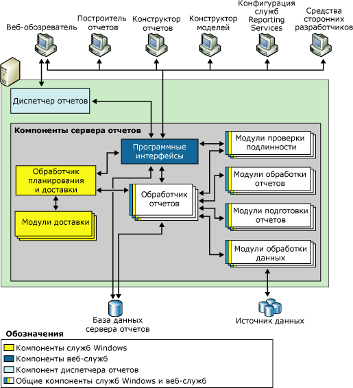
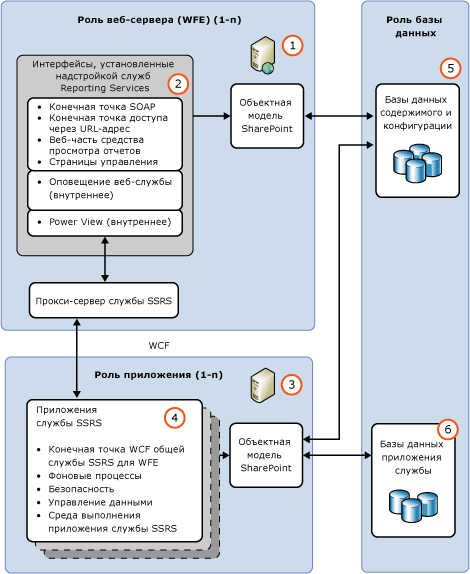

# Сервер отчетов служб Reporting Services

Дополнительные сведения об основном компоненте установки [!INCLUDE[ssNoVersion](../../includes/ssnoversion-md.md)] [!INCLUDE[ssRSnoversion](../../includes/ssrsnoversion-md.md)] . Он состоит из подсистемы обработки, а также расширений функциональности.

Сервер отчетов [!INCLUDE[ssRSnoversion](../../includes/ssrsnoversion-md.md)] может работать в одном из двух режимов развертывания: в собственном режиме или в режиме интеграции с SharePoint. В разделе [Сравнение функций режима интеграции с SharePoint и собственного режима](#bkmk_featuresupport) можно найти сравнительную таблицу функций.  
  
 **Установка.** Дополнительные сведения об установке служб [!INCLUDE[ssRSnoversion](../../includes/ssrsnoversion-md.md)] см. в следующих статьях:  
  
-   [Установка сервера отчетов служб Reporting Services в основном режиме](assetid:///8f25e6dc-b753-400e-9e9a-50f4f35bf6c4)  
  
-   [Установка компонентов бизнес-аналитики SQL Server с SharePoint (Power Pivot и службы Reporting Services)](assetid:///ac6cba68-2665-4a39-8fa3-cb7d7e6723c0)  
  
 **Windows Azure**. Дополнительные сведения об использовании [!INCLUDE[ssRSnoversion](../../includes/ssrsnoversion-md.md)] с виртуальными машинами Windows Azure см. в следующих статьях:  
  
-   [SQL Server Business Intelligence в виртуальных машинах Windows Azure](http://msdn.microsoft.com/library/windowsazure/jj992719.aspx).  
  
-   [Использование PowerShell для создания виртуальной машины Windows Azure с помощью сервера отчетов, работающего в собственном режиме](https://msdn.microsoft.com/library/azure/dn449661.aspx).   
  
##   Общие сведения о режимах сервера отчетов  
 Модули обработки (ЦП) — ядро сервера отчетов. Они служат для поддержания целостности системы отчетности и не могут быть изменены или расширены. Модули также представляют собой обработчики, но они выполняют весьма специализированные функции. [!INCLUDE[ssRSnoversion](../../includes/ssrsnoversion-md.md)] входят один или несколько стандартных модулей каждого из типов поддерживаемых модулей. К серверу отчетов можно добавить пользовательские модули. Это позволяет расширить возможности сервера отчетов для поддержки компонентов, которые не поддерживаются в стандартной поставке; в качестве примеров специализированных функциональных возможностей можно указать поддержку для технологий однократной регистрации входа, вывод отчета в прикладных форматах, которые не обрабатываются стандартными модулями подготовки отчетов, а также доставку отчета на принтер или в приложение.  
  
 Отдельный экземпляр сервера отчетов определяется коллекцией обработчиков и модулей, которые обеспечивают полную обработку, начиная с выполнения начального запроса и заканчивая выдачей законченного отчета. Различные компоненты сервера отчетов выполняют обработку запросов на отчеты и делают их доступными по требованию или по расписанию.  
  
 С функциональной точки зрения сервер отчетов поддерживает возможности создания отчетов, подготовки отчетов к просмотру и доставки отчетов для различных источников данных, а также расширяемые схемы авторизации и проверки подлинности. Кроме того, сервер отчетов содержит базы данных сервера отчетов, в которых хранятся опубликованные отчеты, общие источники данных, общие наборы данных, элементы отчетов, общие расписания и подписки, исходные файлы определения отчетов, определения модели, скомпилированные отчеты, моментальные снимки, параметры и другие ресурсы. Сервер отчетов также поддерживает функции администрирования, позволяющие настроить сервер отчетов для обработки запросов отчета, поддерживать моментальные снимки журнала и управлять разрешениями для отчетов, источников данных, баз данных и подписок.  
  
 Сервер отчетов служб [!INCLUDE[ssRSnoversion](../../includes/ssrsnoversion-md.md)] поддерживает два режима развертывания для экземпляров сервера отчетов.  
  
-   **Собственный режим**, в том числе собственный режим с веб-частями SharePoint, в котором сервер отчетов выполняется, как сервер приложений, обеспечивающий все функции обработки и управления исключительно через компоненты служб [!INCLUDE[ssRSnoversion](../../includes/ssrsnoversion-md.md)] . Сервер отчетов, работающий в собственном режиме, настраивается с помощью диспетчера конфигурации [!INCLUDE[ssRSnoversion](../../includes/ssrsnoversion-md.md)] и среды SQL Server Management Studio.  
  
-   **Режим интеграции с SharePoint**, в котором сервер отчетов устанавливается как часть фермы серверов SharePoint.  Режим интеграции с SharePoint развертывается и настраивается с помощью команд Powershell и страниц управления содержимым SharePoint.  
  
 В SQL Server Reporting Services нельзя переключать сервер отчетов из одного режима в другой. Если требуется изменить тип сервера отчетов, который используется в среде, необходимо установить сервер отчетов в нужном режиме, а затем скопировать или переместить элементы отчетов или серверную базу данных отчетов с сервера отчетов старой версии на новый сервер отчетов. Этот процесс обычно называется миграцией. Действия, которые необходимо выполнить для миграции, зависят от режима, в котором осуществляется миграция, и версии сервера, с которого производится миграция. Дополнительные сведения см. в разделе [Upgrade and Migrate Reporting Services](../../reporting-services/install-windows/upgrade-and-migrate-reporting-services.md).  
  
##  Сравнение функций SharePoint и собственного режима  
  
|Компонент или функция|Собственный режим|Режим интеграции с SharePoint|  
|--------------------------|-----------------|---------------------|  
|**URL-адреса**|Да|В режиме интеграции с SharePoint по-другому осуществляется работа с URL-адресами. URL-адреса SharePoint используются в качестве ссылок на отчеты, модели отчетов, общие источники данных и ресурсы. Иерархия папок сервера отчетов не используется. Если в пользовательских приложениях используется метод доступа на основе URL-адресов, поддерживаемый в собственном режиме сервера отчетов, данная функциональность оказывается недоступной, если сервер отчетов настроен для работы в режиме интеграции с SharePoint.   Дополнительные сведения о доступе по URL-адресу см. в разделе [Ссылка на параметр доступа по URL-адресу](../../reporting-services/url-access-parameter-reference.md).|  
|**Настраиваемые модули безопасности**|Да|[!INCLUDE[ssRSnoversion](../../includes/ssrsnoversion-md.md)] . Сервер отчетов содержит специализированный модуль безопасности, который используется при настройке сервера отчетов для работы в режиме интеграции с SharePoint. Этот модуль безопасности является внутренним компонентом, который необходим для работы в интегрированном режиме.|  
|**диспетчер конфигураций**|Да|**\*\* Важно. \*\*** Диспетчер конфигурации нельзя использовать для управления сервером отчетов в режиме интеграции с SharePoint. Вместо этого следует использовать центр администрирования SharePoint.|  
|**Диспетчер отчетов**|Да|Диспетчер отчетов не может быть использован для управления в режиме интеграции с SharePoint. Используйте страницы приложения SharePoint. Дополнительные сведения см. в разделе [Служба SharePoint и приложения служб Reporting Services](../../reporting-services/report-server-sharepoint/reporting-services-sharepoint-service-and-service-applications.md).|  
|**Связанные отчеты**|Да|Нет.|  
|**Мои отчеты**|Да|Нет|  
|**Мои подписки** и методы пакетной обработки.|Да|Нет|  
|**Предупреждения об изменении данных**|Нет|Да|  
|**Power View**|Нет|Да   Требуется наличие в браузере клиента Silverlight. Дополнительные сведения о требованиях к браузеру см. в разделе [Поддержка браузера для служб Reporting Services и Power View](../../reporting-services/browser-support-for-reporting-services-and-power-view.md).|  
|**Отчеты RDL**|Да|Да   Отчеты RDL можно запускать на серверах отчетов служб [!INCLUDE[ssRSnoversion](../../includes/ssrsnoversion-md.md)] в собственном режиме или в режиме интеграции с SharePoint.|  
|**Отчеты RDLX**|Нет|Да   Отчеты RDLX, созданные компонентом Power View, могут выполняться только на серверах отчетов служб [!INCLUDE[ssRSnoversion](../../includes/ssrsnoversion-md.md)] в режиме интеграции с SharePoint.|  
|**Учетные данные токена пользователя SharePoint для расширения списка SharePoint**|Нет|Да|  
|**AAM-зоны для развертываний, направленных в сторону Интернета**|Нет|Да|  
|**Резервное копирование и восстановление SharePoint**|Нет|Да|  
|**Поддержка журналов ULS**|Нет|Да|  
  
##   Собственный режим  
 В собственном режиме сервер отчетов представляет собой изолированный сервер приложений, поддерживающий операции просмотра, управления, обработки и доставки для отчетов и моделей отчетов. Этот режим включен по умолчанию для экземпляров сервера отчетов. Можно установить сервер отчетов в собственном режиме, настроив его в процессе установки. Сервер отчетов можно также настроить для работы в собственном режиме после завершения установки.  
  
 На приведенной ниже диаграмме показана трехуровневая архитектура развертывания служб [!INCLUDE[ssRSnoversion](../../includes/ssrsnoversion-md.md)] в собственном режиме. На схеме показана база данных сервера отчетов и источники данных в уровне данных, компоненты сервера отчетов в среднем уровне и клиентские приложения и встроенные или пользовательские средства в уровне представления. В диаграмме показан поток запросов и данных в серверных компонентах, а также компоненты, отправляющие и получающие содержимое из хранилища данных.  
  
   
  
 Сервер отчетов реализован как служба [!INCLUDE[msCoName](../../includes/msconame-md.md)] Windows, называемая «Служба сервера отчетов», которая содержит веб-службу, фоновую обработку и другие операции. В оснастке «Службы» эта служба отображается под именем SQL Server Reporting Services (MSSQLSERVER).  
  
 Сторонние разработчики могут создавать дополнительные модули, заменяющие или дополняющие возможности сервера отчетов. Дополнительные сведения о программных интерфейсах, доступных разработчикам приложений, см. в [техническом справочнике](../../reporting-services/technical-reference-ssrs.md).  
  
###   Основной режим с веб-частями SharePoint  
 [!INCLUDE[ssRSnoversion](../../includes/ssrsnoversion-md.md)] предоставляют две веб-части, которые можно установить и зарегистрировать на экземпляре [!INCLUDE[winSPServ](../../includes/winspserv-md.md)] 2.0 и более поздней версии или [!INCLUDE[spPortalServ](../../includes/spportalserv-md.md)] 2003 или более поздней версии. На сайте SharePoint можно использовать эти веб-части для поиска и просмотра отчетов, которые хранятся и обрабатываются на сервере отчетов, работающем в собственном режиме. Эти веб-части появились в предыдущих версиях служб [!INCLUDE[ssRSnoversion](../../includes/ssrsnoversion-md.md)].  
  
##   Режим интеграции с SharePoint  
 В режиме интеграции с SharePoint сервер отчетов должен выполняться на ферме серверов SharePoint. Функции подготовки к просмотру, обработки и управления сервера отчетов представлены сервером приложений SharePoint, исполняющим общую службу SharePoint [!INCLUDE[ssRSnoversion](../../includes/ssrsnoversion-md.md)] и одно или несколько приложений служб [!INCLUDE[ssRSnoversion](../../includes/ssrsnoversion-md.md)] . Сайт SharePoint обеспечивает клиентский доступ к содержимому и функциям сервера отчетов.  
  
 Для режима интеграции с SharePoint требуется следующее.  
  
-   [!INCLUDE[SPF2010](../../includes/spf2010-md.md)] или [!INCLUDE[SPS2010](../../includes/sps2010-md.md)].  
  
-   Соответствующая версия надстройки служб [!INCLUDE[ssRSnoversion](../../includes/ssrsnoversion-md.md)] для продуктов SharePoint 2010.  
  
-   Сервер приложений SharePoint с установленной общей службой [!INCLUDE[ssRSnoversion](../../includes/ssrsnoversion-md.md)] и по крайней мере одним приложением служб [!INCLUDE[ssRSnoversion](../../includes/ssrsnoversion-md.md)] .  
  
 В следующем примере показана среда [!INCLUDE[ssRSnoversion](../../includes/ssrsnoversion-md.md)] в режиме SharePoint.  
  
   
  
||Description|  
|-|-----------------|  
|**(1)**|Веб-серверы или клиентские веб-интерфейсы (WFE). Надстройка служб [!INCLUDE[ssRSnoversion](../../includes/ssrsnoversion-md.md)] должна быть установлена на каждом веб-сервере, функции веб-приложений которого придется использовать (просмотр отчетов и страниц управления [!INCLUDE[ssRSnoversion](../../includes/ssrsnoversion-md.md)] для таких задач, как управление источниками данных и подписки).|  
|**(2)**|Эта надстройка устанавливает URL-адреса и конечные точки SOAP для обеспечения связи клиентов с серверами приложений через прокси-сервер службы [!INCLUDE[ssRSnoversion](../../includes/ssrsnoversion-md.md)] .|  
|**(3)**|Серверы приложений с общей службой [!INCLUDE[ssRSnoversion](../../includes/ssrsnoversion-md.md)] . Масштабное развертывание обработки отчетов управляется в составе фермы SharePoint и путем добавления службы [!INCLUDE[ssRSnoversion](../../includes/ssrsnoversion-md.md)] на дополнительные серверы приложений.|  
|**(4)**|Можно создать несколько приложений служб [!INCLUDE[ssRSnoversion](../../includes/ssrsnoversion-md.md)] с различными конфигурациями, включая разрешения, адреса электронной почты, прокси-серверы и подписки.|  
|**(5)**|Отчеты, источники данных и другие элементы хранятся в базах данных содержимого SharePoint.|  
|**(6)**|[!INCLUDE[ssRSnoversion](../../includes/ssrsnoversion-md.md)] создают три базы данных: для сервера отчетов, временную и для функции предупреждения об изменении данных. Параметры конфигурации, которые применяются ко всем приложениям служб SSRS, хранятся в файле конфигурации **RSReportserver.config** .|  
  
##   Процесс и планирование отчета и процесс доставки 
 Сервер отчетов содержит два ядра обработки, которые выполняют предварительную и промежуточную обработку отчетов, а также функции планирования и доставки. Обработчик отчетов получает определение или модель отчета, соединяет макет отчета с данными, полученными из модуля обработки данных, и формирует его для просмотра в запрошенном пользователем формате. Процесс планирования и доставки обрабатывает отчеты в соответствии с расписанием и производит их доставку получателям.  
  
##   База данных сервера отчетов  
 Сервер отчетов не имеет собственного хранилища и хранит все свойства, объекты и метаданные в базе данных [!INCLUDE[ssNoVersion](../../includes/ssnoversion-md.md)] . В базе хранятся опубликованные отчеты, скомпилированные отчеты, модели отчетов и иерархия папок, которая позволяет адресовать любые элементы, которыми управляет сервер отчетов. База данных сервера отчетов может обеспечивать внутреннее хранилище для отдельной установки служб [!INCLUDE[ssRSnoversion](../../includes/ssrsnoversion-md.md)] либо для нескольких серверов отчетов, входящих в масштабное развертывание. Если сервер отчетов настроен для работы в рамках более крупного развертывания продукта или технологии SharePoint, то дополнительно к базе данных сервера отчетов он использует базы данных SharePoint. Дополнительные сведения о хранилищах данных, используемых службами Reporting Services, см. в разделе [База данных сервера отчетов (службы Reporting Services в собственном режиме)](../../reporting-services/report-server/report-server-database-ssrs-native-mode.md).  
  
##   Модули проверки подлинности, подготовки к просмотру, обработки данных и доставки  
 Сервер отчетов поддерживает следующие типы расширений: модули проверки подлинности, модули обработки данных, модули обработки отчетов, модули подготовки к просмотру и модули доставки. Обязательно наличие хотя бы одного модуля проверки подлинности, одного модуля обработки данных и одного модуля подготовки отчетов. Модули доставки и пользовательские модули обработки необязательны, однако необходимы, если в отчетах используются пользовательские элементы управления и необходимо их распространение.  
  
 Службы Reporting Services предоставляют модули по умолчанию, позволяющие использовать все возможности сервера, не разрабатывая пользовательские компоненты. В следующей таблице приведено описание модулей по умолчанию, которые дополняют общие возможности экземпляра сервера отчетов, предоставляя готовую к использованию функциональность.  
  
|Тип|По умолчанию|  
|----------|-------------|  
|Проверка подлинности|По умолчанию экземпляр сервера отчетов поддерживает проверку подлинности Windows, включая олицетворение и делегирование, если они включены в домене.|  
|Обработка данных|Экземпляр сервера отчетов по умолчанию включает модули обработки данных для источников данных [!INCLUDE[ssNoVersion](../../includes/ssnoversion-md.md)], служб [!INCLUDE[ssASnoversion](../../includes/ssasnoversion-md.md)], Oracle, Hyperion Essbase, SAPBW, OLE DB, параллельного хранилища данных и ODBC.|  
|Подготовка к просмотру отчета|Экземпляр сервера отчетов по умолчанию включает модули подготовки к просмотру в форматах HTML, Excel, CSV, XML, Image, список SharePoint и PDF.|  
|Доставка|По умолчанию экземпляр сервера отчетов включает модуль доставки по электронной почте и модуль доставки в общую папку. Если сервер отчетов настроен для работы в режиме интеграции с SharePoint, то можно использовать модуль доставки, сохраняющий отчеты в библиотеку SharePoint.|  
  
> [!NOTE]  
>  Службы Reporting Services включают полный набор инструментов и приложений, которые могут использоваться для администрирования сервера, создания содержимого и предоставления доступа к этому содержимому пользователям конкретной организации.  
  
##   Связанные задачи  
 В следующих разделах дополнительную информацию по установке, использованию и поддержке сервера отчетов:  
  
|Задача|Ссылка|  
|----------|----------|  
|Ознакомьтесь с требованиями к оборудованию и программному обеспечению.|[Hardware and Software Requirements for Reporting Services in SharePoint Mode](http://msdn.microsoft.com/library/ed91877d-4f74-4266-a932-b824b4810c99).|  
|Установите [!INCLUDE[ssRSnoversion](../../includes/ssrsnoversion-md.md)] в режиме интеграции с SharePoint.|[Установка служб Reporting Services в режиме SharePoint для SharePoint 2010](http://msdn.microsoft.com/en-us/47efa72e-1735-4387-8485-f8994fb08c8c)|  
|Веб-разработчик или пользователь, имеющий опыт создания каскадных таблиц стилей, может (на свой страх и риск) модифицировать таблицы стилей по умолчанию, чтобы изменить цвета, шрифты и макет панели инструментов или диспетчер отчетов. В этой версии не документированы ни таблицы стилей по умолчанию, ни инструкции по изменению таблиц стилей.|[Настройка таблицы стилей для средства просмотра HTML-страниц и диспетчера отчетов](http://msdn.microsoft.com/library/df805cff-b1de-4062-b2ac-423f37390fbd)|  
|Разработчики веб-приложений, знакомые со стилями HTML и каскадными таблицами стилей (CSS), могут использовать сведения в этом разделе, чтобы определить, какие файлы можно изменять, чтобы настроить внешний вид диспетчера отчетов.|[Настройка передачи файлов cookie для пользовательской проверки подлинности на веб-портале](assetid:///91aeb053-149e-4562-ae4c-a688d0e1b2ba)|  
|Объясняется, как настроить параметры памяти для веб-службы и службы Windows сервера отчетов.|[Настройка доступной памяти для приложений сервера отчетов](../../reporting-services/report-server/configure-available-memory-for-report-server-applications.md)|  
|Описаны рекомендованные шаги по настройке сервера отчетов для удаленного администрирования.|[настроить сервер отчетов для удаленного администрирования](../../reporting-services/report-server/configure-a-report-server-for-remote-administration.md)|  
|Содержит инструкции по настройке доступности папки **Мои отчеты** на экземпляре сервера отчетов, работающего в собственном режиме.|[Включение и отключение папки «Мои отчеты»](../../reporting-services/report-server/enable-and-disable-my-reports.md)|  
|Содержит инструкции по настройке элемента управления RSClientPrint, который позволяет выводить документы на печать из поддерживаемых браузеров. Дополнительные сведения о требованиях к браузеру см. в разделе [Поддержка браузера для служб Reporting Services и Power View](../../reporting-services/browser-support-for-reporting-services-and-power-view.md).|[Включение и отключение печати на стороне клиента для служб Reporting Services](../../reporting-services/report-server/enable-and-disable-client-side-printing-for-reporting-services.md)|  

## Следующие шаги

[модули служб Reporting Services](../../reporting-services/extensions/reporting-services-extensions.md)   
[Инструментальные средства служб Reporting Services](../../reporting-services/tools/reporting-services-tools.md)   
[Подписки и доставка (службы Reporting Services)](../../reporting-services/subscriptions/subscriptions-and-delivery-reporting-services.md)   
[База данных сервера отчетов (службы Reporting Services в собственном режиме)](../../reporting-services/report-server/report-server-database-ssrs-native-mode.md)   
[Implementing a Security Extension](../../reporting-services/extensions/security-extension/implementing-a-security-extension.md)   
[Реализация модуля обработки данных](../../reporting-services/extensions/data-processing/implementing-a-data-processing-extension.md)   
[Источники данных, поддерживаемые службами Reporting Services (SSRS)](../../reporting-services/report-data/data-sources-supported-by-reporting-services-ssrs.md)   

Дополнительные вопросы? [Попробуйте задать вопрос на форуме служб Reporting Services](http://go.microsoft.com/fwlink/?LinkId=620231)
