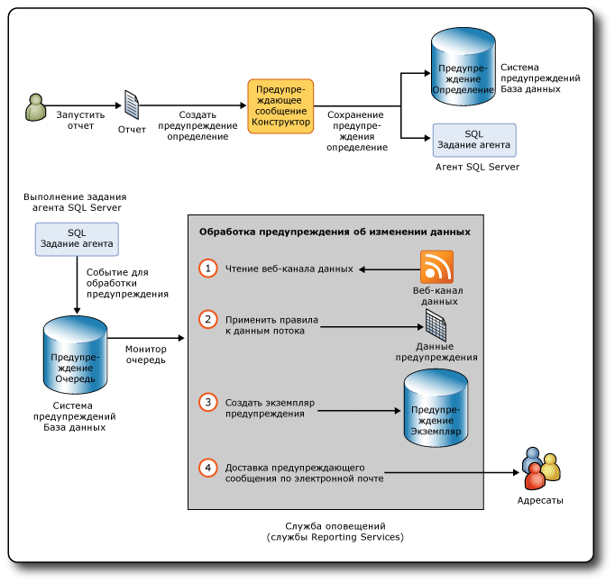

# Предупреждения об изменении данных в службах Reporting Services

[!INCLUDE [ssrs-appliesto](../includes/ssrs-appliesto.md)] [!INCLUDE [ssrs-appliesto-2016](../includes/ssrs-appliesto-2016.md)] [!INCLUDE [ssrs-appliesto-not-2017](../includes/ssrs-appliesto-not-2017.md)] [!INCLUDE[ssrs-appliesto-sharepoint-2013-2016i](../includes/ssrs-appliesto-sharepoint-2013-2016.md)] [!INCLUDE [ssrs-appliesto-not-pbirs](../includes/ssrs-appliesto-not-pbirs.md)]

[!INCLUDE [ssrs-previous-versions](../includes/ssrs-previous-versions.md)]

SQL Server Reporting Services — это управляемое данными решение, информирующее пользователей об изменении данных отчета, которые представляют для них непосредственный интерес. Использование предупреждений об изменении данных позволяет воздержаться от поиска данных — данные будут доставляться вам.

Предупреждения об изменении данных отправляются по электронной почте. В зависимости от степени важности информации можно задать частоту отправления предупреждающих сообщений или указать, что они должны отправляться только при изменении результатов. Можно указать нескольких получателей электронных сообщений, что позволяет держать в курсе коллег, повышая эффективность совместной работы.

> [!NOTE]
> Интеграция служб Reporting Services с SharePoint больше не доступна после выхода SQL Server 2016.

##   Архитектура предупреждений об изменении данных и рабочий процесс

Далее перечислены ключевые задачи, связанные с предупреждениями об изменении данных в службах [!INCLUDE[ssRSnoversion](../includes/ssrsnoversion-md.md)] .

-   **Определение предупреждений об изменении данных и их сохранение** — вы запускаете отчет, создаете правила, определяющие интересующие вас значения данных, определяете шаблон повторения для отправки предупреждающих сообщений и указываете получателей предупреждений.  
  
-   **Запуск определений предупреждений об изменении данных** — служба предупреждений обрабатывает определения предупреждений в запланированное время, извлекает данные отчетов и создает экземпляры предупреждений об изменении данных на основе правил, заданных в определении предупреждения.  
  
-   **Доставка предупреждений об изменении данных получателям** — служба оповещений создает экземпляр предупреждения об изменении данных и отправляет предупреждающее сообщение получателям по электронной почте.  
  
 Кроме того, если вы являетесь владельцем предупреждения об изменении данных, вы можете просматривать сведения о своих предупреждениях, удалять и изменять созданные вами определения предупреждений. Каждое предупреждение имеет одного и только одного владельца — пользователя, который его создал.  
  
 Администраторы системы предупреждений и пользователи, обладающие разрешением на управление предупреждениями SharePoint, могут управлять предупреждениями об изменении данных на уровне сайта. Они могут просматривать списки предупреждений, относящиеся к каждому пользователю сайта, и удалять предупреждения.  
  
 [!INCLUDE[ssRSnoversion](../includes/ssrsnoversion-md.md)] отличаются от предупреждений SharePoint. Предупреждения SharePoint можно определить по документу любого типа, включая отчеты. Предупреждения SharePoint передаются при изменении документа. Например, при добавлении столбца к таблице в отчете. Предупреждения об изменении данных, напротив, отправляются, если данные, отображенные в отчете, выполняют условия в определении предупреждения. Правила обычно ссылаются на данные, отображаемые в отчете.  
  
 После создания предупреждений об изменении данных для отчетов у вас появляется возможность наблюдения за изменениями в данных отчета и отправки предупреждающих сообщений электронной почты в случае, если данные отчета удовлетворяют пользовательским правилам, определяющим, какие данные представляют интерес для вас и других пользователей, через интервалы, соответствующие потребностям вашей компании. Предупреждения об изменении данных также могут запускаться по требованию. При наличии разрешения SharePoint на создание предупреждений пользователь может создавать предупреждения по любому отчету, на просмотр которого он имеет разрешения. Один пользователь может создать несколько предупреждений для отчета. Несколько пользователей могут создавать одинаковые или разные предупреждения для одного и того же отчета. В целях согласованной работы с другими пользователями можно указать их в качестве получателей предупреждающих сообщений в определении предупреждения об изменении данных, созданном вами.  
  
 Следующая диаграмма показывает рабочий процесс создания и сохранения определения предупреждения об изменении данных, создания задания агента SQL Server для начала обработки экземпляра предупреждения об изменении данных и отправки по электронной почте одному или нескольким получателям сообщения, содержащего данные отчета, вызвавшие предупреждение.  
  
   
  
### Отчеты, поддерживаемые предупреждениями об изменении данных  
 Предупреждения об изменении данных могут быть созданы во всех профессиональных отчетах, написанных на языке определения отчета (язык RDL) и созданных в конструкторе отчетов или построителе отчетов. Отчеты, содержащие области данных, такие как таблицы и диаграммы, отчеты с вложенными отчетами и сложные отчеты с несколькими параллельными группами столбцов и вложенными областями данных. Единственными требованиями к отчетам являются присутствие как минимум одной области данных любого типа, а также присутствие источника данных отчета, настроенного на использование сохраненных учетных данных или на работу без учетных данных. Если отчет не содержит областей данных, для него нельзя создать предупреждение.  
  
 Не предусмотрена возможность создавать предупреждения об изменении данных применительно к отчетам, созданным с помощью [!INCLUDE[ssCrescent](../includes/sscrescent-md.md)].  
  
 При установке служб [!INCLUDE[ssRSnoversion](../includes/ssrsnoversion-md.md)] в собственном режиме или в режиме интеграции с SharePoint, а также при использовании автономной версии построителя отчетов можно сохранить отчеты на сервере отчетов, на локальном компьютере или в библиотеке SharePoint. Чтобы можно было создавать предупреждения об изменении данных для отчетов, отчеты необходимо сохранить или загрузить в библиотеку SharePoint. Это означает, что возможность создавать предупреждения для отчетов, сохраненных на сервере отчетов, работающем в собственном режиме или на локальном компьютере, отсутствует. Кроме того, нельзя создавать предупреждения, внедренные в пользовательские приложения.  
  
 [!INCLUDE[ssRSnoversion](../includes/ssrsnoversion-md.md)] поддерживают различные типы учетных данных в отчетах. Вы можете создавать предупреждения об изменении данных по отчетам с источником данных, настроенным на использование сохраненных учетных данных или без учетных данных. Нельзя создавать предупреждения для отчетов, настроенных на использование учетных данных встроенной безопасности или приглашения к вводу учетных данных. Отчет выполняется как часть обработки определения предупреждения, и при отсутствии учетных данных обработка оканчивается с ошибкой. Дополнительные сведения см. в следующих разделах:  
  
-   [Задание учетных данных и сведениях о соединении для источников данных отчета](../reporting-services/report-data/specify-credential-and-connection-information-for-report-data-sources.md)  
  
-   [Роли и разрешения (службы Reporting Services)](../reporting-services/security/roles-and-permissions-reporting-services.md)  
  
-   [Проверка подлинности с использованием сервера отчетов](../reporting-services/security/authentication-with-the-report-server.md)  
  
### Запуск отчетов  
 Первым шагом при создании определения предупреждения об изменении данных является выбор нужного отчета в библиотеке SharePoint, после чего производится запуск отчета. Если отчет не содержит данных при его запуске, то в это время создать предупреждение на его основе нельзя.  
  
 Если отчет параметризован, необходимо указать, какие значения параметров будут использоваться при запуске отчета. Значения параметров будут сохранены в определениях предупреждений об изменении данных, которые будут созданы для отчета. Значения используются при повторном запуске отчета в ходе обработки определения предупреждения об изменении данных. Если необходимо изменить значения параметров, следует повторно запустить отчет с этими значениями параметров и создать определение предупреждения для этой версии отчета.  
  
### Создание определений предупреждений об изменении данных  
 В функцию предупреждений об изменении данных служб [!INCLUDE[ssRSnoversion](../includes/ssrsnoversion-md.md)] включен конструктор предупреждений об изменении данных, который можно использовать для создания определений предупреждений об изменении данных.  
  
 Чтобы создать определение предупреждения об изменении данных, необходимо запустить отчет, а затем открыть конструктор предупреждения об изменении данных из меню **Действия** в средстве просмотра отчетов SharePoint. Формируются веб-каналы данных отчета и в таблице предварительного просмотра данных в конструкторе предупреждений отображаются первые 100 строк потока данных. Все веб-каналы данных из отчета кэшируются при условии, что работа ведется с определением предупреждения в конструкторе предупреждений об изменении данных. Кэширование позволяет быстро переключаться между веб-каналами данных. При повторном открытии определения предупреждения в конструкторе предупреждений об изменении данных происходит обновление веб-каналов данных.  
  
 Определения предупреждений об изменении данных состоят из правил и предложений, которым должны удовлетворять данные отчета для отправки предупреждающего сообщения, расписания, определяющего частоту отправки предупреждающих сообщений и (необязательно) даты запуска или остановки предупреждающих сообщений, сведений, например строки «Тема» и описания, включаемых в предупреждающее сообщение, а также получателей сообщений. После создания определения предупреждения оно сохраняется в базе данных предупреждений SQL Server.  
  
### Сохранение определений предупреждений об изменении данных и метаданных предупреждений  
 При установке служб [!INCLUDE[ssRSnoversion](../includes/ssrsnoversion-md.md)] в режиме интеграции с SharePoint будет автоматически создана база данных предупреждений SQL Server.  
  
 Определения предупреждений об изменении данных и метаданные предупреждений сохраняются в базе данных предупреждений. По умолчанию эта база данных называется ReportingServices\<GUID>_Alerting.  
  
 При сохранении определения предупреждения об изменении данных система предупреждений создает задание агента SQL Server для этого определения предупреждения. В задание включено расписание задания. Расписание основано на шаблоне повторения, определенном для определения предупреждения. Запуск этого задания инициирует обработку определения предупреждения об изменении данных.  
  
### Обработка определений предупреждений об изменении данных  
 Когда расписание задания агента SQL Server запускает обработку определения предупреждения, отчет запускается для обновления веб-каналов данных отчета. Служба предупреждений считывает данные веб-каналов и применяет правила, заданные в определении предупреждения об изменении данных применительно к значениям данных. Если обнаруживается соответствие правилам одного или нескольких значений, создается экземпляр предупреждения об изменении данных и предупреждающее сообщение с результатами предупреждения отправляется всем получателям по электронной почте. Результаты — это строки данных отчета, удовлетворяющие всем правилам на момент создания экземпляра предупреждения. Чтобы предотвратить отправку нескольких предупреждающих сообщений с одними и теми же результатами, можно указать, что сообщения должны отправляться только при изменении результатов. В этом случае экземпляр предупреждения создается или сохраняется в базу данных предупреждений, но предупреждающее сообщение не создается. При возникновении ошибки экземпляр предупреждения сохраняется в базе данных предупреждений, а предупреждающее сообщение с подробными сведениями об ошибке отправляется получателям. В подразделе о диагностике и ведении журналов, приведенном далее в этом разделе, приводятся дополнительные сведения о ведении журналов и разрешении проблем.  
  
### Отправка предупреждающих сообщений  
 Предупреждающее сообщение отправляется по электронной почте.  
  
 Строка **От:** содержит значение, предусмотренное в конфигурации модуля доставки по электронной почте служб [!INCLUDE[ssRSnoversion](../includes/ssrsnoversion-md.md)] . В строке **Кому:** содержится список получателей, указанных при создании предупреждения в конструкторе предупреждений об изменении данных.  
  
 Кроме строки темы электронного письма, которая задается в конструкторе предупреждений об изменении данных, предупреждающее сообщение содержит следующие сведения.  
  
-   Имя пользователя, создавшего определение предупреждения об изменении данных.  
  
-   Если в определение предупреждения включено описание, оно будет отображено в верхней части текста электронного письма.  
  
-   Результаты предупреждения состоят из строк в веб-канале данных отчета, удовлетворяющих правилам, заданным в определении предупреждения.  
  
-   Ссылка на отчет, на основе которого создано определение предупреждения.  
  
-   Правила в определении предупреждения.  
  
-   Параметры и значения, используемые для запуска отчета.  
  
-   Контекстуальные значения из элементов отчета, которые находятся вне областей данных отчета.  
  
 Если не удается создать экземпляр предупреждения об изменении данных или предупреждающего сообщения, то всем получателям будет отправлено сообщение об ошибке. Вместо результатов предупреждения в сообщение будет включено описание ошибки.  
  
 Дополнительные сведения см. в статье [Data Alert Messages](../reporting-services/data-alert-messages.md).  
  
##   Установка предупреждений об изменении данных  
 Функция предупреждений об изменении данных доступна только в случае, если службы [!INCLUDE[ssRSnoversion](../includes/ssrsnoversion-md.md)] установлены в режиме интеграции с SharePoint. При установке служб [!INCLUDE[ssRSnoversion](../includes/ssrsnoversion-md.md)] в режиме интеграции с SharePoint программа установки автоматически создает базу данных предупреждений, в которой хранятся определения предупреждений и метаданные предупреждений, и две страницы SharePoint для управления предупреждениями, а также добавляет конструктор предупреждений об изменении данных к сайту SharePoint. Для установки системы предупреждений не нужно выполнять каких-либо специальных действий.  
  
 Чтобы узнать больше об установке служб [!INCLUDE[ssRSnoversion](../includes/ssrsnoversion-md.md)] в режиме интеграции с SharePoint, включая общую службу [!INCLUDE[ssRSnoversion](../includes/ssrsnoversion-md.md)] , представленную в [!INCLUDE[ssSQL11](../includes/sssql11-md.md)] , а также приложение службы [!INCLUDE[ssRSnoversion](../includes/ssrsnoversion-md.md)] , которое необходимо создать и настроить, чтобы получить возможность использования функций [!INCLUDE[ssRSnoversion](../includes/ssrsnoversion-md.md)] , см. статью [Установка служб Reporting Services в режиме SharePoint для SharePoint 2010](./install-windows/install-the-first-report-server-in-sharepoint-mode.md) в библиотеке MSDN.  
  
 Как показано на приведенной выше диаграмме, предупреждения об изменении данных используют задания агента SQL Server. Чтобы можно было создавать задания, должен работать агент SQL Server. Агент SQL Server мог быть настроен для автоматического запуска при установке служб [!INCLUDE[ssRSnoversion](../includes/ssrsnoversion-md.md)]. Если это не было сделано, вы можете запустить агент SQL Server вручную. Дополнительные сведения см. в статьях [Настройка агента SQL Server](../ssms/agent/configure-sql-server-agent.md) и [Запуск, остановка, приостановка, возобновление и перезапуск компонента Database Engine, агента SQL и службы браузера SQL Server](../database-engine/configure-windows/start-stop-pause-resume-restart-sql-server-services.md).  
  
 Страницу **Подготовка подписок и предупреждений** в центре администрирования SharePoint можно использовать, чтобы узнать, выполняется ли агент SQL Server, а также чтобы создавать и загружать пользовательские скрипты [!INCLUDE[tsql](../includes/tsql-md.md)] , которые впоследствии запускаются для предоставления разрешений агенту SQL Server. С ее помощью также можно создавать скрипты [!INCLUDE[tsql](../includes/tsql-md.md)] с использованием PowerShell. Дополнительные сведения см. в разделе [Подготовка подписок и предупреждений для приложений служб SSRS](../reporting-services/install-windows/provision-subscriptions-and-alerts-for-ssrs-service-applications.md).  
  
##   Настройка предупреждений об изменении данных  
 Начиная с версии [!INCLUDE[ssSQL11](../includes/sssql11-md.md)] настройки для функций служб [!INCLUDE[ssRSnoversion](../includes/ssrsnoversion-md.md)] , включая предупреждения об изменении данных, распределяются между файлом конфигурации сервера отчетов (rsreportserver.config) и базой данных конфигурации SharePoint при установке служб [!INCLUDE[ssRSnoversion](../includes/ssrsnoversion-md.md)] в режиме интеграции с SharePoint. Если вы создаете приложение службы в ходе установки и настройки служб [!INCLUDE[ssRSnoversion](../includes/ssrsnoversion-md.md)], то будет автоматически создана база данных конфигурации SharePoint. Дополнительные сведения см. в разделах [Файл конфигурации RsReportServer.config](../reporting-services/report-server/rsreportserver-config-configuration-file.md) и [Файлы конфигурации служб Reporting Services](../reporting-services/report-server/reporting-services-configuration-files.md).  
  
 В настройки для предупреждений об изменении данных в службах [!INCLUDE[ssRSnoversion](../includes/ssrsnoversion-md.md)] входят интервалы очистки данных и метаданных предупреждений, а также число повторных попыток отправки предупреждений об изменении данных по электронной почте. Файл конфигурации и базу данных конфигурации можно настроить на использование других значений для настроек предупреждений об изменении данных.  
  
 Вы можете обновить файл конфигурации сервера отчетов напрямую. База данных конфигурации SharePoint обновляется с использованием командлетов Windows PowerShell.  
  
 В следующей таблице перечислены элементы конфигурации для предупреждений об изменении данных, их значения по умолчанию, описания и расположения.  
  
|Параметр|Значение по умолчанию|Описание|Расположение|  
|-------------|-------------------|-----------------|--------------|  
|AlertingCleanupCycleMinutes|20|Количество минут между запусками циклов очистки.|Файл конфигурации сервера отчетов|  
|AlertingExecutionLogCleanupMinutes|10 080|Количество минут, в течение которых хранятся записи в журнале выполнения.|Файл конфигурации сервера отчетов|  
|AlertingDataCleanupMinutes|360|Количество минут, в течение которых хранятся временные данные.|Файл конфигурации сервера отчетов|  
|AlertingMaxDataRetentionDays|180|Количество дней, по истечении которых происходит удаление метаданных выполнения предупреждений, экземпляров предупреждений и результатов выполнения.|Файл конфигурации сервера отчетов|  
|MaxRetries|3|Количество повторов обработки предупреждений об изменении данных.|База данных конфигурации службы|  
|SecondsBeforeRetry|900|Количество секунд ожидания перед каждой попыткой повтора.|База данных конфигурации службы|  
  
 По умолчанию параметры MaxRetries и SecondsBeforeRetry применяются ко всем событиям, запускаемым предупреждениями об изменении данных. Если необходимо осуществлять более гранулярное управление количеством попыток и временем ожидания, можно добавить элементы для любых обработчиков событий, в которых будут указаны другие значения параметров MaxRetries и SecondsBeforeRetry.  
  
### Обработчики событий и повторение попытки  
 Существуют следующие обработчики событий.  
  
|Обработчик событий|Описание|  
|-------------------|-----------------|  
|FireAlert|Вы нажимаете кнопку **Выполнить**  в диспетчере предупреждений об изменении данных, чтобы произвести немедленную обработку определения предупреждения.|  
|FireSchedule|Агент SQL Server запускает расписание задания для определения предупреждения.|  
|CreateSchedule|Вы создаете определение предупреждения об изменении данных; параллельно с этим создается расписание задания агента SQL Server на основе интервала частоты, заданного в определении отчета.|  
|UpdateSchedule|Вы обновляете интервал частоты для определения предупреждения об изменении данных; расписание задания агента SQL Server обновляется.|  
|DeleteSchedule|Вы удаляете определение предупреждения об изменении данных; задание агента SQL Server удаляется.|  
|GenerateAlert|Среда выполнения системы предупреждений обрабатывает веб-канал данных отчета, применяет правила, заданные в определении предупреждения об изменении данных, определяет, необходимо ли создать экземпляр предупреждения об изменении данных, и, при необходимости, создает его экземпляр.|  
|DeliverAlert|Среда выполнения создает предупреждающее сообщение и отправляет его всем получателям по электронной почте.|  
  
 В следующей таблице перечисляются обработчики событий и ситуации, в которых выполняется повторение попытки.  
  
|Категория ошибки /тип события|FireAlert|FireSchedule|CreateSchedule|UpdateSchedule|DeleteSchedule|GenerateAlert|DeliverAlert|  
|--------------------|--------|--------|----------------|-|--------|--------|--------|  
|Недостаточно памяти|X|X|X|X|X|X|X|  
|Прерывание потока|X|X|X|X|X|X|X|  
|Агент SQL Server не запущен|X||X|X|X|||  
|Нерегулярная. Главным образом из-за проблем с подключением, времени ожидания и блокировок.|X|X|X|X|X|X|X|  
|IOException|||||||X|  
|WebException|||||||X|  
|SocketException|||||||X|  
|SMTPException **(\*)**|||||||X|  
  
 **(\*)** Ошибки протокола SMTP, которые вызовут повторную попытку:  
  
-   SmtpStatusCode.ServiceNotAvailable  
  
-   SmtpStatusCode.MailboxBusy  
  
-   SmtpStatusCode.MailboxUnavailable  
  
###   Отключение предупреждений об изменении данных  
 Чтобы отключить функцию предупреждений об изменении данных, обновите раздел «Служба» файла конфигурации. В следующем примере показан раздел «Service» файла конфигурации.  
  
 `<Service>`  
  
 `<IsSchedulingService>True</IsSchedulingService>`  
  
 `<IsNotificationService>True</IsNotificationService>`  
  
 `<IsEventService>True</IsEventService>`  
  
 `<IsAlertingService>True</IsAlertingService>`  
  
 `...`  
  
 `</Service>`  
  
 Чтобы отключить систему предупреждений, измените значение True на False в элементе `<IsAlertingService>True</IsAlertingService>`.  
  
##   Разрешения для предупреждений об изменении данных  
 Чтобы можно было создавать предупреждения об изменении данных для отчетов, необходимо иметь разрешения на выполнение отчетов и создание предупреждений на сайте SharePoint. Дополнительные сведения о разрешениях для отчетов см. в следующих разделах:  
  
-   [Формирование веб-каналов данных из отчетов (построитель отчетов и службы SSRS)](../reporting-services/report-builder/generating-data-feeds-from-reports-report-builder-and-ssrs.md)  
  
-   [Задание разрешений для элементов сервера отчетов на сайте SharePoint (службы Reporting Services в режиме интеграции с SharePoint)](../reporting-services/security/set-permissions-for-report-server-items-on-a-sharepoint-site.md)  
  
 [!INCLUDE[ssRSnoversion](../includes/ssrsnoversion-md.md)] поддерживают два уровня разрешений: уровень информационных работников и уровень администраторов системы предупреждений. В следующей таблице перечислены соответствующие разрешения SharePoint и пользовательские задачи.  
  
|Тип пользователя|Разрешение SharePoint|Описание задачи|  
|---------------|---------------------------|----------------------|  
|Информационный работник|Просмотр элементов   Создание предупреждений|Просмотр элементов, таких как отчеты, и создание предупреждений об изменении данных в отчетах. Изменение и удаление предупреждений.|  
|Администратор службы предупреждений|Управление предупреждениями|Просмотр списка всех предупреждений об изменении данных, сохраненных на сайте SharePoint, и удаление предупреждений.|  
  
##   Диагностика и ведение журналов  
 Предупреждения об изменении данных предоставляют информационным работникам и администраторам несколько способов для отслеживания предупреждений и определения причин сбоев в работе системы предупреждений и позволяет администраторам использовать журналы для определения того, какие сообщения и кому были отправлены, каково количество отправленных экземпляров предупреждений и т. д.  
  
### Диспетчер предупреждений об изменении данных  
 Диспетчер предупреждений об изменении данных создает список определений предупреждений и сведений об ошибках, которые позволяют информационным работникам и администраторам системы предупреждений понять, почему произошел сбой. Некоторые общие причины сбоев:  
  
-   Изменился веб-канал данных отчета, и столбцы, используемые в правилах определения предупреждения об изменении данных, больше не включаются в поток данных.  
  
-   Разрешение на просмотр отчета отозвано.  
  
-   Изменился тип данных в источнике данных, и определение предупреждения больше не является допустимым.  
  
### Журналы  
 [!INCLUDE[ssRSnoversion](../includes/ssrsnoversion-md.md)] доступно несколько журналов, с помощью которых можно узнать больше об отчетах, выполняемых при обработке определений предупреждений об изменении данных, создаваемых экземплярах предупреждений, изменении данных и т. д. Три журнала являются особенно полезными: журнал выполнения системы предупреждений, журнал выполнения сервера отчетов и журнал трассировки сервера отчетов.  
  
 Дополнительные сведения о других журналах [!INCLUDE[ssRSnoversion](../includes/ssrsnoversion-md.md)] см. в разделе [Файлы и источники журналов служб Reporting Services](../reporting-services/report-server/reporting-services-log-files-and-sources.md).  
  
#### Журнал выполнения системы предупреждений  
 Служба среды выполнения системы предупреждений вносит записи в таблицу ExecutionLogView базы данных предупреждений. Можно выполнять запросы к этой таблице или выполнять следующие хранимые процедуры для получения более полных диагностических сведений о предупреждениях об изменении данных, сохраненных в базе данных предупреждений.  
  
-   ReadAlertData  
  
-   ReadAlertHistory  
  
-   ReadAlertInstances  
  
-   ReadEventHistory  
  
-   ReadFeedPollHistory  
  
-   ReadFeedPools  
  
-   ReadPollData  
  
-   ReadSentAlerts  
  
 Для выполнения хранимых процедур по расписанию можно использовать агент SQL Server. Дополнительные сведения см. в статье [SQL Server Agent](../ssms/agent/sql-server-agent.md).  
  
#### Журнал выполнения сервера отчетов  
 Отчеты выполняются для создания веб-каналов данных, на основе которых создаются определения предупреждений об изменении данных. Журнал выполнения сервера отчетов в базе данных сервера отчетов отслеживает сведения при каждом запуске отчета. Вы можете выполнить запрос к представлению ExecutionLog2 в базе данных для получения более подробной информации. Дополнительные сведения см. в разделе [Журнал выполнения сервера отчетов и представление ExecutionLog3](../reporting-services/report-server/report-server-executionlog-and-the-executionlog3-view.md).  
  
#### Журнал трассировки сервера отчетов  
 Журнал трассировки сервера отчетов содержит подробнейшие сведения об операциях службы сервера отчетов, включая операции, выполняемые веб-службой сервера отчетов и приложением фоновой обработки. Данные журнала трассировки могут оказаться полезными при отладке приложения, содержащего сервер отчетов, либо при изучении конкретной проблемы, зафиксированной в журнале событий или журнале выполнения. Дополнительные сведения см. в статье [Report Server Service Trace Log](../reporting-services/report-server/report-server-service-trace-log.md).  
  
##   Счетчики производительности  
 Предупреждения об изменении данных предоставляют свои собственные счетчики производительности. Все счетчики производительности, кроме одного, связаны с событием, входящим в состав службы среды выполнения системы предупреждений. Счетчик производительности, связанный с очередью событий, показывает длину очереди всех активных событий.  
  
|Событие или очередь событий|Счетчик производительности|  
|--------------------------|-------------------------|  
|ALERTINGQUEUESIZE|Система предупреждений: длина очереди событий|  
|FireAlert|Система предупреждений: события обрабатываются — FireAlert|  
|FireSchedule|Система предупреждений: события обрабатываются — FireSchedule|  
|CreateSchedule|Система предупреждений: события обрабатываются — CreateSchedule|  
|UpdateSchedule|Система предупреждений: события обрабатываются — UpdateSchedule|  
|DeleteSchedule|Система предупреждений: события обрабатываются — DeleteSchedule|  
|GenerateAlert|Система предупреждений: события обрабатываются — GenerateAlert|  
|DeliverAlert|Система предупреждений: события обрабатываются — DeliverAlert|  
  
 [!INCLUDE[ssRSnoversion](../includes/ssrsnoversion-md.md)] предоставляют счетчики производительности для других функций [!INCLUDE[ssRSnoversion](../includes/ssrsnoversion-md.md)] . Дополнительные сведения см. в разделах [Счетчики производительности для объектов производительности ReportServer:Service и ReportServerSharePoint:Service](../reporting-services/report-server/performance-counters-reportserver-service-performance-objects.md), [Счетчики производительности для объектов производительности веб-службы MSRS 2011 и службы Windows MSRS 2011 (собственный режим)](../reporting-services/report-server/performance-counters-msrs-2011-web-service-performance-objects.md) и [Счетчики производительности для объектов производительности веб-службы MSRS 2011 и службы Windows MSRS 2011 в режиме интеграции с SharePoint (режим интеграции с SharePoint)](../reporting-services/report-server/performance-counters-msrs-2011-sharepoint-mode-performance-objects.md).  
  
##   Поддержка TLS  
 [!INCLUDE[ssRSnoversion](../includes/ssrsnoversion-md.md)] могут использовать HTTP-службу SSL для установления зашифрованного соединения с сервером отчетов или сайтом SharePoint. Протокол TLS ранее назывался SSL.
  
 Служба среды выполнения системы предупреждений и пользовательский интерфейс предупреждений об изменении данных поддерживают службу TLS и работают схожим образом как при использовании TLS, так и при использовании HTTP. Однако существуют определенные малозаметные различия. Если определение предупреждения об изменении данных создается с использованием соединения по протоколу TLS, то в URL-адресе, ссылающемся на библиотеку SharePoint в предупреждающем сообщении, также будет использоваться протокол TLS. Соединение по протоколу TLS можно определить по наличию HTTPS (а не HTTP) в URL-адресе. Аналогично, если определение предупреждения об изменении данных было создано с использованием HTTP-соединения, в ссылке на сайт SharePoint также будет использоваться HTTP. Независимо от того, было ли определение предупреждения создано с использованием протокола TLS или HTTP, пользователи и администраторы системы предупреждений смогут использовать конструктор предупреждений об изменении данных или диспетчер предупреждений об изменении данных схожим образом. Если протокол (HTTP или TLS) изменяется за время между созданием определения предупреждения и его обновлением и повторным сохранением, то исходный протокол сохраняется и используется в URL-адресах ссылок.  
  
 При создании предупреждения об изменении данных на сайте SharePoint, настроенном на работу с TLS, и последующем отключении требования TLS предупреждение продолжит работать на сайте. В случае удаления сайта вместо него будет использоваться сайт зоны по умолчанию.  
  
##   Пользовательский интерфейс предупреждений об изменении данных  
 Функции предупреждения об изменении данных реализуют страницы SharePoint для управления предупреждениями и конструктор для создания и изменения определений предупреждений об изменении данных.  
  
-   **Конструктор предупреждений об изменении данных** , в котором можно создавать и изменять определения предупреждений об изменении данных. Дополнительные сведения см. в разделах [Конструктор предупреждений данных](../reporting-services/data-alert-designer.md), [Создание предупреждения данных в конструкторе предупреждений данных](../reporting-services/create-a-data-alert-in-data-alert-designer.md) и [Изменение предупреждения в конструкторе предупреждений](../reporting-services/edit-a-data-alert-in-alert-designer.md).  
  
-   **Диспетчер предупреждений об изменении данных** , в котором можно просматривать списки предупреждений, удалять предупреждения об изменении данных и открывать предупреждения для изменения. Диспетчер предупреждений об изменении данных доступен в двух версиях: версия для пользователей, позволяющая управлять собственными предупреждениями, и версия для администраторов, с помощью которой можно управлять предупреждениями пользователей сайта.  
  
     Дополнительные сведения об управлении собственными предупреждениями данных см. в разделах [Диспетчер предупреждений данных для пользователей SharePoint](../reporting-services/data-alert-manager-for-sharepoint-users.md) и [Управление предупреждениями данных в диспетчере предупреждений данных](../reporting-services/manage-my-data-alerts-in-data-alert-manager.md).  
  
     Дополнительные сведения об управлении всеми предупреждениями данных на сайте см. в разделах [Диспетчер предупреждений данных для оповещения администраторов](../reporting-services/data-alert-manager-for-alerting-administrators.md) и [Управление всеми предупреждениями данных на сайте SharePoint в диспетчере предупреждений данных](../reporting-services/manage-all-data-alerts-on-a-sharepoint-site-in-data-alert-manager.md)  
  
-   **Подготовка подписок и предупреждений об изменении данных** , в которой можно определить, могут ли службы Reporting Services использовать агент SQL Server для работы с предупреждениями об изменении данных и для загрузки скриптов, позволяющих осуществлять доступ к агенту SQL Server. Дополнительные сведения см. в разделе [Подготовка подписок и предупреждений для приложений служб SSRS](../reporting-services/install-windows/provision-subscriptions-and-alerts-for-ssrs-service-applications.md).  
  
##   Глобализация предупреждений об изменении данных  
 Запись в определенных скриптах, например арабском или иврите, производится справа налево. Предупреждения об изменении данных поддерживают запись скрипта справа налево и запись слева направо. Предупреждения об изменении данных определяют культуру и изменяют соответствующим образом внешний вид и поведение пользовательского интерфейса, а также макет предупреждающих сообщений. Язык и региональные параметры определяются исходя из региональных настроек операционной системы на компьютере пользователя. Культура сохраняется при каждом обновлении и сохранении определения предупреждения об изменении данных.  
  
 Культура определения предупреждения может повлиять на то, удовлетворяют ли данные определению предупреждения. Строковые сравнения наиболее подвержены влиянию правил, специфичных для культуры.  
  
 Культура определения предупреждения может повлиять на то, удовлетворяют ли данные отчета определению предупреждения. Обычно это происходит в строках. Например, если в определении оповещения используется язык и региональные параметры German, то правило, сравнивающее английскую букву o и немецкую букву ö, не будет удовлетворяться. В таком же определении предупреждения, в котором используется культура English, это правило будет удовлетворяться.  
  
 Форматирование данных также основывается на культуре определения предупреждения. Например, если в культуре в качестве символа десятичного разделителя используется точка, то будет отображено значение 45.67; если в культуре в качестве символа десятичного разделителя используется запятая, будет отображено 45,67.  
  
 Поддержка записи справа налево варьируется в зависимости от используемого пользовательского интерфейса предупреждений об изменении данных. Конструктор предупреждений об изменении данных поддерживает запись скрипта справа налево в текстовых полях, но макет конструктора не поддерживает запись справа налево. В макете используется запись слева направо, как и в других средствах. Если определение отчета было создано с ориентацией записи справа налево, а затем редактировалось в среде с ориентацией слева направо, то ориентация текста справа налево будет сохранена при сохранении определения отчета. Диспетчер предупреждений об изменении данных ведет себя так же, как страница SharePoint. В макете используется запись справа налево (Хм, ошибка в оригинале?), как и в других страницах SharePoint. В предупреждающих сообщениях, основанных на определениях предупреждений об изменении данных с записью справа налево, текст сообщений отображается с записью справа налево, а макет имеет запись слева направо.  
  
##   Связанные задачи  
  
-   [Сохранение отчета в библиотеке SharePoint (построитель отчетов)](../reporting-services/report-builder/save-a-report-to-a-sharepoint-library-report-builder.md)  
  
-   [Создание предупреждения данных в конструкторе предупреждений](../reporting-services/create-a-data-alert-in-data-alert-designer.md)  
  
-   [Изменение предупреждения в конструкторе предупреждений](../reporting-services/edit-a-data-alert-in-alert-designer.md)  
  
-   [Управление предупреждениями данных в диспетчере предупреждений данных](../reporting-services/manage-my-data-alerts-in-data-alert-manager.md)  
  
-   [Управление всеми предупреждениями на сайте SharePoint в диспетчере предупреждений данных](../reporting-services/manage-all-data-alerts-on-a-sharepoint-site-in-data-alert-manager.md)  
  
-   [Предоставление разрешений для пользователей и оповещение администраторов](../reporting-services/grant-permissions-to-users-and-alerting-administrators.md)  
  
## См. также:

[Конструктор предупреждений об изменении данных](../reporting-services/data-alert-designer.md)   
[Диспетчер предупреждений данных для оповещения администраторов](../reporting-services/data-alert-manager-for-alerting-administrators.md)   
[Диспетчер предупреждений данных для пользователей SharePoint](../reporting-services/data-alert-manager-for-sharepoint-users.md)  

Остались вопросы? [Посетите форум служб Reporting Services](https://go.microsoft.com/fwlink/?LinkId=620231).