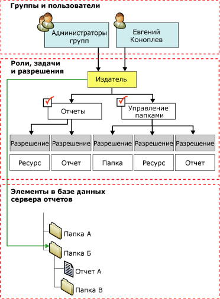

# Назначения ролей

В службах [!INCLUDE[ssRSnoversion](../../includes/ssrsnoversion-md.md)]*назначения ролей* определяют доступ к сохраненным элементам и к самому серверу отчетов. Назначение ролей состоит из следующих частей.  
  
- Защищаемый элемент, доступом к которому нужно управлять. Примеры защищаемых элементов — это папки, отчеты и ресурсы.  
  
- Учетная запись пользователя или группы, которая может быть проверена службой безопасности Windows или другим механизмом проверки подлинности.  
  
- Определения ролей устанавливают набор допустимых задач, куда относятся:
  - **Браузер**
  - **Диспетчер содержимого**
  - **Мои отчеты**
  - **Издатель**
  - **Построитель отчетов**
  - **Системный администратор**
  - **пользователь системы**

 Назначения ролей наследуются в иерархии папок и автоматически применяются к входящим в нее элементам:

- **Отчеты**
- **общие источники данных;**
- **Ресурсы**
- **вложенные папки**.

Можно заменить унаследованные параметры безопасности, определив назначения ролей для отдельных элементов. Все части иерархии папок должны быть защищены, по меньшей мере, одним назначением роли. Вы не можете создать незащищенный элемент или задать настройки так, чтобы получился незащищенный элемент.  
  
 Следующая диаграмма показывает назначение ролей, которое сопоставляет группу и отдельного пользователя с ролью **Издатель** для папки В.  
  
   
Диаграмма назначения ролей  
  
## Назначение ролей на уровне системы и на уровне элемента

 Безопасность служб [!INCLUDE[ssRSnoversion](../../includes/ssrsnoversion-md.md)] на основе ролей организована на нескольких уровнях.

- Назначение роли на уровне элемента управляет доступом к элементам в иерархии папок сервера отчетов, таким как:
  - reports
  - папки
  - модели отчетов.
  - общие источники данных
  - другие ресурсы.

- Назначения ролей на уровне элемента определяются при создании назначения роли отдельному элементу или корневой папке.

- Назначения системных ролей разрешают операции, применяемые к серверу в целом. Например, возможность управлять заданиями считается операцией уровня системы. Назначение системной роли не эквивалентно полномочиям системного администратора. Оно не предоставляет разрешений на полное управление сервером отчетов.

Назначение системной роли не дает доступа к элементам иерархии папок. Защищенность системы и элемента взаимно исключают друг друга. Иногда вам потребуется создавать назначения ролей одновременно на уровне системы и на уровне элемента, чтобы предоставить пользователю или группе нужный доступ к серверу отчетов.

## Пользователи и группы в назначении ролей

 Учетные записи пользователей и групп, указанные в назначениях ролей, — это доменные учетные записи. Сервер отчетов не создает и не изменяет, а ссылается на пользователей и группы домена [!INCLUDE[msCoName](../../includes/msconame-md.md)] Windows (или иной модели безопасности, если используется настраиваемый модуль безопасности).

Среди всех назначений ролей, применяемых к данному элементу, никакие два не могут указывать одного и того же пользователя или группу. Если учетная запись пользователя входит в учетную запись группы, и существуют назначения ролей для них обеих, пользователю будет доступен комбинированный набор задач для обоих назначений.

Когда пользователь добавляется в группу, которой уже назначена роль, необходимо перезагрузить службы IIS, чтобы новые назначения ролей вступили в силу.

## Предопределенное назначение ролей

 По умолчанию применяются предопределенные назначения ролей, что позволяет локальным администраторам управлять сервером отчетов. Чтобы предоставить доступ другим пользователям, вы можете добавить дополнительные назначения ролей.

 Дополнительные сведения о стандартных назначениях ролей, обеспечивающих безопасность по умолчанию, см. в разделе [Стандартные роли](../../reporting-services/security/role-definitions-predefined-roles.md).  

## См. также:

 [Создание, удаление и изменение ролей (среда Management Studio)](../../reporting-services/security/role-definitions-create-delete-or-modify.md)

 [Изменение или удаление назначения ролей (веб-портал SSRS)](../../reporting-services/security/role-assignments-modify-or-delete.md)

 [Задание разрешений для элементов сервера отчетов на сайте SharePoint (службы Reporting Services в режиме интеграции с SharePoint)](../../reporting-services/security/set-permissions-for-report-server-items-on-a-sharepoint-site.md)

 [Предоставление разрешений на сервер отчетов в собственном режиме](../../reporting-services/security/granting-permissions-on-a-native-mode-report-server.md)  
