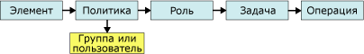

# Задачи и разрешения
  В службах [!INCLUDE[ssRSnoversion](../../includes/ssrsnoversion-md.md)]под *задачами* понимаются действия, которые может выполнить пользователь или администратор. Набор задач предопределен заранее. Создавать пользовательские задачи или изменять существующие задачи нельзя ни программным способом, ни с помощью инструментальных средств. Всего существует двадцать пять задач. Они охватывают весь набор операций, доступных в рамках безопасности, основанной на ролях. В качестве примеров задач можно привести «Просмотр отчетов», «Управление отчетами», «Управление свойствами сервера отчетов».  
  
 Каждая задача состоит из набора разрешений, которые также заранее определены. Например задача «Управление папками» содержит разрешения на создание и удаление папок, а также на просмотр и изменение их свойств. Для полноты описания задач для каждой из них в документацию включены разрешения. Прямой доступ к разрешениям или их указание в назначениях ролей невозможно. Разрешения предоставляются пользователям косвенным образом, через задачи, включенные в определения ролей.  
  
 Задача может быть выполнена только в том случае, если она является частью роли, а эта роль включена в назначение ролей. Таким образом, если задача «Просмотр моделей» не включена в роль либо если эта роль не включена в назначение ролей, пользователи не могут просматривать модели отчетов. Следующая диаграмма показывает, каким образом разрешения объединяются в задачи, а задачи — в роли, которые могут быть использованы для конкретных назначений ролей.  
  
   
Диаграмма разрешений и задач  
  
## Задачи системного уровня и задачи уровня элемента  
 Задачи делятся на две категории: задачи системного уровня и задачи уровня элемента. Роль может включать задачи только одной категории. В следующей таблице описана каждая из категорий задач.  
  
|Категория|Description|  
|--------------|-----------------|  
|[Задачи уровня элемента](../../reporting-services/security/item-level-tasks.md)|Действия, выполняемые над управляемыми сервером отчетов элементами (папками, отчетами, моделями отчетов и ресурсами).   Задачи уровня элемента выполняются в пространстве имен папок сервера отчетов. Для всех элементов, к которым доступ осуществляется через папки на сервере отчетов или по URL-адресу, защищены с помощью назначений ролей, включающих задачи уровня элемента.|  
|[Задачи системного уровня](../../reporting-services/security/system-level-tasks.md)|Действия, выполняемые на уровне системы (например, управление заданиями или общими расписаниями), которые могут использоваться со многими элементами. Задачи системного уровня выполняются вне пространства имен папок сервера отчетов.|  
  
## См. также  
 [Определение ролей](../../reporting-services/security/role-definitions.md)   
 [Стандартные роли](../../reporting-services/security/predefined-roles.md)   
 [Предоставление разрешений на сервер отчетов в собственном режиме](../../reporting-services/security/granting-permissions-on-a-native-mode-report-server.md)  
  
  