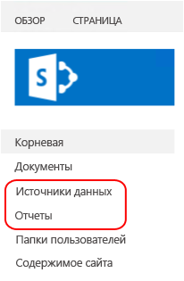

# <a name="sample-reporting-services-rsexe-script-to-copy-content-between-report-servers"></a>Образец скрипта программы rs.exe служб Reporting Services для копирования содержимого между серверами отчетов
  Этот раздел содержит описание и сам скрипт для [!INCLUDE[ssRSnoversion](../../includes/ssrsnoversion-md.md)] RSS, который копирует элементы и параметры содержимого с одного сервера отчетов служб [!INCLUDE[ssNoVersion](../../includes/ssnoversion-md.md)] [!INCLUDE[ssRSnoversion](../../includes/ssrsnoversion-md.md)] на другой с помощью программы **RS.exe** . Программа RS.exe установлена с помощью [!INCLUDE[ssRSnoversion](../../includes/ssrsnoversion-md.md)]как в собственном режиме, так и в режиме SharePoint. Скрипт копирует элементы служб [!INCLUDE[ssRSnoversion](../../includes/ssrsnoversion-md.md)] , например отчеты и подписки, с одного сервера на другой. Скрипт поддерживает как режим интеграции с SharePoint, так и собственный режим сервера отчетов.  
  
  
> **[!INCLUDE[applies](../../includes/applies-md.md)]** [!INCLUDE[ssRSnoversion](../../includes/ssrsnoversion-md.md)] Режим интеграции с SharePoint &#124; [!INCLUDE[ssRSnoversion](../../includes/ssrsnoversion-md.md)] Собственный режим 
  
## <a name="in-this-topic"></a>В этом разделе.  
  
-   [Загрузка скрипта ssrs_migration.rss](#bkmk_download_script)  
  
-   [Поддерживаемые сценарии](#bkmk_supported_scenarios)  
  
-   [Элементы и ресурсы, которые переносит скрипт](#bkmk_what_is_migrated)  
  
-   [Необходимые разрешения](#bkmk_required_permissions)  
  
-   [Использование скрипта](#bkmk_how_to_use_the_script)  
  
-   [Описание параметра](#bkmk_parameter_description)  
  
-   [Другие примеры](#bkmk_more_examples)  
  
    -   [С сервера отчетов в собственном режиме на сервер отчетов в собственном режиме](#bkmk_native_2_native)  
  
    -   [Из собственного режима в режим интеграции с SharePoint — корневой сайт](#bkmk_native_2_sharepoint_root)  
  
    -   [Из собственного режима в режим интеграции с SharePoint — семейство веб-сайтов бизнес-аналитики](#bkmk_native_2_sharepoint_with_site)  
  
    -   [С сервера отчетов в режиме интеграции с SharePoint на сервер отчетов в режиме интеграции с SharePoint — семейство веб-сайтов бизнес-аналитики](#bkmk_sharepoint_2_sharepoint)  
  
    -   [С сервера отчетов в собственном режиме на другой сервер отчетов в собственном режиме — виртуальная машина Windows Azure](#bkmk_native_to_native_Azure_vm)  
  
    -   [Сервер отчетов в режиме интеграции с SharePoint, семейство веб-сайтов бизнес-аналитики, на сервер отчетов в собственном режиме — виртуальная машина Windows Azure](#bkmk_sharepoint_site_to_native_Azure_vm)  
  
-   [Проверка](#bkmk_verification)  
  
-   [Устранение неполадок](#bkmk_troubleshoot)  
  
##  <a name="bkmk_download_script"></a> Загрузка скрипта ssrs_migration.rss  
 Скачайте скрипт с сайта CodePlex [Скрипт программы RS.exe служб Reporting Services переносит содержимое](https://azuresql.codeplex.com/releases/view/115207) в локальную папку. Дополнительную информацию смотрите в разделе [Использование скрипта](#bkmk_how_to_use_the_script) данной темы.  
  
##  <a name="bkmk_supported_scenarios"></a> Поддерживаемые сценарии  
 Скрипт поддерживает как режим интеграции с SharePoint, так и собственный режим сервера отчетов. Скрипт поддерживает следующие версии сервера отчетов.  
  
-   [!INCLUDE[ssSQL15](../../includes/sssql15-md.md)]  
  
-   [!INCLUDE[ssSQL14](../../includes/sssql14-md.md)]  
  
-   [!INCLUDE[ssSQL11](../../includes/sssql11-md.md)]  
  
-   [!INCLUDE[ssKilimanjaro](../../includes/sskilimanjaro-md.md)]  
  
 Скрипт может копировать содержимое между серверами отчетов, работающих в одном или разных режимах. Например, можно запустить скрипт, чтобы скопировать содержимое с сервера отчетов [!INCLUDE[ssKilimanjaro](../../includes/sskilimanjaro-md.md)] , работающего в собственном режиме, на сервер отчетов [!INCLUDE[ssSQL11SP1](../../includes/sssql11sp1-md.md)] в режиме интеграции с SharePoint. Можно запустить скрипт с любого сервера, на котором установлена программа RS.exe. Например, в таком развертывании можно сделать следующее.  
  
-   Запустите RS.exe и скрипт **НА** сервере A.  
  
-   Скопировать содержимое **С** сервера В.  
  
-   **НА** сервер С  
  
|Имя сервера|Режим сервера отчетов|  
|-----------------|------------------------|  
|Сервер А|Собственный|  
|сервера В.|SharePoint|  
|сервер С|SharePoint|  
  
 Дополнительные сведения о программе RS.exe см. в разделе [Служебная программа RS.exe (SSRS)](../../reporting-services/tools/rs-exe-utility-ssrs.md).  
  
###  <a name="bkmk_what_is_migrated"></a> Элементы и ресурсы, которые переносит скрипт  
 Скрипт не перезаписывает существующие элементы содержимого с такими же именами.  Если скрипт выявляет на целевом сервере элементы с такими же именами, как на исходном сервере, появятся сообщения об ошибке для отдельных элементов, при этом скрипт продолжит работу. В следующей таблице перечислены типы содержимого и ресурсов, которые скрипт может перенести в целевой режим сервера отчетов.  
  
|Элемент|Перенесено|SharePoint|Description|  
|----------|--------------|----------------|-----------------|  
|паролей|**Нет**|**Нет**|Пароли **НЕ** переносятся. После переноса элементов содержимого обновите учетные данные на целевом сервере. Например, источники данных с сохраненными учетными данными.|  
|Мои отчеты|**Нет**|**Нет**|Работа функции «Мои отчеты» в собственном режиме основана на именах входа конкретных пользователей, поэтому служба скриптов не имеет доступа к содержимому папки «Мои отчеты» для пользователей, не указанных параметром **–u** , который используется для запуска скрипта RSS. Кроме того, папка «Мои отчеты» не является компонентом служб [!INCLUDE[ssRSnoversion](../../includes/ssrsnoversion-md.md)] в режиме интеграции с SharePoint, и элементы в папках нельзя копировать в среду SharePoint. Поэтому скрипт не копирует элементы отчета из папок «Мои отчеты» на исходном сервере отчетов, работающем в собственном режиме.<br /><br /> Чтобы перенести содержимое папки «Мои отчеты» с помощью этого скрипта, выполните следующие действия.<br /><br /> 1.  Создайте новую папку в диспетчере отчетов. Также можно создать папки или вложенные папки для каждого пользователя.<br />2.  Войдите в систему в качестве одного из пользователей, у которого есть папка «Мои отчеты».<br />3.  В диспетчере отчетов выберите папку **Мои отчеты**.<br />4.  Выберите представление **Подробности** для папки.<br />5.  Выберите каждый отчет, который следует скопировать.<br />6.  Нажмите кнопку **Переместить** на панели инструментов диспетчера отчетов.<br />7.  Выберите нужную папку назначения.<br />8.  Повторите шаги 2–7 для каждого пользователя.<br />9. Выполните скрипт.|  
|Журнал|**Нет**|**Нет**||  
|Параметры журнала|Да|Да|Параметры журнала переносятся, в то время как данные журнала НЕТ.|  
|Расписания|да|да|Чтобы перенести расписания, агент SQL Server должен быть запущен на целевом сервере. Если агент SQL Server не запущен на целевом объекте, появится сообщение об ошибке следующего вида:<br /><br /> `Migrating schedules: 1 items found. Migrating schedule: theMondaySchedule ... FAILURE:  The SQL Agent service is not running. This operation requires the SQL Agent service. ---> Microsoft.ReportingServices.Diagnostics.Utilities.SchedulerNotResponding Exception: The SQL Agent service is not running. This operation requires the SQL Agent service.`|  
|Роли и системные политики|Да|Да|По умолчанию скрипт не копирует пользовательскую схему разрешений с одного сервера на другой. По умолчанию элементы копируются на целевой сервер, при этом флагу inherit parent permissions задается значение TRUE. Если нужно, чтобы скрипт скопировал разрешения для отдельных элементов, воспользуйтесь переключателем SECURITY.<br /><br /> Если исходный и целевой серверы **работают в разных режимах сервера отчетов**, например выполняется перенос из собственного режима в режим интеграции с SharePoint, и используется выключатель SECURITY, скрипт попытается сопоставить роли и группы по умолчанию на основе сравнения, приведенного в следующем разделе [Compare Roles and Tasks in Reporting Services to SharePoint Groups and Permissions](../../reporting-services/security/reporting-services-roles-tasks-vs-sharepoint-groups-permissions.md). Пользовательские роли и группы не будут скопированы на целевой сервер.<br /><br /> Если скрипт копирует между серверами, **которые работают в одном режиме**, и используется переключатель SECURITY, скрипт создает на целевом сервере новые роли (собственный режим) или группы (режим интеграции с SharePoint).<br /><br /> Если роль уже существует на целевом сервере, скрипт создаст сообщение об ошибке (см. пример ниже) и продолжит перенос других элементов. После завершения работы скрипта убедитесь, что роли на целевом сервере настроены в соответствии с потребностями. Роли миграции: найдено 8 элементов.<br /><br /> `Migrating role: Browser ... FAILURE: The role 'Browser' already exists and cannot be created. ---> Microsoft.ReportingServices.Diagnostics.Utilities.RoleAlreadyExistsException: The role 'Browser' already exists and cannot be created.`<br /><br /> Дополнительные сведения см. в статье [Предоставление пользователям доступа к серверу отчетов (диспетчер отчетов)](../../reporting-services/security/grant-user-access-to-a-report-server-report-manager.md).<br /><br /> **Примечание.** Если пользователь существует на исходном сервере и отсутствует на целевом сервере, скрипт не сможет применить назначение ролей на целевом сервере (даже при использовании параметра SECURITY).|  
|Общий источник данных|Да|Да|Скрипт не перезаписывает существующие элементы на целевом сервере. Если элемент с таким же именем уже существует на целевом сервере, появится сообщение об ошибке следующего вида:<br /><br /> `Migrating DataSource: /Data Sources/Aworks2012_oltp ... FAILURE:The item '/Data Sources/Aworks2012_oltp' already exists. ---> Microsoft.ReportingServices.Diagnostics.Utilities.ItemAlreadyExistsException: The item '/Data Source s/Aworks2012_oltp' already exists.`<br /><br /> Учетные данные **НЕ** копируются как часть источника данных. После переноса элементов содержимого обновите учетные данные на целевом сервере.|  
|Общий набор данных|Да|Да||  
|Папка|Да|Да|Скрипт не перезаписывает существующие элементы на целевом сервере. Если элемент с таким же именем уже существует на целевом сервере, появится сообщение об ошибке следующего вида:<br /><br /> `Migrating Folder: /Reports ... FAILURE: The item '/Reports' already exists. ---> Microsoft.ReportingServices.Diagnostics.Utilities.ItemAlreadyExistsException: The item '/Reports' already exists.`|  
|Отчет|Да|Да|Скрипт не перезаписывает существующие элементы на целевом сервере. Если элемент с таким же именем уже существует на целевом сервере, появится сообщение об ошибке следующего вида:<br /><br /> `Migrating Report: /Reports/testThe item '/Reports/test' already exists. ---> Microsoft.ReportingServices.Diagnostics.Utilities.ItemAlreadyExistsException: The item '/Reports/test' already exists.`|  
|Параметры|Да|Да||  
|Подписки|Да|Да||  
|Параметры журнала|Да|Да|Параметры журнала переносятся, в то время как данные журнала НЕТ.|  
|параметры обработки|Да|Да||  
|параметры обновления кэша|Да|Да|Зависимые параметры переносятся в составе элемента каталога. Далее приводится пример скрипта, который переносит отчет (RDL-файл), и связанные параметры, например параметры обновления кэша.<br /><br /> — Параметры миграции для отчета TitleOnly.rdl: найдено 0 элементов.<br />— Миграция подписок для отчета TitleOnly.rdl: найден 1 элемент.<br />— Миграция подписки: сохранить в \\\server\public\savedreports как TitleOnly… УСПЕШНОЕ ЗАВЕРШЕНИЕ<br />— Миграция параметров журнала для отчета TitleOnly.rdl… УСПЕШНОЕ ЗАВЕРШЕНИЕ<br />— Миграция параметров обработки для отчета TitleOnly.rdl… Найдено 0 элементов.<br />— Миграция параметров обновления кэша для отчета TitleOnly.rdl… УСПЕШНОЕ ЗАВЕРШЕНИЕ<br />— Миграция планов обновления кэша для отчета TitleOnly.rdl: найден 1 элемент.<br />— Миграция плана обновления кэша titleonly_refresh735amM2F… УСПЕШНОЕ ЗАВЕРШЕНИЕ|  
|Планы обновления кэша|Да|Да||  
|Изображения|Да|Да||  
|Элементы отчета|Да|Да||  
  
##  <a name="bkmk_required_permissions"></a> Необходимые разрешения  
 Разрешения, необходимые для чтения и записи элементов и ресурсов, разные для разных методов, используемых в скрипте. В следующей таблице перечислены методы, используемые для каждого элемента или ресурса, и ссылки на соответствующее содержимое. Переходите к отдельным разделам, в которых приведены необходимые разрешения. Например, обязательные требования для метода ListChildren следующие:  
  
-   **Обязательные разрешения для собственного режима:** свойства ReadProperties для элемента  
  
-   **Обязательные разрешения в режиме SharePoint:** ViewListItems  
  
|Элемент или ресурс|Source|Назначение|  
|----------------------|------------|------------|  
|Элементы каталога|<xref:ReportService2010.ReportingService2010.ListChildren%2A><br /><br /> <xref:ReportService2010.ReportingService2010.GetProperties%2A><br /><br /> <xref:ReportService2010.ReportingService2010.GetItemDataSources%2A><br /><br /> <xref:ReportService2010.ReportingService2010.GetItemReferences%2A><br /><br /> <xref:ReportService2010.ReportingService2010.GetDataSourceContents%2A><br /><br /> <xref:ReportService2010.ReportingService2010.GetItemLink%2A>|<xref:ReportService2010.ReportingService2010.CreateCatalogItem%2A><br /><br /> <xref:ReportService2010.ReportingService2010.SetItemDataSources%2A><br /><br /> <xref:ReportService2010.ReportingService2010.GetItemReferences%2A><br /><br /> <xref:ReportService2010.ReportingService2010.CreateDataSource%2A><br /><br /> <xref:ReportService2010.ReportingService2010.CreateLinkedItem%2A><br /><br /> <xref:ReportService2010.ReportingService2010.CreateFolder%2A>|  
|Роль|<xref:ReportService2010.ReportingService2010.ListRoles%2A><br /><br /> <xref:ReportService2010.ReportingService2010.GetRoleProperties%2A>|<xref:ReportService2010.ReportingService2010.CreateRole%2A>|  
|Системная политика|<xref:ReportService2010.ReportingService2010.GetSystemPolicies%2A>|<xref:ReportService2010.ReportingService2010.SetSystemPolicies%2A>|  
|Расписание|<xref:ReportService2010.ReportingService2010.ListSchedules%2A>|<xref:ReportService2010.ReportingService2010.CreateSchedule%2A>|  
|Подписка|<xref:ReportService2010.ReportingService2010.ListSubscriptions%2A><br /><br /> <xref:ReportService2010.ReportingService2010.GetSubscriptionProperties%2A><br /><br /> <xref:ReportService2010.ReportingService2010.GetDataDrivenSubscriptionProperties%2A>|<xref:ReportService2010.ReportingService2010.CreateSubscription%2A><br /><br /> <xref:ReportService2010.ReportingService2010.CreateDataDrivenSubscription%2A>|  
|План обновления кэша|<xref:ReportService2010.ReportingService2010.ListCacheRefreshPlans%2A><br /><br /> <xref:ReportService2010.ReportingService2010.GetCacheRefreshPlanProperties%2A>|<xref:ReportService2010.ReportingService2010.CreateCacheRefreshPlan%2A>|  
|Параметры|<xref:ReportService2010.ReportingService2010.GetItemParameters%2A>|<xref:ReportService2010.ReportingService2010.SetItemParameters%2A>|  
|Параметры выполнения|<xref:ReportService2010.ReportingService2010.GetExecutionOptions%2A>|<xref:ReportService2010.ReportingService2010.SetExecutionOptions%2A>|  
|Параметры кэша|<xref:ReportService2010.ReportingService2010.GetCacheOptions%2A>|<xref:ReportService2010.ReportingService2010.SetCacheOptions%2A>|  
|Параметры журнала|<xref:ReportService2010.ReportingService2010.GetItemHistoryOptions%2A>|<xref:ReportService2010.ReportingService2010.SetItemHistoryOptions%2A>|  
|Политика элемента|<xref:ReportService2010.ReportingService2010.GetPolicies%2A>|<xref:ReportService2010.ReportingService2010.SetPolicies%2A>|  
  
 Дополнительные сведения см. в разделе [Сравнение ролей и задач служб Reporting Services с группами и разрешениями SharePoint](../../reporting-services/security/reporting-services-roles-tasks-vs-sharepoint-groups-permissions.md).  
  
##  <a name="bkmk_how_to_use_the_script"></a> Использование скрипта  
  
1.  Загрузите файл скрипта в локальную папку, например **c:\rss\ssrs_migration.rss**.  
  
2.  Откройте командную строку **с правами администратора**.  
  
3.  Перейдите к папке, содержащей файл ssrs_migration.rss.  
  
4.  Выполните команду с параметрами, соответствующими сценарию.  
  
 **Простой пример, из сервера отчетов в собственном режиме на сервер отчетов в собственном режиме.**  
  
 В следующем примере выполняется миграция содержимого с **Sourceserver** в собственном режиме на **Targetserver**в собственном режиме.  
  
 `rs.exe -i ssrs_migration.rss -e Mgmt2010 -s http://SourceServer/ReportServer -u Domain\User -p password -v ts="http://TargetServer/reportserver" -v tu="Domain\Userser" -v tp="password"`  
  
 **Заметки по использованию.**  
  
-   Скрипт выполняется в два шага.  
  
     Первый шаг — это аудит, чтобы получить список элементов для переноса, и второй шаг — сам перенос.  
  
     Вы можете **отменить сценарий после шага** один, если вы хотите увидеть возможный перенос списка или если вы хотите изменить параметры. Зависимые параметры не указываются на первом шаге. Например, не перечисляются параметры кэша отчета, а только сам отчет.  
  
    > [!TIP]  
    >  Если нужно просто провести аудит на одном сервере, используйте один сервер в качестве источника и целевого сервера и отмените все шаги после первого  
  
     Хорошее применение данных аудита, получаемых после выполнения первого шага, — просмотреть существующие роли как на исходном, так и на целевом серверах, работающих в собственном режиме. Ниже приводится пример списка аудита, полученного после первого шага. Обратите внимание, что список содержит "роли" раздела, так как был использован переключатель -v security="True".  
  
    -   `Retrieve and report the list of items that will be migrated. You can cancel the script after step 1 if you do not want to start the actual migration.`  
  
         `Retrieving roles:`  
  
         `Role: Browser`  
  
         `Role: Content Manager`  
  
         `Role: Model Item Browser`  
  
         `Retrieve and report the list of items that will be migrated. You can cancel the script after step 1 if you do not want to start the actual migration.`  
  
         `Retrieving roles:`  
  
         `Role: Browser`  
  
         `Role: Content Manager`  
  
         `Role: CustomRole`  
  
         `Role: Model Item Browser`  
  
         `Role: My Reports`  
  
         `Role: Publisher`  
  
         `Role: Report Builder`  
  
         `Role: System Administrator`  
  
         `Role: System User`  
  
         `Retrieving system policies:`  
  
         `Retrieving system policies:`  
  
         `System policy: BUILTIN\Administrators`  
  
         `System policy: domain\user1`  
  
         `System policy: domain\ueser2`  
  
         `Retrieving schedules:`  
  
         `Schedule: theMondaySchedule`  
  
         `Retrieving catalog items. This may take a while.`  
  
         `Folder: /Data Sources`  
  
         `DataSource: /Data Sources/Aworks2012_oltp`  
  
         `Folder: /images`  
  
         `Resource: /images/Boba Fett.png`  
  
         `Resource: /images/R2-D2.png`  
  
         `Folder: /Reports`  
  
         `Report: /Reports/products`  
  
         `Report: /Reports/test`  
  
         `Report: /Reports/TitleOnly`  
  
-   SOURCE_URL и TARGET_URL должны быть действительными URL-адресами серверов отчетов, которые указывают на исходный и целевой сервер отчетов служб [!INCLUDE[ssRSnoversion](../../includes/ssrsnoversion-md.md)] . В собственном режиме URL-адрес сервера отчетов выглядит следующим образом:  
  
    -   `http://servername/reportserver`  
  
     В режиме интеграции с SharePoint URL-адрес выглядит следующим образом:  
  
    -   `http://servername/_vti_bin/reportserver`  
  
-   Виртуальная структура папок, представленная пользователю в режиме интеграции с SharePoint, может отличаться от базовой. Откройте в браузере `http://servername/_vti_bin/reportserver` или `http://servername/sites/site_name/_vti_bin/reportserver` , чтобы увидеть физическую структуру папок. Это позволит задать имя, отличное от «/», для исходной и целевой папок на сервере в режиме интеграции с SharePoint.  
  
-   Пароли не переносятся, их нужно вводить повторно, например для источников данных с сохраненными учетными данными.  
  
##  <a name="bkmk_parameter_description"></a> Описание параметра  
  
|Параметр|Description|Обязательно|  
|---------------|-----------------|--------------|  
|**-s** Source_URL|URL-адрес исходного сервера отчетов|Да|  
|**-u** Domain\password **–p** password|Учетные данные для исходного сервера.|OPTIONAL, если не указаны учетные данные, используются учетные данные по умолчанию.|  
|**-v st**="SITE"||OPTIONAL. Этот параметр используется только для серверов отчетов в режиме интеграции с SharePoint.|  
|**- v f**="SOURCEFOLDER"|Задайте «/», чтобы перенести все, либо «/folder/subfolder» для частичного переноса. Будет скопировано все из этой папки.|OPTIONAL, «/» по умолчанию.|  
|**-v ts**="TARGET_URL"|URL-адрес целевого сервера отчетов||  
|**-v tu**="domain\username" **-v tp**="password"|Учетные данные для целевого сервера.|OPTIONAL, если не указаны учетные данные, используются учетные данные по умолчанию. **Примечание.** На целевом сервере пользователь будет указан как "создатель" общего расписания, чья учетная запись "изменила" элементы отчета.|  
|**-v tst**="SITE"||OPTIONAL. Этот параметр используется только для серверов отчетов в режиме интеграции с SharePoint.|  
|**-v tf** ="TARGETFOLDER"|Задайте «/» для перехода в корневой уровень. Задайте «/folder/subfolder» для копирования в уже существующую папку. Все из папки SOURCEFOLDER будет скопировано в папку TARGETFOLDER.|OPTIONAL, «/» по умолчанию.|  
|**-v security**= "True/False"|Если значение равно FALSE, элементы целевого каталога унаследуют параметры безопасности в соответствии с параметрами целевой системы. Этот параметр рекомендуется использовать для миграций между серверами отчетов разных типов, например из собственного режима в режим интеграции с SharePoint. Если значение равно TRUE, скрипт пытается перенести параметры безопасности.|OPTIONAL, значение по умолчанию FALSE.|  
  
##  <a name="bkmk_more_examples"></a> Другие примеры  
  
###  <a name="bkmk_native_2_native"></a> С сервера отчетов в собственном режиме на сервер отчетов в собственном режиме  
 В следующем примере выполняется миграция содержимого с **Sourceserver** в собственном режиме на **Targetserver**в собственном режиме.  
  
```  
rs.exe -i ssrs_migration.rss -e Mgmt2010 -s http://SourceServer/ReportServer -u Domain\User -p password -v ts="http://TargetServer/reportserver" -v tu="Domain\Userser" -v tp="password"  
```  
  
 В следующем примере добавляется параметр безопасности:  
  
```  
rs.exe -i ssrs_migration.rss -e Mgmt2010 -s http://SourceServer/ReportServer -u Domain\User -p password -v ts="http://TargetServer/reportserver" -v tu="Domain\Userser" -v tp="password" -v security="True"  
```  
  
###  <a name="bkmk_native_2_sharepoint_root"></a> Из собственного режима в режим интеграции с SharePoint — корневой сайт  
 В следующем примере выполняется миграция содержимого с **SOURCESERVER** в собственном режиме на «корневой сайт» на сервере **TargetServer**в режиме интеграции с SharePoint. Папки «Отчеты» и «Источники данных» на сервере в собственном режиме переносятся в развертывание SharePoint как библиотеки.  
  
   
  
```  
rs.exe -i ssrs_migration.rss -e Mgmt2010 -s http://SourceServer/ReportServer -u Domain\User -p Password -v ts="http://TargetServer/_vti_bin/ReportServer" -v tu="Domain\User" -v tp="Password"  
```  
  
###  <a name="bkmk_native_2_sharepoint_with_site"></a> Из собственного режима в режим интеграции с SharePoint — семейство веб-сайтов бизнес-аналитики  
 В следующем примере выполняется миграция содержимого с сервера в собственном режиме на сервер в режиме интеграции с SharePoint, который содержит семейство веб-сайтов, сайтов бизнес-аналитики и библиотеку общих документов. Скрипт создает папки в целевой библиотеке документов. Например, скрипт создает папки «Отчеты» и «Источники данных» в целевой библиотеке документов.  
  
```  
rs.exe -i ssrs_migration.rss -e Mgmt2010 -s http://SourceServer/ReportServer -u Domain\User -p Password -v ts="http://TargetServer/sites/bi/_vti_bin/reportserver" -v tst="sites/bi" -v tf="Shared Documents" -v tu="Domain\User" -v tp="Password"  
```  
  
###  <a name="bkmk_sharepoint_2_sharepoint"></a> С сервера отчетов в режиме интеграции с SharePoint на сервер отчетов в режиме интеграции с SharePoint — семейство веб-сайтов бизнес-аналитики  
 В следующем примере выполняется миграция содержимого:  
  
-   С сервера **SourceServer** в режиме интеграции с SharePoint, содержащего семейство веб-сайтов бизнес-аналитики и общую библиотеку документов.  
  
-   На **TargetServer** в режиме интеграции с SharePoint, который содержит семейство веб-сайтов бизнес-аналитики и общую библиотеку документов.  
  
```  
rs.exe -i ssrs_migration.rss -e Mgmt2010 -s http://SourceServer/_vti_bin/reportserver -v st="sites/bi" -v f="Shared Documents" -u Domain\User1 -p Password -v ts="http://TargetServer/sites/bi/_vti_bin/reportserver" -v tst="sites/bi" -v tf="Shared Documents" -v tu="Domain\User" -v tp="Password"  
```  
  
###  <a name="bkmk_native_to_native_Azure_vm"></a> С сервера отчетов в собственном режиме на другой сервер отчетов в собственном режиме — виртуальная машина Windows Azure  
 В следующем примере выполняется миграция содержимого:  
  
-   С сервера отчетов **SourceServer**в собственном режиме.  
  
-   На сервер отчетов **TargetServer** в собственном режиме, работающий на виртуальной машине Windows Azure. Сервер **TargetServer** не входит в домен **SourceServer** , при этом **User2** является администратором на виртуальной машине Windows Azure, где работает **TargetServer**.  
  
```  
rs.exe -i ssrs_migration.rss -e Mgmt2010 -s http://SourceServer/ReportServer -u Domain\user1 -p Password -v ts="http://ssrsnativeazure.cloudapp.net/ReportServer" -v tu="user2" -v tp="Password2"  
```  
  
> [!TIP]  
>  Сведения по использованию Windows PowerShell для создания серверов отчетов [!INCLUDE[ssRSnoversion](../../includes/ssrsnoversion-md.md)] на виртуальных машинах Windows Azure см. в разделе [Использование PowerShell для создания виртуальной машины Windows Azure с сервером отчетов в собственном режиме](http://msdn.microsoft.com/library/dn449661.aspx).  
  
##  <a name="bkmk_sharepoint_site_to_native_Azure_vm"></a> Сервер отчетов в режиме интеграции с SharePoint, семейство веб-сайтов бизнес-аналитики, на сервер отчетов в собственном режиме — виртуальная машина Windows Azure  
 В следующем примере выполняется миграция содержимого:  
  
-   С сервера отчетов **SourceServer** в режиме интеграции с SharePoint, который содержит семейство веб-сайтов бизнес-аналитики и общую библиотеку документов.  
  
-   На сервер отчетов **TargetServer** в собственном режиме, работающий на виртуальной машине Windows Azure. Сервер **TargetServer** не входит в домен **SourceServer** , при этом **User2** является администратором на виртуальной машине Windows Azure, где работает **TargetServer**.  
  
```  
rs.exe -i ssrs_migration.rss -e Mgmt2010 -s http://uetesta02/_vti_bin/reportserver -u user1 -p Password -v ts="http://ssrsnativeazure.cloudapp.net/ReportServer" -v tu="user2" -v tp="Passowrd2"  
```  
  
##  <a name="bkmk_verification"></a> Проверка  
 Раздел содержит описание некоторых шагов, которые необходимо выполнить на целевом сервере, чтобы убедиться, что содержимое и политики были успешно перенесены.  
  
### <a name="schedules"></a>Расписания  
 Проверка расписаний на целевом сервере.  
  
 **Native Mode**  
  
1.  Перейдите в диспетчер отчетов на целевом сервере.  
  
2.  В верхнем меню щелкните **Параметры сайтов** .  
  
3.  На левой панели щелкните **Расписания** .  
  
 **Режим интеграции с SharePoint.**  
  
1.  Перейдите к **Параметры сайта**.  
  
2.  В группе **Службы Reporting Services** щелкните **Управление общими расписаниями**.  
  
### <a name="roles-and-groups"></a>Роли и группы  
 **Native Mode**  
  
1.  Откройте [!INCLUDE[ssManStudioFull](../../includes/ssmanstudiofull-md.md)] и установите соединение с сервером отчетов, работающим в собственном режиме.  
  
2.  В **обозревателе объектов** щелкните **Безопасность**.  
  
3.  Выберите **Роли**.  
  
##  <a name="bkmk_troubleshoot"></a> Устранение неполадок  
 Используйте флаг трассировки **–t** для получения дополнительных сведений. Например, если при выполнении скрипта появляется сообщение следующего вида:  
  
-   Не удалось подключиться к серверу: http://\<имя_сервера>/ReportServer/ReportService2010.asmx  
  
 Запустите скрипт еще раз с флагом **–t** , чтобы просмотреть сообщение следующего вида:  
  
-   System.Exception: не удалось подключиться к серверу: http://\<имя_сервера>/ReportServer/ReportService2010.asmx ---> System.Net.WebException: **Запрос завершился ошибкой с кодом состояния HTTP 401: отсутствуют права доступа**.   в System.Web.Services.Protocols.SoapHttpClientProtocol.ReadResponse (SoapClientMessage сообщение, ответ WebResponse, responseStream потока, логическое asyncCall) на System.Web.Services.Protocols.SoapHttpClientProtocol.Invoke (строка имя_метода Object [] parameters) в Microsoft.SqlServer.ReportingServices2010.ReportingService2010.IsSSLRequired() на Microsoft.ReportingServices.ScriptHost.Management2010Endpoint.PingService (URL-адрес строки String userName, строковый пароль Строка домена, время ожидания Int32) в Microsoft.ReportingServices.ScriptHost.ScriptHost.DetermineServerUrlSecurity()---конец трассировки стека внутреннего исключения---  
  
## <a name="see-also"></a>См. также:  
 [Служебная программа RS.exe (SSRS)](../../reporting-services/tools/rs-exe-utility-ssrs.md)   
 [Сравнение ролей и задач служб Reporting Services с группами и разрешениями SharePoint](../../reporting-services/security/reporting-services-roles-tasks-vs-sharepoint-groups-permissions.md)  
  
  
