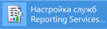

# Учебник. Инструкции по поиску и запуску средств служб Reporting Services (SSRS)

  В этом руководстве рассказывается о средствах, используемых для настройки сервера отчетов, управления содержимым и операциями сервера отчетов, а также создания и публикации отчетов с разбиением на страницы и мобильных отчетов [!INCLUDE[ssRSnoversion](../../includes/ssrsnoversion-md.md)] . Если вы уже знакомы с этими средствами, то можете перейти к другим руководствам, которые помогут научиться правильно использовать службы [!INCLUDE[ssRSnoversion](../../includes/ssrsnoversion-md.md)]. Другие учебные материалы см. в разделе [Учебники по службам Reporting Services (SSRS)](../../reporting-services/reporting-services-tutorials-ssrs.md).  
  
  
##   Использование диспетчера конфигурации служб Reporting Services (собственный режим)  
 Используйте диспетчер конфигурации для работы в основном режиме, чтобы сделать следующее.  
  
-   Укажите учетную запись службы.  
-   Создайте или обновите базу данных сервера отчетов.  
-   Измените свойства соединения.  
-   Укажите URL-адреса.  
-   Настройте ключи шифрования.  
-   Настройте автоматическую обработку отчетов и доставку отчетов по электронной почте.  
  
 **Установка** [!INCLUDE[ssRSnoversion](../../includes/ssrsnoversion-md.md)] устанавливается одновременно с установкой служб [!INCLUDE[ssRSnoversion](../../includes/ssrsnoversion-md.md)] в основном режиме. Дополнительные сведения см. в разделе [Установка сервера отчетов служб Reporting Services в собственном режиме](assetid:///8f25e6dc-b753-400e-9e9a-50f4f35bf6c4).  
  
### Запуск диспетчера конфигурации служб Reporting Services  
  
1.  На начальном экране Windows введите **reporting** и в результатах поиска **Приложения** выберите **Диспетчер конфигурации служб Reporting Services**.  
  
       
  
     **Or**  
  
     Нажмите кнопку **Пуск**, выберите пункт **Программы**, [!INCLUDE[ssCurrentUI](../../includes/sscurrentui-md.md)], **Средства настройки**, а затем **Диспетчер конфигурации служб Reporting Services**.  
  
     Появится диалоговое окно **Выбор экземпляра установки сервера отчетов** , в котором можно выбрать настраиваемый экземпляр сервера отчетов.  
  
2.  В поле **Имя сервера**укажите имя компьютера, на котором установлен экземпляр сервера отчетов. По умолчанию указывается имя локального компьютера, но можно ввести имя удаленного экземпляра [!INCLUDE[ssNoVersion](../../includes/ssnoversion-md.md)] .  
  
     Если указан удаленный компьютер, для установления соединения нажмите кнопку **Найти** . Сервер отчетов должен быть заранее настроен для удаленного администрирования. Дополнительные сведения о подготовке сервера отчетов для удаленного администрирования см. в разделе [Настройка сервера отчетов для удаленного администрирования](../../reporting-services/report-server/configure-a-report-server-for-remote-administration.md).  
  
3.  В разделе **В разделеstance Name**выберите экземпляр служб [!INCLUDE[ssNoVersion](../../includes/ssnoversion-md.md)] [!INCLUDE[ssRSnoversion](../../includes/ssrsnoversion-md.md)] , который необходимо настроить. В списке отображаются только экземпляры сервера отчетов SQL Server 2008 и более поздней версии. Более ранние версии служб [!INCLUDE[ssRSnoversion](../../includes/ssrsnoversion-md.md)]настраивать нельзя.  
  
4.  Нажмите кнопку **Соединить**.  
  
5.  Убедиться, что средство запущено, можно, сравнив полученные результаты со следующим изображением:  
  
       
  
 **Дальнейшие действия:** [Настройка и администрирование сервера отчетов (службы Reporting Services в собственном режиме)](../../reporting-services/report-server/configure-and-administer-a-report-server-ssrs-native-mode.md) и [Использование диспетчера конфигурации служб Reporting Services (собственный режим)](../../reporting-services/install-windows/reporting-services-configuration-manager-native-mode.md).  
  
##  Веб-портал (основной режим служб SSRS)  
 Используйте [Web portal (SSRS Native Mode)](../../reporting-services/web-portal-ssrs-native-mode.md) для задания разрешений, управления подписками и расписаниями, а также для работы с отчетами. Можно также использовать веб-портал для просмотра отчетов.  
  
 **Установка** . Веб-портал устанавливается при установке [!INCLUDE[ssRSnoversion](../../includes/ssrsnoversion-md.md)] в собственном режиме: [Установка сервера отчетов служб Reporting Services в собственном режиме](assetid:///8f25e6dc-b753-400e-9e9a-50f4f35bf6c4)  
  
 Для работы с веб-порталом необходимо иметь соответствующие разрешения (изначально разрешения на доступ к функциональным возможностям веб-порталом имеют только члены группы локальных администраторов). Веб-портал предоставляет различные страницы и параметры, в зависимости от назначений роли текущего пользователя. Пользователи, у которых нет разрешения, получат пустую страницу. Пользователи, которые имеют разрешения на просмотр отчетов, получат ссылки для открытия отчетов. Дополнительные сведения о разрешениях см. в разделе [Роли и разрешения &#40;службы Reporting Services&#41;](../../reporting-services/security/roles-and-permissions-reporting-services.md).  
  
### Запуск веб-портала  
  
1.  Откройте браузер. Сведения о поддерживаемых браузерах и версиях см. в разделе [Поддержка браузера для служб Reporting Services и Power View](../../reporting-services/browser-support-for-reporting-services-and-power-view.md).  
  
2.  В адресной строке браузера введите URL-адрес веб-портала. URL-адрес по умолчанию — `http://<serverName>/reports`. Можно использовать программу настройки служб Reporting Services для подтверждения имени сервера и URL-адреса. Дополнительные сведения о URL-адресах, используемых в [!INCLUDE[ssRSnoversion](../../includes/ssrsnoversion-md.md)], см. в разделе [Настройка URL-адресов сервера отчетов &#40;диспетчер конфигурации служб SSRS&#41;](../../reporting-services/install-windows/configure-report-server-urls-ssrs-configuration-manager.md).  
  
3.  Веб-портал откроется в окне браузера. Стартовой страницей является корневая папка. В зависимости от разрешений на стартовой странице могут быть видны дополнительные папки, гиперссылки на отчеты и файлы ресурсов. На панели инструментов расположены дополнительные кнопки и команды.  
  
4.  Если веб-портал запускается на локальном сервере отчетов, см. раздел [Настройка сервера отчетов, работающего в собственном режиме, для локального администрирования (SSRS)](../../reporting-services/report-server/configure-a-native-mode-report-server-for-local-administration-ssrs.md).  
   
##   Среда Management Studio  
 Администраторы сервера отчетов могут использовать среду [!INCLUDE[ssManStudio](../../includes/ssmanstudio-md.md)] для управления сервером отчетов наряду с другими серверными компонентами [!INCLUDE[ssNoVersion](../../includes/ssnoversion-md.md)] . Дополнительные сведения см. в разделе [Use SQL Server Management Studio](http://msdn.microsoft.com/library/f289e978-14ca-46ef-9e61-e1fe5fd593be).  
  
### Начало работы в среде SQL Server Management Studio  
  
1.  На начальном экране Windows введите **sql server** и в результатах поиска **Приложения** выберите **SQL Server Management Studio**.  
  
       
  
     **Or**  
  
     Нажмите кнопку **Пуск**, а затем последовательно выберите **Все программы**, [!INCLUDE[ssCurrentUI](../../includes/sscurrentui-md.md)]и **SQL Server Management Studio**. Откроется диалоговое окно **Соединение с сервером** .  
  
2.  Если диалоговое окно **Соединение с сервером** отсутствует, то в **обозревателе объектов**нажмите **Подключиться** и выберите **службы Reporting Services**.  
  
3.  В раскрывающемся списке **Тип сервера** выберите **Службы Reporting Services**. Если службы [!INCLUDE[ssRSnoversion](../../includes/ssrsnoversion-md.md)] не находятся на списке, значит, они не установлены.  
  
4.  В раскрывающемся списке **Имя сервера** выберите экземпляр сервера отчетов. В этом списке появятся локальные экземпляры. Можно также ввести имя удаленного экземпляра [!INCLUDE[ssNoVersion](../../includes/ssnoversion-md.md)] .  
  
5.  Нажмите кнопку **Соединить**. Предусмотрена возможность развернуть корневой узел, чтобы задать свойства сервера, изменить определения ролей или отключить те или иные компоненты сервера отчетов.  
  
##   SQL Server Data Tools с конструктором и мастером отчетов  
 Отчеты [!INCLUDE[ssNoVersion](../../includes/ssnoversion-md.md)] с разбиением на страницы можно создать с помощью двух разных средств — конструктора отчетов и [построителя отчетов](#bkmk_report_builder).  
  
 Конструктор отчетов доступен в [!INCLUDE[ssBIDevStudioFull](../../includes/ssbidevstudiofull-md.md)] в среде Visual Studio. Рабочая область конструирования в конструкторе отчетов содержит окна, мастера и меню на вкладках, используемые для доступа к функциям создания отчетов. Средство конструктора отчетов становится доступным при выборе шаблона проекта сервера отчетов или мастера сервера отчетов в средствах [!INCLUDE[ssBIDevStudioFull](../../includes/ssbidevstudiofull-md.md)]. Дополнительные сведения см. в разделе [Службы Reporting Services в SQL Server Data Tools (SSDT)](../../reporting-services/tools/reporting-services-in-sql-server-data-tools-ssdt.md). 
 
Скачать [SQL Server Data Tools](http://go.microsoft.com/fwlink/?LinkID=616714).  
  
### Запуск конструктора отчетов  
  
1.  Откройте **SQL Server Data Tools**.  
  
2.  В меню **Файл** укажите **Создать**, затем нажмите **Проект**.  
  
3.  В списке **Типы проектов** выберите значение **Проекты бизнес-аналитики**.  
  
4.  В списке **Шаблоны** выберите значение **Проект сервера отчетов**. На следующей диаграмме показано, как шаблоны проекта выглядят в диалоговом окне.  
  
       
  
5.  Введите имя и местоположение проекта или нажмите кнопку **Обзор** и выберите местоположение.  
  
6.  [!INCLUDE[clickOK](../../includes/clickok-md.md)] [!INCLUDE[ssBIDevStudioFull](../../includes/ssbidevstudiofull-md.md)] откроется на начальной странице [!INCLUDE[vsprvs](../../includes/vsprvs-md.md)] . В обозревателе решений содержатся категории для создания отчетов и источников данных. Эти категории можно использовать для создания новых отчетов и источников данных. При создании определения отчета появляются окна со вкладками. К окнам со вкладками относятся такие окна, как «Данные», «Макет» и «Предварительный просмотр».  
  
 Чтобы приступить к работе над первым отчетом, см. раздел [Создание простого табличного отчета &#40;учебник по службам SSRS&#41;](../../reporting-services/create-a-basic-table-report-ssrs-tutorial.md). Дополнительные сведения о конструкторах запросов, которые можно использовать в конструкторе отчетов, см. в разделе [Средства проектирования запросов (SSRS)](../../reporting-services/report-data/query-design-tools-ssrs.md).  
  
##   [!INCLUDE[ssRBnoversion](../../includes/ssrbnoversion-md.md)]  
 [Построитель отчетов в SQL Server 2016](../../reporting-services/report-builder/report-builder-in-sql-server-2016.md) — это автономное приложение, с помощью которого можно создавать отчеты с разбиением на страницы вне [!INCLUDE[ssNoVersion](../../includes/ssnoversion-md.md)]. Существующие отчеты можно настраивать и обновлять независимо от того, были ли они созданы в конструкторе отчетов или в предыдущих версиях [!INCLUDE[ssRBnoversion](../../includes/ssrbnoversion-md.md)]. Его можно установить с веб-портала [!INCLUDE[ssNoVersion](../../includes/ssnoversion-md.md)] или из Центра загрузки Майкрософт.  
  
 [Построитель отчетов можно скачать](http://go.microsoft.com/fwlink/?LinkID=219138) из Центра загрузки Майкрософт.  
  
### Запуск [!INCLUDE[ssRBnoversion](../../includes/ssrbnoversion-md.md)]  
  
1.  На веб-портале [!INCLUDE[ssNoVersion](../../includes/ssnoversion-md.md)] в меню  **Создание** выберите пункт **Paginated Report**(Отчет с разбиением на страницы).  
  
       
  
2.  Если [!INCLUDE[ssRBnoversion](../../includes/ssrbnoversion-md.md)] еще не установлен на этом компьютере, выберите пункт **Get [!INCLUDE[ssRBnoversion](../../includes/ssrbnoversion-md.md)]**.  
  
     Или  
  
     [Построитель отчетов можно скачать](http://go.microsoft.com/fwlink/?LinkID=219138) из Центра загрузки Майкрософт.  
  
3.  [!INCLUDE[ssRBnoversion](../../includes/ssrbnoversion-md.md)] , и можно будет создать или открыть отчет с разбиением на страницы.  
  
##   [!INCLUDE[SS_MobileReptPub_Long](../../includes/ss-mobilereptpub-long-md.md)]  
 [Издатель мобильных отчетов SQL Server](http://msdn.microsoft.com/library/e23cf095-cb9a-4631-ab46-10413d8e3a7c) позволяет создать мобильные отчеты, которые можно просмотреть на веб-портале [!INCLUDE[ssNoVersion](../../includes/ssnoversion-md.md)] и на мобильных устройствах, например iPad и iPhone.   Его можно установить с веб-портала [!INCLUDE[ssNoVersion](../../includes/ssnoversion-md.md)] или из Центра загрузки Майкрософт.  
  
 [Издатель мобильных отчетов для SQL Server можно скачать](http://go.microsoft.com/fwlink/?LinkID=733527) из Центра загрузки Майкрософт.  
  
### Запуск [!INCLUDE[SS_MobileReptPub_Short](../../includes/ss-mobilereptpub-short-md.md)]  
  
1.  На веб-портале [!INCLUDE[ssNoVersion](../../includes/ssnoversion-md.md)] в меню  **Создание** выберите пункт **Mobile Report**(Мобильный отчет).  
  
       
  
2.  Если [!INCLUDE[SS_MobileReptPub_Short](../../includes/ss-mobilereptpub-short-md.md)] еще не установлен на этом компьютере, выберите пункт **Get [!INCLUDE[SS_MobileReptPub_Short](../../includes/ss-mobilereptpub-short-md.md)]**.  
  
     Или  
  
     [Издатель мобильных отчетов для SQL Server можно скачать](http://go.microsoft.com/fwlink/?LinkID=733527) из Центра загрузки Майкрософт.  
  
3.  [!INCLUDE[SS_MobileReptPub_Short](../../includes/ss-mobilereptpub-short-md.md)] , и можно будет создать или открыть мобильный отчет.  

## Следующие шаги

[Издатель мобильных отчетов для SQL Server можно скачать](http://go.microsoft.com/fwlink/?LinkID=733527)   
[Построитель отчетов можно скачать](http://go.microsoft.com/fwlink/?LinkID=219138)  
[Скачивание SQL Server Data Tools](http://go.microsoft.com/fwlink/?LinkID=616714) 
[Установка режима интеграции с SharePoint для служб Reporting Services](../../reporting-services/install-windows/install-reporting-services-sharepoint-mode.md)   
[Сервер отчетов служб Reporting Services](../../reporting-services/report-server-sharepoint/reporting-services-report-server.md)   
[Средства проектирования запросов](../../reporting-services/report-data/query-design-tools-ssrs.md)   
[Учебники по службам Reporting Services](../../reporting-services/reporting-services-tutorials-ssrs.md)  

Остались вопросы? [Посетите форум служб Reporting Services](http://go.microsoft.com/fwlink/?LinkId=620231).
