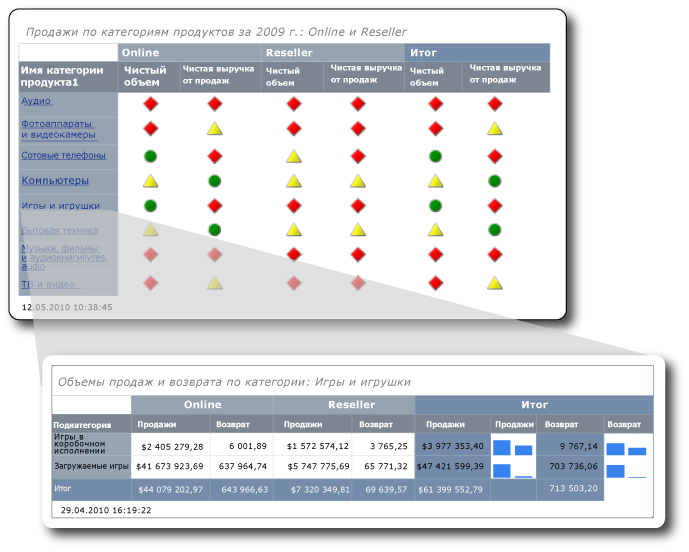

# <a name="tutorial-creating-drillthrough-and-main-reports-report-builder"></a>Руководство по Создание детализированных и главных отчетов (построитель отчетов)
В этом учебнике описывается создание двух типов отчетов [!INCLUDE[ssRSnoversion_md](../includes/ssrsnoversion-md.md)] с разбивкой на страницы: детализированного отчета и главного отчета. Образцы данных по продажам, использованные в этих отчетах, извлекаются из куба служб Analysis Services. 

На следующей иллюстрации показаны отчеты, которые будут созданы, а также то, как отображается значение поля "Игры и игрушки" главного отчета в заголовке детализированного отчета. Данные в детализированном отчете относятся к категории продуктов "Игры и игрушки".  
  
  
   
На изучение этого руководства потребуется примерно 30 минут.  
  
## <a name="requirements"></a>Требования  
В рамках этого учебника требуется доступ к кубу Contoso Sales как для детализированного, так и для главного отчета. Этот набор включает хранилище данных ContosoDW и базу данных OLAP Contoso_Retail. Создаваемые в данном учебнике отчеты извлекают данные из куба Contoso Sales. Базу данных OLAP Contoso_Retail можно скачать в [Центре загрузки Майкрософт](https://www.microsoft.com/download/details.aspx?id=18279). Необходимо скачать только файл ContosoBIdemoABF.exe. Он содержит базу данных OLAP.  
  
Второй файл, ContosoBIdemoBAK.exe, относится к хранилищу данных ContosoDW, которое не используется в данном учебнике.  
  
На веб-сайте приведены инструкции по извлечению и восстановлению файла резервной копии ContosoRetail.abf в базу данных Contoso_Retail OLAP.  

Необходимо иметь доступ к экземпляру служб [!INCLUDE[ssASnoversion](../includes/ssasnoversion-md.md)], где будет установлена база данных OLAP.  
    
Дополнительные сведения об общих требованиях см. в разделе [Предварительные условия для использования учебников (построитель отчетов)](../reporting-services/prerequisites-for-tutorials-report-builder.md).  
  
## <a name="1-create-a-drillthrough-report-from-the-table-or-matrix-wizard"></a><a name="DMatrixAndDataset"></a>1. Создание детализированного отчета с помощью мастера таблицы или матрицы  
Создайте в диалоговом окне "Приступая к работе" матричный отчет с помощью **мастера таблицы или матрицы**. Мастер поддерживает два режима работы: режим конструктора отчета и режим конструктора общего набора данных. В этом учебнике будет использоваться режим конструктора отчетов.  
  
#### <a name="to-create-a-new-report"></a>Создание нового отчета  
  
1.  [Запустите построитель отчетов](../reporting-services/report-builder/start-report-builder.md) с компьютера, веб-портала [!INCLUDE[ssRSnoversion_md](../includes/ssrsnoversion-md.md)] или сервера в режиме интеграции с SharePoint.  
  
    Откроется диалоговое окно **Создать отчет или набор данных** .  
  
    Если диалоговое окно **Новый отчет или набор данных** не появилось, в меню **Файл** выберите команду **Создать**.  
  
2.  Убедитесь, что на левой панели выбран **Новый отчет** .  
  
3.  Убедитесь в том, что на панели справа выбран **Мастер таблицы или матрицы** .  
  
## <a name="1a-specify-a-data-connection"></a><a name="DConnection"></a>1a. Задание подключения к данным  
Подключение к данным содержит сведения, необходимые для подключения к внешнему источнику данных, например к кубу служб Analysis Services или базе данных [!INCLUDE[ssNoVersion](../includes/ssnoversion-md.md)] . Чтобы указать подключение к данным, можно воспользоваться общим источником данных с сервера отчетов или создать внедренный источник данных, используемый только в этом отчете. В этом учебнике используется внедренный источник данных. Дополнительные сведения об использовании общих источников данных см. в разделе [Альтернативные способы создания подключения к данным (построитель отчетов)](../reporting-services/alternative-ways-to-get-a-data-connection-report-builder.md).  
  
#### <a name="to-create-an-embedded-data-source"></a>Создание внедренного источника данных  
  
1.  На странице **Выбор набора данных** выберите команду **Создать набор данных**, а затем нажмите кнопку **Далее**. Откроется страница **Выберите соединение с источником данных** .  
  
2.  Нажмите кнопку **Создать**. Откроется диалоговое окно **Свойства источника данных** .  
  
3.  В текстовом поле **Имя**введите имя источника данных: **Online and Reseller Sales Detail** .  
  
4.  Выберите в списке **Выберите тип соединения**пункт **Microsoft SQL Server Analysis Services**и нажмите кнопку **Создать**.  
  
5.  Убедитесь в том, что в поле **Источник данных**указано значение **Microsoft SQL Server Analysis Services (AdomdClient)** .  
  
6.  Введите в поле **Имя сервера**имя сервера, на котором установлен экземпляр служб Analysis Services.  
  
7.  Выберите в поле **Выберите или введите имя базы данных**куб Contoso.  
  
8.  [!INCLUDE[clickOK](../includes/clickok-md.md)]  
  
9. Убедитесь в том, что поле **Строка подключения** содержит строку в следующем формате:  
  
    ```  
    Data Source=<servername>; Initial Catalog = Contoso  
    ```  
  
    Элемент `<servername>` представляет имя экземпляра сервера [!INCLUDE[ssNoVersion](../includes/ssnoversion-md.md)] с установленными службами Analysis Services.  
  
10. Выберите **Тип учетных данных**.  
  
    > [!NOTE]  
    > В зависимости от настройки разрешений для источника данных может потребоваться изменить параметры проверки подлинности по умолчанию. Дополнительные сведения см. в разделах [Безопасность (построитель отчетов)](../reporting-services/report-builder/security-report-builder.md).  
  
11. [!INCLUDE[clickOK](../includes/clickok-md.md)]  
  
    Откроется страница **Выбор соединения с источником данных** .  
  
12. Нажмите кнопку **Проверить соединение**, чтобы проверить соединение с источником данных.  
  
    Отобразится сообщение **Соединение установлено успешно** .  
  
13. [!INCLUDE[clickOK](../includes/clickok-md.md)]  
  
14. Щелкните **Далее**.  
  
## <a name="1b-create-an-mdx-query"></a><a name="DMDXQuery"></a>1б. Создание запроса многомерных выражений  
В отчете можно использовать общий набор данных со стандартным запросом или создать внедренный набор данных только для этого отчета. В этом учебнике рассматривается создание внедренного набора данных.  
  
#### <a name="to-create-query-filters"></a>Создание фильтров запроса  
  
1.  На странице **Проектирование запроса** на панели "Метаданные" нажмите кнопку **(...)** .  
  
2.  В диалоговом окне **Выбор куба** выберите Sales и нажмите кнопку **ОК**.  
  
    > [!TIP]  
    > Если вы не хотите создавать запрос многомерных выражений вручную, щелкните значок , переключите конструктор запросов в режим "Запрос", вставьте в конструктор законченное многомерное выражение и перейдите к шагу 6 раздела [Создание набора данных](#DSkip).  
  
    ```  
    SELECT NON EMPTY { [Measures].[Sales Amount], [Measures].[Sales Return Amount] } ON COLUMNS, NON EMPTY { ([Channel].[Channel Name].[Channel Name].ALLMEMBERS * [Product].[Product Category Name].[Product Category Name].ALLMEMBERS * [Product].[Product Subcategory Name].[Product Subcategory Name].ALLMEMBERS ) } DIMENSION PROPERTIES MEMBER_CAPTION, MEMBER_UNIQUE_NAME ON ROWS FROM ( SELECT ( { [Date].[Calendar Year].&[2009] } ) ON COLUMNS FROM ( SELECT ( { [Sales Territory].[Sales Territory Group].&[North America] } ) ON COLUMNS FROM ( SELECT ( STRTOSET(\@ProductProductCategoryName, CONSTRAINED) ) ON COLUMNS FROM ( SELECT ( { [Channel].[Channel Name].&[2], [Channel].[Channel Name].&[4] } ) ON COLUMNS FROM [Sales])))) WHERE ( [Sales Territory].[Sales Territory Group].&[North America], [Date].[Calendar Year].&[2009] ) CELL PROPERTIES VALUE, BACK_COLOR, FORE_COLOR, FORMATTED_VALUE, FORMAT_STRING, FONT_NAME, FONT_SIZE, FONT_FLAGS  
    ```  
  
3.  Разверните на панели "Группа мер" узел "Канал" и перетащите "Имя канала" в столбец **Иерархия** на панели фильтра.  
  
    Имя размерности "Канал" автоматически добавляется в столбец **Размерность** . Не меняйте значения в столбцах **Размерность** и **Оператор** .  
  
4.  Чтобы открыть список **Критерий фильтра** , щелкните стрелку вниз в столбце **Критерий фильтра** .  
  
5.  В списке критериев фильтра разверните узел **Весь канал**, выберите **Online**, затем **Reseller**, после чего нажмите кнопку **ОК**.  
  
    Теперь запрос содержит фильтр, включающий только эти каналы: Online и Reseller.  
  
6.  Разверните размерность "Территория продаж", затем перетащите элемент "Группа территорий продаж" в столбец **Иерархия** ниже элемента **Имя канала**.  
  
7.  Откройте список **Критерий фильтра** , разверните узел **Территория продаж: все**, выберите элемент **Северная Америка**, а затем нажмите кнопку **ОК**.  
  
    Теперь запрос содержит фильтр, включающий только продажи в Северной Америке.  
  
8.  Разверните на панели "Группа мер" узел "Дата", затем перетащите "Календарный год" в столбец **Иерархия** на панели фильтра.  
  
    Имя размерности "Дата" автоматически добавляется в столбец **Размерность** . Не меняйте значения в столбцах **Размерность** и **Оператор** .  
  
9. Чтобы открыть список **Критерий фильтра** , щелкните стрелку вниз в столбце **Критерий фильтра** .  
  
10. В списке критериев фильтра разверните узел **Дата: все**, выберите элемент **Год 2009**и нажмите кнопку **ОК**.  
  
    Теперь запрос содержит фильтр, включающий только 2009 календарный год.  
  
#### <a name="to-create-the-parameter"></a>Создание параметра  
  
1.  Разверните размерность "Продукт", а затем перетащите элемент "Имя категории продуктов" в столбец **Иерархия** ниже элемента **Календарный год**.  
  
2.  Откройте список **Критерий фильтра** , выберите элемент **Все продукты**и нажмите кнопку **ОК**.  
  
3.  Установите флажок **Параметр** . Теперь запрос содержит параметр ProductProductCategoryName.  
  
    > [!NOTE]  
    > Параметр содержит имена категорий продуктов. Если щелкнуть имя категории продуктов в основном отчете, его имя передается в детализированный отчет с использованием данного параметра.  
  
### <a name="to-create-the-dataset"></a><a name="DSkip"></a>Создание набора данных  
  
1.  Из размерности "Канал" перетащите элемент "Имя канала" на панель данных.  
  
2.  Из размерности "Продукт" перетащите элемент "Имя категории продуктов" на панель данных, разместив его справа от элемента "Имя канала".  
  
3.  Из размерности "Продукт" перетащите элемент "Имя подкатегории продуктов" на панель данных, разместив его справа от элемента "Имя категории продуктов".  
  
4.  На панели "Метаданные" разверните узел **Мера**, а затем разверните узел "Продажи".  
  
5.  Перетащите меру "Объем продаж" на панель данных, разместив ее справа от элемента "Имя подкатегории продуктов".  
  
6.  На панели инструментов конструктора запросов нажмите кнопку **Выполнить (!)** .  
  
7.  Щелкните **Далее**.  
  
## <a name="1c-organize-data-into-groups"></a><a name="DLayout"></a>1в. Упорядочение данных по группам  
При выборе полей для группирования данных создается матрица со строками и столбцами, отображающими подробные и агрегированные данные.  
  
#### <a name="to-organize-data-into-groups"></a>Организация данных в группы  
  
1.  Щелкните **Конструктор**для переключения в режим конструктора.  
  
2.  На странице **Размещение полей** перетащите элемент Имя_подкатегории_продуктов в область **Группы строк**.  
  
    > [!NOTE]  
    > Пробелы в именах заменяются на символы подчеркивания (_). Например, "Имя категории продуктов" превращается в Имя_категории_продуктов.  
  
3.  Перетащите элемент Имя_канала в область **Группы столбцов**.  
  
4.  Перетащите элемент Объем_продаж в область **Значения**.  
  
    Объем_продаж автоматически вычисляется с помощью функции Sum, используемой по умолчанию для статистических вычислений. Значение равно `[Sum(Sales_Amount)]`.  
  
    Для просмотра других доступных агрегатных функций откройте раскрывающийся список (не меняйте агрегатную функцию).  
  
5.  Перетащите элемент Выручка_от_продаж в область **Значения**, разместив его под элементом `[Sum(Sales_Amount)]`.  
  
    Шаги 4 и 5 задают данные, отображаемые в матрице.  
  
6.  Щелкните **Далее**.  
  
## <a name="1d-add-subtotals-and-totals"></a><a name="DTotals"></a>1г. Добавление подытогов и итогов  
После создания групп можно добавить и отформатировать строки, в которых будут отображаться значения агрегатной обработки полей. Можно также выбрать режим отображения данных: показывать все или позволить пользователю сворачивать и разворачивать сгруппированные данные интерактивно.  
  
#### <a name="to-add-subtotals-and-totals"></a>Добавление подытогов и итогов  
  
1.  На странице **Выбор макета** в области **Параметры**убедитесь в том, что выбран параметр **Показать подытоги и общие итоги** .  
  
    На панели просмотра в мастере отображается матрица с четырьмя строками.  
  
2.  Щелкните **Далее**.  
  
2.  Нажмите кнопку **Готово**.  
  
    Таблица добавляется в область конструктора.  
  
3.  Нажмите кнопку **Выполнить (!)** , чтобы выполнить предварительный просмотр отчета.  
  
## <a name="2-format-data-as-currency"></a><a name="DFormat"></a>2. Форматирование данных в денежном формате  
Добавьте форматирование в денежном формате для полей объема продаж в детализированном отчете.  
  
#### <a name="to-format-data-as-currency"></a>Форматирование данных в денежном формате  
  
1.  Щелкните **Конструктор**для переключения в режим конструктора.  
  
2.  Чтобы выбрать и отформатировать несколько ячеек одновременно, выберите ячейки, содержащие числовые данные о продажах, удерживая клавишу Ctrl.  
  
3.  На вкладке **Главная** в группе **Число** нажмите кнопку **Валюта**.  
  
## <a name="3-add-columns-to-show-sales-values-in-sparklines"></a><a name="DSparkline"></a>3. Добавление столбцов в спарклайн-график «Значения продаж»  
Вместо того чтобы отображать данные по продажам и выручке от продаж в виде денежных сумм, отчет показывает их в виде спарклайна.  
  
#### <a name="to-add-sparklines-to-columns"></a>Добавление спарклайн-графиков в столбцы  
  
1.  Щелкните **Конструктор**для переключения в режим конструктора.  
  
2.  В группе "Итого" матрицы щелкните правой кнопкой мыши столбец **Объем продаж** , выберите пункт **Вставить столбец**, после чего выберите **Справа**.  
  
    Справа от столбца **Объем продаж**добавляется пустой столбец.  
  
3.  Выберите на ленте **Прямоугольник**, а затем щелкните пустую ячейку справа от ячейки `[Sum(Sales_Amount)]` в группе строк [Подкатегория_продуктов].  
  
4.  Выберите на ленте значок **Спарклайн** , а затем щелкните ячейку, куда был добавлен прямоугольник.  
  
5.  Убедитесь в том, что в диалоговом окне **Выбор типа спарклайн-графика** выбран тип **Столбец** .  
  
6.  [!INCLUDE[clickOK](../includes/clickok-md.md)]  
  
7.  Щелкните правой кнопкой мыши спарклайн.  
  
8.  Щелкните на панели "Данные диаграммы" значок **Добавить поле** , а затем выберите Объем_продаж.  
  
9. Щелкните правой кнопкой мыши столбец `Sales_Return_Amount` , затем добавьте справа от него новый столбец.  
  
10. Повторите шаги с 2 по 6.  
  
11. Щелкните правой кнопкой мыши спарклайн.  
  
12. Щелкните на панели "Данные диаграммы" значок **Добавить поле** , а затем выберите Выручка_от_продаж.  
  
13. Нажмите кнопку **Выполнить**, чтобы выполнить предварительный просмотр отчета.  
  
## <a name="4-add-report-title-with-product-category-name"></a><a name="DReportTitle"></a>4. Добавление в заголовок отчета названия категории продуктов  
Заголовок отчета отображается в верхней части отчета. Можно поместить заголовок отчета в верхнем колонтитуле или, если в отчете колонтитулы не используются, в текстовом поле в верхней части текста отчета. В данном учебнике это текстовое поле автоматически размещается в верхней части текста отчета.  
  
#### <a name="to-add-a-report-title"></a>Добавление заголовка отчета  
  
1.  Щелкните **Конструктор**для переключения в режим конструктора.  
  
2.  В области конструктора щелкните ссылку **Щелкните, чтобы добавить заголовок**.  
  
3.  Введите текст **Объемы продаж и выручка от продаж для категории:** .  
  
4.  Щелкните это поле правой кнопкой мыши и выберите пункт **Создать заполнитель**.  
  
5.  Нажмите кнопку **(fx)** справа от списка **Значение** .  
  
6.  На панели "Категория" диалогового окна **Выражение** выберите пункт **Набор данных**, а затем в списке **Значения** дважды щелкните элемент `First(Product_Category_Name)`.  
  
    Поле **Выражение** содержит следующее выражение:  
  
    ```  
    =First(Fields!Product_Category_Name.Value, "DataSet1")  
    ```  
  
7.  Нажмите кнопку **Выполнить**, чтобы выполнить предварительный просмотр отчета.  
  
Заголовок отчета содержит имя первой категории продуктов. В дальнейшем, когда отчет запускается в виде детализированного отчета, имя категории продуктов будет динамически меняться, отражая имя категории продуктов, которая была нажата в основном отчете.  
  
## <a name="5-update-parameter-properties"></a><a name="DParameter"></a>5. Обновление свойств параметров  
По умолчанию параметры видимы, но для данного отчета это неприемлемо. Поэтому мы обновим свойства параметров детализированного отчета.  
  
#### <a name="to-hide-a-parameter"></a>Скрытие параметра  
  
1.  В области данных отчета разверните узел **Параметры**.  
  
2.  Щелкните правой кнопкой мыши элемент \@ProductProductCategoryName и выберите **Свойства параметра**.  
  
    > [!NOTE]  
    > Символ \@ рядом с именем указывает на то, что это параметр.  
  
3.  На вкладке **Общие** установите флажок **Скрытый**.  
  
4.  В поле **Запрос** введите **Категория продуктов**.  
  
    > [!NOTE]  
    > Поскольку параметр является скрытым, эта подсказка никогда не используется.  
  
5.  По желанию можно открыть вкладки **Доступные значения** и **Значения по умолчанию** и просмотреть параметры, доступные на них. Не изменяйте параметры на этих вкладках.  
  
6.  [!INCLUDE[clickOK](../includes/clickok-md.md)]  
  
## <a name="6-save-the-report-to-a-sharepoint-library"></a><a name="DSave"></a>6. Сохранение отчета в библиотеке SharePoint  
Отчет можно сохранить в библиотеке SharePoint, на сервере отчетов или на локальном компьютере. При сохранении отчета на локальном компьютере некоторые возможности служб [!INCLUDE[ssRSnoversion](../includes/ssrsnoversion-md.md)] , например работа с элементами отчетов и вложенными отчетами, будут недоступны. В этом занятии отчет будет сохранен в библиотеке SharePoint.  
  
#### <a name="to-save-the-report"></a>Сохранение отчета  
  
1.  В построителе отчетов нажмите кнопку **Сохранить**. Откроется диалоговое окно **Сохранение отчета** .  
  
    > [!NOTE]  
    > Во время повторного сохранения отчет автоматически сохраняется в предыдущем расположении. Чтобы изменить расположение, используйте вариант **Сохранить как** .  
  
2.  Также можно перейти по ссылке **Последние сайты и серверы**, чтобы вывести список недавно использовавшихся серверов отчетов и сайтов SharePoint.  
  
3.  Выберите или введите имя сайта SharePoint, на котором у вас имеется разрешение на сохранение отчетов.  
  
    URL-адрес библиотеки SharePoint имеет следующий формат:  
  
    ```  
    Http://<ServerName>/<Sites>/  
    ```  
  
4.  Выберите команду **Сохранить**.  
  
    Список**Последние сайты и серверы** включает библиотеки на сайте SharePoint.  
  
5.  Перейдите к библиотеке, в которой необходимо сохранить отчет.  
  
6.  В поле **Имя** замените имя по умолчанию на строку **ResellerVSOnlineDrillthrough**.  
  
    > [!NOTE]  
    > В следующем занятии мы сохраним в том же расположении основной отчет. Если нужно сохранить основной и детализированный отчет на разных сайтах или в разных библиотеках, необходимо обновить путь в действии **Переход к отчету** основного отчета.  
  
7.  Выберите команду **Сохранить**.  
  
## <a name="1-create-the-main-report-from-the-table-or-matrix-wizard"></a><a name="MMatrixAndDataset"></a>1. Создание основного отчета с помощью мастера таблицы или матрицы  
Создайте в диалоговом окне **Приступая к работе** матричный отчет с помощью **мастера таблицы или матрицы**.  
  
#### <a name="to-create-the-main-report"></a>Создание основного отчета  
  
1.  [Запустите построитель отчетов](../reporting-services/report-builder/start-report-builder.md) с компьютера, веб-портала [!INCLUDE[ssRSnoversion_md](../includes/ssrsnoversion-md.md)] или сервера в режиме интеграции с SharePoint.  
  
    Откроется диалоговое окно **Создать отчет или набор данных** .  
  
    Если диалоговое окно **Новый отчет или набор данных** не появилось, в меню **Файл** выберите команду **Создать**.  
 
2.  Убедитесь в том, что в диалоговом окне **Приступая к работе** выбран пункт **Новый отчет** , после чего щелкните **Мастер таблиц или матриц**.  
  
## <a name="1a-specify-a-data-connection"></a><a name="MConnection"></a>1a. Задание подключения к данным  
Добавим в основной отчет внедренный источник данных.  
  
#### <a name="to-create-an-embedded-data-source"></a>Создание внедренного источника данных  
  
1.  На странице **Выбор набора данных** выберите команду **Создать набор данных**, а затем нажмите кнопку **Далее**.  
  
2.  Нажмите кнопку **Создать**.  
  
3.  В поле **Имя**введите имя источника данных: **Online and Reseller Sales Main** .  
  
4.  Выберите в списке **Выберите тип соединения**пункт **Microsoft SQL Server Analysis Services**и нажмите кнопку **Создать**.  
  
5.  Убедитесь в том, что в поле **Источник данных**указано значение **Microsoft SQL Server Analysis Services (AdomdClient)** .  
  
6.  Введите в поле **Имя сервера**имя сервера, на котором установлен экземпляр служб [!INCLUDE[msCoName](../includes/msconame-md.md)][!INCLUDE[ssASnoversion](../includes/ssasnoversion-md.md)] .  
  
7.  Выберите в поле **Выберите или введите имя базы данных**куб Contoso.  
  
8.  [!INCLUDE[clickOK](../includes/clickok-md.md)]  
  
9. Убедитесь в том, что поле **Строка подключения** содержит строку в следующем формате:  
  
    ```  
    Data Source=<servername>; Initial Catalog = Contoso  
    ```  
  
10. Выберите **Тип учетных данных**.  
  
    В зависимости от настройки разрешений для источника данных может потребоваться изменить параметры проверки подлинности по умолчанию.  
  
11. [!INCLUDE[clickOK](../includes/clickok-md.md)]  
  
12. Нажмите кнопку **Проверить соединение**, чтобы проверить соединение с источником данных.  
  
13. [!INCLUDE[clickOK](../includes/clickok-md.md)]  
  
14. Щелкните **Далее**.  
  
## <a name="1b-create-an-mdx-query"></a><a name="MMDXQuery"></a>1б. Создание запроса многомерных выражений  
Далее создайте внедренный набор данных. Для этого используется конструктор запросов, позволяющий создать фильтры, параметры и вычисляемые элементы, а также сам набор данных.  
  
#### <a name="to-create-query-filters"></a>Создание фильтров запроса  
  
1.  На странице **Проектирование запроса** на панели "Метаданные" в разделе куба нажмите кнопку с многоточием **(...)** .  
  
2.  В диалоговом окне **Выбор куба** выберите Sales и нажмите кнопку **ОК**.  
  
    > [!TIP]  
    > Если вы не хотите создавать запрос многомерных выражений вручную, щелкните значок , переключите конструктор запросов в режим "Запрос", вставьте в конструктор законченное многомерное выражение и перейдите к шагу 5 раздела [Создание набора данных](#MSkip).  
  
    ```  
    WITH MEMBER [Measures].[Net QTY] AS [Measures].[Sales Quantity] -[Measures].[Sales Return Quantity] MEMBER [Measures].[Net Sales] AS [Measures].[Sales Amount] - [Measures].[Sales Return Amount] SELECT NON EMPTY { [Measures].[Net QTY], [Measures].[Net Sales] } ON COLUMNS, NON EMPTY { ([Channel].[Channel Name].[Channel Name].ALLMEMBERS * [Product].[Product Category Name].[Product Category Name].ALLMEMBERS ) } DIMENSION PROPERTIES MEMBER_CAPTION, MEMBER_UNIQUE_NAME ON ROWS FROM ( SELECT ( { [Date].[Calendar Year].&[2009] } ) ON COLUMNS FROM ( SELECT ( STRTOSET(\@ProductProductCategoryName, CONSTRAINED) ) ON COLUMNS FROM ( SELECT ( { [Sales Territory].[Sales Territory Group].&[North America] } ) ON COLUMNS FROM ( SELECT ( { [Channel].[Channel Name].&[2], [Channel].[Channel Name].&[4] } ) ON COLUMNS FROM [Sales])))) WHERE ( [Sales Territory].[Sales Territory Group].&[North America], [Date].[Calendar Year].&[2009] ) CELL PROPERTIES VALUE, BACK_COLOR, FORE_COLOR, FORMATTED_VALUE, FORMAT_STRING, FONT_NAME, FONT_SIZE, FONT_FLAGSQuery text: Code.  
    ```  
  
3.  Разверните на панели "Группа мер" узел "Канал" и перетащите "Имя канала" в столбец **Иерархия** на панели фильтра.  
  
    Имя размерности "Канал" автоматически добавляется в столбец **Размерность** . Не меняйте значения в столбцах **Размерность** и **Оператор** .  
  
4.  Чтобы открыть список **Критерий фильтра** , щелкните стрелку вниз в столбце **Критерий фильтра** .  
  
5.  В списке критериев фильтра разверните узел **Весь канал**, выберите **Online** и **Reseller**, а затем нажмите кнопку **ОК**.  
  
    Теперь запрос содержит фильтр, включающий только эти каналы: Online и Reseller.  
  
6.  Разверните размерность "Территория продаж", а затем перетащите элемент "Группа территорий продаж" в столбец **Иерархия** ниже элемента **Имя канала**.  
  
7.  Откройте список **Критерий фильтра** , разверните узел **Территория продаж: все**, выберите элемент **Северная Америка**, а затем нажмите кнопку **ОК**.  
  
    Теперь запрос содержит фильтр, включающий только продажи в Северной Америке.  
  
8.  Разверните на панели "Группа мер" узел "Дата", а затем перетащите "Календарный год" в столбец **Иерархия** на панели фильтра.  
  
    Имя размерности "Дата" автоматически добавляется в столбец **Размерность** . Не меняйте значения в столбцах **Размерность** и **Оператор** .  
  
9. Чтобы открыть список **Критерий фильтра** , щелкните стрелку вниз в столбце **Критерий фильтра** .  
  
10. В списке критериев фильтра разверните узел **Дата: все**, выберите элемент **Год 2009**и нажмите кнопку **ОК**.  
  
    Теперь запрос содержит фильтр, включающий только 2009 календарный год.  
  
#### <a name="to-create-the-parameter"></a>Создание параметра  
  
1.  Разверните размерность "Продукт", а затем перетащите элемент "Имя категории продуктов" в столбец **Иерархия** ниже элемента **Группа территорий продаж**.  
  
2.  Откройте список **Критерий фильтра** , выберите элемент **Все продукты**и нажмите кнопку **ОК**.  
  
3.  Установите флажок **Параметр** . Теперь запрос содержит параметр ProductProductCategoryName.  
  
#### <a name="to-create-calculated-members"></a>Создание вычисляемых элементов  
  
1.  Переместите курсор на панель "Вычисляемые элементы", щелкните правой кнопкой мыши и выберите пункт **Создать вычисляемый элемент**.  
  
2.  На панели "Метаданные" разверните узел **Меры** , а затем узел "Продажи".  
  
3.  Перетащите меру "Количество продаж" в поле **Выражение** , введите символ вычитания (-) и перетащите меру "Объем выручки от продаж" в поле **Выражение** , разместив его после символа вычитания.  
  
    Следующий образец кода содержит выражение:  
  
    ```  
    [Measures].[Sales Quantity] - [Measures].[Sales Return Quantity]  
    ```  
  
4.  В поле "Имя" введите **Чистый объем**и нажмите кнопку **ОК**.  
  
    На панели "Вычисляемые элементы" отображается вычисляемый элемент **Чистый объем** .  
  
5.  Щелкните правой кнопкой мыши область **Вычисляемые элементы**и выберите пункт **Создать вычисляемый элемент**.  
  
6.  На панели "Метаданные" разверните узел **Меры**, а затем узел "Продажи".  
  
7.  Перетащите меру "Объем продаж" в поле **Выражение** , введите символ вычитания (-) и перетащите меру "Объем выручки от продаж" в поле **Выражение** , разместив ее после символа вычитания.  
  
    Следующий образец кода содержит выражение:  
  
    ```  
    [Measures].[Sales Amount] - [Measures].[Sales Return Amount]  
    ```  
  
8.  Введите в поле **Имя** строку  **Чистая сумма продаж**и нажмите кнопку **ОК**. На панели "Вычисляемые элементы" отображается вычисляемый элемент **Чистая сумма продаж** .  
  
### <a name="to-create-the-dataset"></a><a name="MSkip"></a>Создание набора данных  
  
1.  Из размерности "Канал" перетащите элемент "Имя канала" на панель данных.  
  
2.  Из размерности "Продукт" перетащите элемент "Имя категории продуктов" на панель данных, разместив его справа от элемента "Имя канала".  
  
3.  На панели **Вычисляемые элементы**перетащите элемент `Net QTY` в область данных и разместите его справа от элемента"Имя категории продуктов".  
  
4.  На панели "Вычисляемые элементы" перетащите элемент "Чистая выручка от продаж" в область данных и разместите его справа от элемента `Net QTY`.  
  
5.  На панели инструментов конструктора запросов нажмите кнопку **Выполнить (!)** .  
  
    Просмотрите результирующий набор запроса.  
  
6.  Щелкните **Далее**.  
  
## <a name="1c-organize-data-into-groups"></a><a name="MLayout"></a>1в. Упорядочение данных по группам  
При выборе полей для группирования данных создается матрица со строками и столбцами, отображающими подробные и агрегированные данные.  
  
#### <a name="to-organize-data-into-groups"></a>Организация данных в группы  
  
1.  На странице **Размещение полей** перетащите элемент Имя_категории_продуктов в область **Группы строк**.  
  
2.  Перетащите элемент Имя_канала в область **Группы столбцов**.  
  
3.  Перетащите поле `Net_QTY` в область **Значения**.  
  
    `Net_QTY` автоматически вычисляется с помощью функции Sum, используемой по умолчанию для агрегирования числовых полей. Значение равно `[Sum(Net_QTY)]`.  
  
    Другие доступные агрегатные функции можно просмотреть в раскрывающемся списке. Не изменяйте агрегатную функцию.  
  
4.  Перетащите элемент `Net_Sales_Return` в область **Значения** и разместите его под элементом `[Sum(Net_QTY)]`.  
  
    Шаги 3 и 4 задают данные, отображаемые в матрице.  
  
## <a name="1d-add-subtotals-and-totals"></a><a name="MTotals"></a>1г. Добавление подытогов и итогов  
В отчетах можно показывать подытоги и общие итоги. Данные в основном отчете отображаются в виде индикатора. По завершении мастера общий итог можно удалить.  
  
#### <a name="to-add-subtotals-and-grand-totals"></a>Добавление подытогов и общих итогов  
  
1.  На странице **Выбор макета** в области **Параметры**убедитесь в том, что выбран параметр **Показать подытоги и общие итоги** .  
  
    На панели просмотра в мастере отображается матрица с четырьмя строками.  При запуске отчета каждая строка отобразится следующим образом: первая строка представляет группу столбцов, вторая строка содержит заголовки столбцов, третья строка содержит данные категории продуктов (`[Sum(Net_ QTY)]` и `[Sum(Net_Sales)]`), а четвертая строка содержит итоговые значения.  
  
2.  Щелкните **Далее**.  
  
3.  Нажмите кнопку **Готово**.  
  
3.  Нажмите кнопку **Выполнить**, чтобы выполнить предварительный просмотр отчета.  
  
## <a name="2-remove-the-grand-total-row"></a><a name="MGrandTotal"></a>2. Удаление строки «Общий итог»  
Значения данных показаны в виде состояний индикатора, включая итоговые значения по группам столбцов. Удалите строку, отображающую общий итог.  
  
#### <a name="to-remove-the-grand-total-row"></a>Удаление строки «Общий итог»  
  
1.  Щелкните **Конструктор**для переключения в режим конструктора.  
  
2.  Щелкните строку "Итого" (последнюю строку матрицы), щелкните ее еще раз правой кнопкой мыши, а затем выберите команду **Удалить строки**.  
  
3.  Нажмите кнопку **Выполнить**, чтобы выполнить предварительный просмотр отчета.  
  
## <a name="3-configure-text-box-action-for-drillthrough"></a><a name="MDrillthrough"></a>3. Действие «Настройка текстового поля» для детализированного отчета  
Чтобы включить детализированный отчет, укажите действие для текстового поля основного отчета.  
  
#### <a name="to-enable-an-action"></a>Включение действия  
  
1.  Щелкните **Конструктор**для переключения в режим конструктора.  
  
2.  Щелкните правой кнопкой мыши ячейку, содержащую Имя_категории_продуктов, а затем выберите пункт **Свойства текстового поля**.  
  
3.  Откройте вкладку **Действие** .  
  
4.  Выберите **Перейти к отчету**.  
  
5.  В поле **Выберите отчет**нажмите кнопку **Обзор**, чтобы найти местоположение детализированного отчета с именем ResellerVSOnlineDrillthrough.  
  
6.  Чтобы добавить параметр для передачи детализированному отчету, нажмите кнопку **Добавить**.  
  
7.  В списке **Имя** выберите ProductProductCategoryName.  
  
8.  В поле **Значение**введите `[Product_Category_Name.UniqueName]`.  
  
    Имя_категории_продуктов — это поле из набора данных.  
  
    > [!IMPORTANT]  
    > Необходимо включить свойство **UniqueName** , потому что действие детализации требует, чтобы значение было уникальным.  
  
9. [!INCLUDE[clickOK](../includes/clickok-md.md)]  
  
#### <a name="to-format-the-drillthrough-field"></a>Форматирование поля детализации  
  
1.  Щелкните правой кнопкой мыши ячейку, содержащую `Product_Category_Name`, и выберите пункт **Свойства текстового поля**.  
  
2.  Перейдите на вкладку **Шрифт** .  
  
3.  В списке **Эффекты** выберите **Подчеркивание**.  
  
4.  В списке **Цвет** выберите **Синий**.  
  
5.  [!INCLUDE[clickOK](../includes/clickok-md.md)]  
  
6.  Нажмите кнопку **Выполнить**для предварительного просмотра отчета.  
  
Имена категорий продуктов представлены в формате обычных ссылок (синие и подчеркнутые).  
  
## <a name="4-replace-numeric-values-with-indicators"></a><a name="MIndicators"></a>4. Замена числовых значений индикаторами  
Используйте индикаторы для отображения состояния количеств и объемов продаж по каналам Online и Reseller.  
  
#### <a name="to-add-an-indicator-for-net-qty-values"></a>Добавление индикатора для значений «Чистый объем»  
  
1.  Щелкните **Конструктор**для переключения в режим конструктора.  
  
2.  Щелкните на ленте значок **Прямоугольник** , а затем щелкните ячейку `[Sum(Net QTY)]` в группе строк `[Product_Category_Name]` в группе столбцов `Channel_Name` .  
  
3.  Щелкните на ленте значок **Индикатор** , а затем щелкните внутри прямоугольника. Откроется диалоговое окно **Выбор стиля индикатора** с выбранным индикатором **Направленные** .  
  
4.  Выберите тип **3 знака** и нажмите кнопку **ОК**.  
  
5.  Щелкните правой кнопкой мыши индикатор, а затем щелкните на панели "Данные датчика" стрелку вниз рядом с полем **(Не задано)** . Выберите `Net_QTY`.  
  
6.  Повторите шаги 2–5 для ячейки `[Sum(Net QTY)]` в группе строк `[Product_Category_Name]` области **Итого**.  
  
#### <a name="to-add-an-indicator-for-net-sales-values"></a>Добавление индикатора для значений «Чистая выручка от продаж»  
  
1.  Щелкните на ленте значок **Прямоугольник** , а затем щелкните ячейку `[Sum(Net_Sales)]` в группе строк `[Product_Category_Name]` в группе столбцов `Channel_Name` .  
  
2.  Щелкните на ленте значок **Индикатор** , а затем щелкните внутри прямоугольника.  
  
3.  Выберите тип **3 знака** и нажмите кнопку **ОК**.  
  
4.  Щелкните правой кнопкой мыши индикатор, а затем щелкните на панели "Данные датчика" стрелку вниз рядом с полем **(Не задано)** . Выберите `Net_Sales`.  
  
5.  Повторите шаги 1–4 для ячейки `[Sum(Net_Sales)]` в группе строк `[Product_Category_Name]` области **Итого**.  
  
6.  Нажмите кнопку **Выполнить**для предварительного просмотра отчета.  
  
## <a name="5-update-parameter-properties"></a><a name="MParameter"></a>5. Обновление свойств параметров  
По умолчанию параметры видимы, но для данного отчета это неприемлемо. Мы обновим свойства параметра, сделав его внутренним.  
  
#### <a name="to-make-the-parameter-internal"></a>Превращение параметра во внутренний  
  
1.  В области данных отчета разверните узел **Параметры**.  
  
2.  Щелкните правой кнопкой мыши элемент `@ProductProductCategoryName,` и выберите пункт **Свойства параметра**.  
  
3.  На вкладке **Общие** установите флажок **Внутренний**.  
  
4.  По желанию можно открыть вкладки **Доступные значения** и **Значения по умолчанию** и просмотреть параметры, доступные на них. Не изменяйте параметры на этих вкладках.  
  
5.  [!INCLUDE[clickOK](../includes/clickok-md.md)]  
  
## <a name="6-add-a-report-title"></a><a name="MTitle"></a>6. Добавление заголовка отчета  
Добавьте заголовок в основной отчет.  
  
#### <a name="to-add-a-report-title"></a>Добавление заголовка отчета  
  
1.  В области конструктора щелкните ссылку **Щелкните, чтобы добавить заголовок**.  
  
2.  Введите **Продажи по категориям продуктов за 2009 г.: категории Online и Reseller**.  
  
3.  Выберите набранный текст.  
  
4.  На вкладке **Главная** ленты в группе "Шрифт" выберите **Times New Roman** , размер **16 пунктов** , стили **Полужирный** и **Курсив** .  
  
5.  Нажмите кнопку **Выполнить**для предварительного просмотра отчета.  
  
## <a name="7-save-the-main-report-to-a-sharepoint-library"></a><a name="MSave"></a>7. Сохранение основного отчета в библиотеке SharePoint  
Сохраните основной отчет в библиотеке SharePoint.  
  
#### <a name="to-save-the-report"></a>Сохранение отчета  
  
1.  Щелкните **Конструктор**для переключения в режим конструктора.  
  
2.  В построителе отчетов нажмите кнопку **Сохранить**.  
  
3.  Также можно щелкнуть ссылку **Последние сайты и серверы**, чтобы вывести список недавно использовавшихся серверов отчета и сайтов SharePoint.  
  
4.  Выберите или введите имя сайта SharePoint, на котором у вас имеется разрешение на сохранение отчетов. URL-адрес библиотеки SharePoint имеет следующий формат:  
  
    ```  
    Http://<ServerName>/<Sites>/  
    ```  
  
5.  Перейдите к библиотеке, в которой необходимо сохранить отчет.  
  
6.  В поле **Имя**замените имя по умолчанию на **ResellerVSOnlineMain**.  
  
    > [!IMPORTANT]  
    > Сохраните основной отчет в то же расположение, куда был сохранен детализированный отчет. Чтобы сохранить основной и детализированный отчет на разных сайтах или в разных библиотеках, убедитесь в том, что в действии **Переход к отчету** основного отчета указано правильное расположение детализированного отчета.  
  
7.  Выберите команду **Сохранить**.  
  
## <a name="8-run-the-main-and-drillthrough-reports"></a><a name="MRunReports"></a>8. Запуск основного и детализированного отчетов  
Запустите основной отчет и попробуйте щелкнуть значения в столбце категорий продуктов для запуска детализированного отчета.  
  
#### <a name="to-run-the-reports"></a>Запуск отчетов  
  
1.  Откройте библиотеку SharePoint, в которой сохранены отчеты.  
  
2.  Дважды щелкните ResellerVSOnlineMain.  
  
    Отчет запускается и отображает сведения о продажах по категориям продуктов.  
  
3.  Щелкните ссылку **Игры и игрушки** в столбце, который содержит имена категорий продуктов.  
  
    При этом запускается детализированный отчет, отображающий только значения категории продуктов «Игры и игрушки».  
  
4.  Чтобы вернуться в основной отчет, нажмите кнопку «Назад» Internet Explorer.  
  
5.  При необходимости просмотрите другие категории продуктов, щелкая их имена.  
  
## <a name="see-also"></a>См. также:  
[Учебники по построителю отчетов](../reporting-services/report-builder-tutorials.md)  
  
