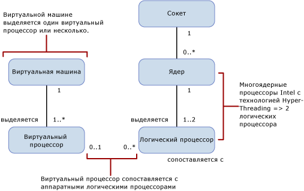

# Compute Capacity Limits by Edition of SQL Server
  В этом разделе описываются ограничения вычислительной мощности в разных выпусках [!INCLUDE[ssCurrent](../includes/sscurrent-md.md)] и различия в их работе в физических и виртуальных средах с процессорами Hyper-Threading.  
  
   
  
 В следующей таблице описаны обозначения, используемые на схеме выше.  
  
|Значение|Описание|  
|-----------|-----------------|  
|0..1|Ноль или один|  
|1|Ровно один|  
|1..\*|Один или более|  
|0..\*|Ноль или более|  
|1..2|Один или два|  
  
> [!IMPORTANT]  
> Дополнительный анализ  
>   
> - Виртуальной машине выделяется один или несколько виртуальных процессоров.  
> - Один или несколько виртуальных процессоров выделяются ровно одной виртуальной машине.  
> - Ноль или один виртуальный процессор сопоставляются с нулем или другим числом логических процессоров. Различное сопоставление виртуальных и логических процессоров: 
>     -   один-ноль означает, что непривязанный логический процессор не используется гостевыми операционными системами;  
>     -   один-много означает перерасход ресурсов;  
>     -   ноль-много означает отсутствие виртуальной машины в основной системе, и логические процессоры не используются виртуальными машинами.  
> - Процессор сопоставляется с нулем или другим числом ядер. Различное сопоставление процессоров и ядер:  
>     -   один-ноль означает, что процессорное гнездо пусто (процессор не установлен);  
>     -   один-один означает, что в гнездо установлен одноядерный процессор (редкая ситуация);  
>     -   один-много означает, что в гнездо установлен многоядерный процессор (типичные значения — 2, 4, 8).  
> - Ядро сопоставляется с одним или двумя логическими процессорами. Различное сопоставление ядер и логических процессоров:  
>     -   один-один означает, что технология Hyper-Threading отключена;  
>     -   один-два означает, что технология Hyper-Threading включена.  
  
 Далее даны определения терминов, используемых в данном разделе.  
  
-   Потоком или логическим процессором называется отдельная логическая вычислительная система с точки зрения [!INCLUDE[ssNoVersion](../includes/ssnoversion-md.md)], операционной системы, приложения или драйвера.  
  
-   Ядром называется блок процессора, который может содержать один или несколько логических процессоров.  
  
-   Физический процессор может содержать одно или несколько ядер. Физический процессор также называется процессорным пакетом или просто процессором.  
  
Системы с несколькими физическими процессорами, а также системы, где физические процессоры имеют несколько ядер или поддерживают технологию Hyper-Threading, позволяют операционной системе одновременно выполнять несколько задач. Каждый поток выполнения представляется как логический процессор. Например, если на компьютере установлено два четырехъядерных процессора с включенной технологией Hyper-Threading (два потока на ядро), то получится 16 логических процессоров: 2 процессора x 4 ядра в каждом процессоре x 2 потока в каждом ядре. Важные замечания  
  
-   Вычислительная мощность логического процессора на один поток ядра с технологией Hyper-Threading меньше, чем мощность логического процессора с таким же ядром при отключенной технологии Hyper-Threading.  
  
-   Однако вычислительная мощность 2 логических процессоров в ядре с технологией Hyper-Threading больше, чем у того же ядра с отключенной технологией Hyper-Threading.  
  
Каждый выпуск [!INCLUDE[ssNoVersion](../includes/ssnoversion-md.md)] обладает двумя ограничениями вычислительной мощности.  
  
- Максимальное число процессоров (физических процессоров, процессорных пакетов).  
  
- Максимальное число ядер, обнаруженное операционной системой.  
  
Эти ограничения относятся к отдельному экземпляру [!INCLUDE[ssNoVersion](../includes/ssnoversion-md.md)]. Они представляют максимальную вычислительную мощность, которую будет использовать отдельный экземпляр. Ограничения не распространяются на сервер, где может развертываться экземпляр. На практике развертывание нескольких экземпляров [!INCLUDE[ssNoVersion](../includes/ssnoversion-md.md)] на одном физическом сервере является эффективным способом использования вычислительной мощности сервера, где число процессоров или ядер превышает указанные ниже ограничения.  
  
В следующей таблице приводятся ограничения вычислительной мощности для одного экземпляра каждого выпуска [!INCLUDE[ssCurrent](../includes/sscurrent-md.md)].  
  
|[!INCLUDE[ssNoVersion](../includes/ssnoversion-md.md)] Выпуск|Максимальная вычислительная мощность, используемая одним экземпляром ([!INCLUDE[ssNoVersion](../includes/ssnoversion-md.md)][!INCLUDE[ssDE](../includes/ssde-md.md)])|Максимальная вычислительная мощность, используемая одним экземпляром (службы Analysis Services, службы Reporting Services)|  
|---------------------------------------|--------------------------------------------------------------------------------------------------------|-------------------------------------------------------------------|  
|Enterprise Edition: лицензирование по числу ядер\*|Максимум, поддерживаемый операционной системой|Максимум, поддерживаемый операционной системой|  
|Разработчик|Максимум, поддерживаемый операционной системой|Максимум, поддерживаемый операционной системой|  
|Standard Edition|Ограничение: меньшее из 4 процессоров и 24 ядер|Ограничение: меньшее из 4 процессоров и 24 ядер|  
|Express|Ограничение: меньшее из 1 процессора и 4 ядер|Ограничение: меньшее из 1 процессора и 4 ядер|  

\*Использование выпуска Enterprise Edition с лицензированием по принципу "лицензия на сервер и клиентские лицензии (Server+CAL)" (недоступно для новых соглашений) ограничено максимум 20 ядрами в расчете на экземпляр [!INCLUDE[ssNoVersion](../includes/ssnoversion-md.md)]. В модели лицензирования по числу ядер никаких ограничений нет.  
  
В виртуальной среде ограничение вычислительной мощности зависит от числа логических процессоров, а не ядер, поскольку архитектура процессора скрыта от гостевых приложений.  Например, сервер с четырьмя четырехъядерными процессорами и технологией Hyper-Threading, поддерживающей два потока на ядро, содержит 32 логических процессора, если технология Hyper-Threading включена, и 16, если она отключена. Такие логические процессоры могут сопоставляться с виртуальными машинами на сервере, а вычислительная нагрузка виртуальных машин на данный логический процессор сопоставляется с потоком выполнения в физическом процессоре на сервере.  
  
Если важна производительность в пересчете на виртуальный процессор, может понадобиться отключить технологию Hyper-Threading. Технологию Hyper-Threading можно включать и отключать в параметрах процессора в BIOS, но обычно это операция на уровне сервера, которая действует на всю рабочую нагрузку, активную на сервере. Это обстоятельство делает разумным отделение рабочей нагрузки, действующей в виртуальных средах, от нагрузки, для которой технология Hyper-Threading обеспечит прирост производительности в среде физической операционной системы.  
  
## См. также:  
 [Выпуски и компоненты SQL Server 2016](../sql-server/editions-and-components-of-sql-server-2016.md)   
 [Возможности, поддерживаемые различными выпусками SQL Server 2016](~/sql-server/editions-and-supported-features-for-sql-server-2016.md)   
 [Задание максимальной вместимости SQL Server](../sql-server/maximum-capacity-specifications-for-sql-server.md)   
 [Быстрая установка SQL Server 2016](http://msdn.microsoft.com/library/672afac9-364d-4946-ad5d-8a2d89cf8d81)  
  
  

