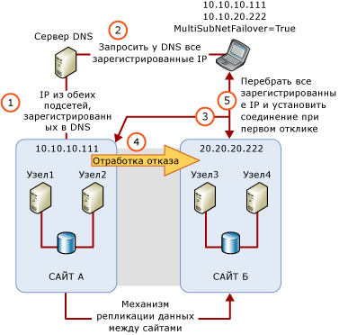

# Кластеры SQL Server с несколькими подсетями [SQL Server]
[!INCLUDE[appliesto-ss-xxxx-xxxx-xxx-md](../../../includes/appliesto-ss-xxxx-xxxx-xxx-md.md)]
  Отказоустойчивый кластер с узлами в нескольких подсетях [!INCLUDE[ssNoVersion](../../../includes/ssnoversion-md.md)] представляет собой конфигурацию, в которой узлы отказоустойчивого кластера подключены к разным подсетям или разным наборам подсетей. Эти подсети могут находиться в одном месте или на географически распределенных сайтах. Кластеры географически распределенных сайтов иногда называют растянутыми. Поскольку не существует общедоступного для всех узлов хранилища, существует необходимость в репликации данных между хранилищами данных, расположенных в разных подсетях. При репликации данных в наличии имеется несколько копий данных. Поэтому, отказоустойчивый кластер с узлами, расположенными в нескольких подсетях, обеспечивает не только высокий уровень доступности, но и является решением для аварийного восстановления данных.  
  
   
##   Отказоустойчивый кластер SQL Server с несколькими подсетями (2 узла, 2 подсети)  
 На следующем рисунке показан экземпляр отказоустойчивого кластера [!INCLUDE[ssCurrent](../../../includes/sscurrent-md.md)], состоящий из двух узлов в двух подсетях.  
  
   
  
  
##   Конфигурации экземпляров отказоустойчивых кластеров с несколькими подсетями  
 Далее представлено несколько примеров экземпляров отказоустойчивых кластеров [!INCLUDE[ssNoVersion](../../../includes/ssnoversion-md.md)] , узлы которых располагаются в разных подсетях.  
  
-   [!INCLUDE[ssNoVersion](../../../includes/ssnoversion-md.md)] SQLCLUST1 включает в себя Узел1 и Узел2. Узел1 подключен к Подсети1. Узел2 подключен к подсети2. [!INCLUDE[ssNoVersion](../../../includes/ssnoversion-md.md)] Программа установки видит эту конфигурацию как кластер с несколькими подсетями и устанавливает для зависимости ресурса IP-адреса значение **OR**.  
  
-   [!INCLUDE[ssNoVersion](../../../includes/ssnoversion-md.md)] SQLCLUST1 включает в себя Узел1, Узел2 и Узел3. Узел1 и Узел2 подключены к Подсети1. Узел 3 подключен к подсети 2. [!INCLUDE[ssNoVersion](../../../includes/ssnoversion-md.md)] Программа установки видит эту конфигурацию как кластер с несколькими подсетями и устанавливает для зависимости ресурса IP-адреса значение **OR**. Поскольку Узел1 и Узел2 расположены в одной подсети, такая конфигурация позволяет обеспечить более высокой уровень доступности локальных ресурсов.  
  
-   [!INCLUDE[ssNoVersion](../../../includes/ssnoversion-md.md)] SQLCLUST1 включает в себя Узел1 и Узел2. Узел1 находится в Подсети1. Узел 2 подключен к подсети 1 и подсети 2. [!INCLUDE[ssNoVersion](../../../includes/ssnoversion-md.md)] Программа установки видит эту конфигурацию как кластер с несколькими подсетями и устанавливает для зависимости ресурса IP-адреса значение **OR**.  
  
-   [!INCLUDE[ssNoVersion](../../../includes/ssnoversion-md.md)] SQLCLUST1 включает в себя Узел1 и Узел2. Узел1 подключен к Подсети1 и Подсети2. Узел2 также подключен к Подсети1 и Подсети2. Для зависимости ресурса IP-адреса программой установки **устанавливается значение** AND [!INCLUDE[ssNoVersion](../../../includes/ssnoversion-md.md)] .  
  
    > **ПРИМЕЧАНИЕ.** Такая конфигурация не относится к отказоустойчивым кластерам с несколькими подсетями, поскольку кластеризованные узлы находятся в одном наборе подсетей.  
  
##   Вопросы ресурса IP-адреса  
 В конфигурации отказоустойчивого кластера с узлами в нескольких подсетях, IP-адреса не принадлежат всем узлам отказоустойчивого кластера, в момент запуска [!INCLUDE[ssNoVersion](../../../includes/ssnoversion-md.md)] не все из них могут находиться в сети. Начиная с выпуска [!INCLUDE[ssSQL11](../../../includes/sssql11-md.md)], можно устанавливать для зависимости ресурса IP-адреса значение **OR**. Это позволяет [!INCLUDE[ssNoVersion](../../../includes/ssnoversion-md.md)] находиться в сети, если имеется хотя бы один действительный IP-адрес, к которому можно выполнить привязку.  
  
> **ПРИМЕЧАНИЕ.** В версиях [!INCLUDE[ssNoVersion](../../../includes/ssnoversion-md.md)] более ранних, чем [!INCLUDE[ssSQL11](../../../includes/sssql11-md.md)], при создании кластерных конфигураций с несколькими подсетями использовалась технология распределенных виртуальных ЛС, которая позволяла использовать один IP-адрес для отработки отказа на нескольких объектах. Благодаря новым возможностям [!INCLUDE[ssNoVersion](../../../includes/ssnoversion-md.md)] , позволяющим обеспечивать кластеризацию узлов, размещенных в разных подсетях, вы можете настраивать отказоустойчивые кластеры [!INCLUDE[ssNoVersion](../../../includes/ssnoversion-md.md)] на разных сайтах без внедрения технологии распределенных виртуальных ЛС.  
  
### Рекомендации по заданию зависимости ресурса IP-адреса со значением OR  
 Если для зависимости ресурса IP-адреса устанавливается значение **OR**, рекомендуется задать следующий режим отработки отказа.  
  
-   При возникновении сбоя на одном из IP-адресов узла, которому в настоящий момент принадлежит группа ресурсов кластера [!INCLUDE[ssNoVersion](../../../includes/ssnoversion-md.md)] , отработка отказа запускается автоматически только после сбоя всех действительных IP-адресов в этом узле.  
  
-   При отработке отказа [!INCLUDE[ssNoVersion](../../../includes/ssnoversion-md.md)] перейдет в режим «в сети» в том случае, если для него возможна привязка хотя бы к одному действительному IP-адресу на текущем узле. IP-адреса, которые не были привязаны к [!INCLUDE[ssNoVersion](../../../includes/ssnoversion-md.md)] при запуске, будут указаны в журнале ошибок.  
  
   
 Если экземпляр отказоустойчивого кластера [!INCLUDE[ssNoVersion](../../../includes/ssnoversion-md.md)] установлен параллельно с отдельным экземпляром компонента [!INCLUDE[ssDEnoversion](../../../includes/ssdenoversion-md.md)], то необходимо исключить возникновение конфликта номеров портов TCP в IP-адресах. Конфликты обычно возникают в том случае, когда два экземпляра компонента [!INCLUDE[ssDE](../../../includes/ssde-md.md)] одновременно настроены на использование стандартного порта TCP (1433). Чтобы предотвратить возникновение конфликтов, настройте один экземпляр на использование фиксированного порта, отличного от установленного по умолчанию. Обычно настройку фиксированного порта проще всего выполнить на отдельном экземпляре. Настройка компонента [!INCLUDE[ssDE](../../../includes/ssde-md.md)] на использование различных портов позволит предотвратить непредвиденные конфликты IP-адресов и TCP, которые блокируют запуск экземпляра в случае ошибки экземпляра отказоустойчивого кластера [!INCLUDE[ssNoVersion](../../../includes/ssnoversion-md.md)] при переходе в режим ожидания.  
  
##   Задержка восстановления клиента при отработке отказа  
 Экземпляр отказоустойчивого кластера, содержащий несколько подсетей, по умолчанию включает ресурс кластера RegisterAllProvidersIP в качестве своего сетевого имени. В конфигурации с несколькими подсетями как подключенные, так и отключенные от сети IP-адреса сетевого имени будут зарегистрированы на сервере DNS. Затем клиентское приложение извлечет все зарегистрированные IP-адреса с сервера DNS и попытается подключиться к ним либо по порядку, либо параллельно. Это означает, что время восстановления клиента при отработке отказов в нескольких подсетях больше не зависит от задержек обновления DNS. По умолчанию клиент пытается подключиться к IP-адресам по порядку. Если клиент использует в строке подключения новый дополнительный параметр **MultiSubnetFailover=True** , вместо этого он попытается подключиться к IP-адресам одновременно и подключится к первому серверу, который ответит. Это поможет свести к минимуму задержку восстановления клиента при отработке отказов. Дополнительные сведения см. в разделах [Подключение клиента AlwaysOn (SQL Server)](../../../database-engine/availability-groups/windows/always-on-client-connectivity-sql-server.md) и [Создание или настройка прослушивателя группы доступности (SQL Server)](../../../database-engine/availability-groups/windows/create-or-configure-an-availability-group-listener-sql-server.md).  
  
 При устаревших клиентских библиотеках или сторонних поставщиках данных использовать параметр **MultiSubnetFailover** в строке подключения невозможно. Чтобы обеспечить оптимальную работу клиентского приложения с экземпляром отказоустойчивого кластера в [!INCLUDE[ssCurrent](../../../includes/sscurrent-md.md)], содержащим несколько подсетей, попробуйте скорректировать время ожидания соединения в строке подключения клиента на 21 секунду для каждого дополнительного IP-адреса. Это позволит предотвратить окончание времени ожидания при попытке переподключения клиента до того, как будет завершен циклический перебор всех IP-адресов в экземпляре отказоустойчивого кластера, содержащего несколько подсетей.  
  
 Период ожидания соединения клиента по умолчанию для среды [!INCLUDE[ssNoVersion](../../../includes/ssnoversion-md.md)] Management Studio и **sqlcmd** составляет 15 секунд.  
  
   
##   См. также  
  
|Описание содержимого|Раздел|  
|-------------------------|-----------|  
|Установка отказоустойчивого кластера SQL Server|[Создание нового отказоустойчивого кластера SQL Server (программа установки)](../../../sql-server/failover-clusters/install/create-a-new-sql-server-failover-cluster-setup.md)|  
|Обновление существующего отказоустойчивого кластера SQL Server на месте|[Обновление экземпляра отказоустойчивого кластера SQL Server (программа установки)](../../../sql-server/failover-clusters/windows/upgrade-a-sql-server-failover-cluster-instance-setup.md)|  
|Обслуживание существующего отказоустойчивого кластера SQL Server|[Добавление или удаление узлов отказоустойчивого кластера SQL Server (программа установки)](../../../sql-server/failover-clusters/install/add-or-remove-nodes-in-a-sql-server-failover-cluster-setup.md)|  
|Используйте оснастку управления отказоустойчивым кластером для просмотра событий и журналов WSFC|[Просмотр событий и журналов для отказоустойчивого кластера](https://technet.microsoft.com/library/cc772342\(WS.10\).aspx)|  
|Используйте Windows PowerShell для создания файла журнала для всех узлов (или конкретного узла) в отказоустойчивом кластере WSFC|[Командлет Get-ClusterLog отказоустойчивого кластера](https://technet.microsoft.com/library/ee461045.aspx)|  
  

  
  
