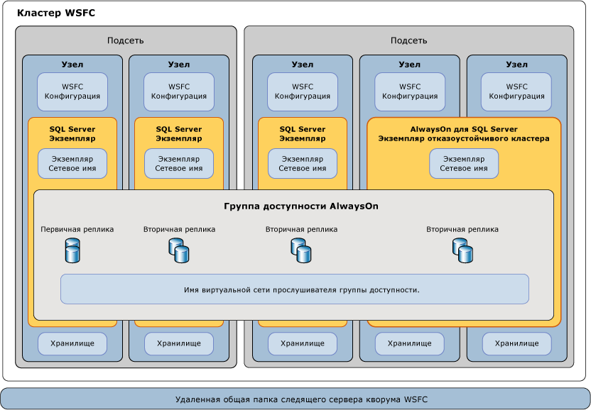

# Отказоустойчивая кластеризация Windows Server (WSFC) с SQL Server
  Новая *Отказоустойчивая кластеризация Windows Server* (WSFC) представляет собой группу независимых серверов, совместная работа которых позволяет повысить доступность приложений и служб. [!INCLUDE[ssCurrent](../../../includes/sscurrent-md.md)] поддержка экземпляров отказоустойчивого кластера [!INCLUDE[ssHADR](../../../includes/sshadr-md.md)] и [!INCLUDE[ssNoVersion](../../../includes/ssnoversion-md.md)] осуществляется с использованием служб и возможностей WSFC.  
  
   
##   Термины и определения  
 Кластер WSFC  
 Новая Отказоустойчивая кластеризация Windows Server (WSFC) представляет собой группу независимых серверов, совместная работа которых позволяет повысить доступность приложений и служб.  
  
 Экземпляр отказоустойчивого кластера  
 Экземпляр службы Windows, управляющий ресурсом IP-адреса, ресурсом сетевого имени и дополнительными ресурсами, которые требуются для запуска приложений и служб. Клиенты могут использовать сетевое имя для доступа к ресурсам в группе аналогично использованию имени компьютера для доступу к службам на физическом сервере. Однако, поскольку экземпляр отказоустойчивого кластера является группой, для него возможен переход на другой узел без изменения базового имени или адреса.  
  
 Узел  
 Система Microsoft Windows Server, которая является активным или неактивным членом кластера серверов.  
  
 Ресурс кластера  
 Физическая или логическая сущность, которая может принадлежать узлу, которую можно переводить в режимы «в сети» и «вне сети», перемещать между узлами и которой можно управлять как объектом кластера. Ресурс кластера может принадлежать одновременно только одному узлу.  
  
 Группа ресурсов  
 Коллекция ресурсов кластера, управляемая как единый объект кластера. Обычно группа ресурсов содержит все ресурсы кластера, которые требуются для выполнения конкретного приложения или службы. Отработка отказа и возврат всегда выполняются для групп ресурсов.  
  
 Зависимость ресурсов  
 Ресурс, от которого зависит другой ресурс. Если ресурс A зависит от ресурса B, то B является зависимостью A.  
  
 Ресурс сетевого имени  
 Имя логического сервера, которое управляется как ресурс кластера. Ресурс сетевого имени должен использоваться с ресурсом IP-адреса.  
  
 Предпочитаемый владелец  
 Предпочтительный узел для запуска группы ресурсов. Каждая группа ресурсов связана со списком предпочитаемых владельцев, отсортированных в порядке предпочтения. Во время автоматического перехода на другой ресурс группа ресурсов перемещается на следующий предпочтительный узел в списке.  
  
 Возможный владелец  
 Дополнительный узел, на котором может запускаться ресурс. Каждая группа ресурсов связана со списком возможных владельцев. Группы ресурсов могут выполнять переход только на узлы из списка возможных владельцев.  
  
 Режим кворума  
 Конфигурация кворума в отказоустойчивом кластере, определяющая количество сбоев узлов, которое может выдержать кластер.  
  
 Принудительный кворум  
 Процесс запуска кластера несмотря на то, что на связи недостаточное количество элементов для кворума.  
  

##   Обзор отказоустойчивого кластера Windows Server  
 Отказоустойчивая кластеризация Windows Server предусматривает инфраструктурные компоненты, поддерживающие сценарии высокого уровня доступности и аварийного восстановления для таких размещенных серверных приложений, как Microsoft [!INCLUDE[ssNoVersion](../../../includes/ssnoversion-md.md)] и Microsoft Exchange. При отказе узла кластера или службы все службы, которые размещались на этом узле, могут автоматически или вручную переноситься на другой доступный узел в рамках процесса под названием *отработка отказа*.  
  
 Узлы в кластере WSFC за счет совместной работы обеспечивают следующие типы возможностей:  
  
-   **Распределенные метаданные и уведомления.** Метаданные служб и размещенных приложений WSFC хранятся на каждом узле кластера. Среди этих метаданных не только параметры размещенных приложений, но также конфигурация и состояние WSFC. Изменения в метаданных или состоянии узла автоматически распространяются на других узлах кластера.  
  
-   **Управление ресурсами.** Отдельные узлы в кластере могут предоставлять физические ресурсы, например подключаемое напрямую хранилище, сетевые интерфейсы и доступ к общему дисковому хранилищу. Размещенные приложения регистрируют себя как ресурсы кластера и могут настраивать запуск и зависимости от исправности других ресурсов.  
  
-   **Мониторинг исправности.** Определение исправности основного узла и исправности между узлами осуществляется за счет сочетания сетевых соединений по типу тактовых импульсов и мониторинга ресурсов. Общее состояние работоспособности кластера определяется голосами кворума узлов в кластере.  
  
-   **Координация отработки отказа.** Каждый ресурс настроен для размещения на основном узле, и каждый можно автоматически или вручную переносить на один или несколько второстепенных узлов. Политика отработки отказа в зависимости от исправности управляет автоматическим переносом владения ресурсами между узлами. Узлы и размещенные приложения получают уведомления об отработке отказа, что позволяет им выполнить соответствующие действия.  
  
 Дополнительные сведения см. в статье [Failover Clustering Overview — Windows Server](https://technet.microsoft.com/library/hh831579(v=ws.11).aspx)(Обзор отказоустойчивой кластеризации — Windows Server).  
  
##   Технологии SQL Server AlwaysOn и WSFC  
 [!INCLUDE[ssCurrent](../../../includes/sscurrent-md.md)] *AlwaysOn* — это новое решение высокого уровня доступности и аварийного восстановления с использованием WSFC. AlwaysOn представляет собой интегрированное, гибкое решение, повышающее доступность приложения, окупаемость вложений в оборудование и упрощающее развертывание систем высокого уровня доступности и управление ими.  
  
 Экземпляры [!INCLUDE[ssHADR](../../../includes/sshadr-md.md)] и экземпляры отказоустойчивого кластера AlwaysOn используют технологию платформы WSFC и регистрируют компоненты в качестве ресурсов кластера WSFC.  Связанные ресурсы объединяются в *группу ресурсов*, которую можно сделать зависимой от других ресурсов кластера WSFC. Затем служба кластера WSFC сможет выявлять необходимость в перезапуске экземпляра [!INCLUDE[ssNoVersion](../../../includes/ssnoversion-md.md)] (и сигнализировать об этой необходимости), а также автоматически выполнять отработку отказа с переходом на другой серверный узел в кластере WSFC.  
  
> **ВАЖНО!** Чтобы воспользоваться всеми возможностями технологий [!INCLUDE[ssNoVersion](../../../includes/ssnoversion-md.md)] AlwaysOn, вам следует выполнить несколько связанных с WSFC предварительных требований.  
>   
>  Дополнительные сведения см. в разделе [Предварительные требования, ограничения и рекомендации для групп доступности AlwaysOn &#40;SQL Server&#41;](../../../database-engine/availability-groups/windows/prereqs-restrictions-recommendations-always-on-availability.md)  
  
### Высокий уровень доступности на уровне экземпляра с помощью экземпляров отказоустойчивого кластера AlwaysOn  
 *Экземпляр отказоустойчивого кластера* (FCI) AlwaysOn представляет собой экземпляр [!INCLUDE[ssNoVersion](../../../includes/ssnoversion-md.md)] , установленный на нескольких узлах в кластере WSFC. Этот тип экземпляра зависит от ресурсов для хранения и имени виртуальной сети. Хранилище может использовать общее дисковое пространство на базе Fibre Channel, iSCSI, FCoE или SAS либо локально подключенное хранилище на основе [локальных дисковых пространств (S2D)](http://technet.microsoft.com/windows-server-docs/storage/storage-spaces/storage-spaces-direct-overview). Ресурс имени виртуальной сети зависит от одного или нескольких виртуальных IP-адресов, которые расположены в разных подсетях. Служба SQL Server и служба агента SQL Server также являются ресурсами, и обе они зависят от ресурсов хранилища и имени виртуальной сети.  
  
 В случае отработки отказа служба WSFC переносит владение ресурсов экземпляра на указанный узел отработки отказа. Затем экземпляр [!INCLUDE[ssNoVersion](../../../includes/ssnoversion-md.md)] перезапускается на узле отработки отказа и выполняется обычное восстановление баз данных. В любой момент времени FCI и базовые ресурсы могут размещаться только на одном узле в кластере.  
  
> **ПРИМЕЧАНИЕ.**  Экземпляру отказоустойчивого кластера AlwaysOn требуется симметричное общее дисковое хранилище, например сеть хранения данных (SAN) или общая папка SMB.  Тома общего дискового хранилища должны быть доступны всем потенциальным узлам отработки отказа в кластере WSFC.  
  
 Дополнительные сведения см. в разделе [Экземпляры отказоустойчивого кластера (режим AlwaysOn) &#40;SQL Server&#41;](../../../sql-server/failover-clusters/windows/always-on-failover-cluster-instances-sql-server.md)  
  
### Высокий уровень доступности на уровне баз данных с [!INCLUDE[ssHADR](../../../includes/sshadr-md.md)]  
 *Группа доступности* — это набор пользовательских баз данных, для которых отработка отказа выполняется одновременно. Группа доступности состоит из первичной *реплики доступности* и от одной до четырех вторичных реплик, которые поддерживаются за счет перемещения данных на основании журнала SQL Server для обеспечения защиты данных, не требующей общего хранилища. Каждая реплика размещается на экземпляре [!INCLUDE[ssNoVersion](../../../includes/ssnoversion-md.md)] в отдельном узле кластера WSFC. Группа доступности и соответствующее имя виртуальной сети регистрируются как ресурсы в кластере WSFC.  
  
 *Прослушиватель группы доступности* на узле первичной реплики отвечает на входящие клиентские запросы на подключение к имени виртуальной сети и в зависимости от атрибутов в строке подключения перенаправляет каждый запрос в соответствующий экземпляр [!INCLUDE[ssNoVersion](../../../includes/ssnoversion-md.md)] .  
  
 При отработке отказа вместо переноса владения общих физических ресурсов на другой узел WSFC используется для перенастройки вторичной реплики на другом экземпляре [!INCLUDE[ssNoVersion](../../../includes/ssnoversion-md.md)] в первичную реплику группы доступности. Затем ресурс виртуального сетевого имени группы доступности переводится на этот экземпляр.  
  
 Первичная реплика баз данных группы доступности одновременно может размещаться только на одном экземпляре [!INCLUDE[ssNoVersion](../../../includes/ssnoversion-md.md)] , все связанные вторичные реплики должны находиться на отдельном экземпляре, и каждый экземпляр должен находиться на отдельном физическом узле.  
  
> **NOTE:** [!INCLUDE[ssHADR](../../../includes/sshadr-md.md)] do not require deployment of a Failover Cluster Instance or use of symmetric shared storage (SAN or SMB).  
>   
>  Экземпляр отказоустойчивого кластера (FCI) может использоваться совместно с группой доступности для повышения доступности реплики доступности. Однако во избежание соперничества в кластере WSFC автоматический переход на другой ресурс группы доступности не поддерживается для реплики доступности, размещенной в FCI.  
  
 Дополнительные сведения см. в статье [Обзор групп доступности AlwaysOn SQL Server)](../../../database-engine/availability-groups/windows/overview-of-always-on-availability-groups-sql-server.md)  
  
##   Мониторинг исправности WSFC и отработка отказа  
 Высокий уровень доступности для решения AlwaysOn достигается за счет упреждающего мониторинга работоспособности физических и логических ресурсов кластера WSFC, а также за счет автоматического перехода на другой ресурс с переходом на дублирующее оборудование и его перенастройкой.  Системный администратор также может запустить *переход на другой ресурс вручную* для группы доступности или экземпляра [!INCLUDE[ssNoVersion](../../../includes/ssnoversion-md.md)] для перехода с одного узла на другой.  
  
### Политики отработки отказа для узлов, экземпляров отказоустойчивого кластера и групп доступности  
 *Политика отработки отказа* настраивается на уровне узла кластера WSFC, экземпляра отказоустойчивого кластера (FCI) [!INCLUDE[ssNoVersion](../../../includes/ssnoversion-md.md)] и группы доступности.  Эта политика на основе серьезности, продолжительности и частоты неисправного состояния ресурса кластера и времени отклика узла может включать перезапуск службы или *автоматический переход на другой ресурс* с переходом с одного узла на другой либо включать перевод первичной реплики группы доступности с одного экземпляра [!INCLUDE[ssNoVersion](../../../includes/ssnoversion-md.md)] на другой.  
  
 Отработка отказа реплики группы доступности не влияет на базовый экземпляр [!INCLUDE[ssNoVersion](../../../includes/ssnoversion-md.md)] .  При отработке отказа экземпляра отказоустойчивого кластера вместе с этим экземпляром перемещаются размещенные реплики группы доступности.  
  
 Дополнительные сведения см. в разделе [Политика отработки отказа для экземпляров откзоустойчивого кластера](../../../sql-server/failover-clusters/windows/failover-policy-for-failover-cluster-instances.md).  
  
### Определение исправности ресурсов WSFC  
 Все ресурсы на узле кластера WSFC могут сообщать о своем состоянии и исправности периодически или по запросу. Об отказе ресурса могут говорить различные обстоятельства, например неисправность электропитания, ошибки дисков или памяти, ошибки в сети, неотвечающие службы.  
  
 Ресурсы кластера WSFC, например сети, хранилища и службы, можно делать зависимыми друг от друга. Совокупная исправность ресурса определяется путем последовательного суммирования его работоспособности с исправностью каждого из зависимых ресурсов.  
  
### Определение исправности между узлами WSFC и определение голосов в кворуме  
 Все узлы в кластере WSFC участвуют в периодической передаче тактового импульса, сообщающего состояние исправности узла другим узлам. Неотвечающие узлы считаются неисправными.  
  
 Набор узлов *кворума* — это большинство узлов с правом голоса и следящих объектов в кластере WSFC. Общая исправность и состояние кластера WSFC определяется периодическим *голосованием с кворумом*. Наличие кворума означает, что кластер работоспособен и может обеспечивать отказоустойчивость на уровне узла.  
  
 *Режим кворума* настраивается на уровне кластера WSFC, который определяет методику голосования кворума, а также момент выполнения автоматического перехода на другой ресурс или перевода кластера в режим «вне сети».  
  
> **СОВЕТ.** Рекомендуется, чтобы число голосов кворума в кластере WSFC всегда было нечетным.  По соображениям голосования кворума нет необходимости устанавливать [!INCLUDE[ssNoVersion](../../../includes/ssnoversion-md.md)] на всех узлах в кластере. Дополнительный сервер может выступать в качестве члена кворума, либо модель кворума WSFC можно настроить для использования удаленной общей папки в качестве решающего голоса.  
>   
>  Дополнительные сведения см. в разделе [Режим кворума и участвующая в голосовании конфигурация WSFC (SQL Server)](../../../sql-server/failover-clusters/windows/wsfc-quorum-modes-and-voting-configuration-sql-server.md).  
  
### Аварийное восстановление через принудительный кворум  
 В зависимости от принятых методов работы и конфигурации кластера WSFC можно использовать как автоматический, так и ручной переход на другой ресурс, при этом решение [!INCLUDE[ssNoVersion](../../../includes/ssnoversion-md.md)] AlwaysOn остается всегда надежным и отказоустойчивым. Однако если кворуму узлов с правом голоса в кластере WSFC не удается связаться друг с другом либо если кластеру WSFC по другим причинам не удается проверить исправность, то кластер WSFC может перейти в режим «вне сети».  
  
 При переходе кластера WSFC в автономный режим из-за неожиданной аварии или по причине постоянно возникающего сбоя в работе оборудования или ошибки связи требуется вмешательство администратора для *принудительного создания кворума* и переключения работоспособных кластеров обратно в режим "в сети" в неотказоустойчивой конфигурации.  
  
 После этого будет необходимо также предпринять ряд действий по перенастройке кластера WSFC, восстановлению затронутых реплик баз данных и повторному созданию нового кворума.  
  
 Дополнительные сведения см. в статье [Аварийное восстановление WSFC через принудительный кворум (SQL Server)](../../../sql-server/failover-clusters/windows/wsfc-disaster-recovery-through-forced-quorum-sql-server.md).  
  
##   Связь компонентов SQL Server AlwaysOn с WSFC  
 Между функциями и компонентами [!INCLUDE[ssNoVersion](../../../includes/ssnoversion-md.md)] AlwaysOn и WSFC существуют связи нескольких уровней.  
  
 Группы доступности AlwaysOn размещаются в экземплярах [!INCLUDE[ssNoVersion](../../../includes/ssnoversion-md.md)] .  
 Клиентский запрос с указанием логического сетевого имени прослушивателя группы доступности для подключения к первичной или базе данных-получателю направляется на соответствующее сетевое имя экземпляра базового экземпляра [!INCLUDE[ssNoVersion](../../../includes/ssnoversion-md.md)] или экземпляра отказоустойчивого кластера [!INCLUDE[ssNoVersion](../../../includes/ssnoversion-md.md)] .  
  
 Экземпляры SQL Server активно размещаются на одном узле.  
 Если имеется изолированный экземпляр [!INCLUDE[ssNoVersion](../../../includes/ssnoversion-md.md)] , то он всегда находится на отдельном узле со статическим сетевым именем экземпляра.  Экземпляр отказоустойчивого кластера [!INCLUDE[ssNoVersion](../../../includes/ssnoversion-md.md)] (если он есть) активен на одном из нескольких возможных узлов отработки отказа с единым виртуальным сетевым именем экземпляра.  
  
 Узлы являются членами кластера WSFC.  
 Метаданные и состояние конфигурации WSFC для всех узлов сохраняются на каждом узле. Каждый сервер может предоставлять тома асимметричного хранения или общего хранения (SAN) для пользовательских и системных баз данных. Каждый сервер имеет по крайней мере один физический сетевой интерфейс в одной или нескольких IP-подсетях.  
  
 Служба WSFC контролирует исправность группы серверов и управляет их конфигурацией.  
 Служба отказоустойчивого кластера (WSFC) распространяет изменения в метаданных и состоянии конфигурации WSFC во всех узлах кластера. Частичные метаданные и состояние могут храниться в удаленной общей папке следящего сервера кворума WSFC. Несколько активных узлов или следящих экземпляров образуют кворум для голосования по исправности кластера WSFC.  
  
 [!INCLUDE[ssHADR](../../../includes/sshadr-md.md)] — это подразделы кластера WSFC.  
 При удалении и повторном создании кластера WSFC необходимо отключить и повторно включить функцию [!INCLUDE[ssHADR](../../../includes/sshadr-md.md)] на каждом экземпляре сервера, на котором была включена функция [!INCLUDE[ssHADR](../../../includes/sshadr-md.md)] в исходном кластере WSFC. Дополнительные сведения см. в разделе [Включение и отключение групп доступности AlwaysOn (SQL Server)](../../../database-engine/availability-groups/windows/enable-and-disable-always-on-availability-groups-sql-server.md).  
  
   
  
##   Связанные задачи  
  
-   [Просмотр параметров NodeWeight кворума кластера](../../../sql-server/failover-clusters/windows/view-cluster-quorum-nodeweight-settings.md)  
  
-   [Настройка параметров NodeWeight кворума кластера](../../../sql-server/failover-clusters/windows/configure-cluster-quorum-nodeweight-settings.md)  
  
-   [Принудительный запуск кластера WSFC без кворума](../../../sql-server/failover-clusters/windows/force-a-wsfc-cluster-to-start-without-a-quorum.md)  
  
##   См. также  
  
-   [Технологии Windows Server: отказоустойчивые кластеры](http://technet.microsoft.com/library/cc732488\(v=WS.10\).aspx)  

-   [Обзор локальных дисковых пространств \(S2D\)](http://technet.microsoft.com/windows-server-docs/storage/storage-spaces/storage-spaces-direct-overview)

-   [Отказоустойчивые кластеры в Windows Server 2008 R2](http://technet.microsoft.com/library/ff182338\(WS.10\).aspx)  
  
-   [Просмотр событий и журналов для отказоустойчивого кластера](http://technet.microsoft.com/library/cc772342\(WS.10\).aspx)  
  
-   [Командлет Get-ClusterLog отказоустойчивого кластера](http://technet.microsoft.com/library/ee461045.aspx)  
  
## См. также:  
 [Экземпляры отказоустойчивого кластера AlwaysOn (SQL Server)](../../../sql-server/failover-clusters/windows/always-on-failover-cluster-instances-sql-server.md)   
 [Обзор групп доступности AlwaysOn SQL Server)](../../../database-engine/availability-groups/windows/overview-of-always-on-availability-groups-sql-server.md)   
 [Режим кворума и участвующая в голосовании конфигурация WSFC (SQL Server)](../../../sql-server/failover-clusters/windows/wsfc-quorum-modes-and-voting-configuration-sql-server.md)   
 [Политика отработки отказа для экземпляров откзоустойчивого кластера](../../../sql-server/failover-clusters/windows/failover-policy-for-failover-cluster-instances.md)   
 [Аварийное восстановление WSFC через принудительный кворум (SQL Server)](../../../sql-server/failover-clusters/windows/wsfc-disaster-recovery-through-forced-quorum-sql-server.md)  
 [Windows Server 2016 поддерживает функцию локальных дисковых пространств Windows Server 2016](http://blogs.technet.microsoft.com/dataplatforminsider/2016/09/27/sql-server-2016-now-supports-windows-server-2016-storage-spaces-direct/)
  

