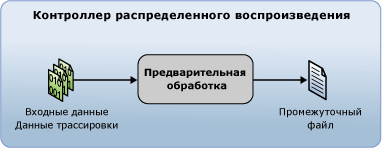

# Подготовка входных данных трассировки
  Прежде чем начинать распределенное воспроизведение с помощью функции распределенного воспроизведения [!INCLUDE[msCoName](../../includes/msconame-md.md)][!INCLUDE[ssNoVersion](../../includes/ssnoversion-md.md)], необходимо подготовить входные данные трассировки, а для этого инициировать стадию предварительной подготовки с помощью средства администрирования распределенного воспроизведения. На стадии предварительной обработки контроллер распределенного воспроизведения обрабатывает данные трассировки и формирует промежуточный файл:  
  
   
  
 Дополнительные сведения о программе распределенного воспроизведения см. в разделе [Распределенное воспроизведение SQL Server](../../tools/distributed-replay/sql-server-distributed-replay.md).  
  
> [!NOTE]  
>  Входные данные трассировки должны быть получены в версии [!INCLUDE[ssNoVersion](../../includes/ssnoversion-md.md)] , совместимой с распределенным воспроизведением. Кроме того, эти данные должны быть совместимы с целевым сервером, на котором планируется их воспроизведение. Дополнительные сведения о требованиях к версии см. в разделе [Distributed Replay Requirements](../../tools/distributed-replay/distributed-replay-requirements.md).  
  
### Подготовка входных данных трассировки  
  
1.  **Изменение параметров конфигурации предварительной обработки**(необязательно). Если нужно изменить параметры конфигурации предварительной обработки, например указать, следует ли фильтровать системные сеансы, или настроить максимальное время простоя, нужно изменить элемент `<PreprocessModifiers>` файла конфигурации предварительной обработки на основе XML — `DReplay.exe.preprocess.config`. При изменении файла конфигурации предварительной подготовки рекомендуется изменять его копию, а не оригинал. Чтобы изменить параметры, выполните следующие действия.  
  
    1.  Скопируйте файл конфигурации предварительной подготовки по умолчанию, `DReplay.exe.preprocess.config`, и переименуйте копию. Файл конфигурации предварительной подготовки по умолчанию расположен в папке установки средства администрирования.  
  
    2.  Измените параметры конфигурации предварительной подготовки в новом файле конфигурации.  
  
    3.  При запуске этапа предварительной обработки (следующий шаг) используйте параметр *config_file* параметра **preprocess** , чтобы задать расположение измененного файла конфигурации.  
  
     Дополнительные сведения о файле конфигурации предварительной обработки см. в разделе [Настройка распределенного воспроизведения](../../tools/distributed-replay/configure-distributed-replay.md).  
  
2.  **Запуск этапа предварительной обработки**. Для подготовки входных данных трассировки необходимо запустить средство администрирования с параметром **preprocess**. Дополнительные сведения см. в разделе [Параметр предварительной обработки (средство администрирования распределенного воспроизведения)](../../tools/distributed-replay/preprocess-option-distributed-replay-administration-tool.md).  
  
    1.  Откройте программу командной строки Windows (**CMD.exe**) и перейдите в место установки средства администрирования распределенного воспроизведения (**DReplay.exe**).  
  
    2.  Используйте параметр *controller* , **-m**, чтобы указать контроллер, если служба контроллера и инструмент администрирования работают на разных компьютерах (необязательно).  
  
    3.  Используйте параметр *input_trace_file* , **-i**, чтобы указать расположение и имена входных файлов трассировки.  
  
    4.  Используйте параметр *controller_working_directory* , **-d**, чтобы указать место сохранения промежуточного файла на контроллере.  
  
    5.  Используйте параметр *config_file* , **-c**, чтобы указать расположение файла конфигурации предварительной обработки (необязательно). Этот параметр позволяет указать новый файл конфигурации, если используется измененная копия файла конфигурации предварительной подготовки по умолчанию.  
  
    6.  Используйте параметр *status_interval* , **-f**, если нужно, чтобы средство администрирования отображало сообщения о состоянии не каждые 30 секунд, а с другим интервалом (необязательно).  
  
     Например, для запуска этапа предварительной обработки на компьютере, на котором выполняется служба контроллера, с файлом трассировки, расположенным по адресу `c:\trace1.trc`, рабочим каталогом контроллера, расположенным в по адресу `c:\WorkingDir` , и сообщением о состоянии, по умолчанию отображаемым каждые 30 секунд, требуется следующий синтаксис: `dreplay preprocess -i c:\trace1.trc -d c:\WorkingDir`  
  
3.  После завершения предварительной подготовки промежуточный файл сохраняется в рабочем каталоге контроллера. Для воспроизведения событий необходимо запустить средство администрирования с параметром **replay** . Дополнительные сведения см. в разделе [Воспроизведение данных трассировки](../../tools/distributed-replay/replay-trace-data.md).  
  
## См. также:  
 [Распределенное воспроизведение SQL Server](../../tools/distributed-replay/sql-server-distributed-replay.md)   
 [Требования распределенного воспроизведения](../../tools/distributed-replay/distributed-replay-requirements.md)   
 [Параметры командной строки средства администрирования &#40; программа распределенного воспроизведения &#41;](../../tools/distributed-replay/administration-tool-command-line-options-distributed-replay-utility.md)   
 [Настройка распределенного воспроизведения](../../tools/distributed-replay/configure-distributed-replay.md)  
  
  
