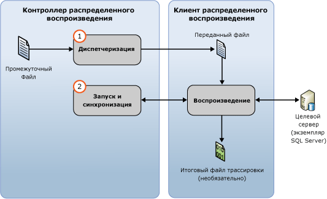

# Воспроизведение данные трассировки
[!INCLUDE[appliesto-ss-xxxx-xxxx-xxx-md](../../includes/appliesto-ss-xxxx-xxxx-xxx-md.md)]
  После подготовки входных данных трассировки можно запустить распределенное воспроизведение, используя функцию распределенного воспроизведения [!INCLUDE[msCoName](../../includes/msconame-md.md)] [!INCLUDE[ssNoVersion](../../includes/ssnoversion-md.md)]. Дополнительные сведения см. в статье [Подготовка входных данных трассировки](../../tools/distributed-replay/prepare-the-input-trace-data.md).  
  
 Параметр **replay** инструмента администрирования используется для инициирования этапа воспроизведения событий при распределенном воспроизведении. Этот этап состоит из двух частей: передача данных трассировки и запуски и синхронизация распределенного воспроизведения.  
  
   
  
 Данные трассировки можно воспроизводить в одном из двух режимов последовательного выполнения: в режиме нагрузки и режиме синхронизации. По умолчанию используется воспроизведение данных трассировки в режиме нагрузки. Дополнительные сведения об этапе воспроизведения событий и режимах последовательного выполнения см. в разделе [SQL Server Distributed Replay](../../tools/distributed-replay/sql-server-distributed-replay.md).  
  
> [!NOTE]  
>  Входные данные трассировки должны быть получены в версии [!INCLUDE[ssNoVersion](../../includes/ssnoversion-md.md)] , совместимой с распределенным воспроизведением. Кроме того, эти данные должны быть совместимы с целевым сервером, на котором планируется их воспроизведение. Дополнительные сведения о требованиях к версии см. в разделе [Distributed Replay Requirements](../../tools/distributed-replay/distributed-replay-requirements.md).  
  
### Воспроизведение трассировки  
  
1.  **(Необязательно) Измените параметры конфигурации воспроизведения.** Чтобы изменить параметры конфигурации воспроизведения, например режим последовательного выполнения и значения масштабирования, необходимо изменить элемент `<ReplayOptions>` в XML-файле `DReplay.exe.replay.config` с конфигурацией воспроизведения. Также можно изменить элемент `<OutputOptions>` , задав параметры вывода, например следует ли записывать число строк. При изменении файла конфигурации воспроизведения рекомендуется изменить его копию, а не оригинал. Чтобы изменить параметры, выполните следующие действия.  
  
    1.  Скопируйте файл конфигурации воспроизведения по умолчанию `DReplay.exe.replay.config`и переименуйте копию. Файл конфигурации воспроизведения по умолчанию расположен в папке установки средства администрирования.  
  
    2.  Измените параметры конфигурации воспроизведения в новом файле конфигурации.  
  
    3.  При инициировании этапа воспроизведения событий (следующий шаг) необходимо использовать аргумент *config_file* параметра **replay** , чтобы указать расположение измененного файла конфигурации.  
  
     Дополнительные сведения о файле конфигурации воспроизведения см. в разделе [Настройка распределенного воспроизведения](../../tools/distributed-replay/configure-distributed-replay.md).  
  
2.  **Запуск этапа воспроизведения событий.** Чтобы начать распределенное воспроизведение, необходимо запустить средство администрирования с параметром **replay**. Дополнительные сведения см. в статье [Параметр воспроизведения (средство администрирования распределенного воспроизведения)](../../tools/distributed-replay/replay-option-distributed-replay-administration-tool.md).  
  
    1.  Откройте программу командной строки Windows (**CMD.exe**) и перейдите в место установки средства администрирования распределенного воспроизведения (**DReplay.exe**).  
  
    2.  (Необязательно.) Используйте параметр *controller* , **-m**, чтобы указать контроллер, если служба контроллера и инструмент администрирования работают на разных компьютерах.  
  
    3.  Используйте параметр *controller_working_directory* , **-d**, чтобы указать, где на контроллере был сохранен промежуточный файл во время стадии предварительной обработки.  
  
    4.  (Необязательно.) Используйте параметр **-o** , чтобы записать действие воспроизведения в результирующий файл трассировки на каждом клиенте.  
  
    5.  (Необязательно.) Используйте параметр *target_server* , **-s**, чтобы указать экземпляр [!INCLUDE[ssNoVersion](../../includes/ssnoversion-md.md)] , в котором клиенты распределенного воспроизведения должны воспроизвести рабочую нагрузку трассировки. Этот параметр не нужен, если для задания целевого сервера в элементе `<Server>` файла конфигурации воспроизведения использовался элемент `<ReplayOptions>` .  
  
    6.  Используйте параметр *clients* , **-w**, чтобы указать, какие клиенты распределенного воспроизведения должны участвовать в воспроизведении. Укажите имена клиентских компьютеров, разделенные запятыми. Примечание. IP-адреса недопустимы.  
  
    7.  (Необязательно.) Используйте параметр *config_file* , **-c**, чтобы указать расположение файла конфигурации воспроизведения. Этот параметр позволяет задать новый файл конфигурации, если используется измененная копия файла конфигурации воспроизведения по умолчанию.  
  
    8.  (Необязательно.) Используйте параметр *status_interval* , **-f**, если нужно, чтобы средство администрирования отображало сообщения о состоянии не каждые 30 секунд, а с другим интервалом.  
  
     Например, следующая команда инициирует этап воспроизведения на том же компьютере, на котором выполняется служба контроллера, использует рабочий каталог контроллера `c:\WorkingDir`, записывает действие воспроизведения на каждом участвующем клиенте, использует для воспроизведения клиенты `client1` и `client2` , а также получает оставшиеся параметры конфигурации воспроизведения из измененного файла конфигурации, расположенного в `c:\modifiedreplay.config`.  
  
     `dreplay replay -d c:\WorkingDir -o -w client1,client2 -c c:\modifiedreplay.config`  
  
3.  По завершении распределенного воспроизведения средство администрирования возвращает сводные данные о результатах. Если задан параметр **-o** , то действие воспроизведения сохраняется в результирующих файлах трассировки на каждом клиенте. Дополнительные сведения о файлах результатов трассировки см. в статье [Просмотр результатов воспроизведения](../../tools/distributed-replay/review-the-replay-results.md).  
  
## См. также:  
 [Distributed Replay Requirements](../../tools/distributed-replay/distributed-replay-requirements.md)   
 [Параметры командной строки средства администрирования (программа распределенного воспроизведения)](../../tools/distributed-replay/administration-tool-command-line-options-distributed-replay-utility.md)   
 [Настройка распределенного воспроизведения](../../tools/distributed-replay/configure-distributed-replay.md)  
  
  
