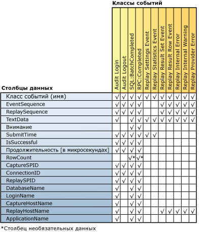

# просмотреть результаты воспроизведения
[!INCLUDE[appliesto-ss-xxxx-xxxx-xxx-md](../../includes/appliesto-ss-xxxx-xxxx-xxx-md.md)]
  Когда компонент распределенного воспроизведения [!INCLUDE[msCoName](../../includes/msconame-md.md)] [!INCLUDE[ssNoVersion](../../includes/ssnoversion-md.md)] завершает распределенное воспроизведение, действие воспроизведения может быть записано в результирующий файл трассировки на каждом клиенте. Чтобы записать это действие, необходимо использовать параметр **-o**, когда запускается средство администрирования с параметром **replay**. Дополнительные сведения о параметре replay см. в статье [Параметр воспроизведения (средство администрирования распределенного воспроизведения)](../../tools/distributed-replay/replay-option-distributed-replay-administration-tool.md).  
  
 Расположение хранения результирующих файлов трассировки указывается XML-элементом `<ResultDirectory>` в файле конфигурации клиента `DReplayClient.xml`, находящемся на каждом клиенте. Файлы трассировки в результирующем каталоге клиента перезаписываются при каждом воспроизведении.  
  
 Чтобы задать тип выходных данных, записываемых в результирующие файлы трассировки, измените файл конфигурации воспроизведения `DReplay.exe.replay.config`. В XML-элементе `<OutputOptions>` можно задать, нужно записывать количество строк или содержимое результирующего набора.  
  
 Дополнительные сведения об этих параметрах конфигурации см. в статье [Настройка распределенного воспроизведения](../../tools/distributed-replay/configure-distributed-replay.md).  
  
## Классы событий, записываемые в результирующих файлах трассировки  
 В следующей таблице перечислены все классы событий, записываемые в результирующих файлах трассировки.  
  
|Категория|Имя класса событий|Частота записи|Точка записи|  
|--------------|---------------------|-----------------------|----------------------|  
|Воспроизводимые события|Аудит входа в систему|Один раз для каждого события Audit Login в исходных данных трассировки|При успешном или неуспешном завершении события|  
||Аудит выхода из системы|Один раз для каждого события Audit Logout в исходных данных трассировки|При успешном или неуспешном завершении события|  
||SQL:BatchCompleted|Один раз для каждого события SQL:BatchStarting в исходных данных трассировки|При успешном или неуспешном завершении события|  
||RPC:Completed|Один раз для каждого события RPC:Starting в исходных данных трассировки|При успешном или неуспешном завершении события|  
|Статистика и результаты|Replay Settings Event|Однократно|Первое событие в результирующей трассировке|  
||Replay Statistics Event|Однократно|Последнее событие в результирующей трассировке|  
||Replay Result Set Event|Один раз для каждого события SQL:BatchStarting и RPC:Starting.   Захватывается, только если параметр `<RecordResultSet>` в файле конфигурации воспроизведения имеет значение `Yes`.||  
||Replay Result Row Event|Один раз для каждой строки в результирующем наборе для событий SQL:BatchStarting и RPC:Starting.   Захватывается, только если параметр `<RecordResultSet>` в файле конфигурации воспроизведения имеет значение `Yes`.||  
|Ошибки и предупреждения|Replay Internal Error|Один раз для каждой внутренней ошибки|В случае внутренней ошибки|  
||Replay Provider Error|Один раз для каждой ошибки поставщика|В случае ошибки поставщика|  
  
 Следует отметить следующее.  
  
-   Каждому событию, успешно воспроизведенному на целевом сервере, соответствует один класс выходных событий.  
  
-   Причиной сбоя или отмены каждого события может быть несколько ошибок.  
  
## Сопоставление столбцов классов событий  
 На следующем рисунке показано, какие столбцы результирующей трассировки доступны для каждого класса событий, записываемого в ходе воспроизведения.  
  
   
  
## Описания столбцов для результирующей трассировки  
 В следующей таблице описаны столбцы в результирующих данных трассировки.  
  
|Имя столбца данных|Тип данных|Описание|Идентификатор столбца|  
|----------------------|---------------|-----------------|---------------|  
|EventClass|**nvarchar**|Имя класса событий.|1|  
|EventSequence|**bigint**|Для ошибок поставщика, внутренних ошибок и предупреждений это последовательность записи событий, соответствующая ошибке или предупреждению.   Для всех прочих классов событий это последовательность события в исходных данных трассировки.|2|  
|ReplaySequence|**bigint**|Для ошибок поставщика, внутренних ошибок и предупреждений это последовательность воспроизведения событий, соответствующая ошибке или предупреждению.   Для всех прочих классов событий это последовательность события, назначенного в ходе воспроизведения.|3|  
|TextData|**ntext**|Содержимое TextData зависит от EventClass.   Для событий Audit Login и ExistingConnection это параметры набора для соединения.   Для событий SQL:BatchStarting это текст пакетного запроса.   Для событий RPC:Starting это вызванная хранимая процедура.   Для событий Replay Settings Event этот столбец содержит параметры, определенные в файле конфигурации воспроизведения.   Для событий Replay Statistics Event здесь содержатся следующие данные:   — целевой сервер SQL Server воспроизведения;   — общее число воспроизводимых событий;   — число ошибок поставщика;   — число внутренних ошибок;   — внутренние предупреждения;   — общее число ошибок;   — общий коэффициент успешного выполнения;   — время воспроизведения (ЧЧ:ММ:СС:МММ).   Для событий Replay Result Set Event здесь показан список заголовков столбцов возвращаемого результата.   Для событий Replay Result Row Event здесь показано возвращаемое значение для всех столбцов данной строки.   Для событий Replay Internal Warning и Replay Provider Error этот столбец содержит предупреждения или ошибки поставщика.|4|  
|Внимание|**bigint**|Продолжительность события Attention (в микросекундах) для события. Вычисляется из события Attention для трассировки записи. Если для события не указано время ожидания запроса, то этот столбец не заполняется (имеет значение NULL).|5|  
|SubmitTime|**datetime**|Время отправки события в [!INCLUDE[ssNoVersion](../../includes/ssnoversion-md.md)].|6|  
|IsSuccessful|**int**|Логический флаг, показывающий, было ли успешно выполнено определенное событие и были ли результирующие наборы возвращены клиенту.   Событие, создающее предупреждение (например, если событие отменяется из-за события Attention или истечения указанного пользователем времени ожидания), считается успешным.   IsSuccessful может иметь одно из следующих значений:   1 = успешно;   0 = ошибка|7|  
|Duration [microsec]|**bigint**|Продолжительность времени ответа (в микросекундах) для события. Измерение начинается, когда в [!INCLUDE[ssNoVersion](../../includes/ssnoversion-md.md)]отправляется событие входа, событие выхода, событие RPC или событие языка.   Если событие выполняется успешно, то измерение завершается после обработки всего результирующего набора.   Если событие не выполняется, то измерение завершается во время ошибки или отмены события.|8|  
|RowCount|**bigint**|Заполняется в зависимости от значения элемента `<RecordRowCount>` в файле конфигурации воспроизведения.   Если элемент `<RecordRowCount>` имеет значение Yes, то эта ячейка содержит число строк в результирующем наборе, возвращенном [!INCLUDE[ssNoVersion](../../includes/ssnoversion-md.md)].   Если элемент `<RecordRowCount>` имеет значение No, то эта ячейка не заполняется (имеет значение NULL).|9|  
|CaptureSPID|**int**|Идентификатор сеанса записи для события.|10|  
|ConnectionID|**int**|Идентификатор соединения записи для события.|11|  
|ReplaySPID|**int**|Идентификатор сеанса воспроизведения для события.|12|  
|DatabaseName|**nvarchar**|Имя базы данных, в которой выполняется инструкция пользователя.|13|  
|LoginName|**nvarchar**|Имя входа пользователя. Это может быть имя входа в системе безопасности [!INCLUDE[ssNoVersion](../../includes/ssnoversion-md.md)] или учетные данные входа Microsoft Windows в формате *имя_домена*\\*имя_пользователя*.|14|  
|CaptureHostName|**nvarchar**|Имя компьютера, на котором служба клиента работает во время записи.|15|  
|ReplayHostName|**nvarchar**|Имя компьютера, на котором работает клиент во время воспроизведения.|16|  
|ApplicationName|**nvarchar**|Имя клиентского приложения, создавшего соединение с [!INCLUDE[ssNoVersion](../../includes/ssnoversion-md.md)] во время записи.|17|  
  
## См. также:  
 [Распределенное воспроизведение SQL Server](../../tools/distributed-replay/sql-server-distributed-replay.md)   
 [Distributed Replay Requirements](../../tools/distributed-replay/distributed-replay-requirements.md)   
 [Параметры командной строки средства администрирования (программа распределенного воспроизведения)](../../tools/distributed-replay/administration-tool-command-line-options-distributed-replay-utility.md)   
 [Настройка распределенного воспроизведения](../../tools/distributed-replay/configure-distributed-replay.md)  
  
  
